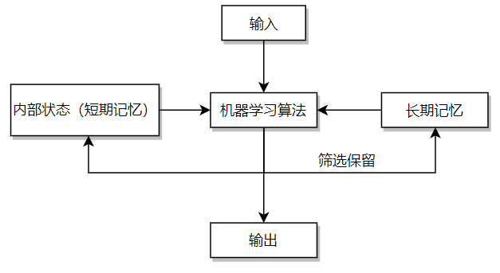

# AI入门

----

> - AI与人类大脑的联系
> - 对输入/输出建模
> - 分类和回归
> - 时间序列
> - 训练

常用的人工智能算法有：神经网络、支持向量机、贝叶斯网络和隐马尔可夫模型等等。

## AI与大脑的联系

大脑本质上就是一种深奥、繁复的技术，有必要通过逆向工程来解析它的工作原理和机制，从而模仿它的功能。

就像仿生学一样，人类为了飞翔而模仿鸟的生理结构去设计了灰雁扑翼机，通过模仿鸟类扇动翅膀的方式去实现飞翔。但是他们会发现，如果完全照搬自然界的解决方案，并不能够解决问题。我想或许是因为在有限能力下无法对鸟类生理结构进行极高程度的拟真。

同样的，对于大脑而言，我们也许无法复刻一个一模一样的大脑，但是我们可以去不断地近似拟合。进行拟真时，在底层硬件上一般无法做到一致，但是在抽象层如果能够进行仿真，并且最终能达到一致的效果，那么也不必去模拟全部过程。即，对于飞翔而言，无论以何种方式（像鸟一样扑翼，又或者参照流体力学设计结构），只要最终能够达到目的就行了。

而人脑和大多数人工智能算法在高度抽象层面具有很多相似性。

### 大脑和真实世界

我们可以把大脑视作具有一系列输入/输出的黑箱。所谓黑箱，是因为我们不能说自己百分之一百地了解大脑内部的处理机制。感受器所传递来的神经冲动作为一种输入，而人脑的输出实际上是一个关于输入信号和大脑内部状态的一个函数，对于任何输入信号，人脑都会相应调整它的内部状态同时产生输出信号。其中，输入信号的顺序影响或大或小，取决于当时大脑的内部状态。

这一系列的输入输出，表现为大脑与真实世界的交互。

### 缸中之脑

我们与真实世界的唯一交互渠道就是从感受器获得的输入通过运动神经作用的输出。

这里有一个著名的哲学思想实验，即：“缸中之脑”。假设存在一个机器，能够使得大脑产生印象，并且大脑本身无法分辨真假。那么当这台机器给大脑发送自己正在遛狗的印象，大脑就会认为自己的身体正在遛狗，而身体压根没动。这个实验假想了大脑可以脱离身体，依靠维生系统保持活性。如果将大脑的神经连接到一台可以用电脉冲完全仿真大脑实际接收信号的超级计算机上，而这台计算机通过对大脑的输出信号产生相应的响应方式。

这样就给大脑模拟了一个真实世界。

一种尝试对人脑直接建模的算法就是“神经网络”，它是人工智能研究中的一个小分支。计算机的神经网络不同于人脑，它们不具备通用性，一般是为了解决特定问题。

## 对问题建模

将真实世界建模为机器学习算法的方法至关重要。可以按照下列步骤对问题进行建模：

- 数据分类

- 回归分析
- 聚类问题
- 时序问题

###  数据分类

即将输入数据提前分类，通常是监督学习，由用户提供数据和机器学习算法的预期输出结果。在数据分类问题中，预期结果就是数据类别。

下面是一个经典的分类问题数据集——鸢尾花数据集，通常被用来评估机器学习算法的性能。数据集下载网站如下：

```
https://archive-beta.ics.uci.edu/ml/datasets/iris
```

其数据集的一部分样本如下所示：

```
5.1,3.8,1.9,0.4,setosa
4.8,3.0,1.4,0.3,setosa
5.1,3.8,1.6,0.2,setosa
...
7.0,3.2,4.7,1.4,versicolor
6.4,3.2,4.5,1.5,versicolor
6.9,3.1,4.9,1.5,versicolor
...
6.3,3.3,6.0,2.5,virginica
5.8,2.7,5.1,1.9,virginica
7.1,3.0,5.9,2.1,virginica
```

上述数据显示为逗号分隔值文件（Comma Separated Values, CSV）格式，这是一种机器学习中很常见的输入数据格式。首行数据通常是对每列数据的一个解释，在这里五列数据分别代表着：

- 花萼长度
- 花萼宽度
- 花瓣长度
- 花瓣宽度
- 种属

对于分类问题来说，算法需要在拿到花萼和花瓣长度、宽度之后，判断得到花的种属。在分类问题中，对于结果判断是必须要有确定定义的，也就是说，获得前提数据后不可能会判断识别出除了规定种属以外的其他花种。

### 回归分析

上述分类中，分类的出的结果是确切的花的种类，但有时候要求得到的数据并非是一类名词，而是一系列的数值，如下面的数据集：

```
https://archive-beta.ics.uci.edu/ml/datasets/auto+mpg
```

在这个数据集中，包含下列的数据：

```
18.0   8   307.0      130.0      3504.      12.0   70  1	"chevrolet chevelle malibu"
15.0   8   350.0      165.0      3693.      11.5   70  1	"buick skylark 320"
18.0   8   318.0      150.0      3436.      11.0   70  1	"plymouth satellite"
16.0   8   304.0      150.0      3433.      12.0   70  1	"amc rebel sst"
17.0   8   302.0      140.0      3449.      10.5   70  1	"ford torino"
15.0   8   429.0      198.0      4341.      10.0   70  1	"ford galaxie 500"
14.0   8   454.0      220.0      4354.       9.0   70  1	"chevrolet impala"
14.0   8   440.0      215.0      4312.       8.5   70  1	"plymouth fury iii"
14.0   8   455.0      225.0      4425.      10.0   70  1	"pontiac catalina"
15.0   8   390.0      190.0      3850.       8.5   70  1	"amc ambassador dpl"
15.0   8   383.0      170.0      3563.      10.0   70  1	"dodge challenger se"
...
```

下面是对每一列数据的解释：

```
1. mpg:           continuous
2. cylinders:     multi-valued discrete
3. displacement:  continuous
4. horsepower:    continuous
5. weight:        continuous
6. acceleration:  continuous
7. model year:    multi-valued discrete
8. origin:        multi-valued discrete
9. car name:      string (unique for each instance)
```

在给定发动机规格和车身重量之后，就可以计算得到特定车型的燃油效率。

所以不难看出，在上述的数据集中，并非所有给出数值都是可利用的，例如`origin`和`car name`，对燃油效率并无影响。

### 聚类问题

聚类问题和分类问题很像，计算机都要将输入数据进行编组。在训练开始之前，程序员通常要预先指定聚类的簇的数目，计算机根据输入数据将相近项放到一起。例如在上述汽车的数据集中，可以根据聚类算法以特性将汽车分为4个组。

可以看到聚类问题被赋予了很高的自由度，它从数据中自行发现规律并进行区分。而分类问题需要给算法指定已知数据的类别，最终能够正确识别不曾用来训练的新数据。

### 时序问题

当分析的数据是非时间敏感的数据，例如我们上面的数据集（鸢尾花和汽车），那么就不会存在时间问题，但如果输入时当前股票价格，那么时序就有举足轻重的作用了，因为我们知道股票价格是时间敏感的数据。

那么对时间敏感的数据而言，时序的长短在一般情况下意味着可分析样本的多少，输入样本对输出结果是肯定有影响的。

## 对输入输出的建模

机器学习算法实际上就是给定输入，产生输出，而输出又受到算法本身的长短期记忆影响。如下图（自己的一点拙见）：



那么输入和输出形式到底是什么样子呢？实际上，输入和输出都是向量形式，而向量形式本质上就是一个如下所示的浮点数组：

```
Input:[-0.245,.283,0,0]
Output:[0.782,0.543]
```

绝大多数的机器学习算法的输入和输出是固定的，就像计算机程序中的函数一样。输入数据可以被视为函数参数，而输出则是函数的返回值，如图上的三个参数作为函数参数，经过函数处理后，得到了两个返回值。

要使用这类型的算法就需要将特定问题的输入转为浮点数数组，同样，问题的解也会是浮点数数组。

对于传统编程来说，许多模式识别的算法就有点像用来映射键值对的哈希表，通过`key`来寻找`value`，只不过在机器学习中，当输入一个不存在的`key`，得到的不一定是个空值，而是一个最接近匹配项的值。

在`词袋算法`中，字符串被编码到一个字典当中。

```python
# coding:utf-8
# 1.3 对输入输出建模

word_dict = {}


def get_code(code_string):
    """
    :param code_string:
    :return:
    """
    word_list = code_string.split(" ")
    code_num = 1
    for word in word_list:
        temp_dict = {word: code_num}
        word_dict.update(temp_dict)
        code_num += 1


def bag_of_words_1(string):
    """
    :param string:
    :return:
    """
    result = []
    for c in string.split(" "):
        if c in word_dict.keys():
            result.append(word_dict[c])
        else:
            result.append(0)
    return list(set(result))


def bag_of_words_2(string):
    count_dict = word_dict
    for word in count_dict.keys():
        count_dict[word] = 0
    for c in string.split(" "):
        if c in count_dict.keys():
            count_dict[c] += 1
    return list(count_dict.values())


if __name__ == '__main__':
    code_s = input("编码序列：\n")
    get_code(code_s)
    test_s = input("输入测试字符串以获得编码后的值：\n")
    print("编码结果为：")
    print(bag_of_words_1(test_s))
    print("向量值为：")
    print(bag_of_words_2(test_s))
    
```

执行结果为：

```
编码序列：
a b c d e f g h i j k l m n o p q r s t u v w x y z
输入测试字符串以获得编码后的值：
w z m love t s yyds
编码结果为：
[0, 13, 19, 20, 23, 26]
向量值为：
[0, 0, 0, 0, 0, 0, 0, 0, 0, 0, 0, 0, 1, 0, 0, 0, 0, 0, 1, 1, 0, 0, 1, 0, 0, 1]
```

可以看到在输入了编码序列为26个word后，最终的向量值也会有26个值。

机器学习的最大特征之一就是把问题建模为定长浮点数组，下面的小节会用几个例子来演示如何进行这种建模。

### 一个简单的例子

模仿人工异或的程序堪称人工智能界的"hello, world"。它接收二元输入并输出一个布尔值，异或运算的真值表如下所示：

```
False XOR False = False
True XOR False = True
False XOR True = True
True XOR True = False
```

用哈希表来表示的话为：

```
[0.0, 0.0] -> [0.0]
[1.0, 0.0] -> [1.0]
[0.0, 1.0] -> [1.0]
[1.0, 1.0] -> [0.0]
```

以上映射展现了这个算法中输入和理想的预期输出间的关系。

### 燃油效率

还记得之前提到的Auto MPG的数据集吗？在计算汽车燃油效率的时候，我们需要把对应的数据进行归一化操作，即将数值映射到`0~1`或者`-1~1`的范围内。对于所获得数据：

- 汽车重量
- 发动机排量
- 气缸数
- 功率
- 混合动力或常规动力

我们需要计算另一个数据：

- 燃油效率

因此，我们总共会获得六个字段，其中五个作为输入，一个作为输出。

在进行归一化时，我们需要为每一组数据选择一个合适的数值区间，例如一辆汽车的重量在合理状态下不应该出现负值。

因此，假设规定了下述的取值范围：

- 汽车重量：`45~2268` 千克
- 发动机排量：`0.1~10` 升
- 气缸数：`2~10` 个
- 功率：`0.736~736`千瓦
- 混合动力或常规动力：`真` or `假`
- 燃油效率：`0.425~212.6` 千米/升

设定这样的范围可以较大的适配汽车的属性（无论是过去还是未来），这样就不用在未来频繁重构取值范围。

那么当我们拿到一辆重达1200千克的汽车时，如何对这一数据进行归一化呢？其实很简单：

1. 重量的取值空间为：`2268-45=2223` 千克；
2. 在区间中，这个重量的相对大小是：`1200-45=1155` 千克
3. 则占取值区间的百分比是：`1155/2223=0.520`

因此对于这辆汽车的输入向量而言，进行归一化后，我们会设定其重量为0.520，以此来代表1200千克的重量。

另外对于真假这种布尔值而言，用`0`和`1`代替即可。

### 向算法传入图像

在输入图像时，如何对图像进行归一化呢？

以一个`300*300`的全彩图像为例，90000个像素点乘以3个RGB色彩通道数，总共有270000个像素。如果把每一个像素作为输入，对于大多数来说，这样的输入量未免也太大了。因此需要一个降采样的过程。

当图片被压缩为`32*32`后，如果只分辨像素点的亮度的话，只需要1024个输入即可(0或者1)。如果需要分辨色彩，那么需要3072个输入。

通常来说，通用RGB值的范围为0~255，要将图片归一化，还需要先把光强除以255来得到一个”光强百分数“，比如光强度为10，经过计算后就会变成`10/255=0.039`。

当然，这不是理解的人工智能，对于图片而言，如果我们需要算法能够识别出图片内容，通常的解决方案是为需要算法识别的每种图像创建一个输出通道，训练好的算法会在置信的图片种类对应的输出通道返回一个值`1.0`。

### 金融算法

金融预测是一种时间算法的常见应用。

所谓“时间算法”，指的是接受时变性输入值的一种算法，如果算法支持短期记忆的话，意味着自动支持输入范围的时变性，如果不支持，则需要分别使用一个输入窗口和一个预测窗口。

如下面的一个例子：

使用下述代码生成某只股票10天的收盘价：

```python
price_dict = {}

def print_price():
    """
    :return:
    """
    for i in range(1, 11):
        random_num = random.randint(30, 55)
        price_dict.update({i: random_num})
        print(f'Day {i}: ${random_num}')
```

可以得到：

```
Day 1: $33
Day 2: $49
Day 3: $30
Day 4: $33
Day 5: $46
Day 6: $51
Day 7: $52
Day 8: $46
Day 9: $39
Day 10: $32
```

要将数据归一化，我们可以将每个数据转化为对前一天收盘价的同比百分比，使用下述代码：

```python
pct_dict = {}

def get_percent():
    """
    :return:
    """
    for i in range(2, 11):
        d_val = price_dict[i] - price_dict[i - 1]
        pct = float(d_val / price_dict[i-1])
        pct_dict.update({i: round(pct, 3)})
        print(f'Day {i}: {round(pct, 3)}')
```

将得到：

```
Day 2: 0.485
Day 3: -0.388
Day 4: 0.1
Day 5: 0.394
Day 6: 0.109
Day 7: 0.02
Day 8: -0.115
Day 9: -0.152
Day 10: -0.179
```

由于这里使用的是random随机函数，与真实股市相差很大，仅供学习。

要创建一个预测后一天股票价格的算法，需要考虑一下怎么样把数据编码为算法可接受的输入形式，而这个编码方式又取决于算法**是否具有内部状态**，因为**具有内部状态的算法只需要最近几天的输入数据**就可以对价格走势进行预测。

而问题在于很多机器学习算法没有内部状态，因此一般情况下，使用滑动窗口算法对数据进行编码。假设我们设置滑动窗口大小为3，即**通过三天的价格走势来预测第四天的价格**，通过下述代码进行划分以得到训练数据：

```python
def get_prediction():
    """
    :return:
    """
    windows_list = []
    for i in range(2, 8):  # total-2
        windows_list.append([pct_dict[i], pct_dict[i+1], pct_dict[i+2]])
    print("滑动窗口：")
    print(windows_list)
    # TODO: 进行预测
```

可以得到如下的窗口：

```
[[0.485, -0.388, 0.1], [-0.388, 0.1, 0.394], [0.1, 0.394, 0.109], [0.394, 0.109, 0.02], [0.109, 0.02, -0.115], [0.02, -0.115, -0.152]]
```

每一个窗口都将得到一个输出数据，即：

```
[0.485, -0.388, 0.1]	-> [xxx]
[-0.388, 0.1, 0.394]	-> [xxx]
[0.1, 0.394, 0.109]		-> [xxx]
[0.394, 0.109, 0.02]	-> [xxx]
[0.109, 0.02, -0.115]	-> [xxx]
[0.02, -0.115, -0.152]	-> [xxx]
```

## 理解训练过程

训练的本质是一个算法拟合训练数据的过程，可以把训练认为是对长期记忆的塑造过程。对于神经网络而言，训练改变的就是权重矩阵。

何时进行训练是算法决定的。一般来说，算法的训练和实际应用是鲜明分立的两个阶段，但也确实有训练和应用并行不悖的时候。

### 评估成果

必须在算法训练阶段评估算法性能，其对训练有着指导意义，并且提供一种对训练成果的反馈。

一种评估方法就是评分函数，其对训练结果会进行打分，而我们的目标就是达到分数的上限或者下限。

### 批量学习和在线学习

批量学习(batch training)和在线学习(online training)跟学习过程的类型有关，通常在处理数据集的时候发挥作用。批量学习是一次性对特定数量的训练集元素进行学习，同步更新算法。在线学习就是每处理一个训练集元素便更新算法。

### 监督学习和非监督学习

监督学习(Supervised training)和非监督学习(Unsupervised training)。当给定算法的预期输出时，就是监督学习，未给定则为非监督学习。

此外还有一种混合训练的方法，只需要提供部分预期输出即可，常被用于深度置信网络。

### 随机学习和确定学习

确定学习(Deterministic training)只需要给定相同的初始状态，算法总会以完全相同的方式运行，一般不会有随机数出现。

随机学习(Stochastic training)需要用到随机数，即使选用相同的初始状态也可能得到全然不同的训练结果，这样的训练结果虽然不好评估但是效果拔群。

