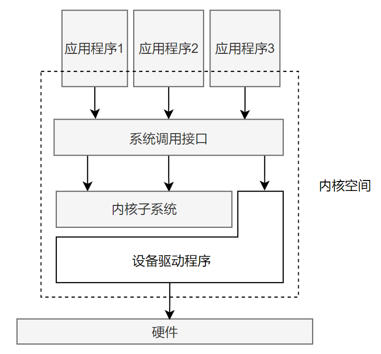

# Linux内核简介

第一章从Unix的历史认识Linux内核和Linux操作系统的前世今生。

## Unix历史

Unix诞生于贝尔实验室的一个失败的多用户操作系统Multics。

1969年，贝尔实验室的程序员设计了一个文件系统原型，最终该原型发展成了Unix。Thompson首先在一台无人问津的 PDP-7 型机上实现了这个操作系统。

1971年，Unix被移植到了 PDP-11 型机中。

1973年，Unix操作系统用C语言进行了重写。

1977年，推出了Unix System III。

1977年，加州大学伯克利分校推出了1BSD系统，实现基于贝尔实验室的Unix版本。

1978年，推出了2BSD系统，里面博阿寒csh、vi等软件。

1979年，推出了独立开发的Unix系统，3BSD，支持虚拟内存。

1994年，重写了虚拟内存子系统VM，推出了最终官方版4.4BSD。

Unix强大的原因：

- Unix简洁，仅仅提供几百个系统调用并且有一个非常明确的设计目的。
- Unix中，万物皆为文件，抽象使得对数据和对设备的操作通过一套相同的系统调用接口来进行。
- 内核和相关系统工具软件是用C语言编写的。
- 进程创建非常迅速，有一个非常独特的`fork()`系统调用。

今天，Unix已经发展成为一个支持抢占式都多任务、多线程、虚拟内存、换页、动态链接和TCP/IP网络的现代化系统。

## Linux简介

Linux是类Unix系统，但不是Unix。它借鉴了Unix许多设计，并且实现了Unix的API，但没有直接使用Unix的源代码。Linux是一个非商业化的产品，任何人都可以开发内核，内核也是自由公开的软件，使用GNU GPL 2.0作为限制条款。

## 操作系统和内核简介

**操作系统** - 在整个系统中负责完成最基本的功能和系统管理，包括内核、设备驱动程序、启动引导程序、命令行Shell或者其他种类的用户界面、基本的文件管理工具和系统工具。

**内核** - 操作系统的内在核心，系统其他部分依靠内核提供的服务。内核独立于普通应用程序，一般处于系统态，拥有受保护的内存空间和访问硬件设备的所有权限。

**内核空间** - 系统态和被保护的空间

**系统调用** - 应用程序通过系统调用来与内核通信。

**应用程序通过系统调用陷于内核** - 当一个应用程序在执行一条系统调用，称其为内核正在代其执行，应用程序被称为通过系统调用在内核空间运行，而内核被称为运行于进程上下文中。

**中断** - 硬件想要和系统通信时，发出异步的中断信号去打断处理器的执行，继而打断内核执行。中断对应一个中断号，内核通过中断号找到对应的中断服务程序，执行特定响应。中断服务程序在一个与所有进程无关的、专门的中断上下文中运行。

处理器在任何指定时间点上的活动概括为：

- 运行于用户空间，执行用户进程
- 运行于内核空间，处于进程上下文，代表某个特定的进程执行
- 运行于内核空间，处于中断上下文，与任何进程无关，处理某个特定的中断

# Linux内核与传统Unix内核的比较

Unix内核是一个不可分割的静态可执行库，通常需要硬件系统提供页机制（MMU）以管理内存，早期Linux也需要MMU支持。

操作系统内核分为两个阵营：

- 单内核
- 微内核

（第三阵营为外内核，通常用于科研系统）

## 单内核

把内核从整体桑作为一个单独的执行过程，运行在单独的地址空间上。通常以单个静态二进制文件存放在磁盘中。多数Unix系统都设计为单内核模块。

## 微内核

把内核分为多个独立的过程，每个过程称为服务器，它们运行在各自独立空间中。理性状况下，只有强烈请求特权服务的服务器才运行在特权模式下，其余过程都运行在用户空间。系统通过进程间通信（IPC）机制，各个服务器通过消息传递处理微内核通信。

由于IPC机制带来的开销多于函数调用，又因为内核态和用户态空间的上下文切换，因此消息传递需要一定的周期。基于此，所有实际应用的基于微内核的系统都让大部分或全部服务器放在内核中，以此实现对函数的直接调用，消除频繁的上下文切换。Windows NT和Mach内核就是微内核的典型实例，但它们在最新版本中不让任何微内核服务器运行在用户空间，这违背了微内核设计初衷。

Linux是单内核，但汲取了微内核的精华：模块化设计、抢占式内核、支持内核线程以及动态装载内核模块的能力。Linux尽力避免微内核设计上的性能缺陷，让所有任务运行在内核态，直接调用函数，无须消息传递。

# Linux内核特点

- 支持动态加载内核模块
- 支持对称多处理（SMP）机制
- 支持抢占（preemptive）
- 对于线程支持的实现：不区分线程和其他一般进程，进程只不过是其中的一些共享资源。
- 提供设备类的面向对象的设备模型、热插拔事件
- 忽略了被认为设计的很拙劣的Unix特性和一些难以实现的过时标准
- …

# Linux内核版本

内核的两种版本：

- 稳定版本
- 处于开发版本

Linux通过一个命名机制来区分：

使用三个或四个”.”分割的数字来代表不同内核版本。

- 第一个数字为 主版本号
- 第二个数字为 从版本号（奇数：开发版；偶数：稳定版）
- 第三个数字为 修订版本号
- 第四个可选数字为 稳定版本号

# 内核开发者社区

http://vger.kernel.org

Linux kernel mailing list - lkml
