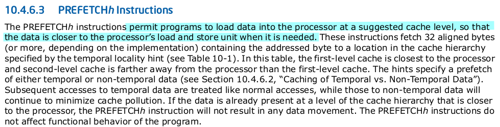

# 进程管理

操作系统为用户程序服务，因此，进程管理是所有操作系统的心脏所在。

## 进程

进程是处于执行期的程序及其相关的资源的总称，它包含其他资源（如打开的文件、挂起的信号等），内核需要有效、透明地管理所有细节。进程还有另一个名称：任务(task)

线程(thread)是在进程中的活动对象，每个线程都拥有一个独立的程序计数器、进程栈和一组进程寄存器。内核调度的是线程，对Linux而言，线程不与进程区分，它只是一种特殊的进程。

进程提供两种虚拟机制：

- 虚拟处理器：许多进程共享一个处理器，但是虚拟处理器使得进程认为自己在独享处理器。
- 虚拟内存：许多进程共享一个内存资源，但是虚拟内存使得进程认为自己独享整个内存资源。

在Linux中，通常使用 `fork()` 系统调用，通过复制一个现有进程来创建一个新进程。

- 父进程：调用 `fork()` 的进程
- 子进程：新生成的进程

在 `fork()` 调用结束后，父进程恢复执行，子进程也开始执行。因此，fork() 系统调用会从内核返回两次，一次回到父进程，一次回到子进程。

在 `fork()` 之后，通常会使用 `exec()` 来创建新的地址空间，并把新的程序载入其中。而在现代Linux中，`fork()` 实际上是由 `clone()` 系统调用实现的。程序最终通过 `exit()` 系统调用退出执行，进程终结，占用资源被释放。父进程可以通过 `wait4()` 系统调用查询子进程是否终结，进程退出执行后被设置为僵死状态，直到父进程的调用 `wait()` 或 `waitpid()` 为止。

## 进程描述符和任务结构

内核把进程的列表存放在任务队列(task list)或者是任务数组(task array)的双向循环链表中。链表中的每一项都是类型为 `task_struct` 的结构，该结构被称为**进程描述符**(process descriptor)，在 `<linux/sched.h>` 中被定义。该结构包含一个具体进程的所有信息。

### 进程描述符的分配

Linux 通过 `slab` 分配器分配 `task_struct` 结构。在 2.6 版本前的内核中，各个进程的 `task_struct` 存放在它们内核栈的末尾。而现在则使用 slab 动态生成 `task_struct` ，所以只需要往栈中压入一个新的结构 `struct thread_info` 即可。这个结构可以使得在汇编代码中能很容易计算出其偏移。

在内核源码树中的 `arch` 文件夹中，存放了不同架构所对应的代码，例如 `x86` 的 `struct thread_info` 在文件 `arch/x86/include/asm/thread_info.h` 中定义。

```c
struct thread_info {
	struct task_struct	*task;		/* main task structure */
	struct exec_domain	*exec_domain;	/* execution domain */
	__u32			flags;		/* low level flags */
	__u32			status;		/* thread synchronous flags */
	__u32			cpu;		/* current CPU */
	int			preempt_count;	/* 0 => preemptable,
						   <0 => BUG */
	mm_segment_t		addr_limit;
	struct restart_block    restart_block;
	void __user		*sysenter_return;
#ifdef CONFIG_X86_32
	unsigned long           previous_esp;   /* ESP of the previous stack in
						   case of nested (IRQ) stacks
						*/
	__u8			supervisor_stack[0];
#endif
	int			uaccess_err;
};

```

每个任务的 `thread_info` 结构在它的内核栈的末尾分配，结构中 `task` 域中存放的是指向该任务的 `task_struct` 的指针。

### 进程描述符的存放

内核通过唯一的<u>进程标识值</u>(process identification value)或 `PID` 来标识每个进程，内核把每个进程的 `PID` 存放在它们各自的 `task_struct` 中。`task_struct` 在 `include/linux/sched.h` 中定义，其结构体内还有许多其他的数据：

```c
struct task_struct {
	volatile long state;	/* -1 unrunnable, 0 runnable, >0 stopped */
	void *stack;
	atomic_t usage;
	unsigned int flags;	/* per process flags, defined below */
	unsigned int ptrace;

	int lock_depth;		/* BKL lock depth */

    /* ... */
    
	pid_t pid;
	pid_t tgid;

    /* ... */
};
```

`PID` 的数据类型是 `pid_t` ，这是一个隐含类型（表示该数据类型是未知或不相关的），而实际上它就是一个 `int` 整型数据，其默认最大值设置为 `32768` （`short int` 短整型的最大值）。

```c
/* include/linux/types.h */
typedef __kernel_pid_t		pid_t;

/* include/asm-generic/posix_types.h */
#ifndef __kernel_pid_t
typedef int		__kernel_pid_t;
#endif
```

 `<linux/threads.h>` 中限制 `PID` 的最大值为 400 万，可以通过修改 `/proc/sys/kernel/pid_max` 来提高上限。这个最大值实际上就是系统允许同时存在的进程的最大数目。

```c
/* include/linux/threads.h */

/*
 * This controls the default maximum pid allocated to a process
 */
#define PID_MAX_DEFAULT (CONFIG_BASE_SMALL ? 0x1000 : 0x8000)

/*
 * A maximum of 4 million PIDs should be enough for a while.
 * [NOTE: PID/TIDs are limited to 2^29 ~= 500+ million, see futex.h.]
 */
#define PID_MAX_LIMIT (CONFIG_BASE_SMALL ? PAGE_SIZE * 8 : \
	(sizeof(long) > 4 ? 4 * 1024 * 1024 : PID_MAX_DEFAULT))

#endif
```

```bash
$ cat /proc/sys/kernel/pid_max
4194304
```

在内核中，访问任务通常需要获得指向该任务 `task_struct` 的指针，通过 current 宏查找到当前正在运行的进程的 `task_struct` 。这个宏与硬件体系结构相关，需要专门处理。在寄存器多的体系结构中，有专门的寄存器用于存放指向当前进程的 `task_struct` 的指针，例如在 MIPS 架构中，获取 current 宏只需要直接访问寄存器：

```c
// arch/mips/include/asm/thread_info.h
/* How to get the thread information struct from C.  */
register struct thread_info *__current_thread_info __asm__("$28");
#define current_thread_info()  __current_thread_info
```

但在 `x86` 这种寄存器较少的架构中，只能通过在内核栈的尾部压入 `thread_info` 结构，通过计算偏移来简介查找对应的 `task_struct` 。具体操作由 `current_thread_info()` 函数完成：

```c
// arch/x86/include/asm/thread_info.h
/* how to get the thread information struct from C */
static inline struct thread_info *current_thread_info(void)
{
	return (struct thread_info *)
		(current_stack_pointer & ~(THREAD_SIZE - 1));
    /*
     * PAGE_SHIFT determines the page size 
     * #define PAGE_SHIFT 12
     * #define PAGE_SIZE		(1UL << PAGE_SHIFT)     // => PAGE_SIZE = 1000000000000(4096)
     * 
     * #ifdef CONFIG_4KSTACKS
     * #define THREAD_ORDER	0
     * #else
     * #define THREAD_ORDER	1
     * #endif
     *
     * #define THREAD_SIZE 	(PAGE_SIZE << THREAD_ORDER) // => THREAD_SIZE = 10000000000000(8192)
     * ~(THREAD_SIZE - 1) = 1111111111111111111111111111111111111111111111111110000000000000（-8192）
     */
}

// arch/mn10300/include/asm/thread_info.h
/* how to get the current stack pointer from C */
static inline unsigned long current_stack_pointer(void)
{
	unsigned long sp;
	asm("mov sp,%0; ":"=r" (sp));
	return sp;
}
```

`current_stack_pointer & ~(THREAD_SIZE - 1)` 相当于屏蔽了 `sp` 的后13个有效位，汇编代码为：

```assembly
movl $-8192, %eax
andl %esp, %eax
```

上述代码中，默认的栈大小是 8 KB，如果栈大小是 4 KB ，那么 `THREAD_ORDER` 将为 0 ，最终进行 `andl` 的数值是 -4096 ，即屏蔽后 `sp` 的12 位。

最后，在得到指向当前进程的 `thread_info` 结构体的指针后，返回其 `task` 域，即 `task_struct` 结构体的地址。

### 进程的几种状态

task_struct 的 state 域描述了进程的当前状态，它必然是五种状态的其中一种：

- `TASK_RUNNING` - 运行，进程是可执行的，两种情形：
  - 正在执行；
  - 在运行队列中等待执行；
- `TASK_INTERRUPTIBLE` - 可中断，进程在睡眠（被阻塞），需要等待某些条件达成才能进入运行状态。在接收到信号时，可被提前唤醒并准备进入运行态。
- `TASK_UNINTERRUPTIBLE` - 不可中断，进程在睡眠（被阻塞），需要等待某些条件达成才能进入运行状态。不接受信号的影响。
- `__TASK_TRACED` - 正在被其他进程跟踪的进程，如通过 `ptrace` 对被调试程序进行跟踪时，被调试程序出于该状态。
- `__TASK_STOPPED` - 停止，没有进入运行态，也不能进入运行态。在接收到 `SIGSTOP` 、 `SIGTSTP` 、 `SIGTTIN` 、 `SIGTTOU` 后进入该状态。此外，在调试期间的程序接收到任何信号，也会进入该状态。

### 设置当前进程状态

内核经常需要调整进程的状态，这是它会使用 `set_task_state(task, state)` 函数，将指定的 `task` 的状态设置为 `state` 参数所指示的状态。等价于 `task->state = state` 。

```c
// include/linux/sched.h
/*
 * set_current_state() includes a barrier so that the write of current->state
 * is correctly serialised wrt the caller's subsequent test of whether to
 * actually sleep:
 *
 *	set_current_state(TASK_UNINTERRUPTIBLE);
 *	if (do_i_need_to_sleep())
 *		schedule();
 *
 * If the caller does not need such serialisation then use __set_current_state()
 */
#define __set_current_state(state_value)			\
	do { current->state = (state_value); } while (0)
#define set_current_state(state_value)		\
	set_mb(current->state, (state_value))
```

### 进程上下文

代码从硬盘上的可执行文件中载入到进程的地址空间，一般程序在用户空间执行。当程序进行系统调用或出发某个异常后，该程序就陷入了内核。内核代表该进程执行，并处于进程上下文中，上下文中的 `current` 宏是有效的。除非有更高优先级的进程需要执行并由调度器做出调整，否则内核退出后，程序会在用户空间中恢复执行。

用户程序对内核提供的所有服务的访问必须通过接口：系统调用、异常处理。

### 进程家族树

所有进程都是 `PID` 为 1 的 `init` 进程的后代。 内核在系统启动的最后阶段启动 `init` 进程，其读取系统的初始化脚本 `initscript` 并执行相关程序，最终完成系统启动的过程。因此：

- 每个进程必有一个父进程。

- 每个进程可以拥有零个或多个子进程。

- 拥有同一个父进程的所有进程被称为兄弟。

可以看到，在 `task_struct` 结构体中，包含了一个指向其父进程 `task_struct` 结构体地址的指针 `parent` ，还包含一个指向其子进程 `task_struct` 结构体的链表指针 `children` 。

由此，对于当前进程的 `task_struct current` ，可以用以下方式访问到 `parent` 和 `children` 。

```c
/* 访问父进程的 task_struct */
struct task_struct *my_parent = current->parent;

/* 遍历访问子进程的 task_struct */
struct task_struct *task;
struct list_head *list;

list_for_each(list, &current->children){
    task = list_entry(list, struct task_struct, sibling);
}
/*
 * 相当于
 * for (list = (current->children)->next; prefetch(list->next), list != (current->children);list = list->next) 
 	task = list_entry(list, struct task_struct, sibling);
*/
```

`list_head` 和 `list_for_each` 等与链表相关的结构体和函数在 `include/linux/list.h` 中定义。

```c
// include/linux/list.h
/*
 * Simple doubly linked list implementation.
 *
 * Some of the internal functions ("__xxx") are useful when
 * manipulating whole lists rather than single entries, as
 * sometimes we already know the next/prev entries and we can
 * generate better code by using them directly rather than
 * using the generic single-entry routines.
 */

struct list_head {
	struct list_head *next, *prev;
};

#define LIST_HEAD_INIT(name) { &(name), &(name) }

#define LIST_HEAD(name) \
	struct list_head name = LIST_HEAD_INIT(name)

static inline void INIT_LIST_HEAD(struct list_head *list)
{
	list->next = list;
	list->prev = list;
}

/* ... */

/**
 * list_for_each	-	iterate over a list
 * @pos:	the &struct list_head to use as a loop cursor.
 * @head:	the head for your list.
 */
#define list_for_each(pos, head) \
	for (pos = (head)->next; prefetch(pos->next), pos != (head); \
        	pos = pos->next)

/* ... */

/**
 * list_entry - get the struct for this entry
 * @ptr:	the &struct list_head pointer.
 * @type:	the type of the struct this is embedded in.
 * @member:	the name of the list_struct within the struct.
 */

#define list_entry(ptr, type, member) \
	container_of(ptr, type, member)

/**
 * container_of(ptr, type, member) 在 include/linux/kernel.h 中定义
 * container_of - cast a member of a structure out to the containing structure
 * @ptr:	the pointer to the member.
 * @type:	the type of the container struct this is embedded in.
 * @member:	the name of the member within the struct.
 *
 */
```

 `sibling` 是 `task_struct` 结构体的成员，是一个存储了该进程的兄弟进程的链表：

```
struct list_head sibling;	/* linkage in my parent's children list */
```

关于 `prefetch(const void *, ...)` ：



`init` 进程的进程描述符是作为 `init_task` 静态分配的。所以，与其纠结先有鸡还是先有蛋，不如直接让女娲造人。下面的代码可以很好地演示所有进程间的关系。

```c
struct task_struct *task;
for (task = current; task != &init_task; task = task->parent)
	;
```

在执行完上述代码后，最终 `task` 会指向 `init` 的 `task_struct` 。

对于给定的进程 `task_struct` 指针 `task` ，获得其下一个进程的指针：

```c
list_entry(task->task.next, struct task_struct, task);
```

在内核中有封装好的 `next_task(task)` 宏，完成了上述的功能。

```c

#define next_task(p) \
	list_entry_rcu((p)->tasks.next, struct task_struct, tasks)
```

获得其上一个进程的指针：

```c
list_entry(task->task.prev, struct task_struct, task);
```

在内核中有封装好的 `prev_task(task)` 宏，完成了上述的功能。

如果想要遍历任务列表的话，使用 `for_each_process(task)` 是很好的选择：

```c
struct task_struct *task;

for_each_process(task){
	printk("%s[%d]\n", task->comm, task->pid);	// 打印任务名称
}

/* #define for_each_process(p) \
 *	for (p = &init_task ; (p = next_task(p)) != &init_task ; )
 */
```

## 进程创建

许多操作系统在创建进程时，提供的是 spawn 机制：首先在新的地址空间里创建进程，读入可执行文件，最后开始执行。

Unix 将上述的步骤分解到了两个独立的函数中执行： `fork()` 和 `exec()` 。

- `fork()` 通过拷贝当前进程创建一个子进程。此时，子进程和父进程的区别仅仅在于 `PID` 、 `PPID` 以及某些资源和统计量。
- `exec()` 读取可执行文件并将其载入地址空间，开始运行。

### 写时拷贝

传统的 fork() 系统调用直接把<u>所有的资源</u>复制给新创建的进程，这样会存在一些弊端：

- 拷贝的数据不一定会被共享给子进程；
- 如果新进程打算立即执行一个新的映像，所有的拷贝将被丢弃；

Linux的 fork() 系统调用使用<u>写时拷贝(copy-on-write)</u>页实现，它可以推迟甚至免除拷贝数据的技术，在不复制整个进程地址空间下，让父子进程共享同一个拷贝。

该技术的主要思想是：只有需要写入时，数据才会被复制，对应的页才会被拷贝，这之后各个进程将拥有各自的拷贝。而在这之前，只是<u>以只读方式共享</u>。

copy-on-write 是一个很好的优化技术。但是在作者写这本书时，脏牛漏洞(dirty cow)还没有被发现，所以我们同时也要注意到这些技术的缺陷。

### fork()

Linux通过 `clone()` 系统调用来实现 `fork()` ，需要指明一系列的参数（父子进程、需要共享的资源）。大致流程是： 

- `fork()`, `vfork()` 和 `__clone()` 根据各自需要的参数标志去调用 `clone()` ；

  - 当执行 `fork()`, `vfork()` 系统调用后，程序陷入内核，调用：

    ```c
    PTREGSCALL0(fork)
    PTREGSCALL0(vfork)
    ```

  - 关于 `PTREGSCALL0()` ：将 `esp+4` 的值保存到 `eax` 寄存器，然后跳转到 `sys_fork()` 或 `sys_vfork()` 。

    ```c
    /* 
     * System calls that need a pt_regs pointer.
     */
    #define PTREGSCALL0(name) \
    	ALIGN; \
    ptregs_##name: \
    	leal 4(%esp),%eax; \
    	jmp sys_##name;
    ```

  - 下面以 `sys_fork()` 为例：

    ```c
    int sys_fork(struct pt_regs *regs)
    {
    	return do_fork(SIGCHLD, regs->sp, regs, 0, NULL, NULL);
    }
    ```

    

- `clone()` 调用 `do_fork()` 。

  ```
  
  ```

  

- `do_fork()` 在 `kernel/fork.c` 中定义，它完成了创建进程的大部分工作。

  ```c
  /*
   *  Ok, this is the main fork-routine.
   *
   * It copies the process, and if successful kick-starts
   * it and waits for it to finish using the VM if required.
   */
  long do_fork(unsigned long clone_flags,
  	      unsigned long stack_start,
  	      struct pt_regs *regs,
  	      unsigned long stack_size,
  	      int __user *parent_tidptr,
  	      int __user *child_tidptr)
  {
  	struct task_struct *p;
  	int trace = 0;
  	long nr;
  
  	/*
  	 * Do some preliminary argument and permissions checking before we
  	 * actually start allocating stuff
  	 */
  	if (clone_flags & CLONE_NEWUSER) {
  		if (clone_flags & CLONE_THREAD)
  			return -EINVAL;
  		/* hopefully this check will go away when userns support is
  		 * complete
  		 */
  		if (!capable(CAP_SYS_ADMIN) || !capable(CAP_SETUID) ||
  				!capable(CAP_SETGID))
  			return -EPERM;
  	}
  
  	/*
  	 * We hope to recycle these flags after 2.6.26
  	 */
  	if (unlikely(clone_flags & CLONE_STOPPED)) {
  		static int __read_mostly count = 100;
  
  		if (count > 0 && printk_ratelimit()) {
  			char comm[TASK_COMM_LEN];
  
  			count--;
  			printk(KERN_INFO "fork(): process `%s' used deprecated "
  					"clone flags 0x%lx\n",
  				get_task_comm(comm, current),
  				clone_flags & CLONE_STOPPED);
  		}
  	}
  
  	/*
  	 * When called from kernel_thread, don't do user tracing stuff.
  	 */
  	if (likely(user_mode(regs)))
  		trace = tracehook_prepare_clone(clone_flags);
  
  	p = copy_process(clone_flags, stack_start, regs, stack_size,
  			 child_tidptr, NULL, trace);
  	/*
  	 * Do this prior waking up the new thread - the thread pointer
  	 * might get invalid after that point, if the thread exits quickly.
  	 */
  	if (!IS_ERR(p)) {
  		struct completion vfork;
  
  		trace_sched_process_fork(current, p);
  
  		nr = task_pid_vnr(p);
  
  		if (clone_flags & CLONE_PARENT_SETTID)
  			put_user(nr, parent_tidptr);
  
  		if (clone_flags & CLONE_VFORK) {
  			p->vfork_done = &vfork;
  			init_completion(&vfork);
  		}
  
  		audit_finish_fork(p);
  		tracehook_report_clone(regs, clone_flags, nr, p);
  
  		/*
  		 * We set PF_STARTING at creation in case tracing wants to
  		 * use this to distinguish a fully live task from one that
  		 * hasn't gotten to tracehook_report_clone() yet.  Now we
  		 * clear it and set the child going.
  		 */
  		p->flags &= ~PF_STARTING;
  
  		if (unlikely(clone_flags & CLONE_STOPPED)) {
  			/*
  			 * We'll start up with an immediate SIGSTOP.
  			 */
  			sigaddset(&p->pending.signal, SIGSTOP);
  			set_tsk_thread_flag(p, TIF_SIGPENDING);
  			__set_task_state(p, TASK_STOPPED);
  		} else {
  			wake_up_new_task(p, clone_flags);
  		}
  
  		tracehook_report_clone_complete(trace, regs,
  						clone_flags, nr, p);
  
  		if (clone_flags & CLONE_VFORK) {
  			freezer_do_not_count();
  			wait_for_completion(&vfork);
  			freezer_count();
  			tracehook_report_vfork_done(p, nr);
  		}
  	} else {
  		nr = PTR_ERR(p);
  	}
  	return nr;
  }
  ```

  其中，`do_fork()` 调用了 `copy_process()` 函数。

- `copy_process()` 主要完成的工作有：

  - 调用 `dup_task_struct()` 为新进程创建一个内核栈、 thread_info 结构和 task_struct ，这些值与当前进程相同。此时，父子进程的描述符是完全相同的。

    ```c
    /* This creates a new process as a copy of the old one, but does not actually start it yet. 
    It copies the registers, and all the appropriate parts of the process environment (as per the clone flags). The actual kick-off is left to the caller.*/
    p = dup_task_struct(current);	
    
    /* Allocate a return stack for newly created task */
    ftrace_graph_init_task(p);	
    
    ```

  - 调用 `copy_creds()` 为新进程复制进程凭据，即credential。

  - 检查并确保在创建新的子进程后，当前用户所拥有的进程数目没有超出分配的资源上限。

    ```c
    	if (nr_threads >= max_threads)
    		goto bad_fork_cleanup_count;
    ```

  - 在确保新进程能够合法创建后，子进程着手使自己与父进程区分开来。其 `task_struct` 内一些成员需要初始化，但大多数数据都未被修改。

  - 而后，子进程的状态被设置为 `TASK_UNINTERRUPTIBLE` ，以保证该进程不会投入运行。

  - 调用 `copy_flags()` 来更新 `task_struct` 的成员 `flags` ，表明进程是否拥有超级用户权限的 `PF_SUPERPRIV` 标志被清零，表明进程还没有调用 `exec()` 函数的 `PF_FORKNOEXEC` 标志被设置，表明进程准备被创建的`PF_STARTING` 标志被设置。

    ```c
    static void copy_flags(unsigned long clone_flags, struct task_struct *p)
    {
    	unsigned long new_flags = p->flags;
    
    	new_flags &= ~PF_SUPERPRIV;
    	new_flags |= PF_FORKNOEXEC;
    	new_flags |= PF_STARTING;
    	p->flags = new_flags;
    	clear_freeze_flag(p);
    }
    ```

  - 在进行许多检查合法性措施后，调用 `alloc_pid()` 为新进程分配一个有效的 `PID` 。

    ```c
    pid = alloc_pid(p->nsproxy->pid_ns);
    ```

  - 根据传递给 `clone()` 的参数标志 `clone_flags` ，`copy_progress()` 拷贝或共享打开的文件、文件系统信息、信号处理函数、进程地址空间和命名空间等。一般情况下，这些资源会被给定进程的所有线程共享。否则，这些资源对每个进程是不同的，因而被拷贝到这里。

  - 最后，`copy_progress()` 做扫尾工作，并返回一个指向子进程的指针。

    ```c
    	total_forks++;
    	spin_unlock(&current->sighand->siglock);
    	write_unlock_irq(&tasklist_lock);
    	proc_fork_connector(p);
    	cgroup_post_fork(p);
    	perf_event_fork(p);
    	return p;
    ```

- 回到 `do_fork()` 后，如果 `copy_process()` 返回成功，新创建的子进程会被唤醒并投入运行，并且内核有意选择子进程首先执行，因为如果父进程首先执行的话，可能会开始向地址空间进行写操作，而子进程一般会马上调用`exec()` ，这样可以避免 copy-on-write 带来的开销。但子进程并非总能被首先执行。

### vfork()

除了不拷贝父进程的页表向外，`vfork()` 和 `fork()` 的功能相同。子进程作为父进程的一个单独线程在它的地址空间里运行，父进程被阻塞时，直到子进程退出或执行 `exec()` 。子进程不能向不能先地址空间中写入。

理想情况下，不要使用 `vfork()` 。

## 线程实现

线程机制提供了在<u>同一程序</u>内<u>共享内存地址空间</u>运行的<u>一组线程</u>，它们支持并发程序设计技术(concurrent programming) ，在多处理器系统上也能保持真正的并行处理(parallelism)。

Linux的内核不知道线程的存在，线程仅仅被视为一个<u>与其他进程共享某些资源的进程</u>，它们拥有自己唯一的 `task_struct` 。而诸如 Microsoft Windows 和或是 Sun Solaris 这类冲动做系统，在内核中专门支持线程的机制（通常把这类线程称作轻量级进程(lightweight processes)）。

### 创建线程

Linux内核对线程的视角就注定了内核在创建线程时与创建进程的过程大同小异。只不过在调用 `clone()` 的时候需要传递一些<u>参数标志</u>来指明需要共享的资源。

在 `include/linux/sched.h` 中，定义了 `clone()` 的参数标志。

```c
/*
 * cloning flags:
 */
#define CSIGNAL		0x000000ff	/* signal mask to be sent at exit */
#define CLONE_VM	0x00000100	/* set if VM shared between processes */
#define CLONE_FS	0x00000200	/* set if fs info shared between processes */
#define CLONE_FILES	0x00000400	/* set if open files shared between processes */
#define CLONE_SIGHAND	0x00000800	/* set if signal handlers and blocked signals shared */
#define CLONE_PTRACE	0x00002000	/* set if we want to let tracing continue on the child too */
#define CLONE_VFORK	0x00004000	/* set if the parent wants the child to wake it up on mm_release */
#define CLONE_PARENT	0x00008000	/* set if we want to have the same parent as the cloner */
#define CLONE_THREAD	0x00010000	/* Same thread group? */
#define CLONE_NEWNS	0x00020000	/* New namespace group? */
#define CLONE_SYSVSEM	0x00040000	/* share system V SEM_UNDO semantics */
#define CLONE_SETTLS	0x00080000	/* create a new TLS for the child */
#define CLONE_PARENT_SETTID	0x00100000	/* set the TID in the parent */
#define CLONE_CHILD_CLEARTID	0x00200000	/* clear the TID in the child */
#define CLONE_DETACHED		0x00400000	/* Unused, ignored */
#define CLONE_UNTRACED		0x00800000	/* set if the tracing process can't force CLONE_PTRACE on this clone */
#define CLONE_CHILD_SETTID	0x01000000	/* set the TID in the child */
#define CLONE_STOPPED		0x02000000	/* Start in stopped state */
#define CLONE_NEWUTS		0x04000000	/* New utsname group? */
#define CLONE_NEWIPC		0x08000000	/* New ipcs */
#define CLONE_NEWUSER		0x10000000	/* New user namespace */
#define CLONE_NEWPID		0x20000000	/* New pid namespace */
#define CLONE_NEWNET		0x40000000	/* New network namespace */
#define CLONE_IO		0x80000000	/* Clone io context */
```

对于 `fork()` 而言，如下代码产生的结果相似，只是父子进程共向地址空间、文件系统资源、文件描述符和信号处理程序。换而言之，子进程和它的父进程就是所谓的线程。

```c
clone(CLONE_VM | CLONE_FS | CLONE_FILES | CLONE_SIGHAND, 0);
```

而对于 `vfork()` 而言，实现相似结果的是：

```
clone(CLONE_VFORK | CLONE_VM | SIGCHLD, 0);
```

### 内核线程

内核经常需要在后台执行操作，这类型的任务可以通过内核线程(kernel thread)完成。它们是独立运行在内和空间的标准进程，它们没有独立的地址空间，即指向地址空间的 `mm` 指针被设置为 `NULL` 。除了它们无法到用户空间去之外，和普通进程一样。

内核线程只能由其他内核线程创建。内核通过 `kthread` 内核进程来衍生出所有新的内核线程，其接口在 `kernel/kthread.c` 中有定义。

```c
/**
 * kthread_create - create a kthread.
 * @threadfn: the function to run until signal_pending(current).
 * @data: data ptr for @threadfn.
 * @namefmt: printf-style name for the thread.
 *
 * Description: This helper function creates and names a kernel
 * thread.  The thread will be stopped: use wake_up_process() to start
 * it.  See also kthread_run().
 *
 * When woken, the thread will run @threadfn() with @data as its
 * argument. @threadfn() can either call do_exit() directly if it is a
 * standalone thread for which noone will call kthread_stop(), or
 * return when 'kthread_should_stop()' is true (which means
 * kthread_stop() has been called).  The return value should be zero
 * or a negative error number; it will be passed to kthread_stop().
 *
 * Returns a task_struct or ERR_PTR(-ENOMEM).
 */
struct task_struct *kthread_create(int (*threadfn)(void *data),
				   void *data,
				   const char namefmt[],
				   ...)
```

新的任务是由 `kthread` 内核进程通过 `clone()` 系统调用来创建的。通过注释可以知道，新进程将运行 `threadfn` 函数，传递的参数是 `data` ，进程被命名为 `namefmt` 。

新进程出于不可运行状态，如果不调用 `wake_up_process()` 去唤醒，那么它不会主动运行。可以直接通过 `kthread_run()` 来创建并运行进程，它只是简单调用了 `kthread_create()` 和 `wake_up_process()` 。

```c
/**
 * kthread_run - create and wake a thread.
 * @threadfn: the function to run until signal_pending(current).
 * @data: data ptr for @threadfn.
 * @namefmt: printf-style name for the thread.
 *
 * Description: Convenient wrapper for kthread_create() followed by
 * wake_up_process().  Returns the kthread or ERR_PTR(-ENOMEM).
 */
#define kthread_run(threadfn, data, namefmt, ...)			   \
({									   \
	struct task_struct *__k						   \
		= kthread_create(threadfn, data, namefmt, ## __VA_ARGS__); \
	if (!IS_ERR(__k))						   \
		wake_up_process(__k);					   \
	__k;								   \
})
```

内核线程启动后就一直运行，直到调用 `do_exit()` 或者内核其他部分调用了 `kthread_stop()` 时退出，传递给 `kthread_stop()` 的参数为 `kthread_create()` 返回的 `task_struct` 结构的地址。

```c
/**
 * kthread_stop - stop a thread created by kthread_create().
 * @k: thread created by kthread_create().
 *
 * Sets kthread_should_stop() for @k to return true, wakes it, and
 * waits for it to exit. This can also be called after kthread_create()
 * instead of calling wake_up_process(): the thread will exit without
 * calling threadfn().
 *
 * If threadfn() may call do_exit() itself, the caller must ensure
 * task_struct can't go away.
 *
 * Returns the result of threadfn(), or %-EINTR if wake_up_process()
 * was never called.
 */
int kthread_stop(struct task_struct *k)
{
	struct kthread *kthread;
	int ret;

	trace_sched_kthread_stop(k);
	get_task_struct(k);

	kthread = to_kthread(k);
	barrier(); /* it might have exited */
	if (k->vfork_done != NULL) {
		kthread->should_stop = 1;
		wake_up_process(k);
		wait_for_completion(&kthread->exited);
	}
	ret = k->exit_code;

	put_task_struct(k);
	trace_sched_kthread_stop_ret(ret);

	return ret;
}
```

## 进程终结

当一个进程终结时，内核必须释放它所占有的资源，并告知父进程。

一般，进程的析构是自身引起的，在调用 `exit()` 时触发。大部分任务都要靠 `do_exit()` 来完成，该函数没有返回值，在 `kernel/exit.c` 中定义。

该函数内容如下：

```c
NORET_TYPE void do_exit(long code)
{
	struct task_struct *tsk = current;
	int group_dead;
	
    /* ... */
    
	exit_irq_thread();  /* irq_thread exits */

	exit_signals(tsk);  /* sets PF_EXITING */
	/*
	 * tsk->flags are checked in the futex code to protect against
	 * an exiting task cleaning up the robust pi futexes.
	 */
	smp_mb();
	raw_spin_unlock_wait(&tsk->pi_lock);

	if (unlikely(in_atomic()))
		printk(KERN_INFO "note: %s[%d] exited with preempt_count %d\n",
				current->comm, task_pid_nr(current),
				preempt_count());

	acct_update_integrals(tsk);
	/* sync mm's RSS info before statistics gathering */
	if (tsk->mm)
		sync_mm_rss(tsk, tsk->mm);
	group_dead = atomic_dec_and_test(&tsk->signal->live);
	if (group_dead) {
		hrtimer_cancel(&tsk->signal->real_timer);
		exit_itimers(tsk->signal);
		if (tsk->mm)
			setmax_mm_hiwater_rss(&tsk->signal->maxrss, tsk->mm);
	}
	acct_collect(code, group_dead);
	if (group_dead)
		tty_audit_exit();
	if (unlikely(tsk->audit_context))
		audit_free(tsk);

	tsk->exit_code = code;
	taskstats_exit(tsk, group_dead);

	exit_mm(tsk);

	if (group_dead)
		acct_process();
	trace_sched_process_exit(tsk);

	exit_sem(tsk);
	exit_files(tsk);
	exit_fs(tsk);
	check_stack_usage();
	exit_thread();
	cgroup_exit(tsk, 1);

	if (group_dead)
		disassociate_ctty(1);

	module_put(task_thread_info(tsk)->exec_domain->module);

	proc_exit_connector(tsk);

	/*
	 * FIXME: do that only when needed, using sched_exit tracepoint
	 */
	flush_ptrace_hw_breakpoint(tsk);
	/*
	 * Flush inherited counters to the parent - before the parent
	 * gets woken up by child-exit notifications.
	 */
	perf_event_exit_task(tsk);

	exit_notify(tsk, group_dead);
#ifdef CONFIG_NUMA
	mpol_put(tsk->mempolicy);
	tsk->mempolicy = NULL;
#endif
#ifdef CONFIG_FUTEX
	if (unlikely(current->pi_state_cache))
		kfree(current->pi_state_cache);
#endif
	/*
	 * Make sure we are holding no locks:
	 */
	debug_check_no_locks_held(tsk);
	/*
	 * We can do this unlocked here. The futex code uses this flag
	 * just to verify whether the pi state cleanup has been done
	 * or not. In the worst case it loops once more.
	 */
	tsk->flags |= PF_EXITPIDONE;

	if (tsk->io_context)
		exit_io_context(tsk);

	if (tsk->splice_pipe)
		__free_pipe_info(tsk->splice_pipe);

	validate_creds_for_do_exit(tsk);

	preempt_disable();
	exit_rcu();
	/* causes final put_task_struct in finish_task_switch(). */
	tsk->state = TASK_DEAD;
	schedule();
	BUG();
	/* Avoid "noreturn function does return".  */
	for (;;)
		cpu_relax();	/* For when BUG is null */
}
```

从上述代码中可以分析得到，`do_exit()` 做了以下大致的工作：

- 调用 `exit_signals()` 将 `task_struct` 中的 `flags` 成员设置为 `PF_EXITING`；
- 调用 `del_timer_sync()` 删除任一内核定时器，根据返回结果确保没有定时器在排队，也没有定时器处理程序在运行；
- 如果 BSD 的进程记账功能是开启的，则调用 `acct_update_integrals()` 来输出记账信息；
- 然后调用 `exit_mm()` 函数来释放进程占用的 `mm_struct`，如果没有别的进程使用它们，就将它们彻底释放。
- 接着调用 `sem__exit()` 函数，如果进程排队等候 IPC 信号，则它将离开队列。
- 调用 `exit_files()`  和 `eixt_fs()` 函数，分别递减文件描述符和文件系统数据的引用计数。如果某个数值降为零，则代表没有进程在使用相应的资源，此时可以释放。
- 把存放在 `task_struct` 的 `exit_code` 成员中的任务退出代码置为由 `exit()` 提供的退出代码，或者去完成任何其他由内核机制规定的退出动作。退出代码存放在这里供 父进程随时检索。
- 调用 `exit_notify()` 向父进程发送信号，给子进程重新寻找养父，养父为线程组中的其他线程或者为 `init` 线程，把进程状态（存放在 `task_struct` 结构的 `exit_state` 中）设成 `EXIT_ZOMBIE` 。

- `do_exit()` 调用 `schedule()` 切换到新的进程，出于 `EXIT_ZOMBIE` 的进程不会再被调度，所以这是程序执行到最后一段代码。

### 删除进程描述符

子进程终结后，系统还保留了它的 `task_struct` ，以便在需要时获取。只有当父进程获得已终结的子进程信息 或者 父进程通知内核自己并不关注这些信息后，子进程的 `task_struct` 才被释放。

最终释放 `task_struct` 时，会调用 `release_task()` 来完成以下工作：

- `release_task() -> __exit_signal() -> _unhash_process() -> detach_pid()` ，从 `pidhash` 上删除该进程，同时也从任务列表中删除该进程；
- `__exit_signal()` 释放目前僵死进程所使用的的所有剩余资源，进行最终统计、记录；

- 如果这个进程是线程组的最后一个进程，且领头进程已经死掉，那么 `release_task()` 就会通知僵死的领头进程的父进程。
- `release_task() -> put_task_struct()` 释放进程内核栈和 `thread_info` 结构所占的页，并释放掉 `task_struct` 所占的 `slab` 高速缓存。

至此，进程描述符 task_struct 和 所有进程独享的资源就全部释放掉了。

### 孤儿进程造成的进退维谷

假如父进程在子进程之前退出，那么必须要有机制来保证子进程能找到一个新的养父，否则这些孤儿进程会在退出时永远处于僵死状态，无法释放剩余内存。

解决方法是，在线程组里找一个线程作为父亲。如果不行，就让 `init` 作为父进程。

 `do_exit() -> exit_notify() -> forget_original_parent() -> find_new_reaper()` 进行寻父操作。

```c
/*
 * When we die, we re-parent all our children.
 * Try to give them to another thread in our thread
 * group, and if no such member exists, give it to
 * the child reaper process (ie "init") in our pid
 * space.
 */
static struct task_struct *find_new_reaper(struct task_struct *father)
{
	struct pid_namespace *pid_ns = task_active_pid_ns(father);
	struct task_struct *thread;

	thread = father;
	while_each_thread(father, thread) {
		if (thread->flags & PF_EXITING)
			continue;
		if (unlikely(pid_ns->child_reaper == father))
			pid_ns->child_reaper = thread;
		return thread;
	}

	if (unlikely(pid_ns->child_reaper == father)) {
		write_unlock_irq(&tasklist_lock);
		if (unlikely(pid_ns == &init_pid_ns))
			panic("Attempted to kill init!");

		zap_pid_ns_processes(pid_ns);
		write_lock_irq(&tasklist_lock);
		/*
		 * We can not clear ->child_reaper or leave it alone.
		 * There may by stealth EXIT_DEAD tasks on ->children,
		 * forget_original_parent() must move them somewhere.
		 */
		pid_ns->child_reaper = init_pid_ns.child_reaper;
	}

	return pid_ns->child_reaper;
}
```

`find_new_reaper()` 试图找到进程所在线程组内其他进程，若没有，则返回 `init` 进程作为养父进程。找到养父后，遍历所有子进程为它们设置新的父进程。

```c
	reaper = find_new_reaper(father);

	list_for_each_entry_safe(p, n, &father->children, sibling) {
		struct task_struct *t = p;
		do {
			t->real_parent = reaper;
			if (t->parent == father) {
				BUG_ON(task_ptrace(t));
				t->parent = t->real_parent;
			}
			if (t->pdeath_signal)
				group_send_sig_info(t->pdeath_signal,
						    SEND_SIG_NOINFO, t);
		} while_each_thread(p, t);
		reparent_leader(father, p, &dead_children);
	}
```

接着调用 `ptrace_exit_finish()` 给 `ptraced` 的子进程寻父。

```c
/*
 * Detach all tasks we were using ptrace on.
 */
void exit_ptrace(struct task_struct *tracer)
{
	struct task_struct *p, *n;
	LIST_HEAD(ptrace_dead);

	write_lock_irq(&tasklist_lock);

	list_for_each_entry_safe(p, n, &tracer->ptraced, ptrace_entry) {
		if (__ptrace_detach(tracer, p))
			list_add(&p->ptrace_entry, &ptrace_dead);
	}
	write_unlock_irq(&tasklist_lock);

	BUG_ON(!list_empty(&tracer->ptraced));

	list_for_each_entry_safe(p, n, &ptrace_dead, ptrace_entry) {
		list_del_init(&p->ptrace_entry);
		release_task(p);
	}
}
```

上述代码遍历了两个链表：子进程链表 和 `ptrace` 子进程链表，给每一个子进程设置新的父进程。当一个进程被 trace 时，他的临时父亲被设置为调试进程。如果调试进程退出了，那么系统会为它和它兄弟寻父。所以一个单独存放被 `ptrace` 跟踪的子进程的链表，可以避免重新遍历找到子进程，从而减小开支。

一旦系统为进程找到并设置了新的父进程，那么就不会再有驻留僵死的进城了。 `init` 进程会例行调用 `wait()` 来检查其子进程，清除所有与其相关的僵死进程。

