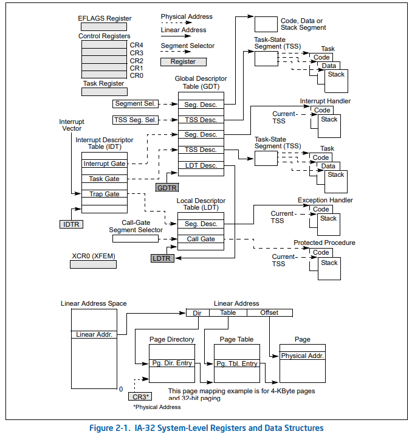
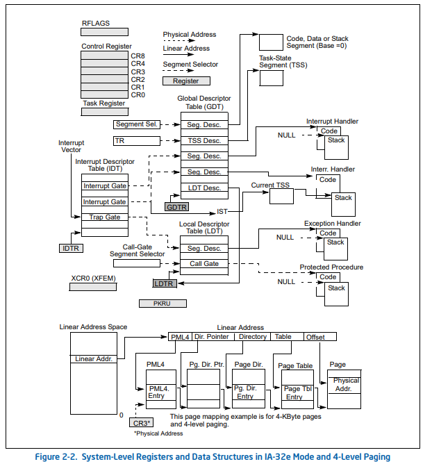

# Linux kernel source(2):kernel boot

## 引导

按下电源开关：

### CPU

CPU初始化，实模式下运行，首先执行`0xfffffff0`地址的内容，是一个跳转，跳转到BIOS；

### BIOS

BIOS初始化，检查硬件状态，寻找可引导设备，跳转到引导扇区；

1. 定位主引导扇区（数据446bytes，0xaa55结束）
2. MBR分区，初始化，把第一个扇区的内容加载到内存`0x7c00`处，即`bootloader`处，跳转执行；

### BootLoader

GRUB2是一种BootLoader；

1. BootLoader执行`boot.img`；
2. `boot.img`跳转到`GRUB2`的`diskboot.img`，加载内核代码和文件系统到内存；
3. `GRUB2`运行`grub_main`函数，初始化控制台，加载配置文件，设置root设备，加载模块，切换为`normal`模式；
4. `normal`模式调用`grub_normal_execute`完成最后的准备工作，显示可用操作系统菜单；
5. 用户选择后，调用`grub_menu_execute_entry`，运行boot命令，引导操作系统到内存中；

物理内存布局

```
        | Protected-mode kernel  |
100000   +------------------------+
        | I/O memory hole        |
0A0000   +------------------------+
        | Reserved for BIOS      | Leave as much as possible unused
        ~                        ~
        | Command line           | (Can also be below the X+10000 mark)
X+10000  +------------------------+
        | Stack/heap             | For use by the kernel real-mode code.
X+08000  +------------------------+
        | Kernel setup           | The kernel real-mode code.
        | Kernel boot sector     | The kernel legacy boot sector.
    X +------------------------+
        | Boot loader            | <- Boot sector entry point 0x7C00
001000   +------------------------+
        | Reserved for MBR/BIOS  |
000800   +------------------------+
        | Typically used by MBR  |
000600   +------------------------+
        | BIOS use only          |
000000   +------------------------+
```


## 实模式到保护模式

执行内存中的内核代码；

### 入口_start

```assembly
	.globl	_start
_start:
		# Explicitly enter this as bytes, or the assembler
		# tries to generate a 3-byte jump here, which causes
		# everything else to push off to the wrong offset.
		.byte	0xeb		# short (2-byte) jump
		.byte	start_of_setup-1f
```

`kernel`入口是`arch/x86/header.S`的`_start`，第一条指令便是一个短跳转，跳转到`start_of_setup`；

### 初始化start_of_setup

```assembly
start_of_setup:
# Force %es = %ds
	movw	%ds, %ax
	movw	%ax, %es
	cld

# Apparently some ancient versions of LILO invoked the kernel with %ss != %ds,
# which happened to work by accident for the old code.  Recalculate the stack
# pointer if %ss is invalid.  Otherwise leave it alone, LOADLIN sets up the
# stack behind its own code, so we can't blindly put it directly past the heap.

	movw	%ss, %dx
	cmpw	%ax, %dx	# %ds == %ss?
	movw	%sp, %dx
	je	2f		# -> assume %sp is reasonably set

	# Invalid %ss, make up a new stack
	movw	$_end, %dx
	testb	$CAN_USE_HEAP, loadflags
	jz	1f
	movw	heap_end_ptr, %dx
1:	addw	$STACK_SIZE, %dx
	jnc	2f
	xorw	%dx, %dx	# Prevent wraparound

2:	# Now %dx should point to the end of our stack space
	andw	$~3, %dx	# dword align (might as well...)
	jnz	3f
	movw	$0xfffc, %dx	# Make sure we're not zero
3:	movw	%ax, %ss
	movzwl	%dx, %esp	# Clear upper half of %esp
	sti			# Now we should have a working stack

# We will have entered with %cs = %ds+0x20, normalize %cs so
# it is on par with the other segments.
	pushw	%ds
	pushw	$6f
	lretw
6:

# Check signature at end of setup
	cmpl	$0x5a5aaa55, setup_sig
	jne	setup_bad

# Zero the bss
	movw	$__bss_start, %di
	movw	$_end+3, %cx
	xorl	%eax, %eax
	subw	%di, %cx
	shrw	$2, %cx
	rep; stosl

# Jump to C code (should not return)
	calll	main
```

可以看到，`start_of_setup`将段寄存器初始化，并且初始化了堆栈和bss段，最后调用`main`函数，其处在`arch/x86/boot/main.c`；

### 主体流程main

```c
void main(void)
{
	/* First, copy the boot header into the "zeropage" */
	copy_boot_params();

	/* Initialize the early-boot console */
	console_init();
	if (cmdline_find_option_bool("debug"))
		puts("early console in setup code\n");

	/* End of heap check */
	init_heap();

	/* Make sure we have all the proper CPU support */
	if (validate_cpu()) {
		puts("Unable to boot - please use a kernel appropriate "
		     "for your CPU.\n");
		die();
	}

	/* Tell the BIOS what CPU mode we intend to run in. */
	set_bios_mode();

	/* Detect memory layout */
	detect_memory();

	/* Set keyboard repeat rate (why?) and query the lock flags */
	keyboard_init();

	/* Query Intel SpeedStep (IST) information */
	query_ist();

	/* Query APM information */
#if defined(CONFIG_APM) || defined(CONFIG_APM_MODULE)
	query_apm_bios();
#endif

	/* Query EDD information */
#if defined(CONFIG_EDD) || defined(CONFIG_EDD_MODULE)
	query_edd();
#endif

	/* Set the video mode */
	set_video();

	/* Do the last things and invoke protected mode */
	go_to_protected_mode();
}

```

`main`函数所做的工作由：

1. `copy_boot_params`

   - 把`header.S`中的`hdr`拷贝到`boot_params`中，所谓的第零页；

     ```c
     	memcpy(&boot_params.hdr, &hdr, sizeof(hdr));
     ```

   - 如果`kernel`用的是旧的命令行协议，，则更新为`kernel`的命令行；

     ```c
     	if (!boot_params.hdr.cmd_line_ptr &&
     	    oldcmd->cl_magic == OLD_CL_MAGIC) {
     		/* Old-style command line protocol. */
     		u16 cmdline_seg;
     
     		/* Figure out if the command line falls in the region
     		   of memory that an old kernel would have copied up
     		   to 0x90000... */
     		if (oldcmd->cl_offset < boot_params.hdr.setup_move_size)
     			cmdline_seg = ds();
     		else
     			cmdline_seg = 0x9000;
     
     		boot_params.hdr.cmd_line_ptr =
     			(cmdline_seg << 4) + oldcmd->cl_offset;
     	}
     ```

2. `console_init`

   - 初始化控制台

     ```c
     void console_init(void)
     {
     	parse_earlyprintk();
     
     	if (!early_serial_base)
     		parse_console_uart8250();
     }
     ```

3. `init_heap`

   - 初始化堆，x

     ```c
     static void init_heap(void)
     {
     	char *stack_end;
     
     	if (boot_params.hdr.loadflags & CAN_USE_HEAP) {   // 判断堆是否可用
     		asm("leal %P1(%%esp),%0"
     		    : "=r" (stack_end) : "i" (-STACK_SIZE));
     
     		heap_end = (char *)     // 堆结束的地址
     			((size_t)boot_params.hdr.heap_end_ptr + 0x200);
     		if (heap_end > stack_end)   // 如果堆结束地址大于栈结束地址，则堆结束地址等于栈结束地址
     			heap_end = stack_end;
     	} else {                          // boot协议不匹配，堆不可用，打印信息
     		/* Boot protocol 2.00 only, no heap available */
     		puts("WARNING: Ancient bootloader, some functionality "
     		     "may be limited!\n");
     	}
     }
     ```

4. `validate_cpu`

   - 检查CPU支持状态

     ```c
     	if (validate_cpu()) {
     		puts("Unable to boot - please use a kernel appropriate "
     		     "for your CPU.\n");
     		die();
     	}
     ```

     调用了`validate_cpu`来检查；

     ```c
     int validate_cpu(void)
     {
     	u32 *err_flags;
     	int cpu_level, req_level;
     
     	check_cpu(&cpu_level, &req_level, &err_flags);   // 检查并获取cpu的几个标志位
     
     	if (cpu_level < req_level) {        // 如果cpu_level < req_level，即cpu特权级小于请求等级
     		printf("This kernel requires an %s CPU, ",
     		       cpu_name(req_level));   // 打印内核需要的CPU请求等级
     		printf("but only detected an %s CPU.\n",
     		       cpu_name(cpu_level));   // 打印当前CPU的特权等级
     		return -1;    // 返回-1代表检查成功但CPU不支持kernel
     	}
     
     	if (err_flags) {
     		puts("This kernel requires the following features "
     		     "not present on the CPU:\n");
     		show_cap_strs(err_flags);   // 如果存在错误，则打印错误的信息，表示CPu功能不足
     		putchar('\n');
     		return -1;
     	} else if (check_knl_erratum()) {   
             // 检查Intel的信息，检查cpu的family和model，检查是否是64bit，或者32bit下是否开启了PAE（物理地址扩展）
     		return -1;
     	} else {
     		return 0;
     	}
     }
     ```

5. `set_bios_mode`

   - 设置BIOS模式为x86_64的模式；

     ```c
     static void set_bios_mode(void)
     {
     #ifdef CONFIG_X86_64        // 告诉BIOS将要运行的是x86_64的
     	struct biosregs ireg;
     // 此时还是实模式，intcall是初始化阶段的中断处理函数，BIOS的寄存器设置成ireg变量
     	initregs(&ireg);
     	ireg.ax = 0xec00;
     	ireg.bx = 2;
     	intcall(0x15, &ireg, NULL);
     #endif
     }
     ```

6. `  detect_memory`

   - 内存探测，从BIOS手机物理内存信息，包括物理内存的起始地址，段大小，内存段类型；

     ```c
     void detect_memory(void)
     {
     	detect_memory_e820();
     
     	detect_memory_e801();
     
     	detect_memory_88();
     }
     ```

     在ucore的实验中，涉及到了地址探测的问题，具体参考我的[另一篇文章](https://www.wolai.com/k1ose-ctf/mZucE8MYnpHtg8LPVQvhUF?theme=dark)，之后有空再补到这上面；

7. `keyboard_init`

   - 字面意思，对键盘的初始化；

     ```c
     static void keyboard_init(void)
     {
     	struct biosregs ireg, oreg;
     	initregs(&ireg);
     
     	ireg.ah = 0x02;		/* Get keyboard status */
     	intcall(0x16, &ireg, &oreg);
     	boot_params.kbd_status = oreg.al;
     
     	ireg.ax = 0x0305;	/* Set keyboard repeat rate */
     	intcall(0x16, &ireg, NULL);
     }
     ```

8. `query_ist`

   - 获取BIOS中的其它信息包括机器型号、BIOS版本、高级电池管理等；

     ```c
     static void query_ist(void)
     {
     	struct biosregs ireg, oreg;
     
     	/* Some older BIOSes apparently crash on this call, so filter
     	   it from machines too old to have SpeedStep at all. */
     	if (cpu.level < 6)
     		return;
     
     	initregs(&ireg);
     	ireg.ax  = 0xe980;	 /* IST Support */
     	ireg.edx = 0x47534943;	 /* Request value */
     	intcall(0x15, &ireg, &oreg);
     
     	boot_params.ist_info.signature  = oreg.eax;
     	boot_params.ist_info.command    = oreg.ebx;
     	boot_params.ist_info.event      = oreg.ecx;
     	boot_params.ist_info.perf_level = oreg.edx;
     }
     ```

     可以发现很多都是靠`header.S`中设置好的寄存器参数来传递参数，并且进行中断处理；

9. 如果设置了APM和EDD模式，则还会查询相关的信息；

10. `set_video`

    - 设置显示模式；

      ```c
      void set_video(void)
      {
      	u16 mode = boot_params.hdr.vid_mode;
      
      	RESET_HEAP();          // 重设堆, heap=_end
      
      	store_mode_params();   // 存储当前模式的参数信息
      	save_screen();      // 保存信息
      	probe_cards(0);    // 探测视频驱动程序，生成模式列表
      
      	for (;;) {   // 对应模式
      		if (mode == ASK_VGA)
      			mode = mode_menu();
      
      		if (!set_mode(mode))
      			break;
      
      		printf("Undefined video mode number: %x\n", mode);
      		mode = ASK_VGA; // 默认
      	}
      	boot_params.hdr.vid_mode = mode;
      	vesa_store_edid();
      	store_mode_params();
      
      	if (do_restore)
      		restore_screen();
      }
      ```

11. `go_to_protected_mode`

    - 启动保护模式

      ```c
      void go_to_protected_mode(void)
      {
      	/* Hook before leaving real mode, also disables interrupts */
      	realmode_switch_hook();   // 禁止中断功能
      
      	/* Enable the A20 gate */
      	if (enable_a20()) {   // 开启a20标志位
      		puts("A20 gate not responding, unable to boot...\n");
      		die();
      	}
      
      	/* Reset coprocessor (IGNNE#) */
      	reset_coprocessor();   // 重新设置协处理器
      
      	/* Mask all interrupts in the PIC */
      	mask_all_interrupts();  // 屏蔽辅助PIC（可编程中断控制器）和主要PIC上的所有中断
      
      	/* Actual transition to protected mode... */
      	setup_idt();   // 设置中断描述符表（IDT）
      	setup_gdt();   // 设置全局描述符表
      	protected_mode_jump(boot_params.hdr.code32_start, // code32_start是保护模式入口点的地址，进行跳转
      			    (u32)&boot_params + (ds() << 4));   // arch/x86/boot/pmjump.S
      }
      ```

      - `setup_idit`
      
        ```c
        static void setup_idt(void)
        {
                static const struct gdt_ptr null_idt = {0, 0};
                asm volatile("lidtl %0" : : "m" (null_idt));
        }
        ```
      
        `null_idt`为空，使用`lidt`将`null_idt`加载入`idt`寄存器；
      
      - `setup_gdt`
      
        ```c
        /* CS: code, read/execute, 4 GB, base 0 */
        [GDT_ENTRY_BOOT_CS] = GDT_ENTRY(0xc09b, 0, 0xfffff),
        /* DS: data, read/write, 4 GB, base 0 */
        [GDT_ENTRY_BOOT_DS] = GDT_ENTRY(0xc093, 0, 0xfffff),
        /* TSS: 32-bit tss, 104 bytes, base 4096 */
        /* We only have a TSS here to keep Intel VT happy;
           we don't actually use it for anything. */
        [GDT_ENTRY_BOOT_TSS] = GDT_ENTRY(0x0089, 4096, 103),
        ```
      
        - 使用`boot_gdt[]`数组存储`gdt`全局表，初始化CS，DS，TSS表项；
      
        - 使用`static struct gdt_ptr gdt`存储gdt全局表大小与地址；
        - 使用`lgdt`将`gdt_ptr`加载如gdt寄存器；
      
      关于涉及到的几个描述符表；
      
      > - **任务状态描述符表**`TSS`记录**当前进程执行时所对应的寄存器的数据**，这些数据主要在**进程切换时发挥作用**。比如，现在要由当前进程A切换到进程B，那么系统就要**将此时各个寄存器的数值保存在进程A的任务状态描述符表**中，以便将来进程A再次执行时接着使用而不至于出现混乱；之后，再用**进程B中TSS里面的寄存器值来设置相应的寄存器**，以此支持进程B接下来的执行。
      >- **局部数据描述符表**`LDT`中，记录着**当前进程对应程序的代码段和数据段信息**，比如代码的基地址等，这些信息将在进程程序执行时提供支持。
      > - 系统将来就是通过**全局描述符表**`GDT`表中**挂接的TSS描述符和LDT描述符，来与当前进程建立关系的**。这里将`TSS`和`LDT`挂接在全局描述符表`GDT`中，标志着**系统从此具备操作进程的能力**；
      
      两个概念图
      
      
      
      
      
      执行结束后，会跳转到`arch/x86/boot/pmjump.S`上，保护模式打开；

## 64bit

跳转后执行，CPU检查是否支持64bit，然后初始化`boot page table`，最后切换到64bit，其引导在`arch/x86/boot/compressed/head_64.S`下；

## 内核启动

解压kernel并重定位，函数`startup_64`开始执行；

