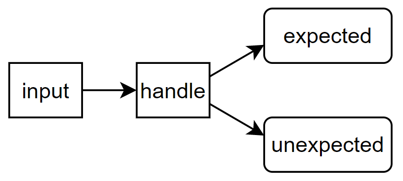

# What is AI？

给人工智能一个定义

ALGORITHMS enabled by CONSTRAINTS exposed by REPRESENTATON that support MODEL targeted at THINKING + PERCEPTION + ACTION

人工智能是关于算法通过如下呈现的约束条件得以实现针对思维、感知和行动的模型。

GENERATE&TEST（测试生成）

RUMPELSTILTSKIN法则：当对一个事物命名后，就能对它产生影响

trivial&simple，微不足道和简单存在的差别，微不足道代表价值意义小，而简单的事情也可能有很重要的意义。

