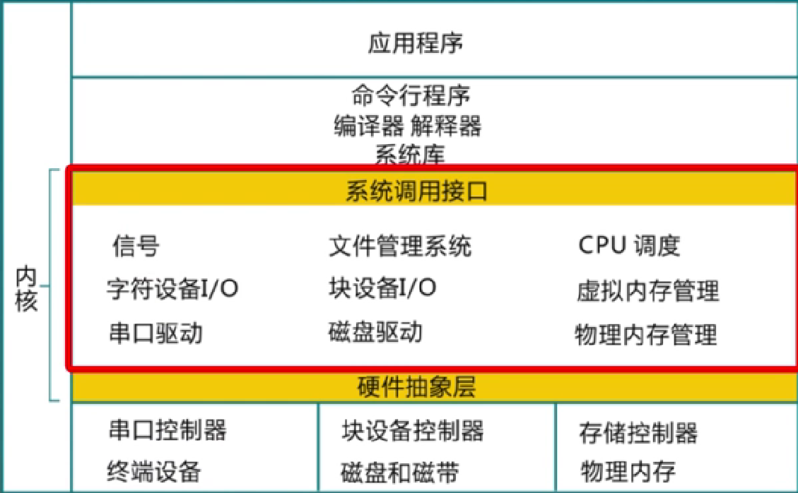

# 01-Summary

## 课程概述

### 预备知识

- 计算机组成原理

- C语言与汇编

- 数据结构


### 参考书

- William Stallings, Operating System-Internals and Design Principles(8th Edition), Prentice Hall,2011
- 操作系统——精髓与设计原理（第七版）


### 成绩评定

- 在线练习（10min）
- 参与教学过程
- 8个实验
- 考试：期中考试 + 期末考试


## 教学安排

- 操作系统结构
- 中断与系统调用
- 内存管理
- 进程及线程
- 处理机调度
- 同步互斥
- 文件系统
- I/O子系统

## 什么是操作系统

操作系统是：

- 没有公认的精确定义；

- 一个控制程序
- 一个资源管理器
  - 控制程序执行过程，防止错误和计算机的不当使用
  - 管理各种计算机软硬件资源
  - 提供访问计算机软硬件资源的高效手段
  - 解决资源访问冲突，确保资源公平使用

操作系统软件的组成：

- 命令行接口shell
- 图形用户结构gui
- 操作系统内部kernel



内核的特征：

- 并发
- 共享
- 虚拟
- 异步

## 为什么学习，如何学习

综合课程：

- 程序设计语言
- 数据结构
- 算法
- 计算机体系结构

## 操作系统实例

Unix Windows Linux

## 操作系统演变

主要功能：硬件抽象和协调管理

- 单用户系统
  - 昂贵组件的低效率
- 批处理系统
  - 顺序执行
  - 批处理
- 多程序系统
  - 多道程序
- 分时
  - 时钟引入以交替运行
- 个人计算机
  - 界面
  - 多功能多服务
- 分布式计算
  - 网络引入，数据共享协调
  - 算力

## 操作系统结构

### 简单结构MS-DOS

- 没有拆分模块
- 接口和功能未分离，主要由汇编编写

### 分层结构

- 最底层为硬件，最高层为用户界面
- 可移植

还是上面用过的图。


### 微内核结构

- 尽可能把内核功能移植到用户空间
- 用户模块间消息传递

### 外核结构

- 内核分配物力资源到多个应用程序，让程序决定如何处理资源
- 链接到操作系统库，实现操作系统抽象
- 保护与控制分离

### VMM

虚拟机管理器将单独的机器接口转换成很多虚拟机，和硬件打交道，由操作系统进行资源管理

## 课后练习

1. ```
   操作系统属于（系统软件）。
   ```

2. ```
   下面不能描述操作系统的是 (D)
   
   使计算机方便使用
   可以管理计算机硬件
   可以控制应用软件的执行
   负责生成应用软件
   ```

3. ```
   以下不属于操作系统的功能是 (C)
   
   进程调度
   内存管理
   视频编辑
   设备驱动
   ```

4. ```
   操作系统中的多道程序设计方式用于提高 (B)
   
   稳定性
   效率
   兼容性
   可靠性
   ```

5. ```
   下面对于分时操作系统的说法，正确的是（C）
   
   应用程序执行的先后顺序是完全随机的
   应用程序按照启动的时间依次执行
   应用程序可以交替执行
   应用程序等待的时间越长，下一次调度被选中的概率一定越大
   ```

6. ```
   Unix操作系统属于 (A)
   
   分时操作系统
   批处理操作系统
   实时操作系统
   分布式操作系统
   
   解释：选择1更合适。Unix操作系统支持交互式应用程序，属于分时操作系统。比早期的批处理操作系统要强大。且它更多地面向桌面和服务器领域，并没有很强的实时调度和实时处理功能，所以一边不划归为实时系统。它虽然有网络支持（如TCP/IP），但实际上它管理的主要还是单个计算机系统让的硬件和应用软件。 以ucore OS为例，它模仿的是Unix操作系统，实现了对应的分时调度算法（时间片轮转、多级反馈队列），所以也算是分时系统。如果ucore实现了实时进程管理、实时调度算法，并支持在内核中的抢占（preempt in kernel），则可以说它也是一个实时系统了。
   ```

7. ```
   批处理的主要缺点是 (B)
   
   效率低
   失去了交互性
   失去了并行性
   以上都不是
   
   解释：批处理操作系统没有考虑人机交互所需要的分时功能，所以开发人员或操作人员无法及时与计算机进行交互。 以ucore OS为例，如果它实现的调度算法是先来先服务调度算法（在后续章节“处理器调度”，相对其他调度算法，具体实现更简单），那它就是一种批处理操作系统了，没有很好的人机交互能力。
   ```

8. ```
   关于操作系统，说法正确的是(ABC)
   
   操作系统属于软件
   操作系统负责资源管理
   操作系统使计算机的使用更加方便
   操作系统必须要有用户程序才能正常启动
   ```

9. ```
   设备管理的功能包括 (ACD)
   
   设备的分配和回收
   进程调度
   虚拟设备的实现
   外围设备启动
   
   解释：进程调度是属于操作系统的进程管理和处理器调度子系统要完成的工作，与设备管理没有直接关系 以ucore OS为例（lab5以后的实验），与进程调度相关的实现位于kern/process和kern/schedule目录下；与设备管理相关的实现主要位于kern/driver目录下
   ```

10. ```
    多道批处理系统主要考虑的是 (CD)
    
    交互性
    及时性
    系统效率
    吞吐量
    
    解释：交互性和及时性是分时系统的主要特征。多道批处理系统主要考虑的是系统效率和系统的吞吐量。 以ucore OS为例（lab6实验）,这主要看你如何设计调度策略了，所以如果实现FCFS(先来想服务)调度算法，这可以更好地为多道批处理系统服务；如果实现时间片轮转（time-slice round robin）调度算法，则可以有比较好的交互性；如果采用多级反馈队列调度算法，则可以兼顾上述4个选项，但交互性用户程序获得CPU的优先级更高。
    ```

11. ```
    （华中科技大学，2005）程序正在试图读取某个磁盘的第100个逻辑块，使用操作系统提供的(A)接口
    
    系统调用
    图形用户
    原语
    键盘命令
    
    解释：操作系统作为用户和计算机硬件系统之间的接口，用户可以通过3种方式使用计算机，命令方式、系统调用方式、图形方式。系统调用按照功能分为进程管理、文件操作、设备管理等，本题描述的是文件操作系统调用相关的执行。
    ```

12. ```
    (2009计算机统考)单处理器系统中，可并行执行或工作的对象是(D)
    
    1)进程与进程
    2)处理器与设备
    3)处理器与通道
    4)设备与设备
    
    1 2 3
    1 2 4
    1 3 4
    2 3 4
    
    解释：并行指同一时刻同时发生，同一时刻单个处理器只能运行一个进程。
    ```

13. ```
    (2010统考）下列选项中，操作系统提供给应用程序的接口是 (A)
    
    系统调用
    中断
    库函数
    原语
    ```

14. ```
    (2011统考)下列选项中，在用户态执行的是 (A)
    
    命令解释程序
    缺页处理程序
    进程调度程序
    时钟中断处理程序
    ```

15. ```
    (2013联考)计算机开机后，操作系统最终被加载到（D）
    
    BIOS
    ROM
    EPROM
    RAM
    ```

