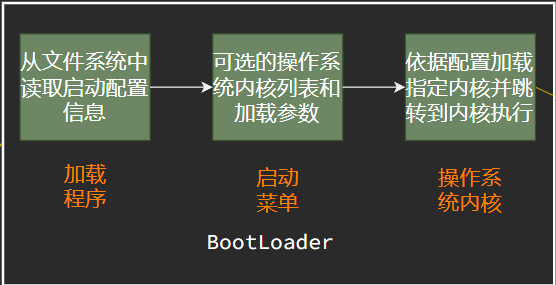

# 03-Boot Interrupt Exception Syscall

[相关图](./OS-03-boot-interrupt-exception-syscall.drawio.html)

## BIOS

### 计算机体系结构概述

```
		CPU

		 |

———————————————————— 总线

	|           |

  I/O设备       内存
```

### 计算机内存和硬盘布局

内存

- ROM只读存储 <- 加电后，CPU加载执行的第一条指令
- RAM随机访问存储


在加电时，CPU完成初始化后，处于实模式，20位地址空间得到1M的寻址；

此时使CS左移四位，加上当前的指令指针寄存器的值，即得到要加载的第一条指令地址。`PC = 16*CS + IP`，其中`CS:IP=0xf000:fff0`；

### BIOS提供的功能

BIOS只能在x86的实模式下进行访问；

- 基本输入输出程序：从磁盘读写数据，从键盘读取数据，输出到显示器上；
  - INT 10h - 字符显示 
  - INT 13h - 磁盘扇区读写
  - INT 15h - 检测内存大小
  - INt 16h - 键盘输入
- 系统设置信息；
- 开机后自检程序；
- 系统自启动程序等

依据以上的功能以及提供的信息，将磁盘中的加载程序加载到内存中；

- 将加载程序从磁盘的引导扇区（512字节）加载到内存偏移为0x7c00处；
- 跳转到CS:IP=0000:7c00

### 加载程序

- 将操作系统的代码和数据从磁盘加载到内存中
- 跳转到操作系统的起始地址


总结起来，BIOS将磁盘中的加载程序加载到内存偏移为0x7c00处，加载程序执行时，将操作系统加载到内存中，接着将控制权交给操作系统即可；


## 系统启动流程

### 计算机启动流程

- 系统加电
- BIOS初始化硬件
- BIOS读取主引导扇区代码(主引导记录)
- 主引导扇区代码读取互动分区的引导扇区代码(活动分区)
- 引导扇区代码读取文件系统的加载程序(加载程序)

总结起来为：


下面是过程间的细节；

#### CPU初始化

- CPU加电稳定后从0xffff0读取第一条指令
  - CS:IP = 0xf000:fff0
  - 第一条指令是跳转指令
- CPU初始状态为16位实模式
  - CS:IP是16位寄存器
  - 指令指针PC=16*CS+IP
  - 最大寻址空间为1MB

#### BIOS初始化

- 硬件自检POST
- 检测系统中内存和显卡等部件的存在和工作状态
- 查找并执行显卡等接口卡BIOS，进行设备初始化；
- 执行系统BIOS，进行系统检测；
  - 检测和配置系统中安装的即插即用设备；
- 更新CMOS中的扩展系统配置数据ESCD(表)；
- 按指定启动顺去从软盘、硬盘或光驱启动

#### 主引导记录MBR格式


- 启动代码
  - 446字节
  - 检查分区表正确性
  - 加载并跳转到磁盘上的引导程序
- 硬盘分区表
  - 64字节
  - 描述分区状态和位置
  - 每个分区描述信息占据16字节
- 结束标志字
  - 2字节(55AA)
  - 主引导记录的有效标志

#### 活动分区格式


- 跳转指令
  - 跳转到启动代码
  - 平台相关

- 文件卷头
  - 文件系统描述信息
- 启动代码
  - 跳转到加载程序
- 结束标志字
  - 55AA

#### Bootloader



加载程序所执行的内容如上图，于是内核从磁盘中被加载到内存中；

### 图示

可能有错误，希望斧正；


## 中断、异常和系统调用

为什么需要中断、异常和系统调用？

- 中断：来自硬件设备的处理请求

  - 计算机运行中，内核是被信任的第三方

  - 只有内核可以执行特权指令

  - 方便应用程序，提供服务给应用程序

- 异常：非法指令或其他原因导致当前指令执行失败后的处理请求

  - 与外设交互的响应

  - 处理意想不到的行为

- 系统调用：应用程序主动向操作系统发出的服务请求

  - 用户程序得到系统服务
  - 系统调用和功能调用

内核的进入与退出


### 中断、异常和系统调用比较

#### 源头

中断：外设

异常：应用程序、内核意想不到的行为

系统调用：应用程序请求操作提供服务

#### 响应方式

中断：异步

异常：同步

系统调用：异步或同步

#### 处理机制

中断：持续，对用户程序是透明的

异常：杀死或重新执行产生意想不到的行为的程序指令

系统调用：等待和持续

### 中断

#### 硬件处理

- 在CPU初始化时设中断使能标志
  - 依据内部或外部事件设置中断标志
  - 依据中断向量表调用相应中断服务例程

#### 软件处理

- 现场保存（编译器）
- 中断服务处理（服务例程）
- 清除中断标记（服务例程）
- 现场恢复（编译器）

#### 中断嵌套

- 硬件中断服务例程允许被打断
  - 不同硬件中断源可能同时出现硬件中断处理
  - 硬件中断服务例程中需要临时禁止中断请求
  - 中断请求会保持到CPU做出响应
- 异常服务例程允许被打断
  - 异常服务例程执行时可能出现硬件中断
- 异常服务例程可嵌套
  - 例如异常服务例程执行时出现缺页异常

### 系统调用


#### 外部使用

- 操作系统服务的编程接口
- 通常由高级语言编写
- 程序访问通常是通过高层次的API接口而不是直接进行系统调用
- 三种常见的应用编程接口（API）
  - Win32 API用于Windows
  - POSIX API用于POSIX-based systems
  - JAVA API用于JVM

#### 内部实现

- 每个系统调用对应一个系统调用号
  - 系统调用接口根据系统调用号来维护表的索引
- 系统调用接口调用内核态中的系统调用功能实现，并返回系统调用的状态和结果
- 用户不需要知道系统调用的实现
  - 需要设置调用参数和获取返回结果
  - 操作系统接口的细节大部分都隐藏在应用编程接口后，通过运行程序支持的库来管理

#### 系统调用和函数调用的差别

系统调用

- INT和IRET指令用于系统调用，系统调用时，堆栈切换和特权级的转换（后续会涉及详细内容）

函数调用

- CALL和RET用于常规调用，常规调用时没有堆栈切换

### 系统调用示例

一个标准的函数调用，例如应用程序调用printf()，会触发系统调用write()；

- 产生中断
- 系统调用表查询
- 系统调用实现
- 结果返回

#### 执行文件复制过程中的系统调用

源文件 -> 目标文件 的 步骤：

- 获取输入文件名
  - 在屏幕显示提示
  - 等待并接收键盘输入
- 获取输出文件名
  - 在屏幕显示提示
  - 等待并接收键盘输入
- 打开输入文件
  - 如果文件不存在，出错退出
- 创建输出文件
  - 如果文件存在，出错退出
- 循环
  - 读取输入文件
  - 写入输出文件
- 直到读取结束
- 关闭输出文件
- 在屏幕上显示完成信息
- 正常退出

#### 系统调用表及涉及的系统调用

```c
// System call numbers
#define SYS_fork 1
#define SYS_exit 2
#define SYS_wait 3
#define SYS_pipe 4
#define SYS_write 5
#define SYS_read 6
#define SYS_close 7
#define SYS_kill 8
#define SYS_exec 9
#define SYS_open 10
#define SYS_mknod 11
#define SYS_unlink 12
```

对于上面的程序，需要用到的系统调用有exit write read close；

对于read()函数，有

```c
int read(int fd, void *buf, int length)
```

参数和返回值信息为：

```
fd - 文件描述符
*buf - 数据缓冲区指针
length - 数据缓冲区长度
return_value - 返回读取数据长度
```

在ucore中的示例：

```
// kern/trap/trapentry.S : alltraps()

// kern/trap/trap.c: trap()
tf->trapno = T_SYSCALL

// kern.syscall/syscall.c: syscall()
tf->tf_regs.reg_eax == SYS_read()

// kern.syscall/syscall.c: sys_read()
    tf->sp从栈中获取参数值fd, buf, length

// kern/fs.sysfile.c: sysfile_read()
    读取文件

// kern/trap/trapentry.S: trapret()
    读取到的内容长度
```

## 练习

### 中断、异常和系统调用

1. ```
   (2012统考)下列选项中，不可能在用户态发生的是（C）
   系统调用
   外部中断
   进程切换
   缺页
   ```

2. ```
   （2012统考）中断处理和子程序调用都需要压栈以保护现场。中断处理一定会保存而子程序调用不需要保存其内容的是（ B ）
   
   程序计数器
   程序状态字寄存器
   通用数据寄存器
   通用地址寄存器
   
   解析：程序状态字（PSW）寄存器用于记录当前处理器的状态和控制指令的执行顺序，并且保留与运行程序相关的各种信息，主要作用是实现程序状态的保护和恢复。所以中断处理程序要将PSW保存，子程序调用在进程内部执行，不会更改PSW。
   ```

3. ```
   （华中科技大学）中断向量地址是（ B ）
   
   子程序入口地址
   中断服务例程入口地址
   中断服务例程入口地址的地址
   例行程序入口地址
   ```

4. ```
   下列选项中， ____可以执行特权指令？(A)
   
   中断处理例程
   普通用户的程序
   通用库函数
   管理员用户的程序
   ```

5. ```
   一般来讲，中断来源于____（A）
   
   外部设备
   应用程序主动行为
   操作系统主动行为
   软件故障
   ```

6. ```
   用户程序通过____向操作系统提出访问外部设备的请求（B）
   I/O指令
   系统调用
   中断
   创建新的进程
   解析：
   以ucore OS为例，在lab5中有详细的syscall机制的设计实现。比如用户执行显示输出一个字符的操作，由于涉及向屏幕和串口等外设输出字符，需要向操作系统发出请求，具体过程是应用程序运行在用户态，通过用户程序库函数cputch，会调用sys_putc函数，并进一步调用syscall函数（在usr/libs/syscall.c文件中），而这个函数会执行“int 0x80”来发出系统调用请求。在ucore OS内核中，会接收到这个系统调用号（0x80）的中断（参见 kernel/trap/trap.c中的trap_dispatch函数有关 “case T_SYSCALL:”的实现）,并进一步调用内核syscall函数（参见 kernel/syscall/syscall.c中的实现）来完成用户的请求。内核在内核态（也称特权态）完成后，通过执行“iret”指令（kernel/trap/trapentry.S中的“__trapret:”下面的指令），返回到用户态应用程序发出系统调用的下一条指令继续执行应用程序。
   ```

7. ```
   应用程序引发异常的时候，操作系统可能的反应是（C）
   删除磁盘上的应用程序
   重启应用程序
   杀死应用程序
   修复应用程序中的错误
   
   ```

8. ```
   操作系统与用户的接口包括____（A）
   系统调用
   进程调度
   中断处理
   程序编译
   ```

9. ```
   操作系统处理中断的流程包括____（ABCD）
   
   保护当前正在运行程序的现场
   分析是何种中断，以便转去执行相应的中断处理程序
   执行相应的中断处理程序
   恢复被中断程序的现场
   ```

10. ```
    下列程序工作在内核态的有____(ABCD)
    
    系统调用的处理程序
    中断处理程序
    进程调度
    内存管理
    ```

10. ```
    (西北工业大学)CPU执行操作系统代码的时候称为处理机处于（ C ）
    
    自由态
    目态
    管态
    就绪态
    
    解析：内核态又称为管态
    ```
    
10. ```
    （2013统考）下列选项中，会导致用户进程从用户态切换到内核态的操作是（ B ） 
    
    1）整数除以0 2）sin()函数调用 3）read系统调用
    
    1、2
    1、3
    2、3
    1、2、3
    
    ```
    
10. ```
    系统调用的主要作用是（ C ）
    
    处理硬件问题
    应对软件异常
    给应用程序提供服务接口
    管理应用程序
    ```

10. ```
    下列关于系统调用的说法错误的是（ B ）
    
    系统调用一般有对应的库函数
    应用程序可以不通过系统调用来直接获得操作系统的服务
    应用程序一般使用更高层的库函数而不是直接使用系统调用
    系统调用可能执行失败
    
    解析：根据对当前操作系统设计与实现的理解，系统调用是应用程序向操作系统发出服务请求并获得操作系统服务的唯一通道和结果。如果操作系统在执行系统调用服务时，产生了错误，就会导致系统调用执行失败。 以ucore OS为例，在用户态的应用程序（lab5,6,7,8中的应用程序）都是通过系统调用来获得操作系统的服务的。为了简化应用程序发出系统调用请求，ucore OS提供了用户态的更高层次的库函数（user/libs/ulib.[ch]和syscall.[ch]），简化了应用程序的编写。如果操作系统在执行系统调用服务时，产生了错误，就会导致系统调用执行失败。
    ```
    
10. ```
    以下关于系统调用和常规调用的说法中，错误的是（D）
    
    系统调用一般比常规函数调用的执行开销大
    系统调用需要切换堆栈
    系统调用可以引起特权级的变化
    常规函数调用和系统调用都在内核态执行
    ```

    


