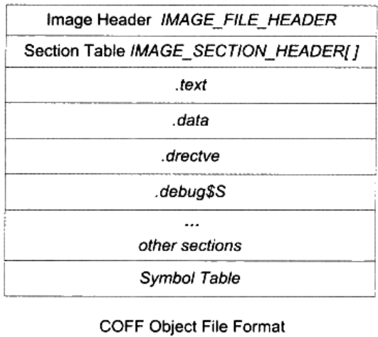
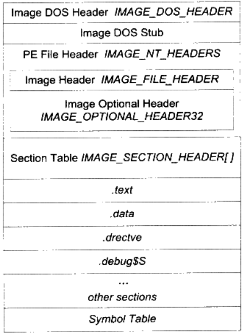

# windows PE/COFF

```
COFF -> ELF/PE
```

书中，目标文件默认为COFF，可执行文件默认为PE；

```
.text -> .code   (visual c++)
.text -> CODE    (Borland)
```

段名没有实际意义，除了链接脚本控制链接的时候；

```
sample.c --cl--> sample.obj --linker--> sample.exe
```

使用`dumpbin`来查看`obj`文件；

## COFF文件格式



## PE文件格式



`IMAGE_NT_HEADERS`是真正的PE文件头，其偏移信息保存在`IMAGE_DOS_HEADER`中，该信息为`e_lfanew`成员，如果为`0`，表示该PE文件为`DOS`的`MZ`文件，将会用DOS子系统执行，如果不为`0`，如上所示，则代表偏移；

在`IMAGE_NT_HEADERS`中，包含一个标记（0x00004550，即`PE\0\0`）以及两个结构体（Image Header、Image Optional Header）；

类似于ELF文件的信息放在了数据目录`Data Directory`中；
