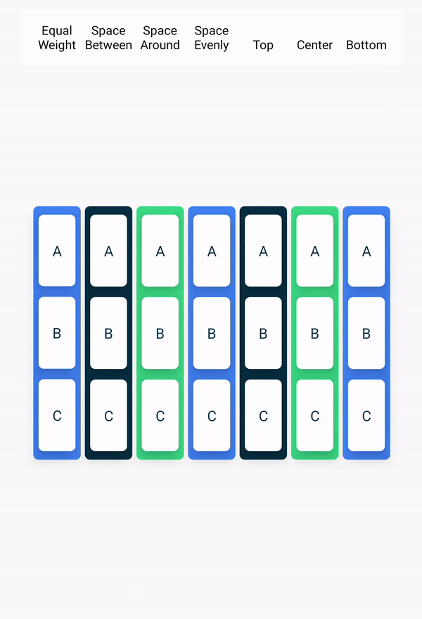

# Unit 1：Your First Android App

## Course goals

- Understand the fundamentals of Kotlin and Jetpack Compose
- Build a series of basic Android apps
- Use Android app architecture, Jetpack libraries and work with data according to Modern Android Development practices

## Prerequisites

- Basic computer skills
- Basic math skills
- A computer that can run Android Studio 
- (Optional) Android device

## Unit 1: Your first Android app

### Introduction to Kotlin

#### Print Message

```kotlin
fun main() {
    println("Use the val keyword when the value doesn't change.") 
	println("Use the var keyword when the value can change.") 
	println("When you define a function, you define the parameters that can be passed to it. ") 
	println("When you call a function, you pass arguments for the parameters.")
}
```

#### Fix compile error

```kotlin
fun main() { 
    println("New chat message from a friend") // println("New chat message from a friend'} 
}
```

#### String templates

```kotlin
fun main() {
    val discountPercentage: Int = 0
    val offer: String = ""
    val item = "Google Chromecast"
    discountPercentage = 20
    offer = "Sale - Up to $discountPercentage% discount on $item! Hurry up!"
    
    println(offer)
}
```

Fix:

```kotlin
fun main() {
    val discountPercentage: Int = 20
    val item = "Google Chromecast"
    val offer = "Sale - Up to $discountPercentage% discount on $item! Hurry up!"
    
    println(offer)
}
```

#### String concatenation

```kotlin
fun main() {
    val numberOfAdults = "20"
    val numberOfKids = "30"
    val total = numberOfAdults + numberOfKids
    println("The total party size is: $total")
}

// 2030
```

Fix:

```kotlin
fun main() {
    val numberOfAdults: Int = 20
    val numberOfKids: Int = 30
    val total = numberOfAdults + numberOfKids
    println("The total party size is: $total")
}

// 50
```

#### Message formatting

```kotlin
fun main() {
    val baseSalary = 5000
    val bonusAmount = 1000
    val totalSalary = "$baseSalary + $bonusAmount"
    println("Congratulations for your bonus! You will receive a total of $totalSalary (additional bonus).")
}
// Congratulations for your bonus! You will receive a total of 5000 + 1000 (additional bonus)."
```

#### Implement basic math operations

##### Step1

```kotlin
fun main() {
    val firstNumber = 10
    val secondNumber = 5
    
    println("$firstNumber + $secondNumber = $result")
}
```

Fix

```kotlin
fun main() {
    val firstNumber = 10
    val secondNumber = 5
    val result = firstNumber + secondNumber
    println("$firstNumber + $secondNumber = $result")
}
```

##### Step2

```kotlin
fun main() {
    val firstNumber = 10
    val secondNumber = 5
    val thirdNumber = 8
    
    val result = add(firstNumber, secondNumber)
    val anotherResult = add(firstNumber, thirdNumber)

    println("$firstNumber + $secondNumber = $result")
    println("$firstNumber + $thirdNumber = $anotherResult")
}

// Define add() function below this line
fun add(num1: Int, num2: Int): Int{
    return num1 + num2
}
```

##### Step 3

Now you have a reusable function to add two numbers.

- Can you implement the `subtract()` function the same way you implemented the `add()` function? Modify the `main()` function as well to use the `subtract()` function so you can verify that it works as expected.

**Hint:** Think about the difference between addition, subtraction and other math operations. Start work on the solution code from there.

```kotlin
fun main() {
    val firstNumber = 10
    val secondNumber = 5
    val thirdNumber = 8
    
    val result = add(firstNumber, secondNumber)
    val anotherResult = add(firstNumber, thirdNumber)
	val value = substract(result, anotherResult)
    
    println("$firstNumber + $secondNumber = $result")
    println("$firstNumber + $thirdNumber = $anotherResult")
    println("$result - $anotherResult = $value")
}

// Define add() function below this line
fun add(num1: Int, num2: Int): Int{
    return num1 + num2
}

// Define subtract() function below this line
fun subtract(num1: Int, num2: Int): Int{
    return num1 - num2
}

/* 
10 + 5 = 15
10 + 8 = 18
15 - 18 = -3
*/
```

#### Default parameters

##### Step1

Can you implement the `displayAlertMessage()` function in this program so that it prints the output displayed?

```kotlin
fun main() {
    val operatingSystem = "Chrome OS"
    val emailId = "sample@gmail.com"

    println(displayAlertMessage(operatingSystem, emailId))
}

// Define your displayAlertMessage() below this line.
fun displayAlertMessage(operatingSystem: String, emailId: String): String{
	return "There's a new sign-in request on $operatingSystem for your Google Account $emailId."
}

// There's a new sign-in request on Chrome OS for your Google Account sample@gmail.com.
```

##### Step 2

Can you find a way to optimize the code with this information so that it prints this output?

```
There's a new sign-in request on Unknown OS for your Google Account user_one@gmail.com.

There's a new sign-in request on Windows for your Google Account user_two@gmail.com. 

There's a new sign-in request on Mac OS for your Google Account user_three@gmail.com. 
```

replace the `main()` function implementation with this one.

```kotlin
fun main() {
    val firstUserEmailId = "user_one@gmail.com"

    // The following line of code assumes that you named your parameter as emailId. 
    // If you named it differently, feel free to update the name.
    println(displayAlertMessage(emailId = firstUserEmailId))
    println()

    val secondUserOperatingSystem = "Windows"
    val secondUserEmailId = "user_two@gmail.com"

    println(displayAlertMessage(secondUserOperatingSystem, secondUserEmailId))
    println()

    val thirdUserOperatingSystem = "Mac OS"
    val thirdUserEmailId = "user_three@gmail.com"

    println(displayAlertMessage(thirdUserOperatingSystem, thirdUserEmailId))
    println()
}

fun displayAlertMessage(operatingSystem: String = "Unknown", emailId: String): String{
	return "There's a new sign-in request on $operatingSystem for your Google Account $emailId."
}

/*
There's a new sign-in request on Unknown for your Google Account user_one@gmail.com.

There's a new sign-in request on Windows for your Google Account user_two@gmail.com.

There's a new sign-in request on Mac OS for your Google Account user_three@gmail.com.
*/
```

#### Pedometer

Can you rename the functions, function parameters, and variables in this program based on best practices?

```kotlin
fun main() {
    val Steps = 4000
    val caloriesBurned = PEDOMETERstepsTOcalories(Steps);
    println("Walking $Steps steps burns $caloriesBurned calories") 
}

fun PEDOMETERstepsTOcalories(NumberOFStepS: Int): Double {
    val CaloriesBURNEDforEachStep = 0.04
    val TotalCALORIESburned = NumberOFStepS * CaloriesBURNEDforEachStep
    return TotalCALORIESburned
}
```

Fix:

```kotlin
fun main() {
    val steps = 4000
    val caloriesBurned = PedometerStepsToCalories(steps);
    println("Walking $steps steps burns $caloriesBurned calories") 
}

fun PedometerStepsToCalories(numberOfSteps: Int): Double {
    val caloriesBurnedForEachStep = 0.04
    val totalCaloriesBurned = numberOfSteps * caloriesBurnedForEachStep
    return totalCaloriesBurned
}

// Walking 4000 steps burns 160.0 calories
```

#### Compare two numbers

In this exercise, you implement a function that compares the time in minutes that you spent on your phone today versus the time spent yesterday. The function accepts two integer parameters and returns a boolean value.

The first parameter holds the number of minutes that you spent today and the second parameter holds the number of minutes that you spent yesterday. The function returns a `true` value if you spent more time on the phone today compared to yesterday. Otherwise, it returns a `false` value.

```kotlin
fun main(){
    val num1 = 25	// 10, 15
    val num2 = 15
	if (CompareTwoNumbers(num1, num2)){
        println("true")
    }
    else{
        println("false")
    }
}

fun CompareTwoNumbers(num1: Int, num2: Int): Boolean{
	if(num1 > num2){
        return true
    }
    else{
        return false
    }
    
    // return num1 > num2
}
```

#### Move duplicate code into a function

```kotlin
fun main() {
    println("City: Ankara")
    println("Low temperature: 27, High temperature: 31")
    println("Chance of rain: 82%")
    println()

    println("City: Tokyo")
    println("Low temperature: 32, High temperature: 36")
    println("Chance of rain: 10%")
    println()
    
    println("City: Cape Town")
    println("Low temperature: 59, High temperature: 64")
    println("Chance of rain: 2%")
    println()
    
    println("City: Guatemala City")
    println("Low temperature: 50, High temperature: 55")
    println("Chance of rain: 7%")
    println()
}
```

There are many similarities in the code that prints the weather for each city. For example, there are phrases that are repeated multiple times, such as `"City:"` and `"Low temperature:"`. Similar, repeated code creates the risk of errors in your program. For one of the cities, you may have a typo or you may forget one of the weather details.

1. Can you create a function that prints the weather details for a single city to reduce the repetition in the `main()` function and then do the same for the remaining cities?
2. Can you update the `main()` function to call the function that you created for each city and pass in the appropriate weather details as arguments?

```kotlin
fun main() {
	WeatherInfo("Ankara",27,31,82)
    WeatherInfo("Tokyo",32,36,10)
   	WeatherInfo("Cape Town",59,64,2)
    WeatherInfo("GUatemala City",50,55,7)
}

fun WeatherInfo(city: String, lowTemp: Int, highTemp: Int, chanceOfRain: Int){
	print("City: $city\nLow temperature: $lowTemp, High temperature: $highTemp\nChance of rain: $chanceOfRain%\n\n")
}

/*
City: Ankara
Low temperature: 27, High temperature: 31
Chance of rain: 82%

City: Tokyo
Low temperature: 32, High temperature: 36
Chance of rain: 10%

City: Cape Town
Low temperature: 59, High temperature: 64
Chance of rain: 2%

City: GUatemala City
Low temperature: 50, High temperature: 55
Chance of rain: 7%
*/
```

### Setup Android Studio

#### New project

In Android Studio, a project template is an Android project that provides the blueprint for a certain type of app. Templates create the structure of the project and the files needed for Android Studio to build your project. The template that you choose provides starter code to get you going faster.

What you need to do is:

- Make sure the **Phone and Tablet** tab is selected.
- Select the **Empty Activity** as the template for your project, which only has a single screen and displays the text *"Hello Android"*.
- Choose a suitable version of **Minimum SDK**.

#### Project files

To become familiar with the file structure:

- the left side is  the **Project** tab. It shows the files and folders of your project. When you were setting up your project, the package name was `com.example.ourhome`. You can see that package right here in the **Project** tab. A package is basically a folder where code is located.

  

- Select **Android** from the drop-down menu in the **Project** tab, you can see different view of the project structure. Thanks to the organization of files, we can easily access the files we are working on in our app. 

  

- Select **Project Source Files** from the drop-down menu. We can now browse the files in the same way as in any file browser.

  

#### Update the text

Firstly, we focus on the code of the *MainActivity.kt* . Notice there are some automatically generated functions in this code, specifically the `onCreate()` and the `setContent()` funcitons.

```kotlin
class MainActivity : ComponentActivity() {
    override fun onCreate(savedInstanceState: Bundle?) {
        super.onCreate(savedInstanceState)
        setContent {
            OurHomeTheme {
                // A surface container using the 'background' color from the theme
                Surface(
                    modifier = Modifier.fillMaxSize(),
                    color = MaterialTheme.colorScheme.background
                ) {
                    Greeting("Android")
                }
            }
        }
    }
}
```

- The `onCreate()` function is **the entry point** to this *Android app* and calls other functions to build the user interface.
- The `main()` function is **the entry point/starting point** of execution in *Kotlin* programs.

- The `setContent()` function within the `onCreate()` function is used to define our layout through composable functions. All functions marked with the `@Composable` annotation can be called from the `setContent()` function or from other Composable functions. The annotation tells the Kotlin compiler that this function is used by Jetpack Compose to generate the UI.

```kotlin
@Composable
fun Greeting(name: String, modifier: Modifier = Modifier) {
    Text(
        text = "Hello $name!",
        modifier = modifier
    )
}

@Preview(showBackground = true)
@Composable
fun GreetingPreview() {
    OurHomeTheme {
        Greeting("Android")
    }
}
```

Next, look at the `Greeting()` and `GreetingPreview()` function. They are Composable functions, notice the `@Composable` annotation above it. 

- `Greeting()` function takes in a parameter `name` and generate what's shown on the screen.

We notice that:

- `@Composable` annotation is added before the function.
- `@Composable` function names are capitalized.
- `@Composable` function can't return anything.

Just like:

```kotlin
@Composable
fun FuncitonName(message: String, modifier: Modifier = Modifier) {
	// code here
}
```

Try to update this function to introduce ourselves instead of saying "Hello".

```kotlin
@Composable
fun Greeting(name: String, modifier: Modifier = Modifier) {
    Text(
        text = "Nice to meet you. My name is $name!",	// Update here
        modifier = modifier
    )
}
```

Now, we focus on the `GreetingPreview()` .

```kotlin
@Preview(showBackground = true)
@Composable
fun GreetingPreview() {
    OurHomeTheme {
        Greeting("Android")
    }
}
```

- `GreetingPreview()` function is a cool feature that lets us see what our composable looks like without having to build entire app. To enable a preview of a composable, annotate it with `@composable` and `@Preview` . `@Preview` annotation tells Android Studio that this composable should be shown in the design view of this file.
- `@Preview` annotation takes in a parameter called `showBackground` . If it is set to `true` , it will add a background to our composable preview. Since Android Studio by default uses a light theme for the editor, it can be hard to see the difference between `showBackground` `=` `true` and `showBackground` `=` `false`. However, this is an example of what the difference looks like. Notice the white background on the image set to `true`.

Try to update this function with our name.

```kotlin
@Preview(showBackground = true)
@Composable
fun GreetingPreview() {
    OurHomeTheme {
        Greeting("K1ose")
    }
}
```


#### Change the background color

To set a different background color for your introduction, you'll need to surround your text with a [`Surface`](https://developer.android.google.cn/reference/kotlin/androidx/compose/material/package-summary#Surface(androidx.compose.ui.Modifier,androidx.compose.ui.graphics.Shape,androidx.compose.ui.graphics.Color,androidx.compose.ui.graphics.Color,androidx.compose.foundation.BorderStroke,androidx.compose.ui.unit.Dp,kotlin.Function0)). A `Surface` is a container that represents a section of UI where you can alter the appearance, such as the background color or border.

- To surround the text with a `Surface`, highlight the line of text, press (`Alt+Enter` for Windows or `Option+Enter` on Mac), and then select **Surround with widget** => **Surround with Container** . The code will be updated.

  ```kotlin
  @Composable
  fun Greeting(name: String, modifier: Modifier = Modifier) {
      Surface(color = Color) {	// Delete Box and type Surface() instead, then add a color parameter, set it to Color
          Text(
              text = "Nice to meet you. My name is $name!",
              modifier = modifier
          )
      }
  }
  ```

- Notice that there is a red underline. To fix it, we should add a period after it. We will see a pop-up showing different color options. We select the `Cyan` .

  

#### Add padding

Next, we will add some space (padding) around the text.

A [`Modifier`](https://developer.android.google.cn/reference/kotlin/androidx/compose/ui/Modifier) is used to augment or decorate a composable. One modifier you can use is the `padding` modifier, which adds space around the element (in this case, adding space around the text). This is accomplished by using the [`Modifier.padding()`](https://developer.android.google.cn/reference/kotlin/androidx/compose/ui/Modifier#(androidx.compose.ui.Modifier).padding(androidx.compose.ui.unit.Dp)) function.

We update the Greeting() function.

```kotlin
@Composable
fun Greeting(name: String, modifier: Modifier = Modifier) {
    Surface(color = Color.Cyan) {
        Text(
            text = "Nice to meet you. My name is $name!",
            modifier = modifier.padding(20.dp)	// update here.
        )
    }
}
```

An imports will be added to the import statement section. 

```kotlin
import androidx.compose.foundation.layout.padding
import androidx.compose.ui.unit.dp
```

We can see:


#### Summary

- To create a new project: open Android Studio, click **New Project > Empty Activity > Next**, enter a name for your project and then configure its settings.
- To see how your app looks, use the **Preview** pane.
- Composable functions are like regular functions with a few differences: functions names are capitalized, you add the `@Composable` annotation before the function, `@Composable` functions can't return anything.
- A [`Modifier`](https://developer.android.google.cn/reference/kotlin/androidx/compose/ui/Modifier) is used to augment or decorate your composable.

### Run app on the Android Emulator

#### Create an AVD

To run an Android app in an emulator on your computer, you first create a virtual device.

1. In Android Studio, select **Tools > Device Manager**.

The **Device Manager** dialog opens. If you created a virtual device previously, it's listed in this dialog.

2. Click **Create virtual device**.

The **Virtual Device Configuration** dialog appears.

he dialog shows a list of pre-configured devices, organized by category, from which you can choose. For each device, the table provides a column for its display size (in inches), screen resolution (in pixels), and pixel density (number of pixels per inch).

3. Select **Phone** as the category.

4. Select a phone, such as the Pixel 5, and then click **Next**.

This step opens another screen where you can choose the version of Android to run on your virtual device. This lets you test your app on different versions of Android.

5. If there's a download link next to **S**, click **Download > Accept > Next > Finish**. The presence of the download link indicates that the image isn't installed on your computer, in which case you must install the image before you can configure the virtual device. Expect the download to take some time to complete.

6. In the **Recommended** tab, choose S as the version of Android to run on the virtual device.

7. In the **AVD Name** field, enter a name for your AVD or use the default. Leave the rest of the fields unchanged.

8. Click **Finish**.

#### Run your app on the Android Emulator

1. Select the virtual device that you created from the dropdown menu at the top of the Android Studio window.
2. Click run.

### Build a basic layout

we will use Jetpack Compose to build a simple Android app that displays a birthday message on the screen.

#### What is Jetpack Compose?

Jetpack Compose is a modern toolkit for building Android UIs. Compose simplifies and accelerates UI development on Android with less code, powerful tools, and intuitive Kotlin capabilities. With Compose, you can build your UI by defining a set of functions, called composable functions, that take in data and describe UI elements.

##### Composable functions

Composable functions are the basic building block of a UI in Compose. A composable function:

- Describes some part of your UI.
- Doesn't return anything.
- Takes some input and generates what's shown on the screen.

##### Annotations

Annotations are means of attaching extra information to code. This information helps tools like the Jetpack Compose compiler, and other developers understand the app's code.

An annotation is applied by prefixing its name (the annotation) with the `@` character at the beginning of the declaration you are annotating. Different code elements, including properties, functions, and classes, can be annotated. Later on in the course, you'll learn about classes.


##### Annotations with parameters

Annotations can take parameters. Parameters provide extra information to the tools processing them. The following are some examples of the `@Preview` annotation with and without parameters.

such as:

```kotlin
@Preview(
	showBackground = true,
    showSystemUi = true,
    name = "My Preview"
)
@Composable
fun foo(){
	// code 
}
```

##### Composable function names

The compose function that returns nothing and bears the `@Composable` annotation MUST be named using pascal case. Pascal case refers to a naming convention in which the first letter of each word in a compound word is capitalized. The difference between pascal case and camel case is that all words in pascal case are capitalized. In camel case, the first word is not capitalized.

The Compose function:

- *MUST* be a noun: `DoneButton()`
- *NOT* a verb or verb phrase: `DrawTextField()`
- *NOT* a nouned preposition: `TextFieldWithLink()`
- *NOT* an adjective: `Bright()`
- *NOT* an adverb: `Outside()`
- Nouns *MAY* be prefixed by descriptive adjectives: `RoundIcon()`

#### Set up a Happy Birthday app

- Create an Empty Activity project

- Update our code

  ```Kotlin
  @Composable
  fun SayHappyBirthday(name: String, modifier: Modifier = Modifier){
      Text(text = "Happy Birthday " + name,
          modifier = Modifier.padding(24.dp))
  }
  ```

  - It's a best practice to have our Composable accept a `Modifier` parameter, and pass that `modifier` to its first child. For now, add a `Modifier` parameter to the `SayHappyBirthday()` function.
  - Add a `name` parameter of type `String` to the `SayHappyBirthday()` composable function.
  - Add a [`Text`](https://developer.android.google.cn/jetpack/compose/text) composable passing in the text message as a named argument.

- row and column

- align

```kotlin
package com.example.happybirthday

import android.os.Bundle
import androidx.activity.ComponentActivity
import androidx.activity.compose.setContent
import androidx.compose.foundation.layout.Arrangement
import androidx.compose.foundation.layout.Column
import androidx.compose.foundation.layout.Row
import androidx.compose.foundation.layout.fillMaxSize
import androidx.compose.foundation.layout.padding
import androidx.compose.material3.MaterialTheme
import androidx.compose.material3.Surface
import androidx.compose.material3.Text
import androidx.compose.runtime.Composable
import androidx.compose.ui.Alignment
import androidx.compose.ui.Modifier
import androidx.compose.ui.tooling.preview.Preview
import androidx.compose.ui.unit.dp
import androidx.compose.ui.unit.sp
import com.example.happybirthday.ui.theme.HappyBirthdayTheme

class MainActivity : ComponentActivity() {
    override fun onCreate(savedInstanceState: Bundle?) {
        super.onCreate(savedInstanceState)
        setContent {
            HappyBirthdayTheme {
                // A surface container using the 'background' color from the theme
                Surface(modifier = Modifier.fillMaxSize(), color = MaterialTheme.colorScheme.background) {
                    SayHappyBirthday(message = "Happy Birthday", name  = "K1ose:")
                }
            }
        }
    }
}

@Composable
fun SayHappyBirthday(message: String, name: String, modifier: Modifier = Modifier){
    Column(
        verticalArrangement = Arrangement.Center,
        modifier = Modifier
    ) {
        Text(
            text = name,
            fontSize = 15.sp,
            modifier = Modifier.padding(24.dp)
        )
        Text(
            text = message,
            fontSize = 36.sp,
            modifier = Modifier
                .padding(16.dp)
                .align(alignment = Alignment.End)
        )
    }

}


@Preview(showBackground = true)
@Composable
fun GreetingPreview() {
    HappyBirthdayTheme {
        SayHappyBirthday(message = "Happy Birthday", name  = "K1ose:")
    }
}
```

- Add an image: click **View > Tool Windows > Resource Manager** or click the **Resource Manager** tab next to the **Project** window. Click "+" and select **Import drawables** .

  

  Android devices come in different screen sizes (phones, tablets, and TVs to name a few), and their screens also have different pixel sizes. That is, while one device has 160 pixels per square inch, another device fits 480 pixels in the same space. If you don't consider these variations in pixel density, the system might scale your images, which could result in blurry images, or large images that consume too much memory, or images that are sized improperly.

  When you resize images that are larger than the Android system can handle, an out-of-memory error is thrown. For photographs and background images, such as the current image, the `androidparty.png`, you should place them in the `drawable-nodpi` folder, which stops the resizing behavior.

- click **Next** and Android Studio shows you the folder structure in which your image will be placed. Notice the **drawable-nodpi** folder. 

  

- Then click **Import** , there will be a picture in **res**.

  

- Add an Image composable: To display an image in our app, it needs a place to be displayed.

  - In the `MainActivity.kt` file, add a `GreetingImage()` composable function after the `GreetingText()` function.
  - Pass the `GreetingImage()` function two `String` parameters: one called `message` for the birthday greeting and the other called `name` for your signature.
  - Every composable function should accept an optional `Modifier` parameter. Modifiers tell a UI element how to lay out, display, or behave within its parent layout. Add another parameter at the `GreetingImage()` composable.

  > **Resources in Jetpack Compose**
  > Resources are the additional files and static content that your code uses, such as bitmaps, user-interface strings, animation instructions, and more. You should always separate app resources, such as images and strings, from your code so that you can maintain them independently. At runtime, Android uses the appropriate resource based on the current configuration. For example, you might want to provide a different UI layout based on the screen size or different strings based on the language setting.

  - Let's group these resources. You should always place each type of resource in a specific subdirectory of your project's `res/` directory. As you can see in this example, the `res/` directory contains all the resources in subdirectories, which includes a `drawable/` directory for an image resource, a `mipmap/` directory for launcher icons, and a `values/` directory for string resources. 

  - Let's access these resources. Jetpack Compose can access the resources defined in your Android project. Resources can be accessed with resource IDs that are generated in your project's `R` class. An `R` class is an automatically generated class by Android that contains the IDs of all resources in the project. In most cases, the resource ID is the same as the filename. 

    ```kotlin
    R.drawable.graphic
    
    // R => Auto generated R class
    // drawable => Subdirectory in  res folder
    // graphic => Resource ID (mostly same as filename)
    ```

  - In the `GreetingImage()` function, declare a `val` property and name it `image`.

  - Make a call to `painterResource()` function by passing in the `androidparty` resource. Assign the returned value to the `image` variable.

  ```kotlin
  @Composable
  fun GreetingImage(message: String, name: String, modifier: Modifier= Modifier){
      val image = painterResource(id = R.drawable.sunrise_sea)
      Image(painter = image, contentDescription = null)
  }
  ```

- Add Box layout: `Box` layout is one of the standard layout elements in Compose. Use `Box` layout to stack elements on top of one another. `Box` layout also lets you configure the specific alignment of the elements that it contains.

  - In the `GreetingImage()` function, add a `Box` composable around the `Image` composable.
  - At the end of the `Box` composable, call the `GreetingText()` function, and pass it the birthday message, signature and the modifier

  ```kotlin
  @Composable
  fun GreetingImage(message: String, name: String, modifier: Modifier= Modifier){
      val image = painterResource(id = R.drawable.alone_field)
      Box {
          Image(
              painter = image,
              contentDescription = null
          )
          SayHappyBirthday(
              message =  message,
              name = name,
              modifier = Modifier
                  .fillMaxSize()
                  .padding(8.dp)
          )
      }
  }
  ```

  Notice that the image is as wide as the screen, but the image is anchored to the top of the screen. There's a whitespace at the bottom of the screen that doesn't look very attractive. In your next task, you will fill the width and height of the screen, and scale the image to fill the entire screen.

- Change opacity and scale the image: to achieve this, we need to use the `ContentScale` parameter.

  - Scale Content: You have added the image to your app and positioned the image. Now, you need to adjust the scale type of the image, which says how to size the image, to make it fullscreen. There are quite a few `ContentScale` available. You use the `ContentScale.Crop` parameter scaling, which scales the image uniformly to maintain the aspect ratio so that the width and height of the image are equal to, or larger than, the corresponding dimension of the screen.

    - Add a `ContentScale` named argument to the image.
    - Import the `androidx.compose.ui.layout.ContentScale` interface when prompted by Android Studio.
    - Check out the **Design** pane.

    ```kotlin
    Image(
    	painter = image,
    	contentDescription = null,
    	contentScale = ContentScale.Crop	// add this line
    )
    ```

    The image should now fill the entire preview screen.

  - Change opacity: to improve the app's contrast, we can change the opacity of the background image. Use `alpha` parameter to the Image Composable and set it to `0.5F` .

    ```kotlin
    Image(
        painter = image,
        contentDescription = null,
        contentScale = ContentScale.Crop,
        alpha = 0.5F					// add this line
    )
    ```

  - Layout Modifiers: Modifiers are used to decorate or add behavior to Jetpack Compose UI elements. For example, you can add backgrounds, padding or behavior to rows, text, or buttons. To set them, a composable or a layout needs to accept a modifier as a parameter. You can add Modifiers to layouts to position the child elements using arrangement and alignment properties. To set children's position within a `Row`, set the `horizontalArrangement` and `verticalAlignment` arguments. For a `Column`, set the `verticalArrangement` and `horizontalAlignment` arguments. The arrangement property is used to arrange the child elements when the size of the layout is larger than the sum of its children.

    

    <center>an illustration of different vertical arrangements</center>

    

    <center>an illustration of different horizontal arrangements</center>

- Align and arrange the text: we will observe the code that you have added in the previous codelab to arrange the text in the app.

  - In the `MainActivity.kt` file, scroll to the `GreetingText()` function. The `verticalArrangement` property in the column is set to `Arrangement.Center`. The text content will be centered on the screen thus.
  - A UI element wraps itself around its content. To prevent it from wrapping too tightly, you can specify the amount of *padding* on each side.

- Extract Resource: A *hardcoded* string is one that's written directly in the code of your app. Hardcoded strings make it more difficult to translate your app into other languages and harder to reuse strings in different places in your app. You can extract strings into a resource file to resolve these issues. Instead of hardcoding strings in your code, you put the strings into a file, name the string resources, and use the names whenever you want to use the strings. The name stays the same, even if you change the string or translate it to a different language.

  

  ```kotlin
  HappyBirthdayTheme {
      // A surface container using the 'background' color from the theme
      Surface(modifier = Modifier.fillMaxSize(), color = MaterialTheme.colorScheme.background) {
          SayHappyBirthday(message = getString(R.string.happy_birthday_text), name  = getString(
              R.string.from_text
          ))
      }
  }
  ```


#### Summary

- Jetpack Compose is a modern toolkit for building Android UI. Jetpack Compose simplifies and accelerates UI development on Android with less code, powerful tools, and intuitive Kotlin APIs.
- The user interface (UI) of an app is what you see on the screen: text, images, buttons, and many other types of elements.
- Composable functions are the basic building block of Compose. A composable function is a function that describes some part of your UI.
- The Composable function is annotated with the `@Composable` annotation; this annotation informs the Compose compiler that this function is intended to convert data into UI.
- The three basic standard layout elements in Compose are `Column`, `Row,` and `Box`. They are Composable functions that take Composable content, so you can place items inside. For example, each child within a `Row` will be placed horizontally next to each other.
- The **Resource Manager** tab in Android Studio helps you add and organize your images and other resources.
- An `Image` composable is a UI element that displays images in your app.
- An `Image` composable should have a content description to make your app more accessible.
- Text that's shown to the user, such as the birthday greeting, should be extracted into a string resource to make it easier to translate your app into other languages.
