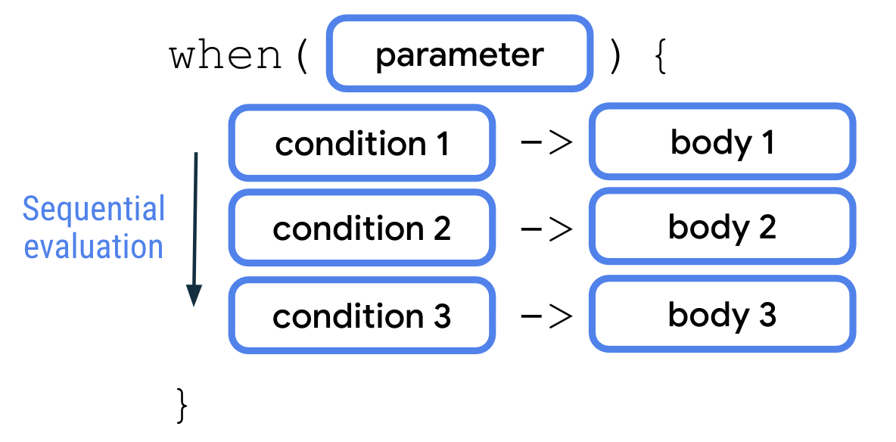
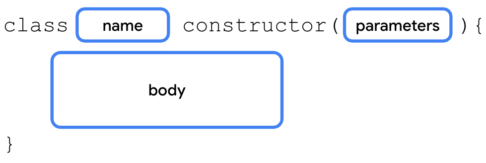
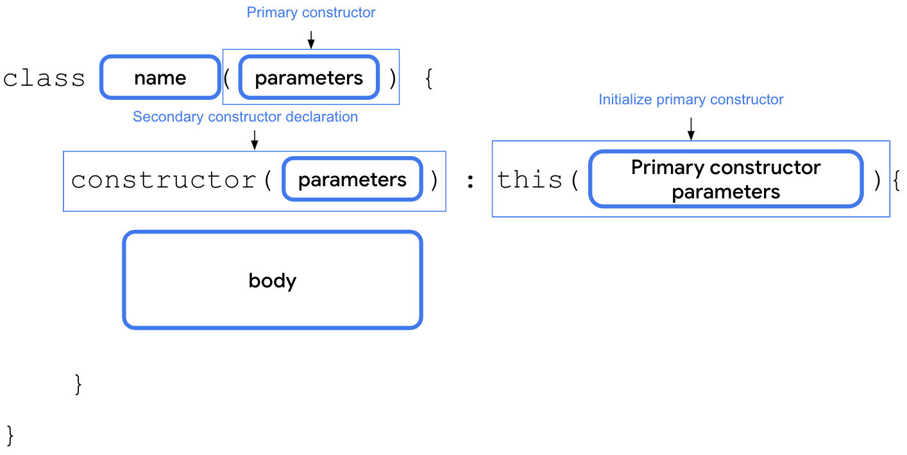

# Unit 2: Building App UI

Continue learning the fundamentals of Kotlin, and start building more interactive apps.

## Kotlin fundamentals

### Write conditionals

In Kotlin, when you deal with multiple branches, you can use the `when` statement instead of the `if/else` statement because it improves readability, which refers to how easy it is for human readers, typically developers, to read the code. It's very important to consider readability when you write your code because it's likely that other developers need to review and modify your code throughout its lifetime. Good readability ensures that developers can correctly understand your code and don't inadvertently introduce bugs into it.

`when` statements are preferred when there are more than two branches to consider.



<center><i>when statement</i></center>

Now, we have an example about traffic light color.

```kotlin
fun main() {
    val trafficLightColor = "Black"
    when(trafficLightColor){
        "Red" -> println("Stop")
        "Yello" -> printl
        n("Slow")
        "Green" -> println("Go")
        else -> println("Invalid traffic light color.")
    }
}
```

And more examples...

```kotlin
fun main() {
    val x: Any = 14

    when (x) {
        2, 3, 5, 7 -> println("x is a prime number between 1 and 10.")
        in 1..10 -> println("x is a number between 1 and 10, but not a prime number.")
        is Int -> println("x is an integer number, but not between 1 and 10.")
        else -> println("x isn't an integer number.")
    }
}
```

### Use nullability

In Kotlin, there's a distinction between nullable and non-nullable types:

- Nullable types are variables that *can* hold `null`.
- Non-null types are variables that *can't* hold `null`.

A type is only nullable if you explicitly let it hold `null`. As the error message says, the `String` data type is a non-nullable type, so you can't reassign the variable to `null`.

### Use classes and objects in Kotlin

#### Define a class

Classes provide blueprints from which objects can be constructed. An object is an instance of a class that consists of data specific to that object. You can use objects or class instances interchangeably.

As an analogy, imagine that you build a house. A class is similar to an architect's design plan, also known as a blueprint. The blueprint isn't the house; it's the instruction for how to build the house. The house is the actual thing, or object, which is built based on the blueprint.

Just like the house blueprint specifies multiple rooms and each room has its own design and purpose, each class has its own design and purpose. To know how to design your classes, you need to get familiar with *object-oriented programming (OOP)*, a framework that teaches you to enclose data, logic, and behavior in objects.

OOP helps you simplify complex, real-world problems into smaller objects. There are four basic concepts of OOP, each of which you learn more about later in this codelab:

- **Encapsulation.** Wraps the related properties and methods that perform action on those properties in a class. For example, consider your mobile phone. It encapsulates a camera, display, memory cards, and several other hardware and software components. You don't have to worry about how components are wired internally.
- **Abstraction.** An extension to encapsulation. The idea is to hide the internal implementation logic as much as possible. For example, to take a photo with your mobile phone, all you need to do is open the camera app, point your phone to the scene that you want to capture, and click a button to capture the photo. You don't need to know how the camera app is built or how the camera hardware on your mobile phone actually works. In short, the internal mechanics of the camera app and how a mobile camera captures the photos are abstracted to let you perform the tasks that matter.
- **Inheritance.** Enables you to build a class upon the characteristics and behavior of other classes by establishing a parent-child relationship. For example, there are different manufacturers who produce a variety of mobile devices that run Android OS, but the UI for each of the devices is different. In other words, the manufacturers inherit the Android OS feature and build their customizations on top of it.
- **Polymorphism.** The word is an adaptation of the Greek root *poly-*, which means many, and *-morphism*, which means forms. Polymorphism is the ability to use different objects in a single, common way. For example, when you connect a Bluetooth speaker to your mobile phone, the phone only needs to know that there's a device that can play audio over Bluetooth. However, there are a variety of Bluetooth speakers that you can choose from and your phone doesn't need to know how to work with each of them specifically.

#### Define class methods

Talk is cheap, show you my code:

```kotlin
class SmartDevice {
    fun turnOn(){
    	println("Smart device is turned on.")   
    }
    
    fun turnOff(){
        println("Smart device is turned off.")
    }
}

fun main(){
    val smartTvDevice = SmartDevice()
    smartTvDevice.turnOn()
    smartTvDevice.turnOff()
}
```

Run this example, we will get the following result:

```
Smart device is turned on.
Smart device is turned off.
```

#### Define class properties

In my opinions, the most important thing is the Getter and Setter functions in properties. 

Properties can do more than a variable can. For example, imagine that you create a class structure to represent a smart TV. One of the common actions that you perform is increase and decrease the volume. To represent this action in programming, you can create a property named `speakerVolume`, which holds the current volume level set on the TV speaker, but there's a range in which the value for volume resides. The minimum volume one can set is 0, while the maximum is 100. To ensure that the `speakerVolume` property never exceeds 100 or falls below 0, you can write a *setter* function. When you update the value of the property, you need to check whether the value is in the range of 0 to 100. As another example, imagine that there's a requirement to ensure that the name is always in uppercase. You can implement a *getter* function to convert the `name` property to uppercase.

Before going deeper into how to implement these properties, you need to understand the full syntax to declare them. The full syntax to define a *mutable* property starts with the variable definition followed by the optional `get()` and `set()` functions. 

You can see the syntax in the following code:

```kotlin
var <name>: <data type> = <initial value>
	get() {
		// <body>
		// <return statement>
	}
	set(value){
		// <body>
	}
```

When you don't define the getter and setter function for a property, the Kotlin compiler internally creates the functions. 

For example, if use the `var` keyword to define a `speakerVolume` property and assign it a `2` value, the compiler autogenerates the getter and setter functions as you can see in this code snippet:

```kotlin
var speakerVolum = 2
	get() = field
	set(value) {
		field = value
	}
```

You won't see these lines in your code because they're added by the compiler in the background.

The full syntax for an *immutable* property has two differences:

- It starts with the `val` keyword.
- The variables of `val` type are read-only variables, so they don't have `set()` functions.

Kotlin properties use a *backing field* to hold a value in memory. A *backing field* is basically a class variable defined internally in the properties. A *backing field* is scoped to a property, which means that you can only access it through the `get()` or `set()` property functions.

To read the property value in the `get()` function or update the value in the `set()` function, you need to use the property's *backing field*. It's autogenerated by the Kotlin compiler and referenced with a `field` identifier.

For example, when you want to update the property's value in the `set()` function, you use the `set()` function's parameter, which is referred to as the `value` parameter, and assign it to the `field` variable as you can see in this code snippet:

```kotlin
var speakerVolume = 2
    set(value) {
        field = value    
    }
```

> **Warning**: Don't use the property name to get or set a value. For example, in the `set()` function, if you try to assign the `value` parameter to the `speakerVolume` property itself, the code enters an endless loop because the Kotlin runtime tries to update the value for the `speakerVolume` property, which triggers a call to the setter function repeatedly.

For example, to ensure that the value assigned to the `speakerVolume` property is in the range of 0 to 100, you could implement the *setter* function as you can see in this code snippet:

```kotlin
var speakerVolume = 2
    set(value) {
        if (value in 0..100) {
            field = value
        }
    }
```

The `set()` functions check whether the `Int` value is in a range of 0 to 100 by using the `in` keyword followed by the range of value. If the value is in the expected range, the `field` value is updated. If not, the property's value remains unchanged.

You include this property in a class in the *Implement a relationship between classes* section of this codelab, so you don't need to add the setter function to the code now.

#### Define a constructor

The primary purpose of the *constructor* is to specify how the objects of the class are created. In other words, constructors initialize an object and make the object ready for use. You did this when you instantiated the object. The code inside the constructor executes when the object of the class is instantiated. You can define a constructor with or without parameters.

There are two kinds of constructor:

- Default constructor

  ```Kotlin
  class SmartDevice constructor() {
      // ...
  }
  ```

  You can also remove the parentheses if the constructor has no parameters as shown in this code snippet:

  ```Kotlin
  class SmartDevice {
  	// ...
  }
  ```

  We are familiar with it.

- Parameterized cnostructor

  ```Kotlin
  class SmartDevice(val name: String, val category: String) {
  
      var deviceStatus = "online"
  
      fun turnOn() {
          println("Smart device is turned on.")
      }
  
      fun turnOff() {
          println("Smart device is turned off.")
      }
  }
  ```

There are two main types of constructors in Kotlin:

- **Primary constructor.** A class can have only one primary constructor, which is defined as part of the class header. A primary constructor can be a default or parameterized constructor. The primary constructor doesn't have a body. That means that it can't contain any code.
- **Secondary constructor.** A class can have multiple secondary constructors. You can define the secondary constructor with or without parameters. The secondary constructor can initialize the class and has a body, which can contain initialization logic. If the class has a primary constructor, each secondary constructor needs to initialize the primary constructor.

You can use the primary constructor to initialize properties in the class header. The arguments passed to the constructor are assigned to the properties. The syntax to define a primary constructor starts with the class name followed by the `constructor` keyword and a set of parentheses. The parentheses contain the parameters for the primary constructor. If there's more than one parameter, commas separate the parameter definitions. You can see the full syntax to define a primary constructor in this diagram:



The secondary constructor is enclosed in the body of the class and its syntax includes three parts:

- **Secondary constructor declaration.** The secondary constructor definition starts with the `constructor` keyword followed by parentheses. If applicable, the parentheses contain the parameters required by the secondary constructor.
- **Primary constructor initialization.** The initialization starts with a colon followed by the `this` keyword and a set of parentheses. If applicable, the parentheses contain the parameters required by the primary constructor.
- **Secondary constructor body.** Initialization of the primary constructor is followed by a set of curly braces, which contain the secondary constructor's body.

You can see the syntax in this diagram:



For example, imagine that you want to integrate an API developed by a smart-device provider. However, the API returns status code of `Int` type to indicate initial device status. The API returns a `0` value if the device is *offline* and a `1` value if the device is *online*. For any other integer value, the status is considered *unknown*. You can create a secondary constructor in the `SmartDevice` class to convert this `statusCode` parameter to string representation as you can see in this code snippet:

```kotlin
class SmartDevice(val name: String, val category: String) {
    var deviceStatus = "online"

    constructor(name: String, category: String, statusCode: Int) : this(name, category) {
        deviceStatus = when (statusCode) {
            0 -> "offline"
            1 -> "online"
            else -> "unknown"
        }
    }
    ...
}
```

#### Implement a relationship between classes

Inheritance lets you build a class upon the characteristics and behavior of another class. It's a powerful mechanism that helps you write reusable code and establish relationships between classes.

For example, there are many smart devices in the market, such as smart TVs, smart lights, and smart switches. When you represent smart devices in programming, they share some common properties, such as a name, category, and status. They also have common behaviors, such as the ability to turn them on and off.

However, the way to turn on or turn off each smart device is different. For example, to turn on a TV, you might need to turn on the display, and then set up the last known volume level and channel. On the other hand, to turn on a light, you might only need an increase or decrease to the brightness.

Also, each of the smart devices has more functions and actions that they can perform. For example, with a TV, you can adjust the volume and change the channel. With a light, you can adjust the brightness or color.

In short, all smart devices have different features, yet share some common characteristics. You can either duplicate these common characteristics to each of the smart device classes or make the code reusable with inheritance.

To do so, you need to create a `SmartDevice` parent class, and define these common properties and behaviors. Then, you can create child classes, such as the `SmartTvDevice` and `SmartLightDevice` classes, which inherit the properties of the parent class.

However, in Kotlin, all the classes are final by default, which means that you can't extend them, so you have to define the relationships between them. 

- It's ok because we can add an `open` keyword to make it extendable.

  ```kotlin
  open class SmartDevice(val name: String, val category: String){
  	// ...
  }
  ```

- Then, we create a `SmartTvDevice` subclass tat extends the `SmartDevice` superclass.

  ```kotlin
  class SmartTvDevice(deviceName: String, deviceCategory: String) :
      SmartDevice(name = deviceName, category = deviceCategory) {
  }
  ```

  The `constructor` definition for `SmartTvDevice` doesn't specify whether the properties are mutable or immutable. This means that the `deviceName` and `deviceCategory` parameters are merely `constructor` parameters instead of class properties. You won't be able to use them in the class, but simply pass them to the superclass constructor.

- In the `SmartTvDevice` subclass body, add the `speakerVolume` property that you created when you learned about the getter and setter functions and define a `channelNumber` property assigned to a `1` value with a setter function that specifies a `0..200` range. Define `increaseSpeakerVolume()` and `nextChannel()` method that increases the volume and the channel number, then prints `"Speaker` `volume` `increased` `to` `$speakerVolume."` and `"Channel` `number` `increased` `to` `$channelNumber."` string:

  ```kotlin
  class SmartTvDevice(deviceName: String, deviceCategory: String) :
      SmartDevice(name = deviceName, category = deviceCategory) {
  
      var speakerVolume = 2
          set(value) {
              if (value in 0..100) {
                  field = value
              }
          }
  
      var channelNumber = 1
          set(value) {
              if (value in 0..200) {
                  field = value
              }
          }
          
      fun increaseSpeakerVolume() {
          speakerVolume++
          println("Speaker volume increased to $speakerVolume.")
      } 
          
      fun nextChannel() {
          channelNumber++
          println("Channel number increased to $channelNumber.")
      }
  }
  ```

- Define a `SmartLightDevice` subclass that extends the `SmartDevice` superclass. In the `SmartLightDevice` subclass body, define a `brightnessLevel` property assigned to a `0` value with a setter function that specifies a `0..100` range. Define an `increaseBrightness()` method that increases the brightness of the light and prints a `"Brightness` `increased` `to` `$brightnessLevel."` string:

  ```kotlin
  class SmartLightDevice(deviceName: String, deviceCategory: String) :
      SmartDevice(name = deviceName, category = deviceCategory) {
  
      var brightnessLevel = 0
          set(value) {
              if (value in 0..100) {
                  field = value
              }
          }
  
      fun increaseBrightness() {
          brightnessLevel++
          println("Brightness increased to $brightnessLevel.")
      }
  }
  ```

Talk is cheap, show you my code:

```kotlin
open class SmartDevice(val name: String, val category: String){
    var deviceStatus = "Offline"
    open val deviceType = "unknown"
    
    open fun turnOn(){
        deviceStatus = "Online"
    }
    
    open fun turnOff(){
        deviceStatus = "Offline"
        println("Shutdown!")

    }
}

class SmartTvDevice(deviceName: String, deviceCategory: String) : SmartDevice(name=deviceName, category=deviceCategory){
    override val deviceType = "Smart TV"
    var speakerVolume = 3
    	set(value) {
            if(value in 0..100){
                field = value
            }
        }
        
    var channelNumber = 1
    	set(value) {
            if(value in 0..10){
                field = value
            }
        }
        
    fun increaseSpeakerVolume() {
        speakerVolume++
        println("Speaker volume increased to $speakerVolume")
    }
    
    fun nextChannel() {
        channelNumber++
        println("Channel increased to $channelNumber")
    }
    
    override fun turnOn() {
        super.turnOn()
        println("$name is $deviceStatus, Spearker volume is set to $speakerVolume and channel number is set to $channelNumber.")
    }
    
    override fun turnOff() {
        deviceStatus = "Offline"
        println("$name is $deviceStatus")
    }
}

class SmartHome(val smartTvDevice: SmartTvDevice){
    fun turnOnTv(){
        smartTvDevice.turnOn()
    }
    
    fun turnOffTv(){
        smartTvDevice.turnOff()
    }
}

fun main() {
    val smartTvDevice = SmartTvDevice("TV", "Samsung")

    val smartHome = SmartHome(smartTvDevice)
    smartHome.turnOnTv()
    smartHome.turnOffTv()
    smartTvDevice.nextChannel()
    smartTvDevice.increaseSpeakerVolume()
}
```

#### visibility modifiers

Visibility modifiers play an important role to achieve encapsulation:

- In a *class*, they let you hide your properties and methods from unauthorized access outside the class.
- In a *package*, they let you hide the classes and interfaces from unauthorized access outside the package.

Kotlin provides four visibility modifiers:

- `public`**.** Default visibility modifier. Makes the declaration accessible everywhere. The properties and methods that you want used outside the class are marked as public.
- `private`**.** Makes the declaration accessible in the same class or source file.

There are likely some properties and methods that are only used inside the class, and that you don't necessarily want other classes to use. These properties and methods can be marked with the `private` visibility modifier to ensure that another class can't accidentally access them.

- `protected`**.** Makes the declaration accessible in subclasses. The properties and methods that you want used in the class that defines them and the subclasses are marked with the `protected` visibility modifier.
- `internal`**.** Makes the declaration accessible in the same module. The internal modifier is similar to private, but you can access internal properties and methods from outside the class as long as it's being accessed in the same module.

When you define a class, it's publicly visible and can be accessed by any package that imports it, which means that it's public by default unless you specify a visibility modifier. Similarly, when you define or declare properties and methods in the class, by default they can be accessed outside the class through the class object. It's essential to define proper visibility for code, primarily to hide properties and methods that other classes don't need to access.

For example, consider how a car is made accessible to a driver. The specifics of what parts comprise the car and how the car works internally are hidden by default. The car is intended to be as intuitive to operate as possible. You wouldn't want a car to be as complex to operate as a commercial aircraft, similar to how you wouldn't want another developer or your future self to be confused as to what properties and methods of a class are meant to be used.

Visibility modifiers help you surface the relevant parts of the code to other classes in your project and ensure that the implementation can't be unintentionally used, which makes for code that's easy to understand and less prone to bugs.

The visibility modifier should be placed before the declaration syntax, while declaring the class, method, or properties.

For example, you can see how to make the `deviceStatus` property private in this code snippet:

```kotlin
open class SmartDevice(val name: String, val category: String) {

    ...

    private var deviceStatus = "online"

    ...
}
```

For the `SmartDevice` class, the value of the `deviceStatus` property should be readable outside of the class through class objects. However, only the class and its children should be able to update or write the value. To implement this requirement, you need to use the `protected` modifier on the `set()` function of the `deviceStatus` property.

Use the `protected` modifier on the `set()` function of the `deviceStatus` property:

1. In the `SmartDevice` superclass's `deviceStatus` property, add the `protected` modifier to the `set()` function:

```kotlin
open class SmartDevice(val name: String, val category: String) {

    ...

    var deviceStatus = "online"
        protected set(value) {
           field = value
       }

    ...
}
```

You aren't performing any actions or checks in the `set()` function. You are simply assigning the `value` parameter to the `field` variable. As you learned before, this is similar to the default implementation for property setters. You can omit the parentheses and body of the `set()` function in this case:

```kotlin
open class SmartDevice(val name: String, val category: String) {

    ...

    var deviceStatus = "online"
        protected set

    ...
}
```

2. In the `SmartHome` class, define a `deviceTurnOnCount` property set to a `0` value with a private setter function:

```kotlin
class SmartHome(
    val smartTvDevice: SmartTvDevice,
    val smartLightDevice: SmartLightDevice
) {

    var deviceTurnOnCount = 0
        private set

    ...
}
```

3. Add the `deviceTurnOnCount` property followed by the `++` arithmetic operator to the `turnOnTv()` and `turnOnLight()` methods, and then add the `deviceTurnOnCount` property followed by the `--` arithmetic operator to the `turnOffTv()` and `turnOffLight()` methods:

```kotlin
class SmartHome(
    val smartTvDevice: SmartTvDevice,
    val smartLightDevice: SmartLightDevice
) {

    var deviceTurnOnCount = 0
        private set

    fun turnOnTv() {
        deviceTurnOnCount++
        smartTvDevice.turnOn()
    }

    fun turnOffTv() {
        deviceTurnOnCount--
        smartTvDevice.turnOff()
    }
    
    ...

    fun turnOnLight() {
        deviceTurnOnCount++
        smartLightDevice.turnOn()
    }

    fun turnOffLight() {
        deviceTurnOnCount--
        smartLightDevice.turnOff()
    }

    ...

}
```

The syntax to specify a visibility modifier for a method starts with the `private`, `protected`, or `internal` modifiers followed by the syntax that defines a method. 

For example, you can see how to specify a `protected` modifier for the `nextChannel()` method in the `SmartTvDevice` class in this code snippet:

```kotlin
class SmartTvDevice(deviceName: String, deviceCategory: String) :
    SmartDevice(name = deviceName, category = deviceCategory) {

    ...

    protected fun nextChannel() {
        channelNumber++
        println("Channel number increased to $channelNumber.")
    }      

    ...
}
```

The syntax to specify a visibility modifier for a constructor is similar to defining the primary constructor with a couple of differences:

- The modifier is specified after the class name, but before the `constructor` keyword.
- If you need to specify the modifier for the primary constructor, it's necessary to keep the `constructor` keyword and parentheses even when there aren't any parameters.

For example, you can see how to add a `protected` modifier to the `SmartDevice` constructor in this code snippet:

```kotlin
open class SmartDevice protected constructor (val name: String, val category: String) {

    ...

}
```

The syntax to specify a visibility modifier for a class starts with the `private`, `protected`, or `internal` modifiers followed by the syntax that defines a class. 

For example, you can see how to specify an `internal` modifier for the `SmartDevice` class in this code snippet:

```kotlin
internal open class SmartDevice(val name: String, val category: String) {

    ...

}
```

Ideally, you should strive for strict visibility of properties and methods, so declare them with the `private` modifier as often as possible. If you can't keep them private, use the `protected` modifier. If you can't keep them protected, use the `internal` modifier. If you can't keep them internal, use the `public` modifier.

| **Modifier** | **Accessible in same class** | **Accessible in subclass** | **Accessible in same module** | **Accessible outside module** |
| ------------ | ---------------------------- | -------------------------- | ----------------------------- | ----------------------------- |
| `private`    | ✔                            | 𝗫                          | 𝗫                             | 𝗫                             |
| `protected`  | ✔                            | ✔                          | 𝗫                             | 𝗫                             |
| `internal`   | ✔                            | ✔                          | ✔                             | 𝗫                             |
| `public`     | ✔                            | ✔                          | ✔                             | ✔                             |
