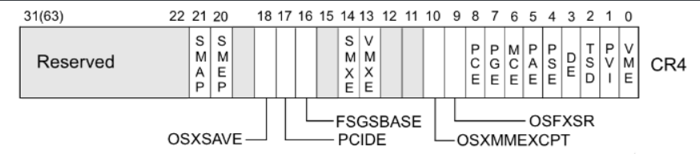
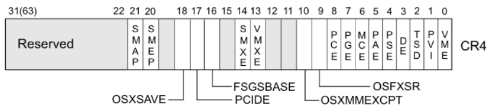
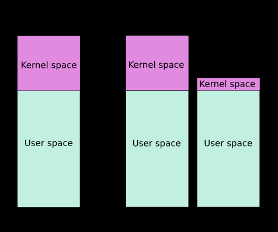

# Basic Knowledge

## Kernel Basic

kernel也是一个程序：

1. 用来管理软件发出的数据I/O要求；
2. 将要求转义为指令；
3. 交给CPU和计算机中其他组件处理；

kernel 最主要的功能有两点：

1. 控制并与硬件进行交互
2. 提供 application 能运行的环境

### Ring Model

intel CPU 将 CPU 的特权级别分为 4 个级别：Ring 0, Ring 1, Ring 2, Ring 3。

Ring0 只给 OS 使用，Ring 3 所有程序都可以使用，内层 Ring 可以随便使用外层 Ring 的资源。

使用 Ring Model 是为了提升系统安全性，例如某个间谍软件作为一个在 Ring 3 运行的用户程序，在不通知用户的时候打开摄像头会被阻止，因为访问硬件需要使用 being 驱动程序保留的 Ring 1 的方法。

大多数的现代操作系统只使用了 Ring 0 和 Ring 3。

### Loadable Kernel Modules(LKMs)

可加载核心模块（内核模块）就像运行在内核空间的可执行程序，包括：

- 驱动程序（Device drivers）
  - 设备驱动
  - 文件系统驱动
  - ...
- 内核扩展模块（modules）

LKMs的文件格式和用户态的可执行程序相同，Linux→ELF，Windows→exe/dll，macOS→MACH-O，因此可以用IDA等工具来分析内核模块；

模块可以单独编译，但不能单独运行，运行时链接到内核中，作为内核的一部分在内核空间运行；

大多数CTF中的kernel vulnerability也出现在LKM中；

### command

insmod：将指定模块加载到内核中；

rmmod：从内核中卸载指定模块；

lsmod：列出已加载内核模块；

modprobe：添加或删除模块，modprobe在加载模块时会查找依赖关系；

### syscall

用户空间的程序请求操作系统内核高权限服务；

### ioctl

使用`man ioctl` 查看手册；

`ioctl`也是一个系统调用，用于与设备通信；

```C
int ioctl(int fd, unsigned long request, ...);
```

第一个参数`fd`为打开设备返回的文件描述符；

第二个参数为用户程序对设备的控制命令；

后面的参数为补充参数，与设备相关；

使用`ioctl`使得用户程序可以直接访问设备驱动而不需要知道设备具体细节；

### mode changing

#### user space to kernel space

当发生：

1. 系统调用；
2. 异常；
3. 外设产生中断；

会发生用户态到内核态的切换。

具体的过程为（x86-64）：

1. 通过`swapgs`（Swap GS Base Register）切换GS段寄存器，将GS寄存器值和一个特定位置的值进行交换，目的是保存GS值，同时将该位置的值作为内核执行时的GS值使用；详情见：https://www.felixcloutier.com/x86/swapgs

2. 将当前栈顶（用户空间栈顶）记录在 CPU 独占变量区域里，将 CPU 独占区域里记录的内核栈顶放入 rsp/esp。

   > 用户栈与内核栈的交换

3. 通过 push 保存各寄存器值，代码如下：

   ```assembly
    ENTRY(entry_SYSCALL_64)
    /* SWAPGS_UNSAFE_STACK是一个宏，x86直接定义为swapgs指令 */
    SWAPGS_UNSAFE_STACK
   
    /* 保存栈值，并设置内核栈 */
    movq %rsp, PER_CPU_VAR(rsp_scratch)
    movq PER_CPU_VAR(cpu_current_top_of_stack), %rsp
   
   
   /* 通过push保存寄存器值，形成一个pt_regs结构 */
   /* Construct struct pt_regs on stack */
   pushq  $__USER_DS      /* pt_regs->ss */
   pushq  PER_CPU_VAR(rsp_scratch)  /* pt_regs->sp */
   pushq  %r11             /* pt_regs->flags */
   pushq  $__USER_CS      /* pt_regs->cs */
   pushq  %rcx             /* pt_regs->ip */
   pushq  %rax             /* pt_regs->orig_ax */
   pushq  %rdi             /* pt_regs->di */
   pushq  %rsi             /* pt_regs->si */
   pushq  %rdx             /* pt_regs->dx */
   pushq  %rcx tuichu    /* pt_regs->cx */
   pushq  $-ENOSYS        /* pt_regs->ax */
   pushq  %r8              /* pt_regs->r8 */
   pushq  %r9              /* pt_regs->r9 */
   pushq  %r10             /* pt_regs->r10 */
   pushq  %r11             /* pt_regs->r11 */
   sub $(6*8), %rsp      /* pt_regs->bp, bx, r12-15 not saved */
   ```

4. 通过汇编指令判断是否为 `x32_abi`；
5. 通过系统调用号，跳到全局变量 `sys_call_table` 相应位置继续执行系统调用。

#### kernel space to user space

退出时，流程如下：

1. 通过 `swapgs` 恢复 GS 值；
2. 通过 `sysretq` 或者 `iretq` 恢复到用户控件继续执行。如果使用 `iretq` 还需要给出用户空间的一些信息（CS, eflags/rflags, esp/rsp 等）；

### struct cred

 kernel 记录了进程的权限，更具体的，是用 cred 结构体记录的，每个进程中都有一个 cred 结构，这个结构保存了该进程的权限等信息（uid，gid 等），如果能修改某个进程的 cred，那么也就修改了这个进程的权限。

结构体定义如下：

```c
struct cred {
    atomic_t    usage;
#ifdef CONFIG_DEBUG_CREDENTIALS
    atomic_t    subscribers;    /* number of processes subscribed */
    void        *put_addr;
    unsigned    magic;
#define CRED_MAGIC  0x43736564
#define CRED_MAGIC_DEAD 0x44656144
#endif
    kuid_t      uid;        /* real UID of the task */
    kgid_t      gid;        /* real GID of the task */
    kuid_t      suid;       /* saved UID of the task */
    kgid_t      sgid;       /* saved GID of the task */
    kuid_t      euid;       /* effective UID of the task */
    kgid_t      egid;       /* effective GID of the task */
    kuid_t      fsuid;      /* UID for VFS ops */
    kgid_t      fsgid;      /* GID for VFS ops */
    unsigned    securebits; /* SUID-less security management */
    kernel_cap_t    cap_inheritable; /* caps our children can inherit */
    kernel_cap_t    cap_permitted;  /* caps we're permitted */
    kernel_cap_t    cap_effective;  /* caps we can actually use */
    kernel_cap_t    cap_bset;   /* capability bounding set */
    kernel_cap_t    cap_ambient;    /* Ambient capability set */
#ifdef CONFIG_KEYS
    unsigned char   jit_keyring;    /* default keyring to attach requested
                     * keys to */
    struct key __rcu *session_keyring; /* keyring inherited over fork */
    struct key  *process_keyring; /* keyring private to this process */
    struct key  *thread_keyring; /* keyring private to this thread */
    struct key  *request_key_auth; /* assumed request_key authority */
#endif
#ifdef CONFIG_SECURITY
    void        *security;  /* subjective LSM security */
#endif
    struct user_struct *user;   /* real user ID subscription */
    struct user_namespace *user_ns; /* user_ns the caps and keyrings are relative to. */
    struct group_info *group_info;  /* supplementary groups for euid/fsgid */
    struct rcu_head rcu;        /* RCU deletion hook */
} __randomize_layout;
```

### kernel function

相比用户态库函数，内核态的函数有了一些变化

- printf() -> printk()，但需要注意的是 printk() 不一定会把内容显示到终端上，但一定在内核缓冲区里，可以通过 `dmesg` 查看效果
- memcpy() ->copy_from_user()/copy_to_user()
  - copy_from_user() 实现了将用户空间的数据传送到内核空间；
  - copy_to_user() 实现了将内核空间的数据传送到用户空间；
- malloc() -> kmalloc()，内核态的内存分配函数，和 malloc() 相似，但使用的是 `slab/slub 分配器`
- free() -> kfree()，同 kmalloc()

另外要注意的是，kernel 管理进程，因此 kernel 也记录了进程的权限。kernel 中有两个可以方便的改变权限的函数：

- **int commit_creds(struct cred \*new)**
- **struct cred\* prepare_kernel_cred(struct task_struct\* daemon)**

从函数名也可以看出，执行 `commit_creds(prepare_kernel_cred(0))` 即可获得 root 权限，0 表示 以 0 号进程作为参考准备新的 credentials。执行 `commit_creds(prepare_kernel_cred(0))` 也是最常用的提权手段，两个函数的地址都可以在 `/proc/kallsyms` 中查看（较老的内核版本中是 `/proc/ksyms`）

### kallsyms

> 为了更方便的调试内核代码，开发者考虑：将内核代码中所有函数以及所有非栈变量的地址抽取出来，形成是一个简单的数据块(data blob:符号和地址对应)，并将此链接进 `vmlinux `中。完成这一地址抽取+数据快组织封装功能的相关子系统就称之为 kallsyms。

kallsyms抽取了内核用到的所有函数地址(全局的、静态的)和非栈数据变量地址，生成一个数据块，作为只读数据链接进kernel image（vmlinux），相当于内核中存了一个System.map。

反之，如果没有 kallsyms 的帮助，内核只能将十六进制的符号地址呈现给外界，因为它能理解的只有符号地址，并不能显示各种函数名等符号。

因此，在`/proc/kallysyms`中，可以看到内核中的函数；

第二列是标识，有的符号是大写的，有的是小写。大写的符号是全局的。

```
b 符号在未初始化数据区（BSS）
c 普通符号，是未初始化区域
d 符号在初始化数据区
g 符号针对小object，在初始化数据区
i 非直接引用其他符号的符号
n 调试符号
r 符号在只读数据区
s 符号针对小object，在未初始化数据区
t 符号在代码段
u 符号未定义
```

### kptr_restrict

关于`kptr_restrict`，在`Document/sysctl/kernel.txt`中有如下介绍：

```
 375   │ kptr_restrict:
 376   │ 
 377   │ This toggle indicates whether restrictions are placed on
 378   │ exposing kernel addresses via /proc and other interfaces.
 379   │ 
 380   │ When kptr_restrict is set to (0), the default, there are no restrictions.
 381   │ 
 382   │ When kptr_restrict is set to (1), kernel pointers printed using the %pK
 383   │ format specifier will be replaced with 0's unless the user has CAP_SYSLOG
 384   │ and effective user and group ids are equal to the real ids. This is
 385   │ because %pK checks are done at read() time rather than open() time, so
 386   │ if permissions are elevated between the open() and the read() (e.g via
 387   │ a setuid binary) then %pK will not leak kernel pointers to unprivileged
 388   │ users. Note, this is a temporary solution only. The correct long-term
 389   │ solution is to do the permission checks at open() time. Consider removing
 390   │ world read permissions from files that use %pK, and using dmesg_restrict
 391   │ to protect against uses of %pK in dmesg(8) if leaking kernel pointer
 392   │ values to unprivileged users is a concern.
 393   │ 
 394   │ When kptr_restrict is set to (2), kernel pointers printed using
 395   │ %pK will be replaced with 0's regardless of privileges.
 396   │ 

```

`kptr_restrict`用于控制内核的打印输出；

| kptr_restrict | 权限描述                                          |
| ------------- | ------------------------------------------------- |
| 2             | 内核将符号地址打印为全0, root和普通用户都没有权限 |
| 1             | root用户有权限读取, 普通用户没有权限              |
| 0             | root和普通用户都可以读取                          |

sample如下：

- 当`kptr_restrict`为2时，有：

  ```bash
  # 设置kptr_restrict为2
  $ sudo sh -c "echo 2 > kptr_restrict"
  $ bat /proc/sys/kernel/kptr_restrict 
  ───────┬──────────────────────────────────────────────────────────────────────────────────────
         │ File: /proc/sys/kernel/kptr_restrict
  ───────┼──────────────────────────────────────────────────────────────────────────────────────
     1   │ 2
  ───────┴──────────────────────────────────────────────────────────────────────────────────────
  
  # root和普通用户状态下地址打印为0
  $ cat /proc/kallsyms | grep commit_creds | bat
  ───────┬──────────────────────────────────────────────────────────────────────────────────────
         │ STDIN
  ───────┼──────────────────────────────────────────────────────────────────────────────────────
     1   │ 0000000000000000 T commit_creds
     2   │ 0000000000000000 r __ksymtab_commit_creds
     3   │ 0000000000000000 r __kstrtab_commit_creds
  ───────┴──────────────────────────────────────────────────────────────────────────────────────
  $ sudo cat /proc/kallsyms | grep commit_creds | bat
  ───────┬──────────────────────────────────────────────────────────────────────────────────────
         │ STDIN
  ───────┼──────────────────────────────────────────────────────────────────────────────────────
     1   │ 0000000000000000 T commit_creds
     2   │ 0000000000000000 r __ksymtab_commit_creds
     3   │ 0000000000000000 r __kstrtab_commit_creds
  ───────┴──────────────────────────────────────────────────────────────────────────────────────
  
  ```

- 当`kptr_restrict`为1时，有：

  ```bash
  # 设置kptr_restrict为2
  $ sudo sh -c "echo 1 > kptr_restrict"
  $ sudo bat /proc/sys/kernel/kptr_restrict
  ───────┬──────────────────────────────────────────────────────────────────────────────────────
         │ File: /proc/sys/kernel/kptr_restrict
  ───────┼──────────────────────────────────────────────────────────────────────────────────────
     1   │ 1
  ───────┴──────────────────────────────────────────────────────────────────────────────────────
  
  # 普通用户状态下地址打印为0
  $ cat /proc/kallsyms | grep commit_creds | bat
  ───────┬──────────────────────────────────────────────────────────────────────────────────────
         │ STDIN
  ───────┼──────────────────────────────────────────────────────────────────────────────────────
     1   │ 0000000000000000 T commit_creds
     2   │ 0000000000000000 r __ksymtab_commit_creds
     3   │ 0000000000000000 r __kstrtab_commit_creds
  ───────┴──────────────────────────────────────────────────────────────────────────────────────
  # root用户可以打印地址
  $ sudo cat /proc/kallsyms | grep commit_creds | bat
  ───────┬──────────────────────────────────────────────────────────────────────────────────────
         │ STDIN
  ───────┼──────────────────────────────────────────────────────────────────────────────────────
     1   │ ffffffffb96b4730 T commit_creds
     2   │ ffffffffba7c9b20 r __ksymtab_commit_creds
     3   │ ffffffffba7ef382 r __kstrtab_commit_creds
  ───────┴──────────────────────────────────────────────────────────────────────────────────────
  ```

- 当`kptr_restrict`为0时，root用户和普通用户均可以打印出内核函数地址；

### dmesg_restrict

dmesg命令用于显示开机信息，其中就包括加载到内核中的驱动等信息；

而dmesg_restrict则是为了限制对这些信息的打印输出；

sample：

```bash
$ sudo sysctl -w kernel.dmesg_restrict=1
kernel.dmesg_restrict = 1

$ dmesg 
dmesg: read kernel buffer failed: Operation not permitted
```

### Mitigation

> canary, dep, PIE, RELRO 等保护与用户态原理和作用相同

- smep: Supervisor Mode Execution Protection，当处理器处于 `ring0` 模式，执行 `用户空间` 的代码会触发页错误。（在 arm 中该保护称为 `PXN`）
- smap: Superivisor Mode Access Protection，类似于 smep，通常是在访问数据时。
- mmap_min_addr:

## CTF

比赛相关，一般会给以下三个文件

1. boot.sh: 一个用于启动 kernel 的 shell 的脚本，多用 qemu，保护措施与 qemu 不同的启动参数有关；
2. bzImage: kernel binary；
3. rootfs.cpio: 文件系统映像；

关于qemu的启动参数：

解释一下 qemu 启动的参数：

- -initrd rootfs.cpio，使用 rootfs.cpio 作为内核启动的文件系统
- -kernel bzImage，使用 bzImage 作为 kernel 映像
- -cpu kvm64,+smep，设置 CPU 的安全选项，这里开启了 smep
- -m 64M，设置虚拟 RAM 为 64M，默认为 128M 其他的选项可以通过 --help 查看。

本地写好 exploit 后，可以通过 base64 编码等方式把编译好的二进制文件保存到远程目录下，进而拿到 flag。同时可以使用 musl, uclibc 等方法减小 exploit 的体积方便传输。

## Exploit Aim

### Privilege Escalation

内核提权指普通用户获取到root用户的权限，访问受限资源；

有两种方式：

1. 改变自身进程权限；
2. 通过影响其他高权限进程来达成目的；

#### Change Self

前面介绍了cred结构体，内核会通过进程的 `task_struct` 结构体中的 `cred pointer`来索引 cred 结构体，然后根据 cred 的内容来判断一个进程拥有的权限，如果 cred 结构体成员中的 uid-fsgid 都为 0，那一般就会认为进程具有 root 权限。

```c
struct cred {
    atomic_t    usage;
#ifdef CONFIG_DEBUG_CREDENTIALS
    atomic_t    subscribers;    /* number of processes subscribed */
    void        *put_addr;
    unsigned    magic;
#define CRED_MAGIC  0x43736564
#define CRED_MAGIC_DEAD 0x44656144
#endif
    kuid_t      uid;        /* real UID of the task */
    kgid_t      gid;        /* real GID of the task */
    kuid_t      suid;       /* saved UID of the task */
    kgid_t      sgid;       /* saved GID of the task */
    kuid_t      euid;       /* effective UID of the task */
    kgid_t      egid;       /* effective GID of the task */
    kuid_t      fsuid;      /* UID for VFS ops */
    kgid_t      fsgid;      /* GID for VFS ops */
  ...
}
```

因此，思路就比较直观了，我们可以通过以下方式来提权

- 直接修改 cred 结构体的内容
- 修改 task_struct 结构体中的 cred 指针指向一个满足要求的 cred

无论是哪一种方法，一般都分为两步：

1. 定位；
2. 修改；

##### change cred 

###### location

定位进程cred结构体的位置；

根据定位方法分为：

1. 直接定位；
2. 间接定位；

直接定位：
cred 结构体的最前面记录了各种 id 信息，对于一个普通的进程而言，uid-fsgid 都是执行进程的用户的身份。因此我们可以通过扫描内存来定位 cred。
在实际定位情况中，会有许多cred满足要求，主要是因为cred会被拷贝、释放。可以利用usage不为0来筛除一些cred，但仍然会发现一些 usage 为 0 的 cred。这是因为 cred 从 usage 为 0， 到释放有一定的时间。此外，cred 是使用 rcu 延迟释放的。

间接定位：

1. task_struct：

   进程的 `task_struct` 结构体中会存放指向 cred 的指针，因此我们可以：

   1. 定位当前进程 `task_struct` 结构体的地址；
   2. 根据 cred 指针相对于 task_struct 结构体的偏移计算得出 `cred` 指针存储的地址；
   3. 获取 `cred` 具体的地址；

2. comm：

   comm 用来标记可执行文件的名字，位于进程的 `task_struct` 结构体中。我们可以发现 comm 其实在 cred 的正下方，所以我们也可以先定位 comm ，然后定位 cred 的地址。

   然而，在进程名字并不特殊的情况下，内核中可能会有多个同样的字符串，这会影响搜索的正确性与效率。因此，我们可以使用 prctl 设置进程的 comm 为一个特殊的字符串，然后再开始定位 comm。

   ```c
       /* Process credentials: */
   
       /* Tracer's credentials at attach: */
       const struct cred __rcu     *ptracer_cred;
   
       /* Objective and real subjective task credentials (COW): */
       const struct cred __rcu     *real_cred;
   
       /* Effective (overridable) subjective task credentials (COW): */
       const struct cred __rcu     *cred;
   
   #ifdef CONFIG_KEYS
       /* Cached requested key. */
       struct key          *cached_requested_key;
   #endif
   
       /*
        * executable name, excluding path.
        *
        * - normally initialized setup_new_exec()
        * - access it with [gs]et_task_comm()
        * - lock it with task_lock()
        */
       char                comm[TASK_COMM_LEN];
   ```

3. UAF使用相同堆块

   虽然我们确实想要修改 cred 的内容，但是不一定非得知道 cred 的具体位置，我们只需要能够修改 cred 即可。

   如果我们在进程初始化时能控制 cred 结构体的位置，并且我们可以在初始化后修改该部分的内容，那么我们就可以很容易地达到提权的目的。这里给出一个典型的例子：

   1. 申请一块与 cred 结构体大小一样的堆块；
   2. 释放该堆块；
   3. fork 出新进程，恰好使用刚刚释放的堆块；
   4. 此时，修改 cred 结构体特定内存，从而提权；

   不需要任何信息泄露；

###### modify

在这种方法下，我们可以直接将 cred 中的 uid-fsgid 都修改为 0。当然修改的方式有很多种，比如说

- 在我们具有任意地址读写后，可以直接修改 cred。
- 在我们可以 ROP 执行代码后，可以利用 ROP gadget 修改 cred。

##### change cred pointer

cred指针没有什么特殊的地方，很难通过直接定位方式定位到cred指针；

###### location

`task_struct`

因此仍然利用task_struct结构体，定位其中存放的`cred pointer`；

1. 定位当前进程 `task_struct` 结构体的地址；
2. 根据 cred 指针相对于 task_struct 结构体的偏移计算得出 `cred` 指针存储的地址；

`comm`

comm 用来标记可执行文件的名字，位于进程的 `task_struct` 结构体中。我们可以发现 comm 其实在 cred 指针的正下方，所以我们也可以先定位 comm ，然后定位 cred 指针的地址。然而，在进程名字并不特殊的情况下，内核中可能会有多个同样的字符串，这会影响搜索的正确性与效率。因此，我们可以使用 prctl 设置进程的 comm 为一个特殊的字符串，然后再开始定位 comm。

`commit_creds`

我们还可以使用` commit_creds(prepare_kernel_cred(0)) `来进行提权，该方式会自动生成一个合法的 cred，并定位当前线程的 task_struct 的位置，然后修改它的 cred 为新的 cred。该方式比较适用于控制程序执行流后使用。

###### modify

在具体修改时，我们可以使用如下的两种方式：

- 修改 cred 指针为内核镜像中已有的 init_cred 的地址。这种方法适合于我们能够：
  1. 直接修改 cred 指针；
  2.  init_cred 地址已知；
- 伪造一个 cred，然后修改 cred 指针指向该地址即可。这种方式比较麻烦，一般并不使用。

#### Change Others

如果我们可以改变特权进程的执行轨迹，也可以实现提权。从以下角度来考虑如何改变特权进程的执行轨迹:

1. 改数据；
2. 改代码；

##### change data

###### symbol link

如果一个 root 权限的进程会执行一个符号链接的程序，并且该符号链接或者符号链接指向的程序可以由攻击者控制，攻击者就可以实现提权。

###### call_usermodehelper

`call_usermodehelper` 是一种内核线程执行用户态应用的方式，并且启动的进程具有 root 权限。因此，如果我们能够控制具体要执行的应用，那就可以实现提权。在内核中，`call_usermodehelper` 具体要执行的应用往往是由某个变量指定的，因此我们只需要想办法修改掉这个变量即可。不难看出，这是一种典型的数据流攻击方法。一般常用的主要有以下几种方式：

modify `modprobe_path`

1. 获取 modprobe_path 的地址。
2. 修改 modprobe_path 为指定的程序。
3. 触发执行`call_modprobe`，从而实现提权 。这里我们可以利用以下几种方式来触发
   1. 执行一个非法的可执行文件。非法的可执行文件需要满足相应的要求（参考 call_usermodehelper 部分的介绍）。
   2. 使用未知协议来触发。

模板如下：

```
// step 1. modify modprobe_path to the target value

// step 2. create related file
system("echo -ne '#!/bin/sh\n/bin/cp /flag /home/pwn/flag\n/bin/chmod 777 /home/pwn/flag\ncat flag' > /home/pwn/catflag.sh");
system("chmod +x /home/pwn/catflag.sh");

// step 3. trigger it using unknown executable
system("echo -ne '\\xff\\xff\\xff\\xff' > /home/pwn/dummy");
system("chmod +x /home/pwn/dummy");
system("/home/pwn/dummy");

// step 3. trigger it using unknown protocol
socket(AF_INET,SOCK_STREAM,132);
```

如何定位`modprobe_path`呢？

直接定位：由于 `modprobe_path` 的取值是确定的，所以我们可以直接扫描内存，寻找对应的字符串。这需要我们具有扫描内存的能力。

间接定位：考虑到 `modprobe_path` 相对于内核基地址的偏移是固定的，我们可以先获取到内核的基地址，然后根据相对偏移来得到 modprobe_path 的地址。

modify `poweroff_cmd`

1. 修改` poweroff_cmd `为指定的程序。
2. 劫持控制流执行 `__orderly_poweroff`。

定位方法类似于定位`modprobe_path`的方法；

##### change code

在程序运行时，如果我们可以修改 root 权限进程执行的代码，也可以实现提权。

###### modify vDSO

内核中 vDSO 的代码会被映射到所有的用户态进程中。如果有一个高特权的进程会周期性地调用 vDSO 中的函数，那我们可以考虑把 vDSO 中相应的函数修改为特定的 shellcode。当高权限的进程执行相应的代码时，我们就可以进行提权。

在早期的时候，Linux 中的 vDSO 是可写的，考虑到这样的风险，Kees Cook 提出引入 `post-init read-only` 的数据，即，将那些初始化后不再被写的数据标记为只读，来防御这样的利用。

在引入之前，vDSO 对应的 raw_data 只是标记了对齐属性，如下：

```c
    fprintf(outfile, "/* AUTOMATICALLY GENERATED -- DO NOT EDIT */\n\n");
    fprintf(outfile, "#include <linux/linkage.h>\n");
    fprintf(outfile, "#include <asm/page_types.h>\n");
    fprintf(outfile, "#include <asm/vdso.h>\n");
    fprintf(outfile, "\n");
    fprintf(outfile,
        "static unsigned char raw_data[%lu] __page_aligned_data = {",
        mapping_size);
```

引入之后，vDSO 对应的 raw_data 则被标记为了初始化后只读。

```c
    fprintf(outfile, "/* AUTOMATICALLY GENERATED -- DO NOT EDIT */\n\n");
    fprintf(outfile, "#include <linux/linkage.h>\n");
    fprintf(outfile, "#include <asm/page_types.h>\n");
    fprintf(outfile, "#include <asm/vdso.h>\n");
    fprintf(outfile, "\n");
    fprintf(outfile,
        "static unsigned char raw_data[%lu] __ro_after_init __aligned(PAGE_SIZE) = {",        // diff here
        mapping_size);
```

通过修改 vDSO 进行提权的基本方式如下

- 定位 vDSO
- 修改 vDSO 的特定函数为指定的 shellcode
- 等待触发执行 shellcode

定位方式：

1. IDA定位：在 vmlinux 中找到 vDSO 的位置；

   1. 在 ida 里定位 `init_vdso`函数的地址；

      ```
      __int64 init_vdso()
      {
        init_vdso_image(&vdso_image_64 + 0x20000000);
        init_vdso_image(&vdso_image_x32 + 0x20000000);
        cpu_maps_update_begin();
        on_each_cpu((char *)startup_64 + 0x100003EA0LL, 0LL, 1LL);
        _register_cpu_notifier(&sdata + 536882764);
        cpu_maps_update_done();
        return 0LL;
      }
      ```

   2. 可以看到 `vdso_image_64` 和 `vdso_image_x32`。以`vdso_image_64` 为例，点到该变量的地址;

      ```
      .rodata:FFFFFFFF81A01300                 public vdso_image_64
      .rodata:FFFFFFFF81A01300 vdso_image_64   dq offset raw_data      ; DATA XREF: arch_setup_additional_pages+18↑o
      .rodata:FFFFFFFF81A01300                                         ; init_vdso+1↓o
      ```

   3. 点击 `raw_data` 即可知道 64 位 vDSO 在内核镜像中的地址，可以看到，vDSO 确实是以页对齐的。

      ```
      .data:FFFFFFFF81E04000 raw_data        db  7Fh ;              ; DATA XREF: .rodata:vdso_image_64↑o
      .data:FFFFFFFF81E04001                 db  45h ; E
      .data:FFFFFFFF81E04002                 db  4Ch ; L
      .data:FFFFFFFF81E04003                 db  46h ; F
      ```

      从最后的符号来看，我们也可以直接使用 `raw_data` 来寻找 vDSO。

2. 内存定位

   1. 直接定位

      vDSO 其实是一个 ELF 文件，具有 ELF 文件头。同时，vDSO 中特定位置存储着导出函数的字符串。因此我们可以根据这两个特征来扫描内存，定位 vDSO 的位置。

   2. 间接定位

      考虑到 vDSO 相对于内核基地址的偏移是固定的，我们可以先获取到内核的基地址，然后根据相对偏移来得到 vDSO 的地址。

### Information Disclosure

泄露敏感信息，这一点需要我们具有读取内核数据的能力。具体想要泄漏什么数据与利用场景紧密相关。

### DoS

对内核进行DoS相对容易，可以通过以下方式实现：

- 触发内核中的某个漏洞让内核崩溃；
- 触发内核中的死锁；
- 触发大量的内核内存泄漏，即存在大量的内存被申请但是没有被释放；

## Defense

### Isolation

在内核的防御机制中，根据隔离的主体，我们将隔离分为两种：

- 内核态和用户态的隔离
- 内核自身内部不同对象间的隔离

#### user&kernel space

主要方式有：

这里主要有

- 默认：用户态不可直接访问内核态的数据、执行内核态的代码
- KASLR：内核地址空间随机分布
- SMEP：内核态不可执行用户态的代码
- SMAP：内核态不可访问用户态的数据
- KPTI：用户态不可看到内核态的页表，内核态不可执行用户态的代码（模拟）

##### x86-SMEP

用户代码不可执行，Supervisor Mode Execution Protection。

起初，在内核态执行代码时，可以直接执行用户态的代码。那如果攻击者控制了内核中的执行流，就可以执行处于用户态的代码。由于用户态的代码是攻击者可控的，所以更容易实施攻击。为了防范这种攻击，研究者提出当位于内核态时，不能执行用户态的代码。在 Linux 内核中，这个防御措施的实现是与指令集架构相关的。

###### CR4-20

CR4寄存器，第五号Control Register中的第20位用来标记是否开启SMEP保护；



###### open&close

开启：默认情况下，SMEP 保护是开启的。如果是使用 qemu 启动的内核，我们可以在 `-append` 选项中添加 `+smep` 来开启 SMEP。

关闭：在 `/etc/default/grub` 的如下两行中添加 nosmep：

```
GRUB_CMDLINE_LINUX_DEFAULT="quiet"  
GRUB_CMDLINE_LINUX="initrd=/install/initrd.gz"
```

然后运行 `update-grub` 并且重启系统就可以关闭 smep。

如果是使用 qemu 启动的内核，我们可以在 `-append` 选项中添加 `nosmep` 来关闭 SMEP。

###### lookup status

通过如下命令可以检查 SMEP 是否开启，如果发现了 smep 字符串就说明开启了 smep 保护，否则没有开启。

```
grep smep /proc/cpuinfo
```

###### attack SMEP

把 CR4 寄存器中的第 20 位置为 0 后，我们就可以执行用户态的代码。一般而言，我们会使用 0x6f0 来设置 CR4，这样 SMAP 和 SMEP 都会被关闭。

内核中修改 cr4 的代码最终会调用到 `native_write_cr4`，当我们能够劫持控制流后，我们可以执行内核中的 gadget 来修改 CR4。从另外一个维度来看，内核中存在固定的修改 cr4 的代码，比如在 `refresh_pce` 函数、`set_tsc_mode` 等函数里都有。

##### arm-PXN

##### x86-SMAP

用户数据不可访问，Supervisor Mode Access Protection；

如果内核态可以访问用户态的数据，也会出现问题。比如在劫持控制流后，攻击者可以通过栈迁移将栈迁移到用户态，然后进行 ROP，进一步达到提权的目的。在 Linux 内核中，这个防御措施的实现是与指令集架构相关的。

###### CR4-21

CR4 寄存器中的第 21 位用来标记是否开启 SMEP 保护；



###### open&close

开启：默认情况下，SMAP 保护是开启的。如果是使用 qemu 启动的内核，我们可以在 `-append` 选项中添加 `+smap` 来开启 SMAP。

关闭：在 `/etc/default/grub` 的如下两行中添加 nosmap

```
GRUB_CMDLINE_LINUX_DEFAULT="quiet"  
GRUB_CMDLINE_LINUX="initrd=/install/initrd.gz"
```

然后运行 `update-grub` ，重启系统就可以关闭 smap。

如果是使用 qemu 启动的内核，我们可以在 `-append` 选项中添加 `nosmap` 来关闭 SMAP。

###### lookup status

通过如下命令可以检查 SMAP 是否开启，如果发现了 smap 字符串就说明开启了 smap 保护，否则没有开启。

```
grep smap /proc/cpuinfo
```

###### attack SMAP

设置 CR4 寄存器 
	把 CR4 寄存器中的第 21 位置为 0 后，我们就可以访问用户态的数据。一般而言，我们会使用 0x6f0 来设置 CR4，这样 SMAP 和 SMEP 都会被关闭。
	内核中修改 cr4 的代码最终会调用到 `native_write_cr4`，当我们能够劫持控制流后，我们就可以执行内核中对应的 gadget 来修改 CR4。从另外一个维度来看，内核中存在固定的修改 cr4 的代码，比如在 `refresh_pce` 函数、`set_tsc_mode` 等函数里都有。

copy_from/to_user
	在劫持控制流后，攻击者可以调用 `copy_from_user` 和 `copy_to_user` 来访问用户态的内存。这两个函数会临时清空禁止访问用户态内存的标志。

##### KPTI

Kernel Page Table Isolation最初目的是为了缓解KASLR的绕过以及CPU侧信道攻击；

在KPTI机制中，内核态空间的内存和用户态空间的内存进行了更强的隔离；

- 内核态中的页表包括用户空间内存的页表和内核空间内存的页表。

- 用户态的页表只包括用户空间内存的页表以及必要的内核空间内存的页表（处理系统调用、终端信息的内存）



在 x86_64 的 KPTI 机制中，内核态的用户空间内存映射部分被全部标记为不可执行NX。也就是说，之前不具有 SMEP 特性的硬件，如果开启了 KPTI 保护，也具有了类似于 SMEP 的特性。此外，SMAP 模拟也可以以类似的方式引入，只是现在还没有引入。因此，在目前开启了 KPTI 保护的内核中，如果没有开启 SMAP 保护，那么内核仍然可以访问用户态空间的内存，只是不能跳转到用户态空间执行 Shellcode。

Linux 4.15 中引入了 KPTI 机制，并且该机制被反向移植到了 Linux 4.14.11，4.9.75，4.4.110。

###### open&close

open：如果是使用 qemu 启动的内核，我们可以在 `-append` 选项中添加 `kpti=1` 来开启 KPTI。

close：如果是使用 qemu 启动的内核，我们可以在 `-append` 选项中添加 `nopti` 来关闭 KPTI。

###### lookup status

我们可以通过以下两种方式来查看 KPTI 机制是否开启。

```
dmesg | grep 'page table'
[    0.000000] Kernel/User page tables isolation: enabled

cat /proc/cpuinfo | grep pti
fpu_exception   : yes
flags           : ... pti smep smap
```

###### attack KPTI

KPTI 机制和 SMAP 、SMEP 不太一样，由于与源码紧密结合，似乎没有办法在运行时刻关闭。

攻击方法有：

1. 修改页表
   在开启 KPTI 后，用户态空间的所有数据都被标记了 NX 权限，但是，我们可以考虑修改对应的页表权限，使其拥有可执行权限。当内核没有开启 smep 权限时，我们在修改了页表权限后就可以返回到用户态，并执行用户态的代码。

2. SWITCH_TO_USER_CR3_STACK
   在开启 KPTI 机制后，用户态进入到内核态时，会进行页表切换；当从内核态恢复到用户态时，也会进行页表切换。那么如果我们可以控制内核执行返回用户态时所执行的切换页表的代码片段，也就可以正常地返回到用户态。通过分析内核态到用户态切换的代码，我们可以得知，页表的切换主要靠`SWITCH_TO_USER_CR3_STACK` 汇编宏。因此，我们只需要能够调用这部分代码即可。

   ```
   .macro SWITCH_TO_USER_CR3_STACK scratch_reg:req
       pushq   %rax
       SWITCH_TO_USER_CR3_NOSTACK scratch_reg=\scratch_reg scratch_reg2=%rax
       popq    %rax
   .endm
   .macro SWITCH_TO_USER_CR3_NOSTACK scratch_reg:req scratch_reg2:req
       ALTERNATIVE "jmp .Lend_\@", "", X86_FEATURE_PTI
       mov %cr3, \scratch_reg
   
       ALTERNATIVE "jmp .Lwrcr3_\@", "", X86_FEATURE_PCID
   
       /*
        * Test if the ASID needs a flush.
        */
       movq    \scratch_reg, \scratch_reg2
       andq    $(0x7FF), \scratch_reg      /* mask ASID */
       bt  \scratch_reg, THIS_CPU_user_pcid_flush_mask
       jnc .Lnoflush_\@
   
       /* Flush needed, clear the bit */
       btr \scratch_reg, THIS_CPU_user_pcid_flush_mask
       movq    \scratch_reg2, \scratch_reg
       jmp .Lwrcr3_pcid_\@
   
   .Lnoflush_\@:
       movq    \scratch_reg2, \scratch_reg
       SET_NOFLUSH_BIT \scratch_reg
   
   .Lwrcr3_pcid_\@:
       /* Flip the ASID to the user version */
       orq $(PTI_USER_PCID_MASK), \scratch_reg
   
   .Lwrcr3_\@:
       /* Flip the PGD to the user version */
       orq     $(PTI_USER_PGTABLE_MASK), \scratch_reg
       mov \scratch_reg, %cr3
   .Lend_\@:
   .endm
   ```

事实上，我们不仅希望切换页表，还希望能够返回到用户态，因此我们这里也需要复用内核中返回至用户态的代码。内核返回到用户态主要有两种方式：iret 和 sysret。下面详细介绍：

iret

```
SYM_INNER_LABEL(swapgs_restore_regs_and_return_to_usermode, SYM_L_GLOBAL)
#ifdef CONFIG_DEBUG_ENTRY
    /* Assert that pt_regs indicates user mode. */
    testb   $3, CS(%rsp)
    jnz 1f
    ud2
1:
#endif
    POP_REGS pop_rdi=0

    /*
     * The stack is now user RDI, orig_ax, RIP, CS, EFLAGS, RSP, SS.
     * Save old stack pointer and switch to trampoline stack.
     */
    movq    %rsp, %rdi
    movq    PER_CPU_VAR(cpu_tss_rw + TSS_sp0), %rsp
    UNWIND_HINT_EMPTY

    /* Copy the IRET frame to the trampoline stack. */
    pushq   6*8(%rdi)   /* SS */
    pushq   5*8(%rdi)   /* RSP */
    pushq   4*8(%rdi)   /* EFLAGS */
    pushq   3*8(%rdi)   /* CS */
    pushq   2*8(%rdi)   /* RIP */

    /* Push user RDI on the trampoline stack. */
    pushq   (%rdi)

    /*
     * We are on the trampoline stack.  All regs except RDI are live.
     * We can do future final exit work right here.
     */
    STACKLEAK_ERASE_NOCLOBBER

    SWITCH_TO_USER_CR3_STACK scratch_reg=%rdi

    /* Restore RDI. */
    popq    %rdi
    SWAPGS
    INTERRUPT_RETURN
```

可以看到，通过伪造如下的栈，然后跳转到 `movq %rsp, %rdi`，我们就可以同时切换页表和返回至用户态。

```
fake rax
fake rdi
RIP
CS
EFLAGS
RSP
SS
```

sysret

在使用 sysret 时，我们首先需要确保 rcx 和 r11 为如下的取值

```
rcx, save the rip of the code to be executed when returning to userspace
r11, save eflags
```

然后构造如下的栈

```
fake rdi
rsp, the stack of the userspace
```

最后跳转至 entry_SYSCALL_64 的如下代码，即可返回到用户态。

```
    SWITCH_TO_USER_CR3_STACK scratch_reg=%rdi

    popq    %rdi
    popq    %rsp
    swapgs
    sysretq
```

signal handler

我们也可以考虑在用户态注册 signal handler 来执行位于用户态的代码。在这种方式下，我们无需切换页表。

#### inside kernel

##### chunk isolaiton

根据描述，如果在使用 `kmem_cache_create` 创建一个 cache 时，传递了 `SLAB_ACCOUNT` 标记，那么这个 cache 就会单独存在，不会与其它相同大小的 cache 合并。

```
Currently, if we want to account all objects of a particular kmem cache,
we have to pass __GFP_ACCOUNT to each kmem_cache_alloc call, which is
inconvenient. This patch introduces SLAB_ACCOUNT flag which if passed to
kmem_cache_create will force accounting for every allocation from this
cache even if __GFP_ACCOUNT is not passed.

This patch does not make any of the existing caches use this flag - it
will be done later in the series.

Note, a cache with SLAB_ACCOUNT cannot be merged with a cache w/o
SLAB_ACCOUNT, i.e. using this flag will probably reduce the number of
merged slabs even if kmem accounting is not used (only compiled in).
```

在早期，许多结构体（如 **cred 结构体**）对应的堆块并不单独存在，会和相同大小的堆块使用相同的 cache。在 Linux 4.5 版本引入了这个 flag 后，许多结构体就单独使用了自己的 cache。然而，根据上面的描述，这一特性似乎最初并不是为了安全性引入的。

```
Mark those kmem allocations that are known to be easily triggered from
userspace as __GFP_ACCOUNT/SLAB_ACCOUNT, which makes them accounted to
memcg.  For the list, see below:

 - threadinfo
 - task_struct
 - task_delay_info
 - pid
 - cred
 - mm_struct
 - vm_area_struct and vm_region (nommu)
 - anon_vma and anon_vma_chain
 - signal_struct
 - sighand_struct
 - fs_struct
 - files_struct
 - fdtable and fdtable->full_fds_bits
 - dentry and external_name
 - inode for all filesystems. This is the most tedious part, because
   most filesystems overwrite the alloc_inode method.

The list is far from complete, so feel free to add more objects.
Nevertheless, it should be close to "account everything" approach and
keep most workloads within bounds.  Malevolent users will be able to
breach the limit, but this was possible even with the former "account
everything" approach (simply because it did not account everything in
fact).
```

### Access Control

访问控制是指内核通过对某些对象添加访问控制，使得内核中相应的对象具有一定的访问控制要求，比如不可写，或者不可读；

#### dmesg_struct

考虑到内核日志中可能会有一些地址信息或者敏感信息，研究者提出需要对内核日志的访问进行限制。

该选项用于控制是否可以使用 `dmesg` 来查看内核日志。当 `dmesg_restrict` 为 0 时，没有任何限制；当该选项为 1 时，只有具有 `CAP_SYSLOG` 权限的用户才可以通过 `dmesg` 命令来查看内核日志。

```
dmesg_restrict:

This toggle indicates whether unprivileged users are prevented
from using dmesg(8) to view messages from the kernel's log buffer.
When dmesg_restrict is set to (0) there are no restrictions. When
dmesg_restrict is set set to (1), users must have CAP_SYSLOG to use
dmesg(8).

The kernel config option CONFIG_SECURITY_DMESG_RESTRICT sets the
default value of dmesg_restrict.
```

#### kptr_restrict

该选项用于控制在输出内核地址时施加的限制，主要限制以下接口

- 通过 /proc 获取的内核地址
- 通过其它接口（有待研究）获取的地址

具体输出的内容与该选项配置的值有关

- 0：默认情况下，没有任何限制。
- 1：使用 `％pK` 输出的内核指针地址将被替换为 0，除非用户具有 CAP_ SYSLOG 特权，并且 group id 和真正的 id 相等。
- 2：使用 `％pK` 输出的内核指针都将被替换为 0 ，即与权限无关。

```
kptr_restrict:

This toggle indicates whether restrictions are placed on
exposing kernel addresses via /proc and other interfaces.

When kptr_restrict is set to 0 (the default) the address is hashed before
printing. (This is the equivalent to %p.)

When kptr_restrict is set to (1), kernel pointers printed using the %pK
format specifier will be replaced with 0's unless the user has CAP_SYSLOG
and effective user and group ids are equal to the real ids. This is
because %pK checks are done at read() time rather than open() time, so
if permissions are elevated between the open() and the read() (e.g via
a setuid binary) then %pK will not leak kernel pointers to unprivileged
users. Note, this is a temporary solution only. The correct long-term
solution is to do the permission checks at open() time. Consider removing
world read permissions from files that use %pK, and using dmesg_restrict
to protect against uses of %pK in dmesg(8) if leaking kernel pointer
values to unprivileged users is a concern.

When kptr_restrict is set to (2), kernel pointers printed using
%pK will be replaced with 0's regardless of privileges.
```

当开启该保护后，攻击者就不能通过 `/proc/kallsyms` 来获取内核中某些敏感的地址了，如 commit_creds、prepare_kernel_cred。

### Detection

#### kernel stack canary

在 Linux 内核中，Canary 的实现是与架构相关的；

在编译内核时，我们可以设置 CONFIG_CC_STACKPROTECTOR 选项，来开启该保护。

##### x86

在 x86 架构中，同一个 task 中的系统调用使用相同的 Canary，因此只要泄露了一次系统调用中的canary，同一task的其他系统调用中的canary也都被泄露了；

### randomization

增加内核的随机性来提高安全性；

#### kalsr

以段为单位进行整体偏移的内核地址随机化；

如果是使用 qemu 启动的内核，我们可以在 `-append` 选项中添加 `kaslr` 来开启 KASLR。

如果是使用 qemu 启动的内核，我们可以在 `-append` 选项中添加 `nokaslr` 来关闭 KASLR。

通过泄漏内核某个段的地址，就可以得到这个段内的所有地址。比如当我们泄漏了内核的代码段地址，就知道内核代码段的所有地址。

#### fgkaslr

鉴于 KASLR 的不足，有研究者实现了 FGKASLR。FGKASLR 在 KASLR 基地址随机化的基础上，在加载时刻，以函数粒度重新排布内核代码，主要在两个部分进行了修改。目前，FGKASLR 只支持 x86_64 架构。

##### 编译阶段

`FGKASLR `利用 gcc 的编译选项 `-ffunction-sections` 把内核中**不同的函数放到不同的 section 中**。 在编译的过程中，任何使用 C 语言编写的函数以及不在特殊输入节的函数都会**单独作为一个节**；使用**汇编编写**的代码会**位于一个统一的节中**。

编译后的 **vmlinux** 保留了所有的**节区头（Section Headers）**，以便于知道**每个函数的地址范围**。同时，FGKASLR 还有一个**重定位地址的扩展表**。通过这两组信息，**内核在解压缩后就可以乱序排列函数**。

最后的 binary 的第一个段包含了一个合并节（由若干个函数合并而成）、以及若干其它单独构成一个节的函数。

##### 加载阶段

在解压内核后，会**首先检查保留的符号信息**，然后**寻找需要随机化的 `.text.*` 节区**。其中，第一个合并的节区 (`.text`) 会被跳过，不会被随机化。后面节区的地址会被随机化，但仍然会与 `.text` 节区相邻。同时，FGKASLR 修改了已有的用于更新重定位地址的代码，不仅考虑了相对于加载地址的偏移，还考虑了函数节区要被移动到的位置。

为了隐藏新的内存布局，**/proc/kallsyms 中符号使用随机的顺序来排列**。在 v4 版本之前，该文件中的符号按照字母序排列。

通过分析代码，我们可以知道，在 `layout_randomized_image` 函数中**计算了最终会随机化的节区，存储在 sections 里**。

```c
    /*
     * now we need to walk through the section headers and collect the
     * sizes of the .text sections to be randomized.
     */
    for (i = 0; i < shnum; i++) {
        s = &sechdrs[i];
        sname = secstrings + s->sh_name;

        if (s->sh_type == SHT_SYMTAB) {
            /* only one symtab per image */
            if (symtab)
                error("Unexpected duplicate symtab");

            symtab = malloc(s->sh_size);
            if (!symtab)
                error("Failed to allocate space for symtab");

            memcpy(symtab, output + s->sh_offset, s->sh_size);
            num_syms = s->sh_size / sizeof(*symtab);
            continue;
        }

        if (s->sh_type == SHT_STRTAB && i != ehdr->e_shstrndx) {
            if (strtab)
                error("Unexpected duplicate strtab");

            strtab = malloc(s->sh_size);
            if (!strtab)
                error("Failed to allocate space for strtab");

            memcpy(strtab, output + s->sh_offset, s->sh_size);
        }

        if (!strcmp(sname, ".text")) {
            if (text)
                error("Unexpected duplicate .text section");

            text = s;
            continue;
        }

        if (!strcmp(sname, ".data..percpu")) {
            /* get start addr for later */
            percpu = s;
            continue;
        }

        if (!(s->sh_flags & SHF_ALLOC) ||
            !(s->sh_flags & SHF_EXECINSTR) ||
            !(strstarts(sname, ".text")))
            continue;

        sections[num_sections] = s;

        num_sections++;
    }
    sections[num_sections] = NULL;
    sections_size = num_sections;
```

可以看到，只有同时满足以下条件的节区才会参与随机化

- 节区名以 .text 开头
- section flags 中包含`SHF_ALLOC`
- section flags 中包含`SHF_EXECINSTR`

因此，通过以下命令，我们可以知道

- __ksymtab 不会参与随机化
- .data 不会参与随机化

```
> readelf --section-headers -W vmlinux| grep -vE " .text|AX"
...
  [36106] .rodata           PROGBITS        ffffffff81c00000 e1e000 382241 00  WA  0   0 4096
  [36107] .pci_fixup        PROGBITS        ffffffff81f82250 11a0250 002ed0 00   A  0   0 16
  [36108] .tracedata        PROGBITS        ffffffff81f85120 11a3120 000078 00   A  0   0  1
  [36109] __ksymtab         PROGBITS        ffffffff81f85198 11a3198 00b424 00   A  0   0  4
  [36110] __ksymtab_gpl     PROGBITS        ffffffff81f905bc 11ae5bc 00dab8 00   A  0   0  4
  [36111] __ksymtab_strings PROGBITS        ffffffff81f9e074 11bc074 027a82 01 AMS  0   0  1
  [36112] __init_rodata     PROGBITS        ffffffff81fc5b00 11e3b00 000230 00   A  0   0 32
  [36113] __param           PROGBITS        ffffffff81fc5d30 11e3d30 002990 00   A  0   0  8
  [36114] __modver          PROGBITS        ffffffff81fc86c0 11e66c0 000078 00   A  0   0  8
  [36115] __ex_table        PROGBITS        ffffffff81fc8740 11e6738 001c50 00   A  0   0  4
  [36116] .notes            NOTE            ffffffff81fca390 11e8388 0001ec 00   A  0   0  4
  [36117] .data             PROGBITS        ffffffff82000000 11ea000 215d80 00  WA  0   0 8192
  [36118] __bug_table       PROGBITS        ffffffff82215d80 13ffd80 01134c 00  WA  0   0  1
  [36119] .vvar             PROGBITS        ffffffff82228000 14110d0 001000 00  WA  0   0 16
  [36120] .data..percpu     PROGBITS        0000000000000000 1413000 02e000 00  WA  0   0 4096
  [36122] .rela.init.text   RELA            0000000000000000 149eec0 000180 18   I 36137 36121  8
  [36124] .init.data        PROGBITS        ffffffff822b6000 14a0000 18d1a0 00  WA  0   0 8192
  [36125] .x86_cpu_dev.init PROGBITS        ffffffff824431a0 162d1a0 000028 00   A  0   0  8
  [36126] .parainstructions PROGBITS        ffffffff824431c8 162d1c8 01e04c 00   A  0   0  8
  [36127] .altinstructions  PROGBITS        ffffffff82461218 164b214 003a9a 00   A  0   0  1
  [36129] .iommu_table      PROGBITS        ffffffff82465bb0 164fbb0 0000a0 00   A  0   0  8
  [36130] .apicdrivers      PROGBITS        ffffffff82465c50 164fc50 000038 00  WA  0   0  8
  [36132] .smp_locks        PROGBITS        ffffffff82468000 1651610 007000 00   A  0   0  4
  [36133] .data_nosave      PROGBITS        ffffffff8246f000 1658610 001000 00  WA  0   0  4
  [36134] .bss              NOBITS          ffffffff82470000 165a000 590000 00  WA  0   0 4096
  [36135] .brk              NOBITS          ffffffff82a00000 1659610 02c000 00  WA  0   0  1
  [36136] .init.scratch     PROGBITS        ffffffff82c00000 1659620 400000 00  WA  0   0 32
  [36137] .symtab           SYMTAB          0000000000000000 1a59620 30abd8 18     36138 111196  8
  [36138] .strtab           STRTAB          0000000000000000 1d641f8 219a29 00      0   0  1
  [36139] .shstrtab         STRTAB          0000000000000000 1f7dc21 0ed17b 00      0   0  1
Key to Flags:
  W (write), A (alloc), X (execute), M (merge), S (strings), I (info),
  L (link order), O (extra OS processing required), G (group), T (TLS),
  C (compressed), x (unknown), o (OS specific), E (exclude),
  l (large), p (processor specific)
```


## Exploit Method

### Kernel UAF

### Kernel ROP

### ret2usr

### bypass-SMEP

### Double-Fetch

> double-fetch从漏洞原理上属于**条件竞争漏洞**，是一种**内核态**与**用户态**之间的**数据访问竞争**。

在 Linux 等现代操作系统中，虚拟内存地址通常被划分为内核空间和用户空间。内核空间负责运行内核代码、驱动模块代码等，权限较高。而用户空间运行用户代码，并通过系统调用进入内核完成相关功能。通常情况下，用户空间向内核传递数据时，内核先通过通过 `copy_from_user` 等拷贝函数将**用户数据拷贝至内核空间**进行校验及相关处理，但在**输入数据较为复杂时，内核可能只引用其指针，而将数据暂时保存在用户空间**进行后续处理。此时，该数据存在被其他恶意线程篡改风险，造成内核验证通过数据与实际使用数据不一致，导致内核代码执行异常。

一个典型的 `Double Fetch` 漏洞原理如下图所示，一个用户态线程准备数据并通过系统调用进入内核，该**数据在内核中有两次被取用**，内核第一次取用数据进行安全检查（如缓冲区大小、指针可用性等），当检查通过后内核第二次取用数据进行实际处理。而在两次取用数据之间，另一个用户态线程可**创造条件竞争，对已通过检查的用户态数据进行篡改**，在真实使用时造成访问越界或缓冲区溢出，最终导致内核崩溃或权限提升。


### userfaultfd

## Not Only CTF Kernel

### 进程管理

### 驱动

### 设备

### 文件系统

### 内存管理系统

### 结构

### 系统调用

### 内核组件

### 网络协议

### 认证机制

