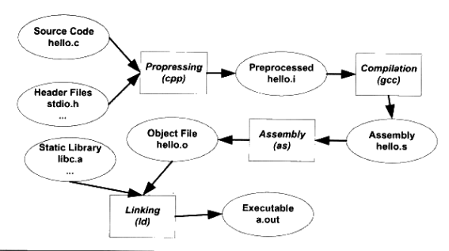
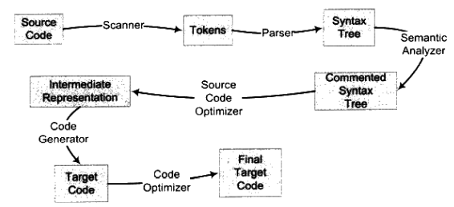
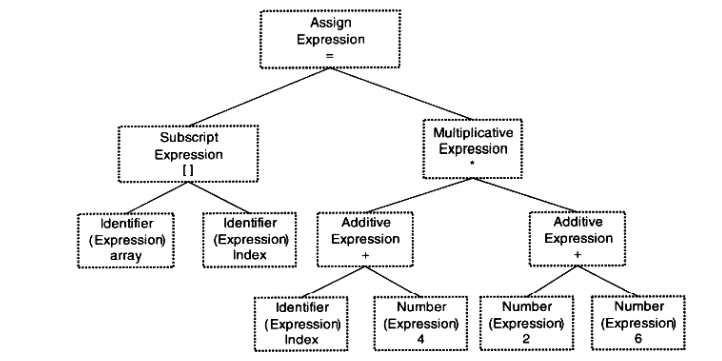
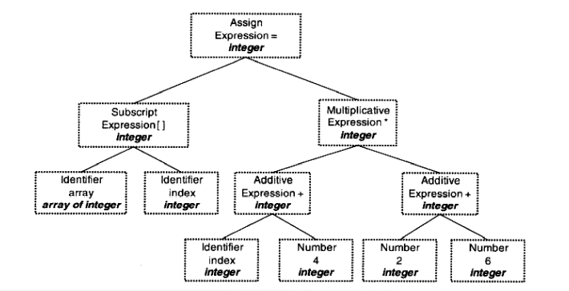
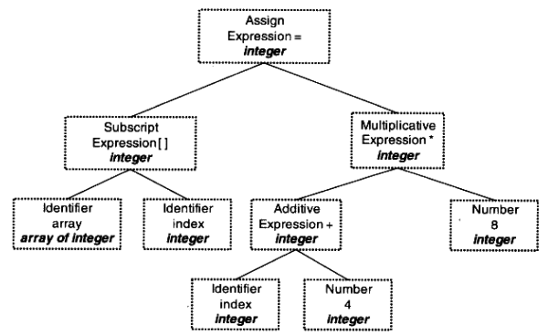
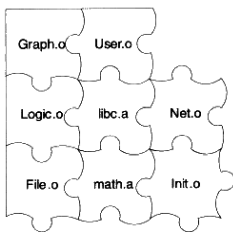
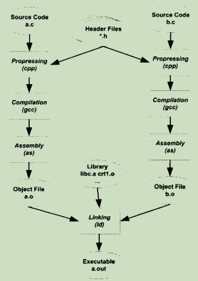

# 编译和链接

如果说“编译和链接这几个字不够熟悉， 那说”Build“就再熟悉不过了吧。

```
gcc program.c
```

事实上以上操作涵盖了四个部分：预处理Prepressing、编译compilation、汇编assembly、链接linking；



## 不为人知的动作

### 预编译

```
gcc -E program.c			// 生成预编译文件
cpp program.c > program.i
```

预编译主要处理的是源代码文件中**以“#”开头**的预编译指令；

包括：

1. 将所有“#define”删除，展开所有**宏定义**；
2. 处理所有**条件预编译**指令，如#if等；
3. 处理**#include**预编译指令，被包含的文件插入到该预编译指令的位置；
4. 删除所有**注释**；
5. **添加代码行号和文件名标识**，以便于编译时编译器产生调试用的行号信息与用于编译时产生编译错误或警告时能够显示行号；
6. 保留所有**#pragma**编译器指令；

### 编译

```
gcc -S program.i -o program.s
```

编译把预编译处理完的文件进行一系列词法**分析**、语法分析、语义**分析**、优化后产生的**汇编代码**文件；

### 汇编

```
gcc -c program.s -o program.o
```

汇编器将汇编代码办成机器可以执行的指令，几乎依据汇编语句对应一条机器指令（翻译）；

### 链接

链接是一个复杂的过程，有许多文件参与进来，下一章详细总结；

## 编译器做了啥

直观地说，编译器是将高级语言翻译成机器语言的一个工具；



**扫描**=>**语法分析**=>**语义分析**=>**源代码优化**=>**代码生成**=>**目标代码优化**

示例代码：

```
array[index] = (index + 4) * (2 + 6)
CompilerExpression.c
```

### 扫描

**扫描器scanner**做的任务就是**词法分析**，用的是一种类似于**有限状态机（Finite State Machine）**的算法，可以轻松将源代码字符序列分割成一系列的记号（Token），如上代码共有28个非空字符，扫描后产生16个记号，“index”作为标识符为一个记号；

这些记号会分类，标识符存放到**符号表**，数字、字符串常量存放到**文字表**中；

一个名为**lex**的程序可以**实现词法扫描**，有了它，编译器开发者只需要改变**词法规则**就可以了；

### 语法分析

**语法分析器Grammar Parser**对记号进行**语法分析**，生成**语法树Syntax Tree**，采用的是**上下文无关语法Context-free Grammar**的分析手段；

语法树是以表达式Expression为节点的树，以上面的代码为例，语法树为：



整个语句被看作是**一个赋值表达式**；

树的**左边**是**数组**表达式，**右边**是**乘法**表达式；

**数组**表达式由**两个符号表达式**组成；

由于**符号**和**数字**是**最小的表达式**，所以也作为整个**语法树的叶节点**；

语法分析器需要解决的是**区分表达式的含义**，在**不合法**表达式出现时**要报错**；

一个名为yacc的工具，根据用户给定的语法规则对几号序列进行解析，构件语法树，对于不同编程语言只需要改变语法规则即可（编译器编译器Compiler Compiler）；

### 语义分析器

顾名思义，**语义分析器Semantic Analyzer**进行**语义分析**，完成了对表达式的**语法层面的分析**，但是并**不了解语句是否真的有意义**；

语义分析器能分析的语义是**静态语义Static Semantic**，是编译期间就可以确定的语义；

不能分析动态语义Dynamic Semantic，这是运行期见才能确定的语义；

语义分析器将语法树的**表达式标识为类型**，上图语法树将转化为：



### 源码级优化器

源代码级优化器Source Code Optimizer在源代码级别进行优化；

例如，2+6的结果是确定的，结果8可以被优化保存；



可以看到，优化器将语法树转换成了中间代码Intermediate Code，这已经非常接近目标代码了，但是它一般跟目标机器和运行时环境是无关的，比如没有数据尺寸、变量地址和寄存器名字等；

中间代码有很多类型，不同编译器中有不同的形式，常见有：

1. 三地址码Three-address Code：

   ```
   x = y op z
   ```

   将变量y和z进行op操作以后，赋值给x；

   上面代码可以转化为以下步骤：

   ```
   t1 = 2 + 6
   t2 = index + 4
   t3 = t2 * t1
   array[index] = t3
   ```

   由于优化程序的作用：

   ```
   t2 = index + 4
   t2 = t2 * 8
   array[index] = t2
   ```

2. P-code

中间代码使得**编译器被分为前端和后端**，**前端**负责产生**机器无关的中间代码**，**后端**将中间代码转换成**目标机器代码**；

### 代码生成器和目标代码优化器

**代码生成器Code Generator**和**目标代码优化器Target Code Optimizer**属于**编译器后端**；

#### 代码生成器

中间代码 => 目标机器代码（这依赖于目标机器）

#### 目标代码优化器

对目标代码进行优化，比如选择合适的寻址方式、使用位移来代替乘法运算等；

经过这么多的程序，源代码变成了目标代码，但是index和array的地址还未确定，要如何得到它们的地址呢？

事实上**绝对地址**要在**最终链接的时候才能确定**，因此**编译器完成的工作是将一个源代码文件编译成一个未链接的目标文件，然后链接器最终将目标文件链接起来形成可执行文件**；

## 链接器

计算各个目标地址的过程被叫做**重定位Relocation**；

假设存在这样的指令：

```nasm
jmp foo
```

意思为跳转到foo表示的地址执行，而foo的符号Symbol就尤为重要，当有指令引用了它，只需要记住foo这个地址，直接修正就可以了；因此模块间符号的引用成为了彼此联系且保证程序正确执行的关键；



## 模块拼装——静态链接

链接Linking就是将**模块组装**起来，各个模块之间相互引用的部分处理好了，程序在引用和调用时就能**找到目标符号确定位置**而不会出错；

而链接的过程主要包括：

1. **地址和空间分配**
2. **符号决议**（或是熟知的**符号绑定**，然而这个说法很“动态”）
3. **重定位**

下图演示了具体流程，每个模块段代码文件.c经过编译器编译成目标文件.o，**目标文件**和**库Library**一起链接形成最终的可执行文件；



这里的库最常见的就是**运行时库Runtime Library**，是支持程序运行的基本函数的集合，是一组目标文件包，存放了常用代码编译后的目标文件集合；

讲一个具体的例子就可以了；

假设**main.c中使用了另个一个模块func.c中的函数func()**，则在调用这个函数时必须要知道**func()函数存放的地址**。但是每个模块是单独编译的，显然**main.c不知道，而func.c知道**，因此main.c会暂时**把这个地址放一放**，等最**后链接的时候让链接器去填充修正**。链接器在链接的时候**根据所引用的符号func**，自动去查找func.c模块中的func函数地址，然后把这些信息**填充修正到main.c模块**中，**这个填充修正的过程正是重定位**，而这个被修正的地方叫**重定位入口**。当然也可以把链接器想成一个裁缝，这是在打补丁；

