# Hello world

## 前言

`Hello, world`，本章的目的是对计算机世界的大致世界观有一个初步的认识，了解计算机大致的组成和运行:dog:。

由于本人学疏才浅，文章所谈及的知识或许会有出入，还望斧正。

## 程序

如下是一个C语言编写的源代码hello.c：

```c
// hello.c
#include <stdio.h>

int main()
{
    printf("hello, world\n");	// 在屏幕上显示出 hello, world 的字样
    return 0;
}
```

它在编译成可执行文件后，即我们熟知的在Windows操作系统上显示为：hello.exe，在linux系统里显示为：hello。

这里我们在linux的terminal中执行下列命令即可完成编译，生成一个32位的可执行文件：

```shell
gcc hello.c -m32 -o hello
```

> $ file hello
> hello: ELF 32-bit LSB executable, Intel 80386, version 1 (SYSV), dynamically linked, interpreter /lib/ld-linux.so.2, for GNU/Linux 2.6.32, BuildID[sha1]=c4ff49711aef2e1f4ad7c3fdfdedf6fffa238ac7, not stripped

在terminal中执行命令：

```shell
./hello
```

执行的结果为：

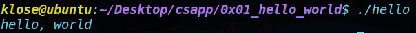

实际上，一个C语言的源代码经过几个阶段形成可执行文件：

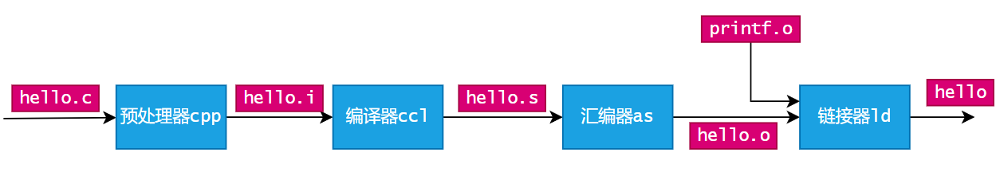

- 预处理 Preprocess：`预处理器cpp`根据`#`开头的命令，修改源代码，如上述代码中的`#include <stdio.h>`；
- 编译 Compile：`编译器ccl`将文本文件`hello.i`翻译成文本文件`hello.s`，其实就是一个汇编语言的源代码。
- 汇编 assemble：`汇编器as`将`hello.s`翻译成机器语言指令，将指令打包到可重定位目标程序(relocatable object program)`hello.o`中。
- 链接 link：由于程序还调用了`printf`函数，其存在于另一个可重定位目标程序`printf.o`中，因此要能完整无误地运行`hello`，需要`链接器ld`将该文件与生成的`hello.o`合并，由此得到了可执行文件`hello`，其可被加载到内存中，由系统运行。

## GCC'N GNU

上面的命令中，可以看到`gcc`的命令，`gcc`是什么呢？

GCC是GNU中的一个编译器工具。

GNU是一个由Richard Stallman发起的免税慈善项目，旨在开发一个完整的类Unix的操作系统。

GNU环境包括EMACS编辑器、GDB、GCC、汇编器、链接器、处理二进制文件的工具以及其他的部件。

GCC编译器已经能支持许多不同语言，能够为许多不同的机器生成代码，支持：C、C++、Fortran、Java、Pascal等。

Linux的出名也有GNU的一份功劳，毕竟GNU为Linux内核提供了环境。

## 程序的执行

现在硬盘上已经有了一个`hello`这样的程序，如果要在linux上执行它，只需要在terminal中，输入下列指令：

```shell
./hello
```

> $ ./hello
> hello, world

可以看到，通过输入`./`来让操作系统加载运行程序，那么其运行背后都有哪些过程呢？首先先来认识相关的硬件。

### 硬件组成

- 总线：贯穿整个系统的一组电子管道，其负责在各个部件中传递比特流。通常，总线所传递的比特流会被设计为固定长度的字节块，即`字(word)`，因此字的字长成为了一个基本的系统参数，例如之所以有一些机器被称为32位，是因为它的字长为4个字节(4*8=32)，而同理，64位的机器则有8个字节的字长。
- I/O设备：系统与外界的联系通道，例如键盘鼠标、显示器以及硬盘磁盘。他们都通过一个控制器或适配器与`I/O`总线相连，用于在I/O总线和I/O设备间传递信息；
  - 控制器：I/O设备本身或者系统的主印制电路板（其实就是主板）上的芯片组。
  - 适配器：插在主板插槽上的卡。
- 主存：即`内存(memory)`，处理器执行程序时，用来存放程序的指令和数据。在物理上，主存是一组`动态随机存取存储器(DRAM)芯片`。在逻辑上，主存是一个线性的字节数组，每个字节对应唯一的索引，而不同类型的数据有不同的占用大小。例如在x86-64的机器上：
  - short: 2 bytes
  - int & float: 4 bytes
  - long & double: 8 bytes
- 处理器：即`中央处理单元(CPU)`，解释（或执行）存储在主存中的指令。在CPU中，大小为一个字的`程序计数器(PC)`在任何时刻都指向主存中的某条机器语言指令（地址），在执行完当前指令后，PC会指向下一条指令（指令并不一定相邻）。执行指令的操作围绕`主存`、`寄存器(Register)`和`算数/逻辑单元(ALU)`进行。在指令要求下，CPU可能会进行下列操作：
  - 加载：从主存复制数据（大小为一个字节或一个字）到寄存器；
  - 存储：从寄存器复制数据（大小为一个字节或一个字）到主存中；
  - 操作：把两个寄存器的内容复制到ALU中，并进行算术运算，将运算结果存放到寄存器上；
  - 跳转：从指令本身中抽取一个字（作为地址），并将这个字复制到PC中；

### 运行程序

在上述操作中，对于`./hello`这个shell命令，系统是如何识别并执行对应指令的呢？

我们知道，鼠标和键盘一般通过USB连接到主板上，实际上可以抽象理解为，鼠标和键盘这些外设通过`USB控制器`连接到`I/O总线`上。同样的，显示器通过`图形适配器`，也就是熟知的显卡，连接到I/O总线上。同理，硬盘也通过对应的`磁盘控制器`与I/O总线进行数据交互。在一般的个人计算机上，还会保留许多扩展槽以便用户根据需要进行设备扩展。

当我们通过键盘输入"./hello"时，shell程序将字符逐一读入寄存器中，再将它们存放到内存上，如下图所示。

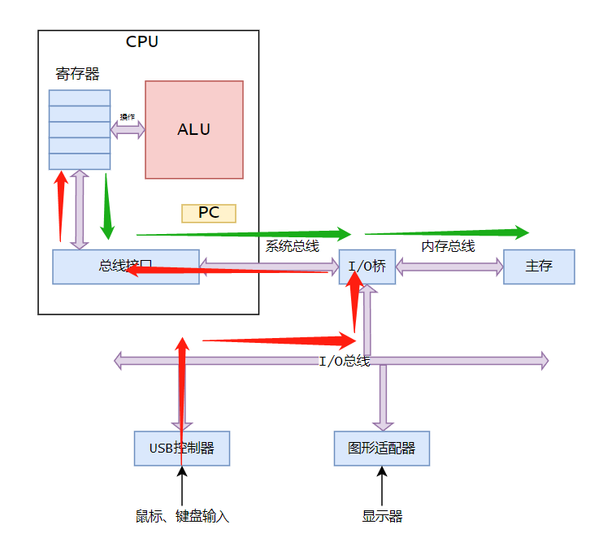

当键入回车后，shell程序执行一系列指令来加载可执行文件`hello`，具体时将hello目标文件的代码和数据从磁盘复制到内存中。

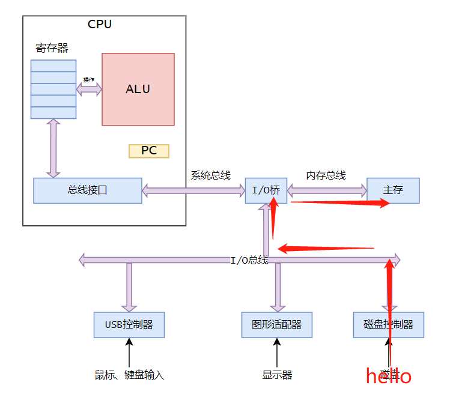

当程序资源都加载完毕后，CPU就开始执行hello程序中的机器语言指令，它们将内存中的数据存储到寄存器中，并进行操作，最后复制到显示设备上，显示为`hello,world`。

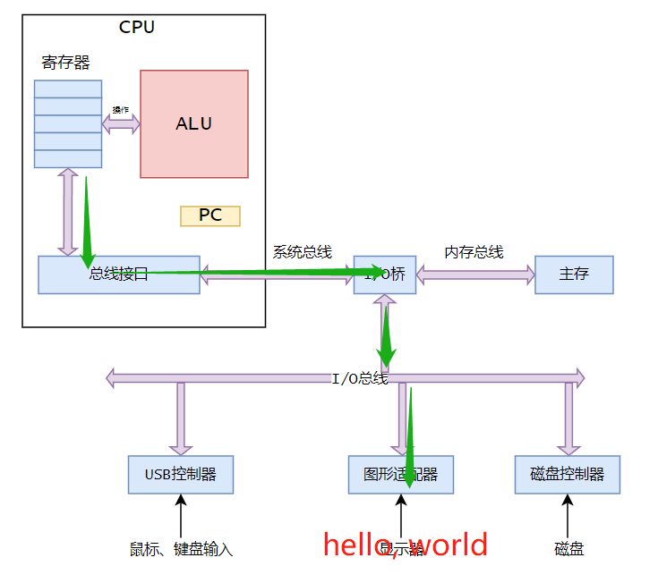

## 效率问题

可以看到，执行一个简单的hello程序时，计算机进行了许多复杂的操作，其中较为繁琐的就是数据的传输，其中许多工作只是简单的复制拷贝，但是却消耗了大量的时间。根据搜寻的原理，在存储空间很大的磁盘上对某一个数据进行查询显然会比存储空间较小的磁盘上的查询要慢。因此，CPU从寄存器中读取数据显然比从内存中读取数据更快，而对比存储空间更大的磁盘而言，从内存中读取数据显然会比从磁盘中读取数据更快。为了提高存取效率，根据程序访问局部区域的数据和代码的特性，设计出效率很高的高速缓存存储器，`高速缓存存储器(cache memory，简称cache)`应运而生。

cache是一个暂时的存放区，存放处理器近期可能会使用的数据信息。通过`静态随机访问存储器(SRAM)`实现了L1、L2高速缓存。其中，L1高速缓存位于处理器上，其访问速度几乎与访问寄存器一致，而进程访问L告诉缓存通过特殊的总线连接到处理器，由于`L2-cache`的存储容量更大，其访问时间大约为访问`L1-cache`的5倍，但是这仍然比直接访问内存要快5-10倍。在新的SRAM中还实现了`L3-cache`。

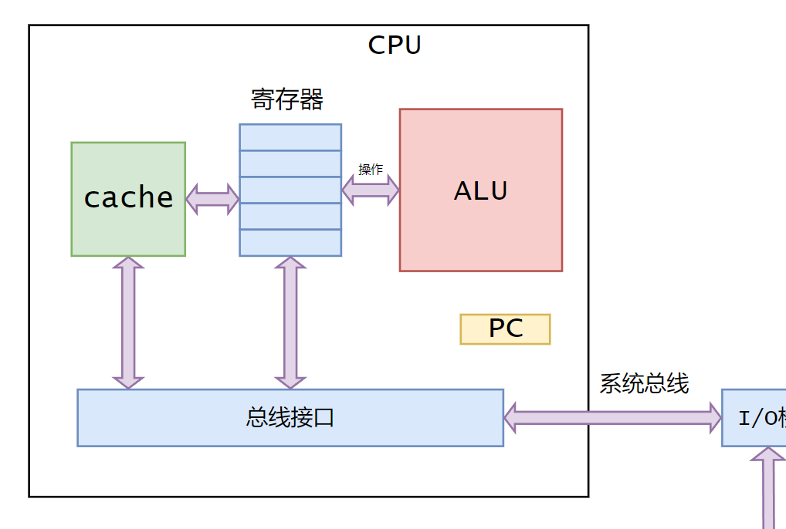

## 存储的层次结构

在效率问题中，我们已经知道了存储容量大小对访问速度的影响。根据访问速度，存储设备也划分为不同层次，以便合理地进行设备间的数据交互。在这个结构中，从上至下，设备的访问速度变慢，容量变大，每字节的造价变便宜。

L0: 寄存器

L1: L1高速缓存(SRAM)

L2: L2高速缓存(SRAM)

L3: L3高速缓存(SRAM)

L4: 主存(DRAM)

L5: 本地磁盘

L6: 分布式文件系统、Web服务器

## 操作系统的地位

既然存在这么多I/O设备和CPU、内存打交道，那谁负责管理呢？答案是：操作系统。

在执行`hello`程序的时候，我们敲下回车时，`shell`程序需要通过键盘输入来执行某些操作，但是shell程序并没有直接访问键盘，在读取hello程序到内存中时，也没有直接访问磁盘或内存，而这些看似隐形的操作其实是`操作系统提供的服务`。

在这里，可以将操作系统看作软件与硬件设备之间的一层软件，所有应用程序对硬件设备的操作都必须通过操作系统，因此操作系统必须具备两种基本功能：

- 防止硬件被失常的应用程序使用
- 向应用程序提供简单一致的机制来控制复杂而不尽相同的硬件设备。

为了实现这些功能，操作系统进行了一系列的抽象：`进程(对CPU、内存和I/O设备)`、`虚拟内存(对内存和磁盘设备)`和`文件系统（对I/O设备）`等。

### 进程

进程是操作系统对一个正在运行的程序的一种抽象，它的目的是让程序认为系统上只有它一个程序正在运行，即：该程序单独占用CPU、内存和I/O设备。

当我们打开任务管理器，可以看到很多进程正在运行，实际上，虽然进程之间无法互相感知并且认为自身单独占用资源，但是CPU、内存和I/O设备都是实际存在的，因此在运行大量的程序时，即并发运行时，进程和另一个进程的指令是被CPU交错执行的。

在传统的操作系统中，在一个时刻只能运行一个程序，如果想要执行多个程序，就只能交替执行不同程序的指令。而如今的`多核处理器`可以在一个时刻同时执行多个程序的指令。在这里我们只先讨论单核处理器。在`CPU`层面，交替执行程序的这种行为理解为`进程间切换`，在`操作系统`层面，这种行为理解为`上下文切换`。

如何理解`上下文（context）`呢？上下文是一种状态，在这里表示为`进程运行所需的所有状态信息`，比如进程运行时，寄存器和PC的值。由于单核处理器在同一时刻只能执行一个进程的代码，因此在下一时刻需要交替执行其他进程的代码时，就需要保存当前进程的上下文（状态），然后恢复到其他进程的上下文（状态），并将控制权交予新的进程。

#### 进程切换

在这里用`shell程序和hello程序并发执行`作为例子。

当我们打开terminal的时候，可以理解为shell程序启动，并且等待键盘的输入。当我们输入`./hello`并回车后，shell通过调用一类函数，称作系统调用，来执行我们的请求。这个系统调用会将控制权从shell程序转交到操作系统，操作系统将会保存shell程序当前的状态，就是i我们前面所说的上下文Context，接着创建一个新的hello进程以及它的上下文。而后操作系统将控制权转交给hello进程，CPU则执行hello相关的指令，在hello进程终止后，操作系统会恢复shell进程的上下文，并将控制权交予shell程序，shell会继续等待键盘的输入。

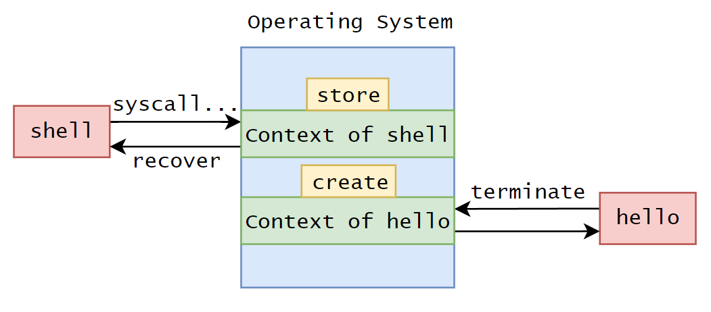

所以这一系列的工作，从表象上看就是，terminal被打开，输入`./hello`，hello程序执行并输出`"hello, world"`，而后shell程序等待键盘的输入。

```shell
# terminal
$ ./hello 
hello, world
$ 
```

#### 操作系统做了什么？

从上面的shell和hello进程切换的例子中，我们可以知道操作系统对两个进程的切换提供了服务，里面有更多的细节有待学习。

实际上，两个进程的转换是由`操作系统内核(kernel)`管理的，而内核便是操作系统代码`常驻于内存中`的核心部分。当应用程序需要操作系统的某些操作，就比如说读写某个文件，就需要使用操作系统提供的系统调用指令，将控制权传递给内核，通过内核执行被请求的操作。要注意的是，内核不是独立的进程，二四系统管理全部进程的一个代码和数据结构的集合。

当然，这么做也是出于对安全和可靠性的考虑，同时也为进程抽象提供了支持。因此，`权限(authority)`是操作系统中的一个非常重要的概念。区分用户和内核的两种环境，能够保证操作系统的正常运行。

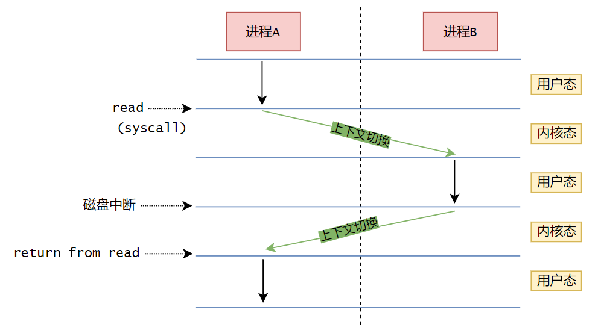

### 线程

在上述对进程的讨论中，我们所举的例子是，一个进程只有`单一的控制流`（如上图的流程中在每个状态中只有一个箭头），然而在现代的操作系统中，一个进程实际上可以由`多个执行单位`组成，这里的执行单元指的就是`线程(thread)`。

`每个线程`都运行在`进程的上下文`中，可以理解为运行在进程的资源区域中，并且`共享该区域内的代码和全局数据`。

### 虚拟内存

`虚拟内存(virtual memory)`是对内存和磁盘I/O设备的抽象。可想而知，有虚拟内存就会有`物理内存(physical memory)`，它们之间存在着一种映射关系，当然，在第一章节里只是稍做介绍，并不会深入学习讨论。

虚拟内存是的每个进程都认为自己独占地使用内存，而每个进程所看到的内存大小都是`一致的`，这个内存大小的空间称为`虚拟地址空间(virtual address)`。当然，实际情况就如物理内存一样，每个进程所占用的实际内存是大小不一的，只不过通过映射后得到统一大小的虚拟内存。

那么进程所认为的独占的内存是一个什么样的结构呢？大致如下图所示：

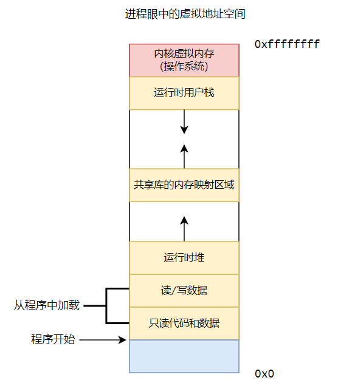

在这里需要注意，`地址(address)`是从下往上增大的。

- 程序代码和数据：对于所有进程而言，代码是从同一固定地址开始，紧接着是全局变量和数据，它们直接按照可执行目标文件(例如hello.o)的内容初始化。代码和数据区域在一开始就已经规定了大小。
- 堆：代码和数据区域后紧跟的是运行时`堆(heap)`，这个区域没有规定大小，而是根据程序的需要通过`malloc`和`free`这类函数动态增加或减小，在这里可以简单理解为`蛋糕的切块和合并`，而这块蛋糕就是虚拟内存空间。
- 共享库：其实就是用存放如C标准库的共享库的代码胡数据的区域，这在程序装载和链接的时候尤为重要。
- 栈：编译器用来实现程序中的函数调用关系和顺序执行的是`栈(stack)`。在程序运行时，如何进入某个函数，如何退出该函数，如何在退出时回到正确的指令执行位置，如何存放被调用的函数里的临时变量，如何处理函数与函数之间的调用和被调用的关系，这都是栈需要关心的问题。
- 内核虚拟内存：这是为操作系统内核预留的空间，进程需要用到操作系统的服务，所以这部分空间必不可少，当然这部分空间也是不允许用户态的进程直接访问的，毕竟它属于内核态，拥有更高的权限级别。

### 文件系统

文件只是`0和1构成的字节序列`而已。我们所看到的电脑里的C盘，D盘，Linux系统里的文件夹，甚至于键盘和显示器，都可以被视为文件。之所以我们能看到文件夹和文件，那是因为操作系统将它们按照磁盘拟定的规则形式进行呈现。通过操作系统的服务，开发程序员不用去了解磁盘的工作原理，因为他们只需要只用操作系统提供的接口服务，即可堆磁盘进行访问和操作。

## 系统间网络通信

从操作系统脱离出来，在0x07中，我们几乎可以说这里的内容很贴切《计算机网络》的内容。上述的所有基本都围绕一个系统，也就是一个计算机来展开，实际上，成千上万的主机通过网络连接起来。如果只是从自己的个人计算机的角度出发，我们可以把网络看作是一个连接在我们主机上的一个I/O设备，其实我说`网卡`就容易理解得多。网卡，我们也称为网络适配器，当系统从内存中复制数据到网络适配器时，数据就从这个I/O设备输出，并通过网络到达另一台计算机上，这就是计算机网络通信的最基本解释。

当然如果深入到计算机网络通信中，还会产生许多许多的问题，就像交警如何管理交通秩序一样。这里就只是点到为止了。

## 重要主题

- Amdahl's law

  `Amdahl定律`是对`提升系统某一部分性能所带来的效果`的观察。`当我们对系统的某个部分进行性能提升时，其对系统整体性能的影响取决于该部分的重要性和提升程度。`

  现在假设系统执行某应用程序需要时间 $T_{old}$，而系统某部分所需执行时间与该时间的比例为 $\alpha$ ，而该部分性能提升比例（加速比例因子）为 $k$ ，即该部分初始所需时间为 $\alpha T_{old} $ ，现在所需时间为 $(\alpha T_{old}) \space / \space k$ 。所需的总的执行时间为：
  $$
  T_{new} 
  = (1-\alpha)T_{old}+(\alpha T_{old})/k 
  = T_{old}[(1-\alpha)+\alpha/k]
  $$
  由此可以计算出加速比
  $$
  S=\frac{T_{old}}{T_{new}}=\frac{T_{old}}{T_{old}[(1-\alpha)+\alpha/k]}=\frac{1}{(1-\alpha)+\alpha/k}
  $$
  举一个例子，现在假定某部分所需执行时间与系统执行总时间 $T_{old}$ 的比例为 $\alpha=0.6$ ，即所需执行时间为 $\alpha T_{old}$ ，这足以证明这个部分对于整个系统而言是非常重要的（至少从占用时间比例这个角度上看）。接着，假定我们提升了这一部分的性能，加速比因子为 $k=4$，相当于提升到4倍性能，那么这部分所需的执行时间将减少为 $\frac{\alpha T_{old}}{4}$ 。现在我们再来看看提升性能后，整个系统的加速比：
  $$
  \begin{align}
  S
  & = \frac{1}{(1-\alpha)+\alpha/k} \\ 
  & = \frac{1}{(1-0.6)+0.6/4} \\
  & = \frac{1}{0.55}\\
  & \approx 1.82
  \end{align}
  $$
  可以看到，虽然我们提升了一个重要部分的性能足足4倍，但是整体系统性能提升仅仅`1.82×`。

  再举一个极端的例子，当$k \rightarrow \infin$时，即相当于这部分花费的时间几乎可以忽略不计，于是能得到 $S=\frac{1}{1-\alpha}=2.5$ ，性能提升也只有`2.5×`。

  由此也能得出，虽然对一个主要部分做出重大提升，但是获得的系统加速比却明显小于该部分加速比，即：`要想显著提升整个系统的性能，必须提升整个系统中相当大的部分的性能`。

- 并发与并行

  `并发(concurrency)`指的是一个在同时刻内具备多个活动的系统，`con`有"陪同"的含义，`currency`是"流通，流动"。

  `并行(parallelism)`指的是用`并发`来使一个系统运行得更快，`parallel`有"平行，类似"的含义。其可以在计算机系统的多个抽象层次上使用，按照层次结构中由高到低的顺序介绍三个层次上的并发使用：

  - 线程级并发

    在进程抽象上设计的`同时有多个程序执行的系统`，这就是计算机系统在进程管理系统上的并发。比如我们打开任务管理器，能够看到很多同时在运行的进程。而，使用线程我们能够在一个进程中执行多个控制流。

    在`时分复用(TDM)`这个概念（可以理解为每个信号按照时间次序依次占用一个时刻的时间）诞生后，实际上就有人在计算机系统上尝试并发执行了，虽然它是一种模拟的工作方式：通过一个CPU核心在正在执行的进程间飞速地进行切换，就好像杂技演员抛小球很快一样。这样的配置被称为`单处理器系统`。

    当一个由`单操作系统内核`控制的`多处理器`组成系统时，我们得到了一个`多处理器系统`，或者说叫`多核处理器系统`，他们的组织结构大概如下：

    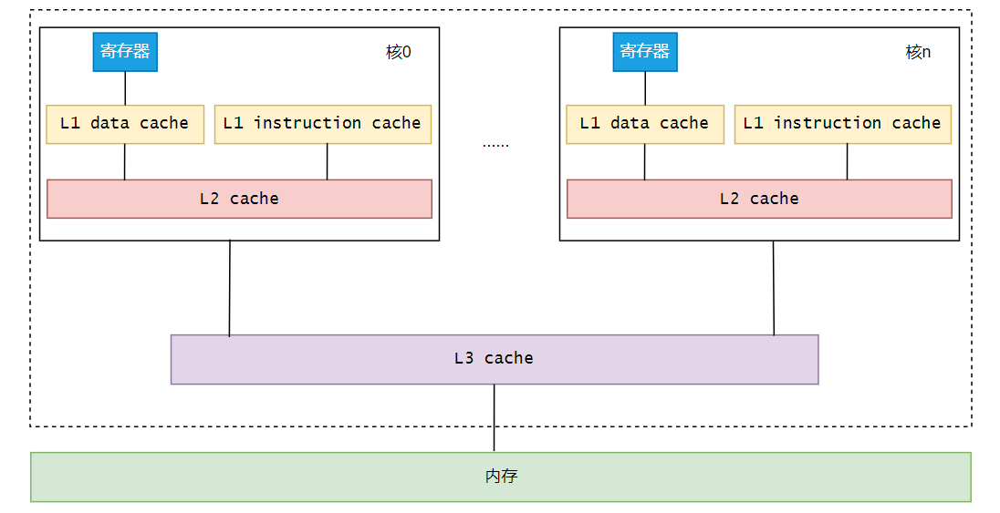

    `超线程(hyperthreading)`，也称为`同时多线程(simultaneous multi-threading)`的出现允许一个CPU执行多个控制流。比如，假设一个线程必须等到某些数据被装载到cache中，那么CPU就可以继续去执行另一个线程。Intel Core i7 处理器支持每个核心执行两个线程，也就是我们所说的4核8线程、8核16线程。工业界专家预言最终的工艺可以将上百个核集成到一个芯片上。

    线程级并发体现在了：

    1. 个人计算机执行多个程序更加快速。
    2. 单个程序多线程执行更加高效。

  - 指令级并行

    在低层的抽象层次上，`处理器可以同时执行多条指令`，这就是所谓的`指令级并行`。说到这里，还要引入一个叫做`时钟周期`的时间度量，可以简单地理解为一个节拍器（或者打点计时器，随便怎样都行:grin:）。早期处理器需要通常3-10个时钟周期才能执行一条指令，而现在的处理器在一个时钟周期就已经能执行很多条指令了。工程师们对处理器的优化可谓是绞尽脑汁，这就像在激发大脑的潜力一样，运用`流水线(pipelining)`的方式，将执行一条指令所需的工作划分成不同的步骤，形成一系列的不同层次的操作，而这些操作可以并行执行。

    当然也有衡量处理器性能指标的一个标准，我们把那些可以达到`比一个周期一条指令更快`的执行速率的处理器叫做`超标量(super-scalar)处理器`

  - 单指令、多数据并行

    在最低层次上，我们将与操作数据打交道。具备单指令多数据并行功能的硬件，`允许一条指令产生多个可以并行执行的操作`，我们称为SIMD并行。例如处理器可以并行地对8个单精度浮点数(float)做加法指令。

- 抽象有多重要？

  在重要主题的最后，我们要意识到抽象是计算机科学中最为重要的概念。我们所指的应用程序接口(API)就是一种抽象的概念，它给人提供了一个黑盒，只需要能够知道它的使用方法即可，无须知道内部原理如何。

  在处理器中，`指令集架构`是对实际处理器硬件的抽象，借此机器代码程序表现得好像运行在一个依次只执行一条指令的处理器上，而实际上底层的机器代码运行要更加复杂精细，它会并行执行多条指令，但是又总是和那个简单有序的抽象模型保持一致。而只要模型一致，不同处理器实际也能执行相同的机器代码。

  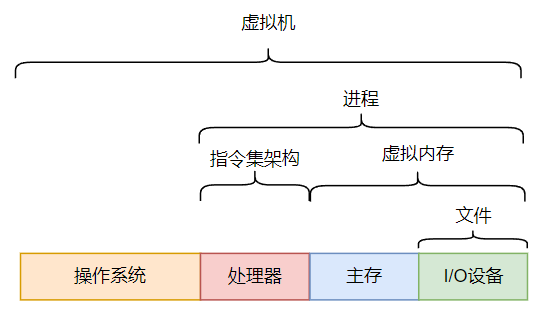

