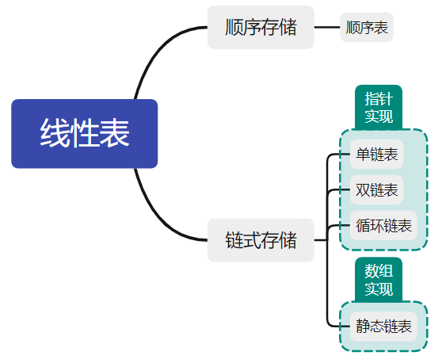

# 线性表

重点内容：

- 线性表的定义和基本操作
- 线性表的实现：顺序存储、链式存储、线性表的应用

知识框架：



## 线性表的定义和基本操作

### 线性表的定义

线性表是具有相同数据类型的 $n \space (n \geq 0)$ 个数据元素的有限序列，其中 $n$ 为表长，为0是代表线性表为空表。若用 $L$ 命名线性表，则一般表示为：
$$
L=(a_1,a_2,...,a_i,a_{i+1},...,a_n)
$$
线性表逻辑特性为：

-  $a_1$ 为**唯一**的”第一个“数据元素，又称为**表头元素** ；
-  $a_n$ 是**唯一**的”最后一个“数据元素，又称为**表尾元素**；
- **除第一个元素外**，每个元素**有且仅有**一个直接**前驱**；
- **除最后一个元素外**，每个元素**有且仅有**一个直接**后继**；

注意：

- **线性表**是一种**逻辑结构**，表示元素之间一对一的相邻关系；
- **顺序表和链表**强调的是**存储结构**，和线性表属于不同层面的概念；

### 线性表的基本操作

线性表的主要操作有：

- `InitList(&L)` - 初始化表，构造一个空的线性表
- `Length(L)` - 求表长，返回线性表`L`的长度，即其中元素的个数
- `LocateElem(L, e)` - 按值查找操作，在表L中查找具有给定值的元素
- `GetElem(L, i)` - 按位查找操作，获取表L中第i个位置的元素的值
- `ListInsert(&L, i, e)` - 插入操作，在表L中第i个位置插入指定元素e
- `ListDelete(&L, i, &e)` - 删除操作，删除表L中第i个位置的元素，并用e返回删除元素的值
- `PrintList(L)` - 打印线性表，按前后顺序输出线性表L的所有元素值
- `Empty(L)` - 判空操作，若L为空表，则返回true，否则返回false
- `DestroyList(&L)` - 销毁操作，销毁线性表，释放L所占用的内存空间

注意：

- 基本操作的实现取决于存储结构
- `&`表示C++中表示引用调用，在C语言中采用指针可达到同样的效果

## 线性表的顺序表示

### 顺序表的定义

线性表的顺序存储称为顺序表。

是用**一组地址连续的存储单元**依次存储线性表中的数据元素，从而使得**逻辑上相邻**的两个元素在**物理位置上也相邻**。即**逻辑顺序与物理顺序相同**。

**线性表的顺序存储结构是一种*随机存储*的存储结构**。典型的就是高级程序设计语言中的**数组**。但是要注意的是，线性表元素的位序从1开始，而数组的元素下标从0开始。

```c
// 静态分配
#define MaxSize 50

typedef struct SeqList
{
    /* data */
    ElemType data[MaxSize];		// 顺序表数组
    int length;
};

// 动态分配
#define InitSize 100

typedef struct SeqList
{
    /* data */
    ElemType *data;		// 动态分配数组的指针
    int length, Maxsize;
};
```

顺序表的特点有：

- 随机访问，通过首地址和元素序号可以在 $O(1)$ 的时间内找到指定元素；
- 存储密度高，每个结点只存储数据元素；
- 逻辑相邻的元素物理相邻，插入和删除操作需要移动大量元素；

### 顺序表上的操作

- 插入
- 删除
- 按值查找

以下列顺序表结构为例：

```cpp
#define InitSize 100
typedef struct
{
    ElemType *data;         // 指针
    int length;             // 表长
    int MaxSize = InitSize; //表长的最大值
} SeqList;
```

#### 插入

```cpp
/* 按位插入指定数值 */
bool ListInsert(SeqList &SeqL, int order, ElemType element)
{
    if (order < 1 || order > SeqL.length + 1) // 注意 order 和 index 的区别
        return false;
    if (SeqL.length >= SeqL.MaxSize) // 如果表满了，则直接返回 false
        return false;

    /*
    将表元素向右挪动，如果从前往后遍历会覆盖掉值，如果声明temp变量来临时存储又会加大开销
    所以考虑从后往前遍历
    for (int j = order; j <= SeqL.length; j++)
    {
        SeqL.data[j] = SeqL.data[j - 1];
    }
    */
    for (int j = SeqL.length; j >= order; j--)
    {
        SeqL.data[j] = SeqL.data[j - 1];
    }
    SeqL.data[order - 1] = element;
    SeqL.length++;
    return true;
}
```

对于插入操作而言：

- 最好情况：在表尾（位序为`L.length+1`，下标为`L.length`）插入，不移动元素

- 最坏情况：在表头（位序为1，下标为0），需要移动`L.length`次

- 平均情况：假设 $p_i \space (p_i=\frac{1}{n+1})$ 是在第 $i$ （这里的 $i$ 是位序）个位置上插入一个结点的概率，则在长度为 $n$ 的线性表中插入一个结点时，$n-i+1$ 为需要挪动的次数，则所需要移动结点的平均次数为： 
  $$
  \begin{equation}
      \begin{split}
      N
      &=\sum_{i=1}^{n+1}p_i(n-i+1)\\
      &=\sum_{i=1}^{n+1}\frac{1}{n+1}(n-i+1)\\
      &=\frac{1}{n+1}\sum_{i=1}^{n+1}（n-i+1)\\
      &=\frac{1}{n+1} \times \frac{n(n+1)}{2}\\
      &=\frac{n}{2}
      \end{split}
  \end{equation}
  $$
  即插入算法的平均时间复杂度为 $O(n)$ 。

#### 删除

```cpp
/* 删除指定位序的元素，并用变量 del_e 返回 */
bool ListDelete(SeqList &SeqL, int order, ElemType &del_e)
{
    if (order < 1 || order > SeqL.length)
        return false;
    if (SeqL.length <= 0)
        return false;
    del_e = SeqL.data[order - 1];
    /* 将表元素向左挪动，从前向后遍历 */
    for (int j = order; j < SeqL.length; j++)
    {
        SeqL.data[order - 1] = SeqL.data[order];
    }
    SeqL.length--;
    return true;
}
```

对于删除操作而言：

- 最好情况：删除表尾（位序为`L.length`，下标为`L.length-1`）元素，不移动元素

- 最坏情况：删除表头（位序为1，下标为0），需要移动`L.length-1`次

- 平均情况：假设 $p_i \space (p_i=\frac{1}{n})$ 是删除第 $i$ （这里的 $i$ 是位序）个位置的结点的概率，则在长度为 $n$ 的线性表中删除一个结点时，$n-i$ 为需要挪动的次数，则所需要移动结点的平均次数为： 
  $$
  \begin{equation}
      \begin{split}
      N
      &=\sum_{i=1}^{n}p_i(n-i)\\
      &=\sum_{i=1}^{n}\frac{1}{n}(n-i)\\
      &=\frac{1}{n}\sum_{i=1}^{n}（n-i)\\
      &=\frac{1}{n} \times \frac{n(n-1)}{2}\\
      &=\frac{n-1}{2}
      \end{split}
  \end{equation}
  $$
  即删除算法的平均时间复杂度为 $O(n)$ 。

#### 按值查找

```cpp
/* 按值查找位序 */
int LocateByElem(SeqList SeqL, ElemType element)
{
    for (int idx = 0; idx < SeqL.length; idx++)
    {
        if (element = SeqL.data[idx])
            return idx + 1; // 返回的位序为 [下标 + 1]
        else
            return 0; // 由于位序不可能为 0 ，返回 0 则表示查找失败
    }
}
```

对于按值查找操作而言：

- 最好情况：查找的元素在表头，只需要执行条件语句一次，时间复杂度为 $O(1)$ 

- 最坏情况：查找的元素在表尾或不存在，需要执行条件语句`L.length`次，即 $n$ 次，时间复杂度为 $O(n)$ 

- 平均情况：假设 $p_i \space (p_i=\frac{1}{n})$ 是查找的元素在第 $i$ （这里的 $i$ 是位序）个位置的结点的概率，则在长度为 $n$ 的线性表中查找值为`element`的结点时，所需要执行条件语句的平均次数为：
  $$
  \begin{equation}
      \begin{split}
      N
      &=\sum_{i=1}^{n}p_i \times i\\
      &=\sum_{i=1}^{n}\frac{1}{n} \times i\\
      &=\frac{1}{n}\sum_{i=1}^{n}i\\
      &=\frac{1}{n} \times \frac{n(n+1)}{2}\\
      &=\frac{n+1}{2}
      \end{split}
  \end{equation}
  $$
  即线性表按值查找算法的平均时间复杂度为 $O(n)$ 。

## 课后题

```cpp

#include <stdio.h>
#include <malloc.h>
#include <string.h>
#define InitSize 100

typedef int ElemType;
ElemType name;

typedef struct
{
    int *data;              // 指针
    int length;             // 表长
    int MaxSize = InitSize; //表长的最大值
} SeqList;

/* tool 打印线性表 */
void PrintList(SeqList SeqL)
{
    for (int i = 0; i < SeqL.length; i++)
    {
        printf("%d ", SeqL.data[i]);
    }
    printf("\n");
}

/* Q1. 从顺序表中删除具有最小值得元素（假设唯一）并由函数返回被删除元素的值，空出的位置由最后一个元素填补，若顺序表为空，则显示出错信息并退出运行 */
bool DeleteMin_Q1(SeqList &L, ElemType &element)
{
    if (L.length == 0)
        return false;

    element = L.data[0]; // 初始化为表头元素
    int minPos = 0;      // 记录线性表中最小元素的下标
    for (int i = 0; i < L.length; i++)
    {
        if (L.data[i] < element)
        {
            element = L.data[i];
            minPos = i;
        }
    }
    L.data[minPos] = L.data[L.length - 1];
    L.length--;
    return true;
}

/* Q2. 设计高效算法，将顺序表L的所有元素逆置， 要求算法的空间复杂度为 O(1) */
bool ReverseList_Q2(SeqList &L)
{

    if (L.length == 0)
        return false;
    int temp;
    for (int i = 0; i < L.length / 2; i++)
    {
        temp = L.data[i];
        L.data[i] = L.data[L.length - 1 - i]; /* A + B = length-1 则 B = length-1-A */
        L.data[L.length - 1 - i] = temp;
    }
    return true;
}

/* Q3. 对长度为 n 的顺序表 L 编写一个时间复杂度为 O(n) ，空间复杂度为 O(1) 的算法，该算法删除线性表中所有值为 x 的元素 */
bool DeteleAll_Q3(SeqList &L, ElemType x)
{
    if (L.length == 0)
        return false;
    int frontxNum = 0; /* 记录当前下标之前等于 x 的元素个数 */
    for (int i = 0; i < L.length; i++)
    {
        /* 目标元素，frontxNum+1 */
        if (L.data[i] == x)
        {
            frontxNum++;
        }
        /* 非目标元素，当前元素下标前移 frontxNum 位*/
        else
        {
            L.data[i - frontxNum] = L.data[i];
        }
    }
    /* 表长减去删除元素个数 */
    L.length -= frontxNum;
    return true;
}

/* Q4. 从有序顺序表中删除其值在给定值 s 与 t 之间（要求 s < t ）的所有元素，若 s 或 t 不合理或顺序表为空，则显示出错信息并退出运行 */
bool DeleteBetweenST_Q4(SeqList &L, ElemType s, ElemType t)
{
    /* 注意题目是有序顺序表 */
    /* 先按要求排除不正常情况 */
    if (s >= t || L.length == 0) // 如果 s >= t 或者为空表，则返回 false
        return false;
    if (L.data[0] > t || L.data[L.length - 1] < s) // 如果有序顺序表中的元素不在[s,t]区间内，则直接返回 true
        return true;

    int end, start;
    for (start = 0; start < L.length && L.data[start] < s; start++) // 得到 start，其为第一个被删除元素的下标
        ;
    for (end = start; end < L.length && L.data[end] <= t; end++) // 得到 end，注意这里的 <= ，end 为第一个需要前移的元素的下标
        ;
    // end-start 为需要删除的元素个数，那么直接把后面的元素前移 end-start 位即可，当然 end 会一直遍历到顺序表尾部
    for (; end < L.length; end++, start++)
    {
        L.data[start] = L.data[end];
    }
    L.length -= end - start;
    return true;
}

/* Q5. 从顺序表中删除其值在给定值 s 与 t 之间，包含 s，t（要求 s < t）的所有元素，若 s 或 t 不合理或顺序表为空，则显示出错信息并退出运行 */
bool DeleteBetweenST_Q5(SeqList &L, ElemType s, ElemType t)
{
    if (s >= t || L.length == 0 || L.data[0] > t || L.data[L.length - 1] < s)
        return false;

    int frontdelNum = 0;
    for (int i = 0; i < L.length; i++)
    {
        if (L.data[i] >= s && L.data[i] <= t)
        {
            frontdelNum++;
        }
        else
        {
            L.data[i - frontdelNum] = L.data[i];
        }
    }
    L.length -= frontdelNum;
    return true;
}

/* Q6. 从有序顺序表删除所有其值重复的元素，使表中所有元素值均不同 */
bool DeleteRepeat_Q6(SeqList &L)
{
    if (L.length == 0)
        return false;

    int i, j;
    /* 使用双指针 */
    for (i = 0, j = 1; j < L.length; j++)
    {
        /* 如果左指针元素和右指针元素相同，则右指针+1，继续比对
        if (L.data[i] == L.data[j])
            j++; */

        /* 如果碰到下一个不同的元素，则左指针+1，并且覆盖为新元素 */
        if (L.data[i] != L.data[j])
        {
            i++;
            L.data[i] = L.data[j];
        }
    }
    L.length = i + 1;
    return true;
}

/* Q7. 将两个有序顺序表合并为一个新的有序顺序表，由函数返回结果顺序表 */
bool CombineSeqL_Q7(SeqList L1, SeqList L2, SeqList &L3)
{
    /* 如果两个顺序表的长度之和超过了顺序表的最大长度，则返回 false */
    if (L1.length + L2.length > L3.MaxSize)
        return false;

    if (L1.length != 0 && L2.length != 0)
    {
        int i = 0, j = 0, k = 0;
        while (i < L1.length && j < L2.length)
        {
            if (L1.data[i] <= L2.data[j])
            {
                /* L3.data[k++] = L1.data[i++]; */
                L3.data[k] = L1.data[i];
                k++;
                i++;
            }
            else
            {
                /* L3.data[k++] = L2.data[j++]; */
                L3.data[k] = L2.data[j];
                k++;
                j++;
            }
        }
        while (i < L1.length)
        {
            /* L3.data[k++] = L1.data[i++]; */
            L3.data[k] = L1.data[i];
            k++;
            i++;
        }
        while (j < L2.length)
        {
            /* L3.data[k++] = L2.data[j++]; */
            L3.data[k] = L2.data[j];
            k++;
            j++;
        }
        L3.length = k;
    }
    return true;
}

/* Q8. 已知在一维数组A[m+n]中依次存放两个线性表(a1,a2,...,am)和(b1,b2,...bn)，试编写一个函数，将数组中两个顺序表的位置互换，即将(b1,b2,...bn)放在(a1,a2,...,am)前面 */
/*
    解法：
    1. 可以先把两个部分分别进行逆序，得到：(am,...,a2,a1) 和 (bn,...,b2,b1)，即为 (am,...,a2,a1,bn,...,b2,b1)
    2. 再整体逆序可以得到：(b1,b2,...,bn,a1,a2,...,am)，即为结果
 */
/* 将下标为start到end的元素逆序排列 */
bool Reverse(SeqList &L, int start, int end)
{
    if (start > end || end >= L.length)
        return false;

    /* 需要逆序元素个数的一半 */
    int mid = (end - start + 1) / 2;
    /* 逆序交换， i 和 start 同时增加，start作为下标，i 作为交换次数 */
    for (int i = 0; i < mid; i++, start++)
    {
        ElemType temp = L.data[start];
        L.data[start] = L.data[end - i];
        L.data[end - i] = temp;
    }
    return true;
}

void ReverseTwoPartList_Q8(SeqList &L, int m, int n)
{
    Reverse(L, 0, m - 1);
    // PrintList(L);
    Reverse(L, m, L.length - 1);
    // PrintList(L);
    Reverse(L, 0, L.length - 1);
}

/* Q9. 线性表(a1,a2,...an)中的元素有序递增且按顺序存储与计算机内，要求设计一个算法，完成用最少时间在表中查找数值 x 的元素，若找到，则将其与后继元素位置相交换，若查不到，则将其插入表中并使表中元素仍有序递增。 */
bool FindXSwapOrInsert_Q9(SeqList &L, ElemType x)
{
    if (L.length == 0)
        return false;
    /* 首先要求用最短时间查询值为 x 的元素，这里使用二分法 */
    int low = 0;
    int high = L.length - 1;
    int mid;
    while (low <= high)
    {
        mid = (low + high) / 2;
        if (L.data[mid] == x)
        {
            break;
        }
        else if (L.data[mid] > x)
        {
            high = mid - 1;
        }
        else // L.data[mid] < x
        {
            low = mid + 1;
        }
    }
    /* 若查找到元素，且该元素不是顺序表的最后一个 */
    if (L.data[mid] == x && mid != L.length - 1)
    {
        // 交换
        ElemType temp = L.data[mid];
        L.data[mid] = L.data[mid + 1];
        L.data[mid + 1] = temp;
    }

    /* 若没有查找到元素，则按顺序插入，在二分结束后，low 和 high 的指针相邻：high low*/
    if (L.length <= L.MaxSize - 1 && low > high)
    {
        int i;
        /* 由于相邻，则 L.data[high] < x < L.data[low] ，因此下标从 low （包括 low ）以后的元素后移 */
        for (i = L.length - 1; i >= low; i--)
        {
            L.data[i + 1] = L.data[i];
        }
        L.data[i + 1] = x;
        L.length++;
    }

    return true;
}
/* Q10. 【2010】设将n(n>1)个整数存放到一堆数组R中，设计一个在时间和空间两方面尽可能高效的算法，使得R中保存的序列循环左移p(0<p<n)个位置，即将R中数据由(X0,X1,...,Xn)变为(Xp,Xp+1,...,Xn-1,X0,X1,...,Xp-1)
要求：  1. 给出算法基本思想
    2. 根据设计思想采用C/C++来描述算法
    3. 说明空间复杂度和时间复杂度  */
bool MoveList_Q10(SeqList &L, int p)
{
    /* 对于循环左移 p 个位置而言，相当于将 p 个序列元素放置到了 n-p 个元素之后，即：
    由 {a1,a2,...ap,b1,b2,...,bn-p} 变成了 {b1,b2,...,bn-p}{a1,a2,...ap}
    相当于：
    {a1,a2,...,ap} 逆序后 {ap,...,a2,a1}
    {b1,b2,...,bn-p} 逆序后 {bn-p,...,b2,b1}
    拼接到一起后再逆序，得到 {b1,b2,...,bn-p,a1,a2,...,ap}
    */
    if (L.length == 0 || p <= 0 || p >= L.length)
        return false;
    Reverse(L, 0, p - 1);
    Reverse(L, p, L.length - 1);
    Reverse(L, 0, L.length - 1);
    return true;
    /* 空间复杂度为：O(1)   时间复杂度为：O(n) */
}

/* Q11. 一个长度为 L (L>=1) 的升序序列 S ，处在第L/2（向上取整）个位置的数称为 S 的中位数。例如，若序列 S1 = (11, 13, 15, 17, 19)，则 S1 的中位数是 15，两个序列的中位数是含它们所有元素的升序序列的中位数。例如，若 S2 = (2,4,6,8,20)，则 S1 和 S2 的中位数是 11 .现在右两个等长升序序列，设计一个在时间空间都尽可能高效的算法，找出两个序列的中位数，要求:
1. 给出算法的基本设计思想
2. 代码描述并注释
3. 说明时间复杂度和空间复杂度 */
ElemType FindMid_Q11(SeqList L1, SeqList L2)
{
    /* 从两个序列的中间开始比较，向两边扩散，可以看作是一种二分法 */
    int start1 = 0, start2 = 0;
    int end1 = L1.length - 1, end2 = L2.length - 1;
    int mid1, mid2;
    while (start1 != end1 || start2 != end2)
    {
        mid1 = (start1 + end1) / 2;
        mid2 = (start2 + end2) / 2;
        if (L1.data[mid1] == L2.data[mid2])
        {
            return L1.data[mid1];
        }
        if (L1.data[mid1] < L2.data[mid2])
        {
            if ((start1 + end1) % 2 == 0)
            {
                start1 = mid1;
                end2 = mid2;
            }
            else
            {
                start1 = mid1 + 1;
                end2 = mid2;
            }
        }
        else
        {
            if ((start2 + end2 % 2 == 0))
            {
                end1 = mid1;
                start2 = mid2;
            }
            else
            {
                end1 = mid1;
                start2 = mid2;
            }
        }
    }
    return L1.data[start1] < L2.data[start2] ? L1.data[start1] : L2.data[start2];
    /* 时间复杂度 O(log2n) 空间复杂度 O(1) */
}

/* Q12. [2013] 已知一个整数序列 A=(a0,a1,...,an-1)，其中 0<=ai<n(0<=i<n)。若存在ap1=ap2=...=apm=x 且 m>n/2(0<=pk<n, 1<=k<=m)，则称 x 为 A 的主元素，例如 A=(0,5,5,3,5,7,5,5)，则 5 为主元素；又如 A=(0,5,5,3,5,1,5,7)，则 A 中没有主元素(m=n/2)，假设 A 中的 n 个元素保存在一个一维数组中，设计一个尽可能高效的算法，招呼A的主元素，若存在主元素，则输出该元素，否则输出-1，要求：
1. 给出算法基本设计思路
2. 代码
3. 时间复杂度和空间复杂度 */
int GetMainElement_Q12(int *arr, int n)
{
    /* 如果一个数组存在主元素，那么其至少有两个主元素一定相邻，从而使得对其的计数 count >= 2 */
    /*
    1. 候选主元素初始化为数组第一个元素
    2. 向后遍历数组，当元素与候选主元素相同时count+1，不同则count-1
    3. 当下一个元素不等于候选主元素且count=0时，则更新候选主元素为下一个元素，并继续遍历
    4. 遍历完成后，对候选主元素进行判断，统计出现次数是否满足要求 count > n/2，满足则返回主元素， 否则返回-1*/
    if (arr)
    {
        int count = 1;
        int i, cur_element;

        cur_element = arr[0];
        for (i = 1; i < n; i++)
        {
            if (arr[i] == cur_element)
                count++;
            else
            {
                if (count > 0)
                    count--;
                else
                {
                    cur_element = arr[i];
                    count = 1;
                }
            }
        }
        if (count > 0)
        {
            for (i = count = 0; i < n; i++)
            {
                if (arr[i] == cur_element)
                    count++;
            }
        }
        if (count > n / 2)
            return cur_element;
        else
            return -1;
    }
    else
    {
        return -1;
    }
    /* 时间复杂度为 O(n) 空间复杂度为 O(1) */
}

/* Q13. [2018] 给定一个含 n(n>=1) 个整数的数组，设计一个在时间上尽可能高效的算法，找出数组中未出现的最小正整数，例如{-5,3,2,3}中未出现的最小正整数是 1，{1,2,3}中未出现的最小正整数是 4，要求：
1. 给出算法基本设计思想
2. 代码
3. 时间复杂度和空间复杂度 */
int GetMinPositiveInt_Q13(int *arr, int n)
{
    /* 返回的最小正整数一定在区间[1,n+1]内，因此arr[i]如果不在这个区间内，则不做操作，在这个区间内则用一个数组做记录 */
    /*
    1. 创建大小为 n 的数组 memory，并初始化为 0
    2. 遍历数组 arr，寻找在 [1,n] 范围内的值，并设置memory中对应下标的元素为 1
    3. 最后遍历数组 memory，寻找第一个没有被设置为 1 的元素下标（即没有出现过），由于只能返回 [1,n]，因此最后需要另外加上一种情况 n+1 */

    int *memory = (int *)malloc(sizeof(int) * n);
    memset(memory, 0, sizeof(int) * n);
    for (int i = 0; i < n; i++)
    {
        if (arr[i] >= 1 && arr[i] <= n)
        {
            memory[arr[i] - 1] = 1;
        }
    }
    for (int i = 0; i < n; i++)
    {
        if (memory[i] == 0)
            return i + 1;
    }
    return n + 1;
    /* 时间复杂度为 O(n) 空间复杂度为 O(n) */
}

/* Q14. 定义三元组(a,b,c)（a,b,c均为正整数）的距离 D=|a-b|+|b-c|+|c-a|。给定3个非空整数集合 S1, S2 和 S3，按升序分别存储在3个数组中。设计一个尽可能高效的算法，计算并输出所有可能的三元组(a,b,c)(a∈S1, b∈S2, c∈S3)中的最小距离。
例如 S1={-1,0,9} S2={-25,-10,10,11} S3={2,9,17,30,41}，则最小距离为2，相应的三元组为{9,10,9}
要求：
1. 给出算法的设计思想
2. 代码
3. 时间复杂度和空间复杂度
*/
int abs_(int num)
{
    if (num < 0)
        return -num;
    else
        return num;
}

bool isMin(int a, int b, int c)
{
    if (a <= b && a <= c)
        return true;
    else
        return false;
}

int GetMinDistanceTuple_Q14(int *s1, int m, int *s2, int n, int *s3, int p)
{
    /*
    1. 由于 D=|a-b|+|b-c|+|c-a|>=0，当 a=b=c 时，D最小
    2. 在一维坐标系上，a,b,c三点中，必定有一点在两点之间（可重合），假设取c最大值，a为最小值，那 D=2|c-a|，要使|c-a|最小，只需要让元组中最大值和最小值的差值最小即可
    3. 可以固定比较元组中的最大值 c ，之后每次更新元组中的最小值 a ，直到计算出最小距离 D*/
    int min_D = 0x7fffffff;
    int cur_D;
    int i = 0, j = 0, k = 0;
    while (i < m && j < n && k < p && min_D > 0)
    {
        cur_D = abs_(s1[i] - s2[j]) + abs_(s2[j] - s3[k]) + abs_(s3[k] - s1[i]);
        if (cur_D < min_D)
            min_D = cur_D;

        if (isMin(s1[i], s2[j], s3[k]))
            i++;
        else if (isMin(s2[j], s1[i], s3[k]))
            j++;
        else
            k++;
    }
    return min_D;
}

int main()
{
    // SeqList L;
    // // printf("%p", L);
    // L.data = (ElemType *)malloc(sizeof(ElemType) * InitSize); // C动态分配
    // // L.data = new ElemType[InitSize]; // C++动态分配
    // scanf_s("%d", &L.length);
    // for (int i = 0; i < L.length; i++)
    // {
    //     scanf_s("%d", &L.data[i]);
    // }
    // printf("before: ");
    // PrintList(L);
    // printf("after: ");

    /* Q1 */
    // int element;
    // DeleteMin_Q1(L, element);
    // PrintList(L);

    /* Q2 */
    // ReverseList_Q2(L);
    // PrintList(L);

    /* Q3 */
    // DeteleAll_Q3(L, 4);
    // PrintList(L);

    /* Q4 */
    // DeleteBetweenST_Q4(L, 4, 10);
    // PrintList(L);

    /* Q5 */
    // DeleteBetweenST_Q5(L, 4, 8);
    // PrintList(L);

    /* Q6 */
    // DeleteRepeat_Q6(L);
    // PrintList(L);

    /* Q7 */
    // SeqList L1;
    // L1.data = (ElemType *)malloc(sizeof(ElemType) * InitSize);
    // scanf_s("%d", &L1.length);
    // for (int i = 0; i < L1.length; i++)
    // {
    //     scanf_s("%d", &L1.data[i]);
    // }
    // SeqList L2;
    // L2.data = (ElemType *)malloc(sizeof(ElemType) * InitSize);
    // CombineSeqL_Q7(L, L1, L2);
    // PrintList(L2);

    /* Q8 */
    // ReverseTwoPartList_Q8(L, 1, 2);
    // PrintList(L);

    /* Q9 */
    // FindXSwapOrInsert_Q9(L, 5);
    // PrintList(L);

    /* Q10 [2010] */
    // MoveList_Q10(L, 4);
    // PrintList(L);

    /* Q11 [2011] */
    // SeqList L1;
    // L1.data = (ElemType *)malloc(sizeof(ElemType) * InitSize);
    // scanf_s("%d", &L1.length);
    // for (int i = 0; i < L1.length; i++)
    // {
    //     scanf_s("%d", &L1.data[i]);
    // }
    // printf("%d", FindMid_Q11(L, L1));

    /* Q12. [2013] */
    // int n;
    // scanf_s("%d", &n);
    // int *arr = (int *)malloc(sizeof(int) * n);
    // // printf("%p\n", arr);
    // for (int i = 0; i < n; i++)
    // {
    //     scanf_s("%d", &arr[i]);
    // }
    // for (int i = 0; i < n; i++)
    // {
    //     printf("%d ", arr[i]);
    // }
    // printf("\n");
    // printf("%d", GetMainElement_Q12(arr, n));

    /* Q13. [2018] */
    // int n;
    // scanf_s("%d", &n);
    // int *arr = (int *)malloc(sizeof(int) * n);
    // for (int i = 0; i < n; i++)
    // {
    //     scanf_s("%d", &arr[i]);
    // }
    // printf("%d", GetMinPositiveInt_Q13(arr, n));

    /* Q14. [2020] */
    // int m, n, p;
    // scanf_s("%d", &m);
    // int *s1 = (int *)malloc(sizeof(int) * m);
    // scanf_s("%d", &n);
    // int *s2 = (int *)malloc(sizeof(int) * n);
    // scanf_s("%d", &p);
    // int *s3 = (int *)malloc(sizeof(int) * p);

    // for (int i = 0; i < m; i++)
    // {
    //     scanf_s("%d", &s1[i]);
    // }
    // for (int i = 0; i < n; i++)
    // {
    //     scanf_s("%d", &s2[i]);
    // }
    // for (int i = 0; i < p; i++)
    // {
    //     scanf_s("%d", &s3[i]);
    // }

    // printf("%d", GetMinDistanceTuple_Q14(s1, m, s2, n, s3, p));

    return 0;
}
```


## 线性表的链式表示

链式存储线性表时，**不需要**使用**地址连续**的存储单元，**不要求逻辑上相邻的元素在物理位置上也相邻**，通过“链”建立其数据元素之间的逻辑关系，插入和删除操作只需要修改指针，但是也会**失去随机存储**的优点。

### 单链表的定义

线性表的链式存储又称为单链表，通过一组任意的存储单元来存储线性表中的数据单元，为了建立元素间的线性关系，对每个链表结点，除了存放元素自身的信息外，还存放一个指向其后继的指针。

```c
typedef struct LNode
{
    /* data */
    ElemType data;      // 数据单元
    struct LNode *next; // 指向下一个 node 的指针
} LNode, *LinkList;     // 可以表示单结点或是指向整个链表的指针
```

需要注意的是：

- 非随机存取的存储结构，不能直接找到表中某个特定结点，查找特定结点需要从表头开始遍历。
- 通常用头指针来标识一个单链表，头指针为NULL时表示一个空表。
- 在第一个结点之前通常附加一个头结点，数据域可以为NULL也可以是表长，其指针指向第一个元素。带头结点的优点：
  - 第一个元素结点的操作和表上其他位置的结点操作一致
  - 无论链表是否为空，头指针都指向头结点的非空指针（空表中头结点的指针域为空）

### 单链表上的操作

#### 按顺序插入结点

- 头插法

  ```cpp
  LinkList InsertListFromHead(LinkList &L, int n)
  {
      /* 创建头结点，并使其 next 指向 NULL */
      L = (LinkList)malloc(sizeof(LNode)); /* 注意这里不是 LinkList *，因为在struct的定义里已经被设置为了数组形式存储LNode */
      L->next = NULL;
  
      /* 创建要插入结点 */
      for (int i = 0; i < n; i++)
      {
          /* 获取数据域 */
          int x;
          scanf_s("%d", &x);
  
          /* 为新建结点创建空间 */
          LNode *p = (LNode *)malloc(sizeof(LNode));
          p->data = x;       /* 设置数据域 */
          p->next = L->next; /* 插入的结点指针指向头结点指针所指区域 */
          L->next = p;       /* 头结点指针指向插入的元素 */
      }
      return L;
  }
  ```

  头插法时，读入数据的顺序与生成链表中的元素顺序是相反的，每个结点插入时间为 $O(1)$ ，当表长为 $n$ 时，时间复杂度为 $O(n)$ 。

  假设不存在头结点，则插入代码为：

  ```cpp
  LinkList InsertListFromHead(LinkList &L, int n)
  {    
  	/* 假设没有头结点 */
      int x;
      scanf_s("%d", &x);
  
      /* 第一个元素的插入 */
      L = (LinkList)malloc(sizeof(LNode));
      L->data = x;
      L->next = NULL;
  
      /* 其余元素插入 */
      for (int i = 1; i < n; i++)
      {
          /* 获取数据域 */
          int x;
          scanf_s("%d", &x);
  
          /* 为插入结点创建空间 */
          LNode *p = (LNode *)malloc(sizeof(LNode));
          p->data = x;
          p->next = L->next;
          L->next = p;
      }
      return L;
  }
  ```

- 尾插法

  ```cpp
  LinkList InsertListFromTail(LinkList &L, int n)
  {
      /* 头结点 */
      L = (LinkList)malloc(sizeof(LNode));
      L->next = NULL;
  
      /* 引入一个尾结点，初始化为与头结点相同的域 */
      LNode *tail = L;
  
      for (int i = 0; i < n; i++)
      {
          /* 获取数据域 */
          int x;
          scanf_s("%d", &x);
  
          LNode *p = (LNode *)malloc(sizeof(LNode));
          p->data = x;
          /* 添加在 tail 后 */
          p->next = tail->next;
          tail->next = p;
          /* tail = p，使得下一个插入结点能够在 p 之后 */
          tail = p;
      }
      tail->next = NULL; // 尾结点指针置空
      return L;
  }
  ```

  时间复杂度为 $O(n)$ 。

#### 按位序查找值

返回位序对应的结点的数据域

```cpp
/* 按位序找到结点值 */
LinkList GetDataByOrder(LinkList L, int order)
{
    /* 结点指针指向第一个元素 */
    LNode *p = L->next;
    int i = 1; /* 计数用 */

    /* 当位序为 0 的时候，返回头结点数据域 */
    if (order == 0)
    {
        return L;
    }
    if (order < 0)
    {
        return NULL;
    }

    /* 只要 p 不为 nullptr 且 还不到对应位序，当 i==order时，即为要找的结点，此时返回p->data即可 */
    while (p && i < order)
    {
        p = p->next;
        i++;
    }
    return p;
}
```

#### 按值查找位序

按值查找位序，没有找到对应的值则返回0

```cpp
/* 按值查找结点位序 */
LinkList GetOrderByData(LinkList L, ElemType data)
{
    int i = 1;
    LNode *p = L->next; // 指针指向第一个元素

    while (p)
    {
        if (p->data == data)
            return p;
        else
        {
            p = p->next;
        }
        i++;
    }
    return NULL;
}
```

#### 按位序插入结点

```cpp
/* 按位置插入结点 */
LinkList InsertListByOrder(LinkList &L, int order, ElemType e)
{
    int i = 1;

    /* 要插入的结点 */
    LNode *newNode = (LNode *)malloc(sizeof(LNode));

    /* 继承头指针 */
    LNode *preNode = L;

    if (order < 0)
    {
        return NULL;
    }

    if (order == 0)
    {
        return L;
    }

    /* 如果 order 超出了链表长度， preNode 会是最后一个结点，新插入的结点会被自动放在最后一个*/
    /* preNode->next 初始指向了第一个结点，在 while 循环结束后为需要插入结点的前驱结点 */
    while (preNode && i < order)
    {
        preNode = preNode->next;
        i++;
    }

    /* preNode 为 newNode 的前驱结点，将 newNode 链接进来 */
    if (preNode)
    {
        newNode->next = preNode->next;
        preNode->next = newNode;
        /* 设置 newNode 的数据域 */
        newNode->data = e;
    }

    return L;
}
```

#### 按位序删除结点

```cpp
/* 按位序删除结点 */
LinkList DeleteNodeByOrder(LinkList &L, int order)
{
    if (order < 0)
        return NULL;
    if (order == 0)
        return L;

    int i = 1;          // 计数
    LNode *preNode = L; /* 遍历指针 */

    while (preNode && i < order)
    {
        preNode = preNode->next;
        i++;
    }

    /* 要删除的结点 */
    LNode *delNode = preNode->next;

    /* 要删除的结点如果存在 */
    if (delNode)
    {
        /* 前驱结点的 next 指向删除结点的 next */
        preNode->next = delNode->next;
        free(delNode); /* 释放 */
    }

    return L;
}

```

#### 获取表长

```cpp
int GetLinkListLen(LinkList L)
{
    int len = 0; /* 包含头指针的长度 */
    LNode *p = L;

    while (p)
    {
        p = p->next;
        len++;
    }

    return len - 1; /* 返回不包含头指针的长度 */
}
```

### 双链表的定义

单链表只有后继指针，只能向后遍历。访问**后继结点**的时间复杂度为 $O(1)$ ，访问**前驱结点**的时间复杂度为 $O(n)$ 。

双链表有前驱和后继指针，可以向前向后遍历。访问**后继结点和前驱结点**的时间复杂度都为 $O(1)$ 。

### 双链表上的操作

#### 按顺序插入结点

```cpp
/* 双链表 尾插法 */
DLinklist InsertElemFromTail(DLinklist &DL, int n)
{
    DL = (DLinklist)malloc(sizeof(DNode));
    DL->next = NULL;

    DNode *tail = DL;
    for (int i = 0; i < n; i++)
    {
        int x;
        scanf_s("%d", &x);

        /* 插入结点 p */
        DNode *p = (DNode *)malloc(sizeof(DNode));
        p->data = x; /* 设置插入结点的数据域 */

        /* 一般插入需要管理四条相关的链子，这里因为是在表尾插入，NULL 没有 next 和 prior指针，省去了对其 prior 的修改 */
        p->next = tail->next; /* next 指向 tail->next */
        p->prior = tail;      /* prior 指向 tail */
        tail->next = p;       /* tail->next 指向 待插入结点 */

        tail = p; /* tail被赋值为插入结点 p */
    }
    return DL;
}
```

#### 按位序插入结点

```cpp
/* 双链表 按位序插入结点 */
DLinklist InsertElemByOrder(DLinklist &DL, int order, int x)
{
    if (order < 0)
        return NULL;
    if (order == 0)
        return DL;

    int i = 1;
    DNode *preNode = DL;

    /* 得到要插入位置的前驱结点 */
    while (preNode && i < order)
    {
        preNode = preNode->next;
        i++;
    }

    DNode *insNode = (DNode *)malloc(sizeof(DNode));
    insNode->data = x;

    /* 当preNode不是最后一个结点时，处理四条链子 */
    if (preNode->next)
    {
        insNode->next = preNode->next;
        preNode->next->prior = insNode; /* 如果preNode是最后一个结点，则NULL->prior会报错，因为NULL不存在该指针 */
        preNode->next = insNode;
        insNode->prior = preNode;
    }
    else
    {
        /* 如果是最后一个结点，处理3条链子 */
        insNode->next = preNode->next;
        preNode->next = insNode;
        insNode->prior = preNode;
    }

    return DL;
}
```

#### 按位序删除结点

```cpp
/* 双链表 根据位序删除结点 */
DLinklist DeleteDNodeByOrder(DLinklist &DL, int order)
{
    if (order < 0)
        return NULL;
    if (order == 0)
        return DL;

    int i = 1; /* 计数 */
    DNode *preNode = DL;

    /* 找到要删除结点的前驱结点 */
    while (preNode && i < order)
    {
        preNode = preNode->next;
        i++;
    }

    /* 要删除的结点 */
    DNode *delNode = preNode->next;

    /* 如果delNode不是最后一个结点，调整两条“链子” */
    if (delNode->next)
    {
        preNode->next = delNode->next;
        delNode->next->prior = preNode;
    }
    else
    {
        /* 如果delNode是最后一个结点，NULL没有前驱指针，只用调整一条链子 */
        preNode->next = delNode->next;
    }
    free(delNode);

    return DL;
}
```

### 循环链表

- 循环单链表
  - 最后一个结点的next指针指向头结点。在**任何一个位置**插入和删除结点的**操作**都是**等价**的，因此**不需要判断是否为表尾结点**。
  - 可以从任何一个位置开始遍历整个链表。
  - 对于循环单链表而言，通常设置的是尾指针，假设尾指针为`r`，则`r->next`即为头指针。如果只有头指针，则对表尾操作需要 $O(n)$ 的时间，因为需要遍历过去，但是如果是尾指针，则对表头表尾操作都只需要 $O(1)$ 的时间。
  
  ```cpp
  Linklist InsertDataFromTail(Linklist &CL, int n)
  {
      CL = (Linklist)malloc(sizeof(LNode) * n);
      CL->next = CL; /* 指向自己 */
  
      LNode *tail = CL;
  
      for (int i = 0; i < n; i++)
      {
          int x;
          scanf_s("%d", &x);
  
          LNode *insNode = (LNode *)malloc(sizeof(LNode));
          insNode->data = x;
  
          insNode->next = tail->next;
          tail->next = insNode;
          tail = insNode;
      }
  
      return CL;
  }
  ```
  
  循环单链表的尾插法；
- 循环双链表

  - 头结点的prior需要指向尾结点，尾结点的next需要指向头结点。

  ```cpp
          CL = (DLinklist)malloc(sizeof(DNode) * n);        
          CL->next = CL;
          CL->prior = CL;
  ```

### 静态链表

借助数组来描述线性表的链式存储。

```cpp
#define MaxSize 50
typedef struct{
	ElemType data;
    int next;		// 下一个元素的数组下标
} SLinklist[Maxsize];
```

## 顺序表和链表的比较

### 性质比较

- 存取方式
  - 顺序表：可以顺序存放，**随机存取**，仅需**一次**访问
  - 链表：从表头依次存取，需要**依次**访问
- 逻辑结构与物理结构
  - 顺序表：**逻辑相邻**的元素**物理相邻**
  - 链表：**逻辑相邻**的元素**不需要物理相邻**
- 查找、插入和删除操作
  - 查找：
    - 按值查找：
      - 顺序表：**无序**顺序表时间复杂度为 $O(n)$ ，有序顺序表采取**折半法**时间复杂度为 $O(log_2n)$ 。
      - 链表：时间复杂度为 $O(n)$ 。
    - 按位置查找：
      - 顺序表：时间复杂度为 $O(1)$ 。
      - 链表：时间复杂度为 $O(n)$ 。
  - 插入和删除：
    - 顺序表：平均需要移动半个表长的元素，所以最坏时间复杂度为：$O(n)$ 。
    - 链表：时间复杂度为 $O(1)$ 。
- 空间分配
  - 顺序表
    - 静态分配：满了不能扩充，分配多了浪费空间
    - 动态分配：可以扩充，但是需要移动大量元素，如果没有连续空间分配将失败
  - 链表：只要有内存空间即可灵活分配。

### 如何选取

- 基于存储考虑：难以估计长度和存储规模的时候，不要用顺序表，但是链式存储存储密度低
- 基于运算考虑：插入删除频繁时用链表，访问频繁时用顺序表
- 基于环境考虑：顺序表容易实现，链表操作基于指针。

## 课后题

```cpp
#include <stdio.h>
#include <malloc.h>
#include <string.h>

typedef int ElemType;
// typedef char ElemType;

typedef struct LNode
{
    /* data */
    ElemType data;
    LNode *next;
} LNode, *Linklist;

typedef struct DNode
{
    /* data */
    ElemType data;
    DNode *next;
    DNode *prior;
} DNode, *DLinklist;

typedef struct LNode_Q20
{
    ElemType data;
    int freq;
    LNode_Q20 *next;
    LNode_Q20 *prior;
} LNode_Q20, *Linklist_Q20;

/* 打印不带头结点的单链表 */
void PrintLinklistWithoutHead(Linklist L)
{
    while (L)
    {
        printf("%d ", L->data);
        L = L->next;
    }
    printf("\n");
}

/* 打印带头结点的单链表 */
void PrintLinklist(Linklist L)
{
    while (L->next)
    {
        L = L->next;
        printf("%d ", L->data);
    }
    printf("\n");
}

/* 打印带头结点的循环双链表 */
void PrintCDLinklist(DLinklist CDL)
{
    DNode *curNode = CDL;
    while (curNode->next != CDL)
    {
        curNode = curNode->next;
        printf("%d ", curNode->data);
    }
    // for (int i = 0; i < n; i++)
    // {
    //     CDL = CDL->next;
    //     printf("%d ", CDL->data);
    // }
    printf("\n");
}

/* 打印带头结点的循环单链表 */
void PrintCLinklist(Linklist L)
{
    LNode *curNode = L;
    while (curNode->next != L)
    {
        curNode = curNode->next;
        printf("%d ", curNode->data);
    }
    printf("\n");
}

/* 打印带有 Freq 域的双链表 */
void PrintFreqDLinklist(Linklist_Q20 FDL)
{
    while (FDL->next)
    {
        FDL = FDL->next;
        printf("%d ", FDL->data);
        printf("%d\n", FDL->freq);
    }
    printf("\n");
}

/* 计算带头结点的单链表的表长 */
int GetLinklistLength(Linklist L)
{
    int len = 0;
    LNode *curNode = L;

    while (curNode)
    {
        curNode = curNode->next;
        len++;
    }

    /* 最后一个NULL也会计入 */
    return len - 1;
}

/* 创建表长为 n 的不带头结点的单链表 */
Linklist InsertDataFromTailwithoutHead(Linklist &L, int n)
{
    L = (Linklist)malloc(sizeof(LNode) * n);
    L->next = NULL;

    /* 处理第一个元素 */
    int x;
    scanf_s("%d", &x);
    L->data = x;

    LNode *tail = L;

    /* 处理剩下的 n-1 个元素 */
    for (int i = 1; i < n; i++)
    {

        scanf_s("%d", &x);

        LNode *p = (LNode *)malloc(sizeof(LNode));
        p->data = x;

        p->next = tail->next;
        tail->next = p;
        tail = p;
    }
    return L;
}

/* 创建表长为 n 的带头结点的单链表 */
Linklist InsertDataFromTail(Linklist &L, int n)
{
    L = (Linklist)malloc(sizeof(LNode) * n);
    L->next = NULL;

    LNode *tail = L;

    for (int i = 0; i < n; i++)
    {
        ElemType x;
        scanf_s("%d", &x);
        // getchar();

        LNode *p = (LNode *)malloc(sizeof(LNode));
        p->data = x;

        p->next = tail->next;
        tail->next = p;
        tail = p;
    }
    return L;
}

/* 创建表长为 n 的带头结点的循环双链表 */
DLinklist InsertDataFromTail_Circle(DLinklist &CDL, int n)
{
    CDL = (DLinklist)malloc(sizeof(DNode) * n);
    CDL->next = CDL;
    CDL->prior = CDL;
    DNode *tail = CDL;

    for (int i = 0; i < n; i++)
    {
        int x;
        scanf_s("%d", &x);

        DNode *insNode = (DNode *)malloc(sizeof(insNode));
        insNode->data = x;

        insNode->next = tail->next;
        insNode->prior = tail;
        tail->next = insNode;
        tail = insNode;
    }
    CDL->prior = tail;
    return CDL;
}

/* 创建表长为 n 的带头结点的循环单链表 */
Linklist InsertDataFromTail_Circle(Linklist &CL, int n)
{
    CL = (Linklist)malloc(sizeof(LNode) * n);
    CL->next = CL;
    LNode *tail = CL;

    for (int i = 0; i < n; i++)
    {
        int x;
        scanf_s("%d", &x);

        LNode *insNode = (LNode *)malloc(sizeof(LNode));
        insNode->data = x;

        insNode->next = tail->next;
        tail->next = insNode;
        tail = insNode;
    }
    return CL;
}

/* 创建表长为 n 的带头结点的双链表，且链表带有访问频度域 freq */
Linklist_Q20 InsertDataFromTailwithFreq(Linklist_Q20 &FDL, int n)
{
    FDL = (Linklist_Q20)malloc(sizeof(LNode_Q20) * n);
    FDL->next = NULL;
    FDL->prior = NULL;
    FDL->freq = 0;

    LNode_Q20 *tail = FDL;

    for (int i = 0; i < n; i++)
    {
        int x;
        scanf_s("%d", &x);

        LNode_Q20 *insNode = (LNode_Q20 *)malloc(sizeof(LNode_Q20));
        insNode->data = x;
        insNode->freq = 0;

        insNode->next = tail->next;
        insNode->prior = tail;
        tail->next = insNode;
        tail = insNode;
    }
    return FDL;
}

/* Q1. 设计一个递归算法，删除不带头结点的单链表 L 中所有值为 x 的结点 */
void DeleteAllxNodeWithoutHead_Q1(Linklist &L, int x)
{
    LNode *p;

    if (L == NULL)
        return;

    if (L->data == x)
    {
        p = L;                              /* 结点 p 继承 data=x 的结点 */
        L = L->next;                        /* 将当前结点覆盖为下一结点 */
        free(p);                            /* 释放 data=x 的结点 */
        DeleteAllxNodeWithoutHead_Q1(L, x); /* 递归调用 */
    }
    else
    {
        DeleteAllxNodeWithoutHead_Q1(L->next, x); /* 如果当前结点的data!=x，则判断下一个结点 L->next */
    }
}

/* Q2.在带头结点的单链表L中，删除所有值为x的结点，并释放空间  */
/* 解法一：引入一个 LNode *preNode 指针来指向每次判断结点的前驱结点，若 p->data == x，则借助 preNode 删除该结点，否则就同步向后移动一位 */
/* 解法二：p 遍历结点，当 p->data != x时，将该结点链接到 L 的尾部 */
/* 解法三：递归判断每一个结点，p->data == x 则在原表 L 上将该结点断链，否则递归判断下一个结点 */
void DeleteAllxNode_Q2(Linklist &L, int x)
{
    LNode *p;
    if (L == NULL)
        return;
    if (L->data == x)
    {
        p = L;
        L = L->next;
        free(p);
        DeleteAllxNode_Q2(L, x);
    }
    else
    {
        DeleteAllxNode_Q2(L->next, x);
    }
}

/* Q3. 设 L 为带头结点的单链表，从尾到头反向输出每个结点的值 */
/* 解法一:遍历链表，每个结点都用头插法插入到 L 中即可实现逆序 */
/* 解法二：栈 */
Linklist ReverseLinklist_Q3(Linklist &L)
{
    LNode *p = L->next; /* 工作指针 */
    L->next = NULL;     /* 用 p 继承L->next后，将L->next置空，方便进行头插法 */
    LNode *auxiliary;   /* 辅助指针，为工作指针的后继，防止断链 */
    /* 第一个元素不用动，将后面的元素用头插法插入head结点后 */
    while (p)
    {
        auxiliary = p->next; /* 保存p->next，防止先前的完整链断掉 */

        /* 进行头插法 */
        p->next = L->next;
        L->next = p;

        /* 将 p 恢复为先前完整链的下一个结点 */
        p = auxiliary;
    }
    return L;
}

/* Q4. 在带头结点的单链表 L 中删除一个最小值结点，最小值结点唯一。 */
Linklist DeleteMinNode_Q4(Linklist &L)
{
    /* 碰到需要删除结点的，一般需要引入一个指向删除结点的前驱结点的指针 minPre，在这里还需要使用 minNode 来指向链表中的最小值结点，并用工作指针 curNode 进行遍历，每次访问结点 curNode->data 将和 minNode->data 进行比较，如果minNode->data > curNode->data ，则对 minNode 进行替换，结束遍历后，使用 preNode 对结点进行删除 */

    LNode *preNode = L;             /* 工作指针的前驱结点 */
    LNode *curNode = preNode->next; /* 工作指针，用于遍历链表 */
    LNode *minNode = L->next;       /* minNode 指向第一个元素 */
    LNode *minPre = preNode;        /* minNode 的前驱，用于删除 minNode */

    while (curNode)
    {
        /* 如果结点的 data 比 所保存的最小值更小，则更新 */
        if (curNode->data < minNode->data)
        {
            minNode = curNode; /* 将 minNode 指向当前结点 */
            minPre = preNode;  /* 将 minPre 指向当前结点的前驱 */
        }
        preNode = curNode; /* 继续遍历 */
        curNode = curNode->next;
    }

    /* 遍历完后， minNode 指向最小值结点，minPre 指向其前驱结点，执行删除操作即可 */
    minPre->next = minNode->next;
    free(minNode);

    return L;
}

/* Q5. 将带头结点的单链表就地（即空间复杂度为O(1)）逆置 */
Linklist ReverseLinklist_Q5(Linklist &L)
{
    /* 这一题和第三题一致 */

    LNode *p = L->next; /* p 指向第一个元素 */
    L->next = NULL;     /* p 继承了 L->next 后，将 L->next 置空，方便头插法 */
    LNode *auxiliary;   /* 防止断链 */
    while (p)
    {
        auxiliary = p->next;

        p->next = L->next;
        L->next = p;

        p = auxiliary;
    }

    return L;
}

/* Q6. 使带头结点的单链表 L 内元素 data 域有序递增 */
Linklist OrderlyIncreasing_Q6(Linklist &L)
{
    /* 有两种解法：
    1. 将 L 拆分成两个链表，第一个链表用于存放最终结果，初始化为只含有一个结点的链表，遍历第二个链表（剩下的结点），按照大小在合适的位置进行插入。显然这种方法的时间复杂度为 O(n^2)
    2. 先将链表元素数据存放到数组进行排序，排序完成后再插入数组中，这种方法的时间复杂度可以达到 O(nlog2n) */

    /* 解法一 */
    LNode *curNode = L->next;         /* 指向第一个元素 */
    LNode *preNode;                   /* curNode 的前驱结点 */
    LNode *auxiliary = curNode->next; /* curNode 的后继结点 */

    curNode->next = NULL; /* 第一个链表只有 curNode 一个结点 */

    curNode = auxiliary;
    while (curNode)
    {
        auxiliary = curNode->next;
        preNode = L;

        /* 如果最终链表当前结点的 data 小于 比较链表当前结点的 data ，则向后继续遍历，直到找到要插入位置，得到其前驱 preNode */
        while (preNode->next && preNode->next->data < curNode->data)
        {
            /* code */
            preNode = preNode->next;
        }

        /* 插入 */
        curNode->next = preNode->next;
        preNode->next = curNode;

        /* curNode = curNode->next ，比较链表向后遍历 */
        curNode = auxiliary;
    }

    // todo 解法二
    return L;
}

/* Q7. 带头结点的单链表中，所有元素结点的数据值无序，删除表中所有介于给定的两个值之间的元素 */
Linklist DeleteNodeBetweenAB_Q7(Linklist &L, int a, int b)
{
    LNode *preNode = L;
    LNode *curNode = preNode->next;

    while (curNode)
    {
        if (curNode->data >= a && curNode->data <= b)
        {
            /* 如果需要删除当前结点 */
            preNode->next = curNode->next;
            free(curNode);
            curNode = preNode->next; /* 使得 curNode 保持为 preNode 的后继结点 */
        }
        else
        {
            /* 前驱指针指向当前结点，当前结点指向下一结点 */
            preNode = curNode;
            curNode = preNode->next;
        }
    }
    return L;
}

/* Q8. 找出两个链表中的公共结点 */
Linklist FindPublicNode_Q8(Linklist L1, Linklist L2)
{ /*
    公共结点的意思并不是 data 域相等就可以了，而是指向了同一个结点，而两个链表如果有公共结点，在公共结点后两个链表不可能在有分叉，因为同一个结点不可能有两个不一样的 next 指针，所以两个带有公共结点的链表的拓扑结构为 Y 型。
    由于两个链表长度不一定一致，所以要计算表长差值，这样才能同步找到第一个公共结点。第一个公共结点最好出现在较短链表的第一个结点，最差出现在最后一个结点。
 */

    /* 先计算表长 */
    int gap;
    int len1 = GetLinklistLength(L1);
    int len2 = GetLinklistLength(L2);
    // printf("%d\n", len1);
    // printf("%d\n", len2);
    Linklist Longerlist, Shorterlist;
    if (len1 > len2)
    {
        Longerlist = L1->next;
        Shorterlist = L2->next;
        gap = len1 - len2;
    }
    else
    {
        Longerlist = L2->next;
        Shorterlist = L1->next;
        gap = len2 - len1;
    }

    /* 把较长的链表调整到和较短表相同的位置 */
    while (gap--)
    {
        Longerlist = Longerlist->next;
    }

    /* 比较判断 */
    while (Shorterlist && Longerlist)
    {
        if (Shorterlist == Longerlist)
        {
            return Shorterlist;
        }
        else
        {
            Shorterlist = Shorterlist->next;
            Longerlist = Longerlist->next;
        }
    }
    return NULL;
}

/* Q9. 带头结点的单链表，不借助数组辅助空间，按递增次序输出单链表各个结点的 data 域 。并释放结点所占的存储空间 */
void OutputOrderlyIncreasing_Q9(Linklist &L)
{
    LNode *orderNode;
    LNode *curNode = L->next;         /* 实际上是第一个结点 */
    LNode *auxiliary = curNode->next; /* 实际上是第二个结点 或 NULL */

    curNode->next = NULL; /* 断成两条链，一条排序链（带头结点），一条比较链（无头结点） */

    /* curNode 回到比较链，第二个结点 */
    curNode = auxiliary;

    /* 排序 */
    while (curNode)
    {
        auxiliary = curNode->next; /* 防止断链 */
        orderNode = L;             /* 排序链的头结点 */

        /* 固定比较链上的结点，遍历排序链。如果排序链上的数据小于比较链上的数据 */
        while (orderNode->next && orderNode->next->data < curNode->data)
        {
            /* 遍历寻找，直到找到合适的插入位置 */
            orderNode = orderNode->next;
        }

        /* 找到合适位置插入 */
        curNode->next = orderNode->next;
        orderNode->next = curNode;

        /* 排序链下一个结点 */
        curNode = auxiliary;
    }

    /* 排序完成后，输出并释放空间 */
    curNode = L->next;
    while (curNode)
    {
        auxiliary = curNode->next;

        printf("%d ", curNode->data);
        free(curNode);
        curNode = auxiliary;
    }
}

/* Q10. 带头结点单链表 A 分解为两个带头结点的单链表 A 和 B ，使得 A 表中含有原表序号为奇数的元素，而 B 表中含有原表中序号为偶数的元素，保持其顺序不变 */
Linklist SeperateOddEven_Q10(Linklist &L1)
{
    /* 定义两个指针，preNode指向原链表 L1 的头指针，curNode为其后的指针，curNode 永远指向奇数结点，preNode 永远指向偶数结点 */
    LNode *preNode = L1;
    LNode *curNode = preNode->next;

    /* 新链的头结点，指向 curNode，如果是空表 head->next 将指向 NULL */
    LNode *head = (LNode *)malloc(sizeof(LNode));
    head->next = curNode;

    /* 只要 curNode 存在 */
    while (curNode)
    {
        /* 如果 curNode->next 存在 */
        if (curNode->next)
        {
            /* 前驱结点的 next 越过 curNode 指向 curNode->next */
            preNode->next = curNode->next;

            /* 对 curNode 的 next 指针进行更行，越过 preNode->next 指向了 下下个结点，下下个结点可能是 NULL，那么两条链最后都会指向 NULL，因此不用再处理 */
            curNode->next = curNode->next->next;
        }
        /* 如果 curNode->next 不存在， 说明 curNode 已经是最后一个结点 或者 已经是 NULL 了，那么 curNode->next->next 是不存在的，访问会 Segment Fault */
        else
        {
            /* 经过下列分析，可以得出，当curNode->next不存在时，可以直接置空 preNode->next 即可 */
            preNode->next = NULL;
            // /* 如果 curNode 是最后一个结点，那么其前驱结点 preNode 的 next 指针需要单独处理，指向 NULL */
            // if (curNode)
            //     preNode->next = curNode->next;

            // /* 如果 curNode 是 NULL，那么也需要处理 preNode */
            // else
            //     preNode->next = NULL;
            return head;
        }
        curNode = curNode->next;
        preNode = preNode->next;
    }
    return head;
}

/* Q11. 设 C={a1,b1,a2,b2,...,an,bn}为线性表，次啊用嗲头结点的 hc 单链表存放，设计就地算法，将其拆为两个线性表，使得 A={a1,a2,a3,...,an}，B={b1,b2,b3,...,bn} */
Linklist SeperateOddEven_Q11(Linklist &L1)
{
    /* 偶数表的头结点兼工作指针 */
    LNode *preNode = L1;
    /* 奇数表的第一个结点兼工作指针 */
    LNode *curNode = preNode->next;
    /* 奇数表的头结点 */
    LNode *head = (LNode *)malloc(sizeof(LNode));
    head->next = curNode;

    /* 如果 curNode 存在，根据循环内的操作分析两种情况：
    1. curNode 有后继结点，curNode->next 存在，curNode->next->next 可能为 NULL
    2. curNode 没有后继结点，为表尾结点，curNode->next = NULL ，那么 curNode->next->next 不存在，也是NULL */
    while (curNode)
    {
        /* 1. 情况1：curNode 存在后继结点 */
        if (curNode->next)
        {
            /* 通过奇数结点的 next 指针，将偶数结点插入到偶数表尾部 */
            preNode->next = curNode->next;

            /* 越过偶数结点，next 指针指向下一个偶数结点，根据分析：curNode->next->next 可能为 NULL ，即 curNode->next 可能指向空指针 */
            curNode->next = curNode->next->next;
        }
        /* 2. 情况2：curNode 没有后继结点，为表尾结点 */
        else
        {
            /* 只需要处理偶数表的尾指针指向 NULL 即可 */
            preNode->next = NULL;
            return head;
        }

        /* 各表向后遍历 */
        preNode = preNode->next;
        curNode = curNode->next;
    }
    return head;
}

/* Q12. 在递增有序的线性表中，有数值相同的元素存在，若存储方式为单链表，设计算法去掉数值相同的元素，并保持有序状态 */
Linklist DeleteSameNode_Q12(Linklist &L)
{
    /* 由于是递增有序的线性表，因此 data 域相等的结点一定相邻，可以设置 curNode 和它的前驱结点 preNode ， preNode 指向每一个值不同的结点，curNode向后遍历，直到碰到值不一样的结点，再挪动 preNode 和 curNode */
    LNode *preNode = L->next;
    LNode *curNode = preNode->next;

    while (curNode)
    {
        /* 如果 curNode 存在（因为 curNode 可能会为 NULL），并且两结点 data 域相同 */
        while (curNode && preNode->data == curNode->data)
        {
            /* curNode->next 可能是 NULL，即 curNode可能被赋值为 NULL */
            curNode = curNode->next;
        }

        /* 更新 */
        preNode->next = curNode;
        preNode = curNode;

        /* 如果 curNode 存在，且 curNode->next 也存在， 则向后更新 */
        if (curNode && curNode->next)
        {
            curNode = curNode->next;
        }
    }
    return L;
}

/* Q13. 递增有序的两个单链表，归并为一个递减有序的单链表，要求利用原来两个单链表的结点存放归并后的单链表 */
Linklist CombineOrderlyDecreasing_Q13(Linklist &L1, Linklist &L2)
{
    LNode *curNode1 = L1->next;
    LNode *auxiliary1 = curNode1->next;

    LNode *curNode2 = L2->next;
    LNode *auxiliary2 = curNode2->next;

    LNode *head = (LNode *)malloc(sizeof(LNode));
    head->next = NULL;

    /* 遍历完较短的表，将 data 域较小的结点用头插法插入 head->next */
    while (curNode1 && curNode2)
    {
        /* 如果要用 curNode->data，那么要注意 curNode 不能为 NULL */
        if (curNode1->data < curNode2->data)
        {
            curNode1->next = head->next;
            head->next = curNode1;
            curNode1 = auxiliary1;
            if (curNode1)
                auxiliary1 = curNode1->next;
            /* 执行结束后，auxiliary1 可能是 NULL，即curNode1 为链尾结点 */
        }
        else
        {
            curNode2->next = head->next;
            head->next = curNode2;
            curNode2 = auxiliary2;
            if (curNode2)
                auxiliary2 = curNode2->next;
            /* 执行结束后，auxiliary2 可能是 NULL，即curNode2 为链尾结点 */
        }
    }

    /* 将较长链表剩下的结点用头插法插入链表 */
    while (curNode1)
    {
        curNode1->next = head->next;
        head->next = curNode1;
        curNode1 = auxiliary1;
        if (curNode1)
            auxiliary1 = curNode1->next;
    }
    while (curNode2)
    {
        curNode2->next = head->next;
        head->next = curNode2;
        curNode2 = auxiliary2;
        if (curNode2)
            auxiliary2 = curNode2->next;
    }

    return head;
}

/* Q14. A, B 两个带头结点的单链表有序递增，设计算法：从 A 和 B 中的公共元素产生单链表 C，要求不破坏 A、B 的结点 */
Linklist FindOrderlyPublicNode_Q14(Linklist L1, Linklist L2)
{
    /* 注意观察题目，题目说明的是公共元素而不是公共结点，即 data 域相同时，将新建data域相等的结点，并用尾插法插入到新的链表中 */
    LNode *curNode1 = L1->next;
    LNode *curNode2 = L2->next;

    LNode *head = (LNode *)malloc(sizeof(LNode));
    head->next = NULL;
    LNode *tail = head;

    while (curNode1 && curNode2)
    {
        if (curNode1->data == curNode2->data)
        {
            LNode *insNode = (LNode *)malloc(sizeof(LNode));
            insNode->data = curNode1->data;
            insNode->next = tail->next;
            tail->next = insNode;
            tail = insNode;

            curNode1 = curNode1->next;
            curNode2 = curNode2->next;
        }
        else if (curNode1->data < curNode2->data)
            curNode1 = curNode1->next;
        else // (curNode1->data > curNode2->data)
            curNode2 = curNode2->next;
    }
    return head;
}

/* Q15. 链表 A、B 分别代表两个集合，元素递增有序，求 A 和 B 的交集，存放在 A 链表中 */
Linklist FindOrderlyPublicNode_Q15(Linklist &L1, Linklist &L2)
{
    /* 两个链表有序递增，交集需要满足：
    1. 位序相等
    2. data 域相等
     */
    LNode *curNode1 = L1->next;
    LNode *curNode2 = L2->next;
    LNode *tail = L1;
    LNode *delNode = (LNode *)malloc(sizeof(LNode));

    while (curNode1 && curNode2)
    {
        /* 如果两个结点的 data 域相等，将结点插入 L1 */
        if (curNode1->data == curNode2->data)
        {
            tail->next = curNode1;
            tail = curNode1;
            curNode1 = curNode1->next;

            /* 释放在 L2 的结点 */
            delNode = curNode2;
            curNode2 = curNode2->next;
            free(delNode);
        }
        /* 如果 curNode1->data 小于 curNode2->data，curNode1 向后遍历，并且删掉不等于交集结点的结点 */
        else if (curNode1->data < curNode2->data)
        {
            delNode = curNode1;
            curNode1 = curNode1->next;
            free(delNode);
        }
        /* curNode2 同理 */
        else
        {
            delNode = curNode2;
            curNode2 = curNode2->next;
            free(delNode);
        }
    }
    /* 遍历完后，较长链剩下的结点释放掉 */
    while (curNode1)
    {
        delNode = curNode1;
        curNode1 = curNode1->next;
        free(delNode);
    }
    while (curNode2)
    {
        delNode = curNode2;
        curNode2 = curNode2->next;
        free(delNode);
    }

    /* 链尾置空 */
    tail->next = NULL;
    free(L2);
    return L1;
}

/* Q16. 两个整数序列 A=a1,a2,...am 和 B=b1,b2,...,bn 已经存入两个单链表中，设计算法判断 B 是否是 A 的连续子序列 */
bool isContinuousSubSequence_Q16(Linklist L1, Linklist L2)
{
    /* 连续子序列，要注意判断的是 B ，所以应该从A上的每一个结点向后检索是否能和 B 匹配，如果 B 是 A 的连续子序列，则 B 一定会被遍历完，指针指向 NULL */
    LNode *curNode1 = L1;
    LNode *compareNode = curNode1;
    LNode *curNode2 = L2;

    while (curNode1 && curNode2)
    {
        /* 两链表数据相等，同时向后遍历比较 */
        if (curNode1->data == curNode2->data)
        {
            curNode1 = curNode1->next;
            curNode2 = curNode2->next;
        }
        /* 不相等，则 curNode2 重新从 L2 开头开始遍历，curNode1 则回到 L1 上一次开始比较的结点的下一个结点 */
        else
        {
            compareNode = compareNode->next;
            curNode1 = compareNode;
            curNode2 = L2;
        }

        /* 如果 curNode2 遍历完 L2，说明 B 是 A 的连续子序列 */
        if (curNode2 == NULL)
            return true;
        else
            return false;
    }
}

/* Q17. 设计一个算法用于判断带头结点的循环双链表是否对称 */
bool isCDLinklistSymmetry_Q17(DLinklist CDL)
{
    DNode *nextNode = CDL->next;
    DNode *priorNode = CDL->prior;

    /* 遍历时会有如下情况：
    1. 当链表结点数量为奇数时，两个指针最终会指向同一个结点，并且一定是对称的
    2. 当链表结点数量为偶数时，两个指针最终会相邻，相邻时如果也是相等的，则也是对称的
    3. 其余为非终点或起点的普遍状况：如果 nextNode 和 priorNode 没有指向同一个结点，并且它们不相邻 */
    while (nextNode != priorNode && priorNode->next != nextNode)
    /* 这里要注意 必须是 priorNode->next != nextNode ，不能是 nextNode->next != priorNode，否则当链表结点个数为偶数个时，最后相邻结点没有进行比较*/
    {

        if (nextNode->data == priorNode->data)
        {
            nextNode = nextNode->next;
            priorNode = priorNode->prior;
        }
        else
            return false;
    }
    /* 出了 while 循环后，一定是对称的 */
    return true;
}

/* Q18. 两个循环单链表，链表头指针分别为 h1 和 h2，将链表 h2 链接到链表 h1 之后，要求连接后的链表仍然保持循环链表的形式 */
Linklist CombineCircleLinklist_Q18(Linklist &CL1, Linklist &CL2)
{
    LNode *h1 = CL1;
    LNode *curNode1 = h1;
    LNode *h2 = CL2;
    LNode *curNode2 = h2;

    /* 得到指向 CL1 尾结点的指针 */
    while (curNode1->next != h1)
    {
        curNode1 = curNode1->next;
    }
    /* 链接上 h2 */
    curNode1->next = h2;

    /* 得到指向 CL2 尾结点的指针 */
    while (curNode2->next != h2)
    {
        curNode2 = curNode2->next;
    }
    /* 链接回 h1 */
    curNode2->next = h1;

    return CL1;
}

/* Q19. 带头结点的循环单链表，结点值都为正整数，反复找出单链表中结点值最小的结点并输出，然后将该结点删除，直到表空，最后删除表头结点 */
void DeleteMinNodeCircle_Q19(Linklist &CL)
{
    LNode *minNode;
    LNode *preMinNode;
    LNode *preNode;
    LNode *curNode;
    /* 如果不是空表 */
    while (CL->next != CL)
    {
        preNode = CL;
        curNode = CL->next;
        minNode = curNode;
        preMinNode = preNode;

        /* 遍历一轮 */
        while (curNode != CL)
        {
            /* 如果当前结点的 data 域比 minNode 的 data 域更小 */
            if (curNode->data < minNode->data)
            {
                /* 指针指向对应位置 */
                minNode = curNode;
                preMinNode = preNode;
            }

            /* preNode 和 curNode 向前进一位 */
            preNode = curNode;
            curNode = curNode->next;
        }

        /* 遍历一轮后，minNode 是指向最小结点的指针 */
        printf("%d ", minNode->data);
        /* 脱链 */
        preMinNode->next = minNode->next;
        /* 清空 */
        free(minNode);
    }
    free(CL);
}

/* Q20. 头指针为 L 的带有头结点的双链表，但是多一个访问频度域 freq。在链表被启用前，所有结点的 freq 初始化为 0 ，每当在链表中进行一次 Locate(L, x)的运算时，其域增加 1 ，并使次链表中结点保持按访问频度递减顺序排列，同时最近访问的结点排在频度相同的结点前面。编写符合要求的 Locate(L, x) 算法，返回所找到的结点指针 */
Linklist_Q20 Locate_Q20(Linklist_Q20 &FDL, ElemType x)
{
    LNode_Q20 *curNode = FDL->next;
    LNode_Q20 *preNode = FDL;

    /* 找到等于 x 的 curNode ，如果不存在 x ，则 curNode 指向 NULL */
    while (curNode && curNode->data != x)
        curNode = curNode->next;

    /* 如果链表中没有 data 域等于 x 的结点 */
    if (!curNode)
    {
        printf("x is not exist.\n");
        return NULL;
    }
    else
    {
        /* data=x 的结点的 freq 域++ */
        curNode->freq++;

        /* 将 curNode 结点从链表中取下来，此时还能找到 curNode 的前驱和后继，但是 curNode 已经不在整体链表上 */
        if (curNode->next != NULL)
        {
            curNode->next->prior = curNode->prior;
        }
        curNode->prior->next = curNode->next;

        /* 按要求找到要插入位置的前驱结点 */
        while (preNode->next != NULL && preNode->next->freq > curNode->freq)
        {
            preNode = preNode->next;
        }

        /* 插入 */
        curNode->next = preNode->next;
        curNode->prior = preNode;
        /* 如果 preNode->next 存在，则链接其前驱结点 */
        if (preNode->next)
            preNode->next->prior = curNode;
        preNode->next = curNode;
    }
    return FDL;
    // return curNode;
}

/* Q21. [2009] 带表头的单链表，不改变链表前提下，尽可能高效地查找链表中倒数第 k 个位置上的结点（k为正整数）。若查找成功，算法输出结点的 data 域，并返回 1 ，否则返回 0 。 */
int FindReciprocalK_Q21(Linklist L, int k)
{
    LNode *auxiliary = L->next;
    LNode *curNode = L->next;

    while (k--)
    {
        if (auxiliary)
            auxiliary = auxiliary->next;
        else
            return 0;
    }
    while (auxiliary)
    {
        auxiliary = auxiliary->next;
        curNode = curNode->next;
    }

    printf("%d", curNode->data);
    return 1;
}

/* Q22. [2012] 用带头结点的单链表保存单词，当两个单词有相同的后缀时，可共享相同得到后缀存储空间。设计一个时间上尽可能高效的算法，找出由两个链表共同后缀的开始位置。 */
LNode *FindPublicNode_Q22(Linklist L1, Linklist L2)
{
    /* 可以知道，可知道如果两个链表有公共结点，则后缀都是一样的，差别就是需要同步遍历，因此要先让较长的链表先前后遍历，直到可以和较短链表同时向后遍历 */
    LNode *longerNode, *shorterNode;
    LNode *tempNode;

    int gap, len1, len2;
    len1 = GetLinklistLength(L1);
    len2 = GetLinklistLength(L2);
    if (len1 < len2)
    {
        longerNode = L2->next;
        shorterNode = L1->next;
        gap = len2 - len1;
    }
    else
    {
        longerNode = L1->next;
        shorterNode = L2->next;
        gap = len1 - len2;
    }
    while (gap--)
    {
        longerNode = longerNode->next;
    }
    while (longerNode)
    {
        if (longerNode == shorterNode)
            return longerNode;
        else
        {
            longerNode = longerNode->next;
            shorterNode = shorterNode->next;
        }
    }
    return NULL;
}

/* Q23. [2015] 单链表保存 m 个整数，结点的结构为[data][link]，且|data|<=n（n为正整数），设计一个时间复杂度尽可能高效的算法，对于链表中data的绝对值相等的结点，仅保留第一次出现的结点，而删除其余绝对值相等的结点 */
Linklist DeteleABSSame_Q23(Linklist &L, int n)
{
    LNode *delNode;
    LNode *curNode = L;

    /* 开辟一个大小为 n+1 的动态一维数组,并置零 */
    int *q = (int *)malloc(sizeof(int) * (n + 1));
    memset(q, 0, sizeof(int) * (n + 1));
    int idx;

    while (curNode->next)
    {
        /* idx为data域的数值的绝对值 */
        idx = curNode->next->data > 0 ? curNode->next->data : -curNode->next->data;
        /* 如果没有记录,表示该数值第一次出现,则置1,向后遍历.这里应当注意q+idx的指向 */
        if (*(q + idx) == 0)
        {
            *(q + idx) = 1;
            curNode = curNode->next;
        }
        /* 如果有记录,则删除当前结点 */
        else
        {
            delNode = curNode->next;
            curNode->next = delNode->next;
            free(delNode);
        }
    }
    free(q);
    return L;
}

/* Q24. 判断一个链表是否有环,如果有,找出入口点并返回 */
LNode *FindCircleNode_Q24(Linklist L)
{
    /* 设置两个指针,快指针和慢指针,快指针一次走两步,慢指针一次走一步.假设 head 到达环入口点的距离是 a , 两只指针在环中相遇点距离入口点的距离是 b ,相遇时快指针比慢指针多走了 n 圈,环长为 r. 则有 2 * dis1 = dis2, 即为 2(a+b) = a+nr+b, 可以得到 a=nr-b , 因此当两个指针分别从 head 和 相遇点同步向后遍历,即可获得入口点 */
    LNode *fastNode = L;
    LNode *slowNode = L;
    while (fastNode->next && slowNode)
    {
        slowNode = slowNode->next;
        fastNode = fastNode->next->next;
        if (slowNode == fastNode)
            break;
    }
    if (slowNode == NULL || fastNode->next == NULL)
    {
        fastNode->next = NULL;
        return NULL;
    }
    LNode *p1 = L;
    LNode *p2 = slowNode;
    while (p1 != p2)
    {
        p1 = p1->next;
        p2 = p2->next;
    }
    return p1;
}

/* Q25. [2019] 线性表L=(a1,a2,a3,...,an-1,an),采用带头结点的单链表保存,设计空间复杂度O(1)且时间上尽可能高效的算法,重新排列L中的各结点,得到L'=(a1,an,a2,an-1,...) */
Linklist SortLinklist_Q25(Linklist &L)
{
    LNode *p, *q, *r, *s;
    p = q = L;

    /* q进2,p进1,寻找中间结点p */
    while (q->next)
    {
        p = p->next;
        q = q->next;
        if (q->next)
            q = q->next;
    }

    /* q 为后半段链表的首结点 */
    q = p->next;
    p->next = NULL;

    /* 后半段链表逆置 */
    while (q)
    {
        r = q->next;
        q->next = p->next;
        p->next = q;
        q = r;
    }

    /* s 指向前半段链表的首结点 */
    s = L->next;

    /* q 指向后半段链表的首结点 */
    q = p->next;
    p->next = NULL;

    /* 后半段插入指定位置 */
    while (q)
    {
        r = q->next;       /* r 指向后半段链表的下个结点 */
        q->next = s->next; /* q所指结点插入s所指结点后 */
        s->next = q;
        s = q->next; /* s 指向前半段的下一个插入点 */
        q = r;
    }
    return L;
}

int main()
{
    /* Q1. */
    // Linklist L;
    // int n;
    // scanf_s("%d", &n);
    // L = InsertDataFromTailwithoutHead(L, n);
    // DeleteAllxNodeWithoutHead_Q1(L, 3);
    // PrintLinklistWithoutHead(L);

    /* Q2. */
    // Linklist L;
    // int n;
    // scanf_s("%d", &n);
    // L = InsertDataFromTail(L, n);
    // DeleteAllxNode_Q2(L, 4);
    // PrintLinklist(L);

    /* Q3. */
    // Linklist L;
    // int n;
    // scanf_s("%d", &n);
    // L = InsertDataFromTail(L, n);
    // L = ReverseLinklist_Q3(L);
    // PrintLinklist(L);

    /* Q4. */
    // Linklist L;
    // int n;
    // scanf_s("%d", &n);
    // L = InsertDataFromTail(L, n);
    // L = DeleteMinNode_Q4(L);
    // PrintLinklist(L);

    /* Q5. */
    // Linklist L;
    // int n;
    // scanf_s("%d", &n);
    // L = InsertDataFromTail(L, n);
    // L = ReverseLinklist_Q5(L);
    // PrintLinklist(L);

    /* Q6. */
    // Linklist L;
    // int n;
    // scanf_s("%d", &n);
    // L = InsertDataFromTail(L, n);
    // L = OrderlyIncreasing_Q6(L);
    // PrintLinklist(L);

    /* Q7. */
    // Linklist L;
    // int n;
    // scanf_s("%d", &n);
    // L = InsertDataFromTail(L, n);
    // L = DeleteNodeBetweenAB_Q7(L, 4, 9);
    // PrintLinklist(L);

    /* Q8. */
    // Linklist L1;
    // int n;
    // scanf_s("%d", &n);
    // L1 = InsertDataFromTail(L1, n);
    // Linklist L2;
    // scanf_s("%d", &n);
    // L2 = (Linklist)malloc(sizeof(LNode) * n);
    // L2->next = NULL;
    // LNode *tail = L2;
    // for (int i = 0; i < n; i++)
    // {
    //     int x;
    //     scanf_s("%d", &x);
    //     LNode *p = (LNode *)malloc(sizeof(LNode));
    //     p->data = x;
    //     p->next = tail->next;
    //     tail->next = p;
    //     tail = p;
    // }
    // LNode *p = (LNode *)malloc(sizeof(LNode));
    // p = L1->next->next->next->next;
    // tail->next = p;
    // tail = p;
    //
    // 5
    // 1 2 3 4 5
    // 5
    // 7 8 9 10 11
    // linklist:
    // L1: 1 2 3 4 5
    // L2: 7 8 9 10 11 4 5
    // Public: 4 5
    //
    // PrintLinklistWithoutHead(FindPublicNode_Q8(L1, L2)); /* 显然是不带头结点的单链表*/

    /* Q9. */
    // Linklist L;
    // int n;
    // scanf_s("%d", &n);
    // L = InsertDataFromTail(L, n);
    // OutputOrderlyIncreasing_Q9(L);

    /* Q10. */
    // Linklist L1, L2;
    // int n;
    // scanf_s("%d", &n);
    // L1 = InsertDataFromTail(L1, n);
    // L2 = SeperateOddEven_Q10(L1);
    // PrintLinklist(L1);
    // PrintLinklist(L2);

    /* Q11. */
    // Linklist L1, L2;
    // int n;
    // scanf_s("%d", &n);
    // L1 = InsertDataFromTail(L1, n);
    // L2 = SeperateOddEven_Q11(L1);
    // PrintLinklist(L1);
    // PrintLinklist(L2);

    /* Q12. */
    // Linklist L;
    // int n;
    // scanf_s("%d", &n);
    // L = InsertDataFromTail(L, n);
    // L = DeleteSameNode_Q12(L);
    // PrintLinklist(L);

    /* Q13. */
    // Linklist L1;
    // int n1;
    // scanf_s("%d", &n1);
    // L1 = InsertDataFromTail(L1, n1);
    // Linklist L2;
    // int n2;
    // scanf_s("%d", &n2);
    // L2 = InsertDataFromTail(L2, n2);
    // PrintLinklist(CombineOrderlyDecreasing_Q13(L1, L2));

    /* Q14. */
    // Linklist L1;
    // int n;
    // scanf_s("%d", &n);
    // L1 = InsertDataFromTail(L1, n);
    // Linklist L2;
    // scanf_s("%d", &n);
    // L2 = InsertDataFromTail(L2, n);
    // PrintLinklist(FindOrderlyPublicNode_Q14(L1, L2));

    /* Q15. */
    // Linklist L1;
    // int n;
    // scanf_s("%d", &n);
    // L1 = InsertDataFromTail(L1, n);
    // Linklist L2;
    // scanf_s("%d", &n);
    // L2 = InsertDataFromTail(L2, n);
    // L1 = FindOrderlyPublicNode_Q15(L1, L2);
    // PrintLinklist(L1);

    /* Q16. */
    // Linklist L1;
    // int n;
    // scanf_s("%d", &n);
    // L1 = InsertDataFromTail(L1, n);
    // Linklist L2;
    // scanf_s("%d", &n);
    // L2 = InsertDataFromTail(L2, n);
    // if (isContinuousSubSequence_Q16(L1, L2))
    // {
    //     printf("B is the continuous subsequence of A.");
    // }
    // else
    // {
    //     printf("B is not the continuous subsequence of A.");
    // }

    /* Q17. */
    // DLinklist CDL1;
    // int n;
    // scanf_s("%d", &n);
    // InsertDataFromTail_Circle(CDL1, n);
    // PrintCDLinklist(CDL1);
    // if (isCDLinklistSymmetry_Q17(CDL1))
    // {
    //     printf("Symmetry CDL\n");
    // }
    // else
    // {
    //     printf("NOT a Symmetry CDL\n");
    // }

    /* Q18. */
    // Linklist CL1;
    // int n;
    // scanf_s("%d", &n);
    // CL1 = InsertDataFromTail_Circle(CL1, n);
    // Linklist CL2;
    // scanf_s("%d", &n);
    // CL2 = InsertDataFromTail_Circle(CL2, n);
    // CombineCircleLinklist_Q18(CL1, CL2);
    // PrintCLinklist(CL1);

    /* Q19. */
    // Linklist CL1;
    // int n;
    // scanf_s("%d", &n);
    // CL1 = InsertDataFromTail_Circle(CL1, n);
    // DeleteMinNodeCircle_Q19(CL1);

    /* Q20. */
    // Linklist_Q20 FDL;
    // int n;
    // scanf_s("%d", &n);
    // InsertDataFromTailwithFreq(FDL, n);
    // PrintFreqDLinklist(FDL);
    // for (int i = 0; i < 10; i++)
    // {
    //     Locate_Q20(FDL, 4);
    //     Locate_Q20(FDL, 2);
    //     Locate_Q20(FDL, 3);
    //     Locate_Q20(FDL, 8);
    // }
    // PrintFreqDLinklist(FDL);

    /* Q21. */
    // Linklist L1;
    // int n;
    // scanf_s("%d", &n);
    // L1 = InsertDataFromTail(L1, n);
    // FindReciprocalK_Q21(L1, 3);

    /* Q22. */
    // Linklist L1;
    // int n;
    // scanf_s("%d", &n);
    // L1 = InsertDataFromTail(L1, n);
    // Linklist L2;
    // scanf_s("%d", &n);
    // L2 = (Linklist)malloc(sizeof(LNode) * n);
    // L2->next = NULL;
    // LNode *tail = L2;
    // for (int i = 0; i < n; i++)
    // {
    //     int x;
    //     scanf_s("%d", &x);
    //     LNode *p = (LNode *)malloc(sizeof(LNode));
    //     p->data = x;
    //     p->next = tail->next;
    //     tail->next = p;
    //     tail = p;
    // }
    // LNode *p = (LNode *)malloc(sizeof(LNode));
    // p = L1->next->next->next->next;
    // tail->next = p;
    // tail = p;
    // // 5
    // // 1 2 3 4 5
    // // 5
    // // 7 8 9 10 11
    // // linklist:
    // // L1: 1 2 3 4 5
    // // L2: 7 8 9 10 11 4 5
    // // Public: 4 5
    // PrintLinklistWithoutHead(FindPublicNode_Q22(L1, L2)); /* 显然是不带头结点的单链表*/

    /* Q23. */
    // Linklist L1;
    // int n;
    // scanf_s("%d", &n);
    // L1 = InsertDataFromTail(L1, n);
    // L1 = DeteleABSSame_Q23(L1, 10);
    // PrintLinklist(L1);

    /* Q24. */
    // Linklist L1;
    // int n;
    // scanf_s("%d", &n);
    // L1 = InsertDataFromTail(L1, n);
    // printf("%d", FindCircleNode_Q24(L1)->data);

    /* Q25. */
    Linklist L1;
    int n;
    scanf_s("%d", &n);
    L1 = InsertDataFromTail(L1, n);
    PrintLinklist(SortLinklist_Q25(L1));

    return 0;
}
```

