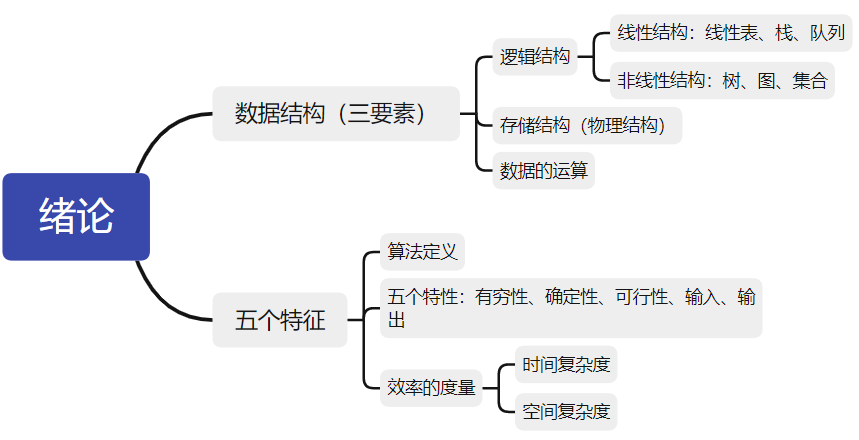
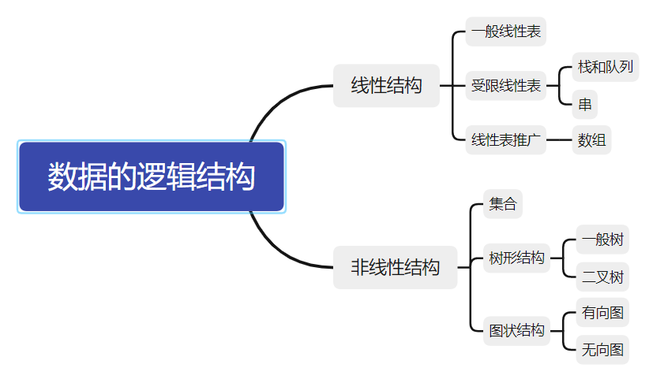

# 绪论

这一章粗略过一下，讲一下重点即可。

知识框架图



## 数据结构的一些概念

【数据】- 信息载体；

【数据项】- 构成数据元素的不可分割的最小单位；

【数据元素】- 数据的基本单位，可由若干数据项组成；

【数据对象】- 具有相同性质的数据元素的集合，是数据的子集；

【数据类型】- 一个值的集合和定义在此集合上的一组操作的总称，包括类型有：1.原子类型 2.结构类型 3.抽象数据类型

【数据结构】- 相互之间存在一种或多种特定关系的数据元素的集合。在任何问题中，数据元素都不是孤立存在的，它们之间存在某种关系，这种数据元素相互之间的关系称为`结构(structure)`。数据结构包括三方面的内容：`1.逻辑结构` `2.存储结构` `3.数据的运算`。

*数据的**逻辑结构和存储结构是密不可分的**，一个算法的**设计**取决于所选定的**逻辑结构**，而算法的**实现**依赖于所采用的**存储结构***

### 数据结构三要素

上面提到了数据结构的三要素，分别是：

- 逻辑结构
- 存储结构
- 数据的运算

#### 逻辑结构

数据元素之间的逻辑关系，从逻辑关系上描述数据。它与数据的存储无关，是独立于计算机的。

逻辑结构分为`线性结构`和`非线性结构`。



#### 存储结构

存储结构是数据结构在计算机中的表示（映像），也称为物理结构。其包括数据元素的表示和关系的表示。存储方式主要有：

- 顺序存储：把**逻辑上相邻**的元素存储在**物理位置相邻**的存储单元中，**元素之间的关系由存储单元的邻接关系来体现**。
  - 优点：可以实现**随机存取**，每个元素占用**最少的存储空间**；
  - 缺点：**只能使用相邻的一整块存储单元**，可能产生较多外部**碎片**；
- 链式存储：**逻辑相邻**的元素在**物理位置上不需要相邻**，借助**指示元素存储地址的指针**来表示元素之间的逻辑关系。
  - 优点：不会出现碎片，**充分利用了所有存储单元**；
  - 缺点：每个元素因**存储指针而占用额外的存储空间**，而且只能实现**顺序存取**；
- 索引存储：在存储元素信息的同时，建立**附加的索引表**，索引表的每一项称为索引项，一般形式是（关键字，地址）。
  - 优点：**检索速度快**；
  - 缺点：附加的**索引表占用而外空间**，**增加**和**删除**也需要**修改索引**；

- 散列存储：根据元素的**关键字**直接计算处该元素的**存储地址**，哈希(Hash)存储。
  - 优点：检索、增加和删除结点操作都很**快**；
  - 缺点：如果**散列函数较差**，可能出现元素**存储单元冲突**；

#### 数据的运算

包括：

- 运算的定义：针对逻辑结构，说明运算的功能；
- 运算的实现：针对存储结构，指出运算的具体操作步骤；

## 算法和算法评价

### 基本概念

五个重要性：

- 有穷性
- 确定性
- 可行性
- 输入
- 输出

好的算法还要考虑以下目标：

- 正确性
- 可读性
- 健壮性
- 效率与低存储量需求

### 算法效率的度量

- 时间复杂度
- 空间复杂度

#### 时间复杂度

一个语句的**频度** 指的是 该语句在算法中**被重复执行的次数**。

算法中所有语句的频度之和记为 $T{(n)}$ ，它是该算法问题规模 $n$ 的函数。

时间复杂度主要分析 $T{(n)}$ 的数量级。基本运算的频度 $f{(n)}$（最深层循环内的语句的频度）与 $T{(n)}$ 有相同数量级。取 $f{(n)}$ 中随 $n$ 增长最快的项，将其系数置为 $1$ 作为时间复杂度的度量。例如， $f{(n)}=an^3+bn^2+cn$ 的复杂度为$O{(n^3)}$ 。

记为：
$$
T{(n)}=O(f{(n)})
$$
$O$ 的含义是 $T(n)$ 的数量级，严格的数学定义是：若 $T(n)$ 和 $f(n)$ 是定义在正整数集合上的两个函数，则存在正常数 $C$ 和 $n_{0}$，使得当 $n \geq n_0$ 时，都满足 $0 \leq T(n) \leq Cf(n)$。

时间复杂度还取决于输入数据的性质，如：

对于数组`arr[0...n-1]`，查找给定值`k`的算法大致为：

```
i=n-1;
while(i>=0&&(arr[i]!=k))
	i--;
return i;
```

存在两种情况：

- 若arr中没有等于`k`的元素，则语句`i--;`的频度是 $f(n)=n$ ；
- 若arr中最后一个元素就等于`k`，则语句`i--;`的频度是 $0$ ;

**一般总是考虑在最坏情况下的时间复杂度**，以保证算法的运行时间不会比之更长。

在分析一个程序的时间复杂度时，有以下两个规则：

- 加法规则
  $$
  T(n)=T_1(n)+T_2(n)=O(f(n))+O(g(n))=O(max(f(n),g(n)))
  $$
  

  即：当两个频度的语句处于同一层时，该层的时间复杂度等于频度更大的语句的频度。

- 乘法规则
  $$
  T(n)=T_1(n) \times T_2(n)=O(f(n)) \times O(g(n))=O(f(n) \times g(n))
  $$
  即：当两个频度的语句进行嵌套时，其整体的时间复杂度等于嵌套各层的语句频度相乘。

##### 时间复杂度比较

$O(1)<O(log_2n)<O(n)<O(nlog_2n)<O(n^2)<O(n^3)<O(2^n)<O(n!)<O(n^n)$

#### 空间复杂度

$S(n)$ 定义为该算法所耗费的存储空间，是问题规模 $n$ 的函数，记为：
$$
S(n)=O(g(n))
$$
一个程序在执行时除需要存储空间来存放**本身所用的指令**、**常数**、**变量**和**输入数据**外，还需要一些对数据进行操作的**工作单元**和存储一些为实现**计算所需信息的辅助空间**。若输入数据所占空间只取决于问题本身，和算法无关，则**只需分析除输入和程序之外的额外空间**。

算法**原地工作**指的是算法所需的**辅助空间为常量**，即 $O(1)$ 。

## 归纳总结

分析程序的时间复杂度是重点。

- 循环主题中的变量**参与**循环条件的判断

  此类型的题目应该找出主体语句中于 $T(n)$ 成正比的循环变量，将之代入条件中进行计算。例如：

  ```c
  // sample 1
  int i=1;
  while(i<=n)
  	i=i*2
  ```

  在这个例子中，`i*2` 的次数正是主体语句执行次数 $t$ ，因此执行 $t$ 次后，有 $2^t \leq n$ ，取对数后可以得到 $t \leq log_2n$ ，即为 $T(n)=O(log_2n)$ 。

  又例如：

  ```c
  // sample 2
  int y=5;
  while((y+1)*(y+1)<n)
      y=y+1;
  ```

  在这个例子中，`y+1` 的次数恰好与 $T(n)$ 成正比。

  记 $t$ 为该程序执行次数。

  1. 执行 $t$ 次后，先计算循环体里的语句：
     $$
     y=y_0+t=5+t
     $$
     
2. 然后将 $y$ 代入循环条件得到：
     $$
     (t+5+1) \times (t+5+1) < n
     $$
     即为：
     $$
     t<\sqrt n -6
     $$
     
  3. 即 $T(n)=O(\sqrt n)$ 

- 循环主题中的变量**不参与**循环条件的判断

  采用 **数学归纳法** 或 **直接累计循环次数**。

  **多层循环时，从内到外分析，忽略单步语句、条件判断语句，只关注主体语句的执行次数**。

  又可分为递归程序和非递归程序：

  - 递归程序是用公式递推，例子如下：

    ```c
    int fact(int n){
    	if(n<=1)
            return 1;
        return n * fact(n-1);
    }
    ```

    递推为：

    
    $$
    \begin{equation*}
    	\begin{split}
    	T(n)
    	& =1+T(n-1)\\
    	& =1+1+T(n-2)\\
    	& =\space ...\\
    	& =n-1+T(1)\\
    	& =n
    	\end{split}
    \end{equation*}
    $$
    最终可以得到 $T(n)=O(n)$ 

  - 非递归程序可以直接累计次数。


