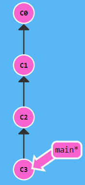

# learngitbranching.js.org

偶然发现一个学习git的[游戏网站](learngitbranching.js.org)。

## Git Local

### Git Commit


```
$ git commit
$ git commit
```

结果为：



### Git Branch


```
$ git branch bugFix
$ git checkout bugFix
```

结果为：


### Git Merge

```
$ git branch bugFix
$ git checkout bugFix
$ git commit
$ git checkout main
$ git commit
$ git merge bugFix
```


### Git Rebase


```
$ git branch bugFix
$ git checkout bugFix
$ git commit
$ git checkout main
$ git commit
$ git checkout bugFix
$ git rebase main
```

结果为：


### 分离 head

> HEAD 是一个对当前检出记录的符号引用 —— 也就是指向你正在其基础上进行工作的提交记录。
>
> HEAD 总是指向当前分支上最近一次提交记录。大多数修改提交树的 Git 命令都是从改变 HEAD 的指向开始的。
>
> HEAD 通常情况下是指向分支名的（如 bugFix）。在你提交时，改变了 bugFix 的状态，这一变化通过 HEAD 变得可见。

通过使用`git checkout <记录>`来分离HEAD，将其从指向分支名，变为指向一个提交记录

### 相对引用 ^

使用`^`先上移动一个提交记录，使用`~<num>`来向上移动多个记录，如：

```
git checkout main^
```

同样可以对分离出来的HEAD进行操作。

```
$ git checkout C4
$ git checkout HEAD^
```

### 相对引用 ~

可以使用

```
git branch -f <分支名> <记录>
```

来进行强制指向。

使用`~<num>`来向上移动多个记录，如：

```
git checkout bugFix~2
```

### 撤销

`git reset HEAD^`，可以将本次记录移除，并跳到上一次的提交记录，通常用于本地；

`git revert <xx>`则用于需要进行更改，会新增一个提交记录（该记录与上上个记录先相同），旧记录仍保存，如：

对于`C0->C1->C2`而言，当在`C2`处使用`git revert`后，将变为`C0->C1->C2->C2'`，而此时，`C2'`和`C1`的提交内容是一致的，`C2`并不会被移除，通常用于远程。

### Git Cherry-pick

```
git cherry-pick <提交号>...
```

如果你想将一些提交复制到当前所在的位置（`HEAD`）下面的话， Cherry-pick 是最直接的方式了。

```
git cherry-pick C2 C4
```

复制记录提交到当前指针下。

### 交互式 rebase

交互式 rebase 指的是使用带参数 `--interactive` 的 rebase 命令, 简写为 `-i`

如果你在命令后增加了这个选项, Git 会打开一个 UI 界面并列出将要被复制到目标分支的备选提交记录，它还会显示每个提交记录的哈希值和提交说明，提交说明有助于你理解这个提交进行了哪些更改。

当 rebase UI界面打开时, 能做3件事:

- 调整提交记录的顺序（通过鼠标拖放来完成）
- 删除你不想要的提交（通过切换 `pick` 的状态来完成，关闭就意味着你不想要这个提交记录）
- 合并提交。 遗憾的是由于某种逻辑的原因，我们的课程不支持此功能，因此我不会详细介绍这个操作。简而言之，它允许你把多个提交记录合并成一个。

如：

```
git rebase -i HEAD~4
```

将指针上的四个记录进行交互式更改。

### 只取一个提交

我正在解决某个特别棘手的 Bug，为了便于调试而在代码中添加了一些调试命令并向控制台打印了一些信息。

这些调试和打印语句都在它们各自的提交记录里。最后我终于找到了造成这个 Bug 的根本原因，解决掉以后觉得沾沾自喜！

最后就差把 `bugFix` 分支里的工作合并回 `main` 分支了。你可以选择通过 fast-forward 快速合并到 `main` 分支上，但这样的话 `main` 分支就会包含我这些调试语句了。

实际我们只要让 Git 复制解决问题的那一个提交记录就可以了。跟之前我们在“整理提交记录”中学到的一样，我们可以使用

- `git rebase -i`
- `git cherry-pick`

来达到目的。

### 提交的技巧1

你之前在 `newImage` 分支上进行了一次提交，然后又基于它创建了 `caption` 分支，然后又提交了一次。

此时你想对某个以前的提交记录进行一些小小的调整。比如设计师想修改一下 `newImage` 中图片的分辨率，尽管那个提交记录并不是最新的了。

我们可以通过下面的方法来克服困难：

- 先用 `git rebase -i` 将提交重新排序，然后把我们想要修改的提交记录挪到最前
- 然后用 `git commit --amend` 来进行一些小修改
- 接着再用 `git rebase -i` 来将他们调回原来的顺序
- 最后我们把 main 移到修改的最前端（用你自己喜欢的方法），就大功告成啦！

当然完成这个任务的方法不止上面提到的一种（我知道你在看 cherry-pick 啦），之后我们会多点关注这些技巧啦，但现在暂时只专注上面这种方法。 最后有必要说明一下目标状态中的那几个`'` —— 我们把这个提交移动了两次，每移动一次会产生一个 `'`；而 C2 上多出来的那个是我们在使用了 amend 参数提交时产生的，所以最终结果就是这样了。

也就是说，我在对比结果的时候只会对比提交树的结构，对于 `'` 的数量上的不同，并不纳入对比范围内。

### 提交的技巧2

使用`git cherry-pick`可以任意复制某一个符合条件的记录

### Git Tags

Tags可以（在某种程度上 —— 因为标签可以被删除后重新在另外一个位置创建同名的标签）永久地将某个特定的提交命名为里程碑，然后就可以像分支一样引用了。

例如，我们将这个标签命名为 `v1`，并且明确地让它指向提交记录 `C1`，如果你不指定提交记录，Git 会用 `HEAD` 所指向的位置。

```
git tag v1 C1
```

### Git Describe

由于标签在代码库中起着“锚点”的作用，Git 还为此专门设计了一个命令用来**描述**离你最近的锚点（也就是标签），它就是 `git describe`！

Git Describe 能帮你在提交历史中移动了多次以后找到方向；当你用 `git bisect`（一个查找产生 Bug 的提交记录的指令）找到某个提交记录时，或者是当你坐在你那刚刚度假回来的同事的电脑前时， 可能会用到这个命令。

`git describe` 的语法是：

```
git describe <ref>
```

`<ref>` 可以是任何能被 Git 识别成提交记录的引用，如果你没有指定的话，Git 会以你目前所检出的位置（`HEAD`）。

它输出的结果是这样的：

```
<tag>_<numCommits>_g<hash>
```

`tag` 表示的是离 `ref` 最近的标签， `numCommits` 是表示这个 `ref` 与 `tag` 相差有多少个提交记录， `hash` 表示的是你所给定的 `ref` 所表示的提交记录哈希值的前几位。

当 `ref` 提交记录上有某个标签时，则只输出标签名称。

## Git Remote

### Git Clone

```
git clone
```

### 远程分支

在我们的本地仓库多了一个名为 `o/main` 的分支, 这种类型的分支就叫**远程**分支。由于远程分支的特性导致其拥有一些特殊属性。

远程分支反映了远程仓库(在你上次和它通信时)的**状态**。这会有助于你理解本地的工作与公共工作的差别 —— 这是你与别人分享工作成果前至关重要的一步.

远程分支有一个特别的属性，在你检出时自动进入分离 HEAD 状态。Git 这么做是出于不能直接在这些分支上进行操作的原因, 你必须在别的地方完成你的工作, （更新了远程分支之后）再用远程分享你的工作成果。

你可能想问这些远程分支的前面的 `o/` 是什么意思呢？好吧, 远程分支有一个命名规范 —— 它们的格式是:

- `<remote name>/<branch name>`

因此，如果你看到一个名为 `o/main` 的分支，那么这个分支就叫 `main`，远程仓库的名称就是 `o`。

大多数的开发人员会将它们主要的远程仓库命名为 `origin`，并不是 `o`。这是因为当你用 `git clone` 某个仓库时，Git 已经帮你把远程仓库的名称设置为 `origin` 了

不过 `origin` 对于我们的 UI 来说太长了，因此不得不使用简写 `o` :) 但是要记住, 当你使用真正的 Git 时, 你的远程仓库默认为 `origin`!

在执行了下列命令后，

```
git checkout o/main; git commit 
```

Git 变成了分离 HEAD 状态，当添加新的提交时 `o/main` 也不会更新。这是因为 `o/main` 只有在远程仓库中相应的分支更新了以后才会更新。

### Git Fetch

Git 远程仓库相当的操作实际可以归纳为两点：向远程仓库传输数据以及从远程仓库获取数据。既然我们能与远程仓库同步，那么就可以分享任何能被 Git 管理的更新（因此可以分享代码、文件、想法、情书等等）。

本节课我们将学习如何从远程仓库获取数据 —— 命令如其名，它就是 `git fetch`。

你会看到当我们从远程仓库获取数据时, 远程分支也会更新以反映最新的远程仓库。在上一节课程中我们已经提及过这一点了。

`git fetch` 完成了仅有的但是很重要的两步:

- 从远程仓库下载本地仓库中缺失的提交记录
- 更新远程分支指针(如 `o/main`)

`git fetch` 实际上将本地仓库中的远程分支更新成了远程仓库相应分支最新的状态。

如果你还记得上一节课程中我们说过的，远程分支反映了远程仓库在你**最后一次与它通信时**的状态，`git fetch` 就是你与远程仓库通信的方式了！希望我说的够明白了，你已经了解 `git fetch` 与远程分支之间的关系了吧。

`git fetch` 通常通过互联网（使用 `http://` 或 `git://` 协议) 与远程仓库通信

`git fetch` 并不会改变你本地仓库的状态。它不会更新你的 `main` 分支，也不会修改你磁盘上的文件。

理解这一点很重要，因为许多开发人员误以为执行了 `git fetch` 以后，他们本地仓库就与远程仓库同步了。它可能已经将进行这一操作所需的所有数据都下载了下来，但是**并没有**修改你本地的文件。我们在后面的课程中将会讲解能完成该操作的命令 :D

所以, 你可以将 `git fetch` 的理解为单纯的下载操作。

### Git Pull

其实有很多方法的 —— 当远程分支中有新的提交时，你可以像合并本地分支那样来合并远程分支。也就是说就是你可以执行以下命令:

- `git cherry-pick o/main`
- `git rebase o/main`
- `git merge o/main`
- 等等

实际上，由于先抓取更新再合并到本地分支这个流程很常用，因此 Git 提供了一个专门的命令来完成这两个操作。它就是我们要讲的 `git pull`。

```
git pull = git fetch + git merge
```

### Git Push

`git push` 负责将**你的**变更上传到指定的远程仓库，并在远程仓库上合并你的新提交记录。一旦 `git push` 完成, 你的朋友们就可以从这个远程仓库下载你分享的成果了！

你可以将 `git push` 想象成发布你成果的命令。它有许多应用技巧，稍后我们会了解到，但是咱们还是先从基础的开始吧……

*注意 —— `git push` 不带任何参数时的行为与 Git 的一个名为 `push.default` 的配置有关。它的默认值取决于你正使用的 Git 的版本，但是在教程中我们使用的是 `upstream`。 这没什么太大的影响，但是在你的项目中进行推送之前，最好检查一下这个配置。*

### 偏离的提交历史

假设你周一克隆了一个仓库，然后开始研发某个新功能。到周五时，你新功能开发测试完毕，可以发布了。但是 —— 天啊！你的同事这周写了一堆代码，还改了许多你的功能中使用的 API，这些变动会导致你新开发的功能变得不可用。但是他们已经将那些提交推送到远程仓库了，因此你的工作就变成了基于项目**旧版**的代码，与远程仓库最新的代码不匹配了。

这种情况下, `git push` 就不知道该如何操作了。如果你执行 `git push`，Git 应该让远程仓库回到星期一那天的状态吗？还是直接在新代码的基础上添加你的代码，亦或由于你的提交已经过时而直接忽略你的提交？

因为这情况（历史偏离）有许多的不确定性，Git 是不会允许你 `push` 变更的。实际上它会强制你先合并远程最新的代码，然后才能分享你的工作。

我们可以用 `fetch` 和 `rebase` ，来进行调整。

我们还可以使用 `merge`，尽管 `git merge` 不会移动你的工作（它会创建新的合并提交），但是它会告诉 Git 你已经合并了远程仓库的所有变更。这是因为远程分支现在是你本地分支的祖先，也就是说你的提交已经包含了远程分支的所有变化。

前面已经介绍过 `git pull` 就是 fetch 和 merge 的简写，类似的 `git pull --rebase` 就是 fetch 和 rebase 的简写！

### 远程追踪

```
git checkout -b track origin/main
```

即使`git push`，也不会改变本地`main`的指向，因为`track`会代替`main`对`origin/main`进行操作，最后可以将不是`main`的分支推送到远程仓库中的`main`分支。

或者：

```
git branch -u origin/main track
```

### git push的参数

Git 是通过当前检出分支的属性来确定远程仓库以及要 push 的目的地的。这是未指定参数时的行为，我们可以为 push 指定参数，语法是：

```
git push <remote> <place>
```

`<place>` 参数是什么意思呢？我们稍后会深入其中的细节, 先看看例子, 这个命令是:

```
git push origin main
```

把这个命令翻译过来就是：

*切到本地仓库中的“main”分支，获取所有的提交，再到远程仓库“origin”中找到“main”分支，将远程仓库中没有的提交记录都添加上去，搞定之后告诉我。*

我们通过“place”参数来告诉 Git 提交记录来自于 main, 要推送到远程仓库中的 main。它实际就是要同步的两个仓库的位置。

需要注意的是，因为我们通过指定参数告诉了 Git 所有它需要的信息, 所以它就忽略了我们所检出的分支的属性！

你可能想问 —— 如果来源和去向分支的名称不同呢？比如你想把本地的 `foo` 分支推送到远程仓库中的 `bar` 分支。

要同时为源和目的地指定 `<place>` 的话，只需要用冒号 `:` 将二者连起来就可以了：

```
git push origin <source>:<destination>
```

这个参数实际的值是个 refspec，“refspec” 是一个自造的词，意思是 Git 能识别的位置（比如分支 `foo` 或者 `HEAD~1`）

### git fetch的参数

如果你像如下命令这样为 git fetch 设置 的话：

```
git fetch origin foo
```

Git 会到远程仓库的 `foo` 分支上，然后获取所有本地不存在的提交，放到本地的 `o/foo` 上。

如果你觉得直接更新本地分支很爽，那你就用冒号分隔的 refspec 吧。不过，你不能在当前检出的分支上干这个事，但是其它分支是可以的。

这里有一点是需要注意的 —— `source` 现在指的是远程仓库中的位置，而 `<destination>` 才是要放置提交的本地仓库的位置。它与 git push 刚好相反，这是可以讲的通的，因为我们在往相反的方向传送数据。

理论上虽然行的通，但开发人员很少这么做。我在这里介绍它主要是为了从概念上说明 `fetch` 和 `push` 的相似性，只是方向相反罢了。

### 古怪的source

Git 有两种关于 `<source>` 的用法是比较诡异的，即你可以在 git push 或 git fetch 时不指定任何 `source`，方法就是仅保留冒号和 destination 部分，source 部分留空。

- `git push origin :side` - 删除分支
- `git fetch origin :bugFix` - 本地新建分支

