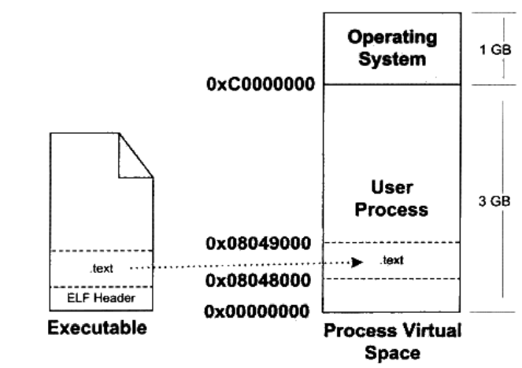
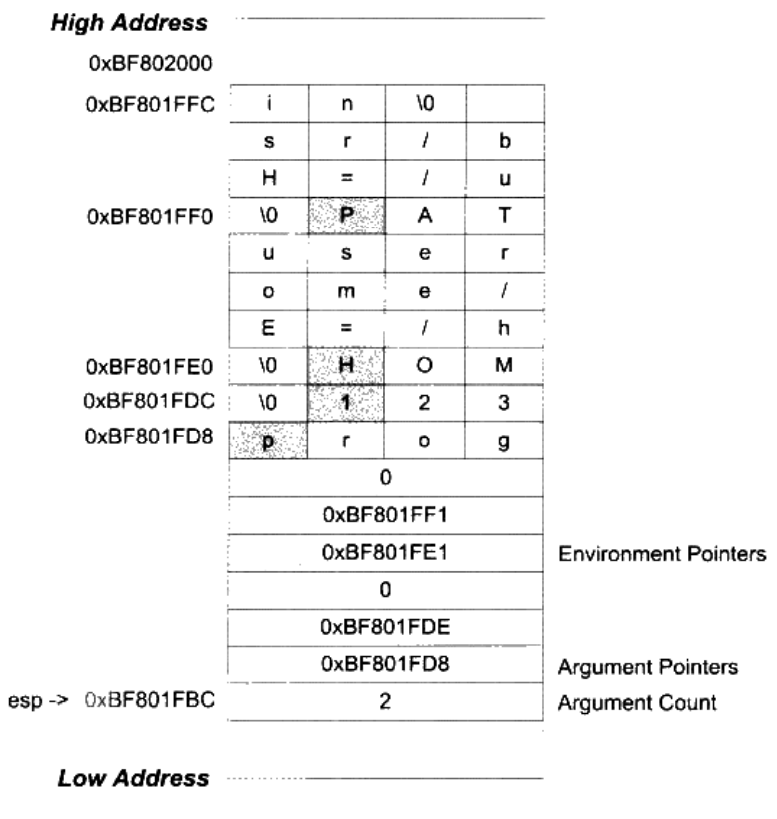

# Load

## 程序和进程

程序是静态的可执行文件，进程是动态的运行过程；

每个程序运行起来后，即进程，都拥有自己独立的虚拟地址空间；

其中一部分是操作系统内核空间，另一部分是抽象的独立的进程空间；

## 程序员角度的装载

程序执行和数据必须在内存中才能被CPU运行；

动态装入，程序最常用的部分驻留与内存中，不常用的数据置于磁盘中；

### 覆盖装入

共享则相互覆盖--树型调用

### 页映射

分成若干页，装载和操作的单位是页，一般4KB；

用到哪一页就装入，考虑算法

1. FIFO（先进先出）
2. LUR（使用频率）

## 操作系统角度的装载

### 进程建立

1. 创建一个独立虚拟地址空间，实际上是创建页映射函数，映射到物理地址

2. 读取可执行文件的文件头，建立与地址空间的映射关系，这里的粒度`0x1000 = 4096 bytes = 4KB`

   这样的映射关系实际上只保存在一个数据结构中；

   

3. 指令寄存器设置为可执行文件的入口地址，即`ELF header`中保存的入口地址，启动运行

   此时，控制权转交给了进程，涉及到了用户态和内核态的切换，CPU权限的切换；；

### 页错误

完成上面三个步骤后，指令和数据还没有被载入内存，只是完成了载入的映射关系，相当于把路打通了，但是还没有开始通车；

CPU打算执行这个内存空间后，发现`0x08048000-0x08049000`根本就是空页面，于是就会触发页错误（page fault），将控制权转交给操作系统，启用专门的处理历程；

操作系统将查询映射时建立的数据结构，找到对应的空页面地址，计算相应页面在可执行文件中的偏移，然后在物理内存中分配物理页面，将进程中该虚拟页与分配的物理页建立映射关系，然后将控制权交给进程，从页错误中断处继续执行；

同样，操作系统将会不断地根据页错误来分配物理页面，因为物理空间并非无穷大，所以涉及到内存管理的问题；

## 进程虚拟空间分布

### Segment和Section

合并权限相同的段，以段权限为划分装载，此时就可以将权限段看做一个`Segment`，因此可以说，一个`Segment`可能包含多个`section`，他们的权限相同；

又可以说，Segment是从装载的角度看，而ELF文件是以Section来存储的；

```
readelf -l sample.elf
```

可以查看可执行文件段与虚拟空间的映射关系；

所以Segment是装载角度，而Section是链接角度

### Stack和Heap

进程执行时还需要堆栈的支持；

通常情况下，可以用一下命令查看进程的内存空间分布；

```
./sample.elf &
[1] 6666                 // 进程pid
cat /proc/6666/maps
```

将显示的是，进程的虚拟空间范围，可执行权限，Segment在文件中的偏移，设备主号和次设备号，映像文件的节点号，以及文件路径；

堆栈、vdso的设备号、节点号为0，表示没有映射文件，是匿名虚拟内存区域；

vdso位于内核区域，是内核的一个模块，进程通过访问这个虚拟内存区域与内核进行一些通信；

do_brk将.bss剩余部分放在堆区；

### heap申请最大空间的问题

堆空间受多种因素影响，并不能完全利用；

### 段地址对齐

以Segment分，每一页0x1000大小，会存在页内碎片；

通过物理地址映射两份到虚拟地址，实现段合并，来减少碎片产生，此时物理页面可能包含多个section，而映射后虚拟地址也不是页面长度的整数倍；

同时要解决段地址对齐的问题，对于任何一个可装载的Segment而言：

p_vaddr / 对齐属性的余数 = p_offset / 对齐属性的余数

### 进程栈初始化

进程运行环境需要栈支持，需要在进程开始前对栈进行初始化；

假设系统中有两个环境变量：

```
HOME=/home/user
PATH=/usr/bin
```

假设可执行文件为exec，运行命令：

```
exec 123
```

那么初始化的栈是：



esp指向栈顶，一个bytes表示命令行参数的数量，然后是两个参数的指针，指向`exec`和`123`的地址，后面是两个环境变量指针，指向两个环境变量；

进程启动后，程序库部分把栈信息的参数传递给main，也就是`argc`和`argv`，对应参数数量和字符串指针数组；

## 内核装载ELF

在bash下执行一个程序，其过程是什么？

### 用户层

bash进程会调用fork系统调用，创建一个新的进程，然后新的进程调用`execve()`系统调用执行指定的ELF文件；

原先的bash进程继续返回等待刚才启动的新进程的结束，然后等待用户输入命令；

在进入`execve()`系统调用后，内核才开始真正的装载工作；

### 内核层

`execve()`的入口是`sys_execve()`，在`arch/i386/kernel/Process.c`中定义；

其进行参数的检查和复制之后，会调用`do_execve()`函数，查找被执行的文件是否存在，如果存在，则先读取前128字节，调用`search_binary_handle()`去搜索和匹配合适的可执行文件装载处理过程，如果搜索到了对应的处理过程，如ELF文件，就会调用`load_elf_binary()`进行装载；

`load_elf_binary()`的主要步骤有：

1. 检查ELF文件格式有效性；
2. 寻找动态链接`.interp`段，设置动态链接路径；
3. 根据elf header对文件进行映射；
4. 初始化ELF进程环境，比如进程启动的EDX寄存器的地址应该是`DT_FINI`的地址；
5. 将系统调用的返回地址修改为ELF可执行文件的入口地址，该入口取决于链接方式，如果是动态链接，那么入口地址是动态链接器；

`load_elf_binary()`执行完毕后，返回到`do_execve()`再返回到`sys_execve()`；

当内核态返回到用户态的时候，及系统调用结束并返回，则返回到了入口地址处，新的程序继续执行，可执行文件被加载；

## PE文件装载

- 读取文件第一个页，第一个页中有DOS头，PE文件头和段表；
- 检查进程空间是否可用，不可用另选一个装载地址（主要针对DLL，因为可执行文件一般都是第一个装载的模块）
- 使用段表提供的信息，将所有段进行映射；
- 如果装载地址不是目标地址，则进行rebasing；
- 装载所有DLL文件；
- 对所有导入符号进行解析；
- 根据PE头指定的参数，建立初始化堆栈；
- 建立主线程并启动进程；
