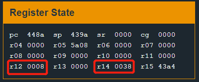
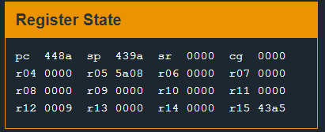
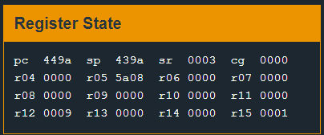
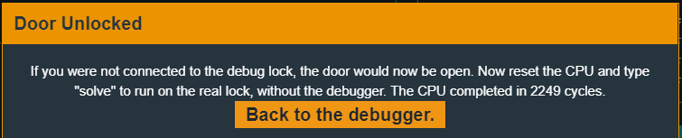

# Tutorial

第一关，试试水。

看汇编代码可以看到是一个密码检测的程序，关键代码如下：

```
4484 <check_password>
4484:  6e4f           mov.b	@r15, r14
4486:  1f53           inc	r15
4488:  1c53           inc	r12
448a:  0e93           tst	r14
448c:  fb23           jnz	#0x4484 <check_password+0x0>
448e:  3c90 0900      cmp	#0x9, r12
4492:  0224           jeq	#0x4498 <check_password+0x14>
4494:  0f43           clr	r15
4496:  3041           ret
4498:  1f43           mov	#0x1, r15
449a:  3041           ret
```

而在main函数中，有如下的条件判断：

```
4450:  0f93           tst	r15
4452:  0520           jnz	#0x445e <main+0x26>
4454:  3f40 c744      mov	#0x44c7 "Invalid password; try again.", r15
4458:  b012 5845      call	#0x4558 <puts>
445c:  063c           jmp	#0x446a <main+0x32>
445e:  3f40 e444      mov	#0x44e4 "Access Granted!", r15
4462:  b012 5845      call	#0x4558 <puts>
4466:  b012 9c44      call	#0x449c <unlock_door>
```

可以看到，`cmp #0x9, r12`是关键，如果符合条件则会跳转到0x4498，使得r15寄存器的值为1，在进行`tst r15`时，结果非零则会跳转到0x445e实现破解，否则程序会输出`Invalid password; try again.`；

那么如何让r12寄存器的值为0x9呢？

这里注意到每次执行`inc r12`会使得r12寄存器的值加1，而这个循环的操作基于对r14寄存器的判断，如下：

```
4484 <check_password>
4484:  6e4f           mov.b	@r15, r14
4486:  1f53           inc	r15
4488:  1c53           inc	r12
448a:  0e93           tst	r14
448c:  fb23           jnz	#0x4484 <check_password+0x0>
```

如果r14非零，则会重新回到0x4484位置继续执行，经过观察可以知道，r15的值是栈的地址，这里取栈上的值（输入的密码）放到r14中，因此r14中存放的是输入密码的每一个字符的ASCII值，所以为了让r12的值为9，需要循环9次，即输入8位密码，最后一次循环后`r12+1=9`，而r14寄存器值为0，跳出了循环，同时后面对r12的检测也能通过。



<div align="center">倒数第二次循环，r14寄存器中存放的'8'的ASCII码'38'</div>



<div align="center">最后一次循环，r14寄存器中为0，即将跳出循环，而r12+1=9</div>



<div align="center">跳转后r15=1，满足后面tst r15的jne条件判断</div>


