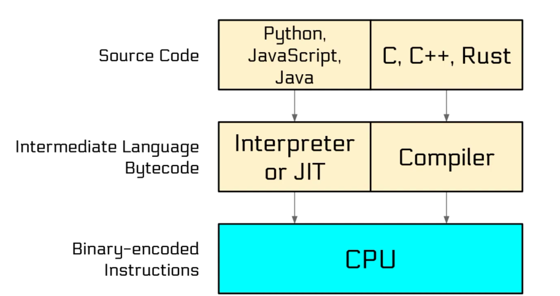
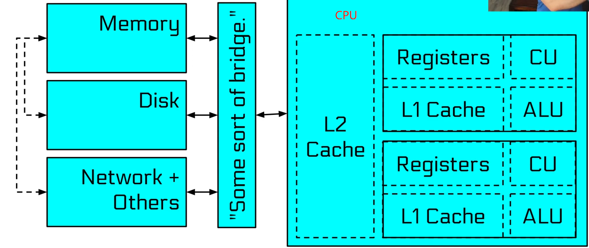

# Getting Start

## What is Computer Systems Security

A chain is only as strong as its weakest link.	--木桶效应

Complex modern computer -> with great complexity comes great vulnerability

Hackers:

- Reconnaissance
  - Little network-facing infrastructure
  - Low public profile
  - Professional external security practices
- Gaining a foothold
  - A target
- Internal reconnaissance
  - passive network listening
  - careful, slow active network scanning
- Gaining influence in the network

- Total compromise
- Gloating

What went wrong?

- Vulnerable network-facing infrastructure(but what could they have done?)

- Physical security system without digital security.

- Failure to isolate backup storage system.

- Continued use of stale password on mailserver(and probaby others) .

- Every-day user accounts that had Domain Administrator privileges.

- Known vulnerability in monitoring system.

- Link between production and development systems(probably necessary)

- Password reuse.

- Lack of two-factor authentication.

## Computer Architecture

All roads lead to the CPU

深入到CPU中，其最本质的运算即为逻辑运算，这涉及到数电中提到的逻辑门，通过巧妙的结合这些逻辑门可以实现不同的逻辑功能，例如加法器等等。通过逻辑门复杂组合实现不同的功能，从更高角度看就构成了CPU、内存、磁盘等等器件的不同的功能。

计组里所讲的计算机内部结构

