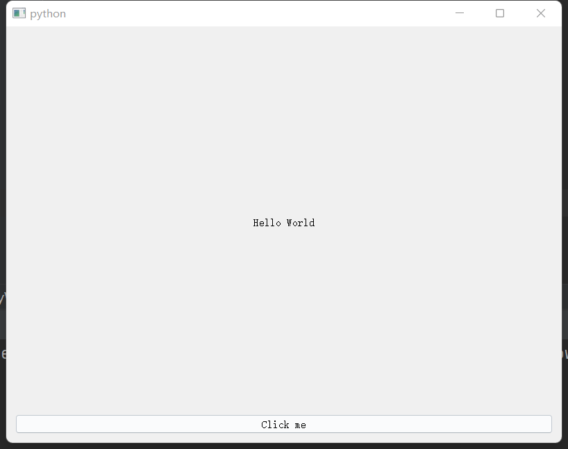

首先安装pyside2，目前pyside2还不支持python3.11，所以下载了python3.10。

```bash
pip install pyside2
```

直接看代码吧，也可以直接用QT Designer来做。

```python
import sys
import random
from PySide2 import QtCore, QtWidgets, QtGui

class MyWidget(QtWidgets.QWidget):
    def __init__(self):
        super().__init__()

        self.hello = ["Hello World", "你好，世界","Hallo Welt", "Hei maailma", "Hola Mundo", "Привет мир"]
        self.button = QtWidgets.QPushButton("Click me!")
        self.text = QtWidgets.QLabel("Hello World",
                                     alignment=QtCore.Qt.AlignCenter)

        self.layout = QtWidgets.QVBoxLayout()
        self.layout.addWidget(self.text)
        self.layout.addWidget(self.button)
        self.setLayout(self.layout)

        self.button.clicked.connect(self.magic)

    @QtCore.Slot()
    def magic(self):
        self.text.setText(random.choice(self.hello))    # 随机选择hello数组里的元素

if __name__ == "__main__":
    app = QtWidgets.QApplication([])

    widget = MyWidget()
    widget.resize(800, 600)
    widget.show()

    sys.exit(app.exec_())
```


