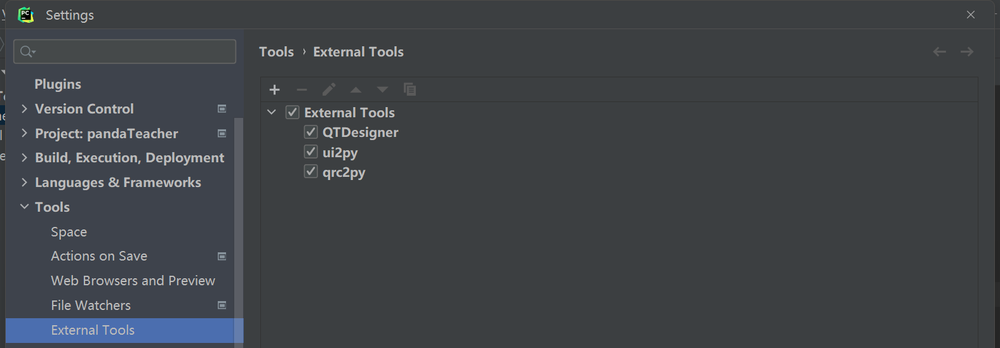
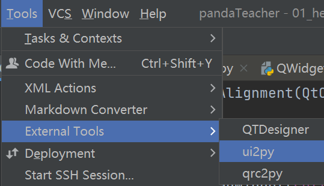

# 概览

使用QtDesigner结合PySide2的编程方法。主要分为三个步骤：

1. 打开QtDesigner绘制窗口；
2. 将UI文件转换为py文件供主程序调用；
3. 主窗口全局初始化。

将外部工具引入到pycharm



- QTDesigner:
  - Name: QTDesigner
  - Program: 【项目环境地址】\Lib\site-packages\PySide2\designer.exe
  - Working directory: \$ProjectFileDir$
- ui2py:
  - Name: ui2py
  - Program: 【项目环境地址】\Scripts\pyside2-rcc.exe
  - Arguments: \$FileName\$ -o \$FileNameWithoutExtension$_rc.py
  - Working directory: \$FileDir$
- qrc2py:
  - Name: qrc2py
  - Program: 【项目环境地址】\venv\Scripts\pyside2-uic.exe
  - Arguments: -o \$FileNameWithoutExtension\$_ui.py \$FileName$
  - Working directory: \$FileDir$



可以看到已经引入了外部的工具。

# QtDesigner

打开QTDesigner，按照上一章的布局设置窗口，并保存为`helloworld.ui`。

并将其转换为python文件。

```
pyside2-uic [UI文件名].ui > ui_mainwindow.py
```

或者选中`helloworld.ui`，用之前配置好的external tool里的qrc2py来生成python文件。
