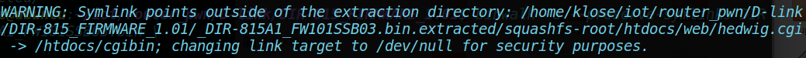
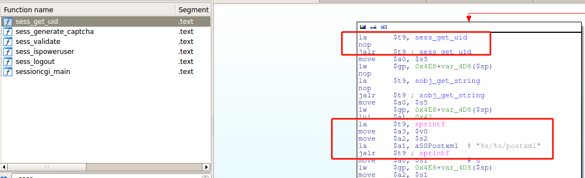
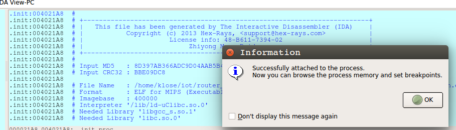
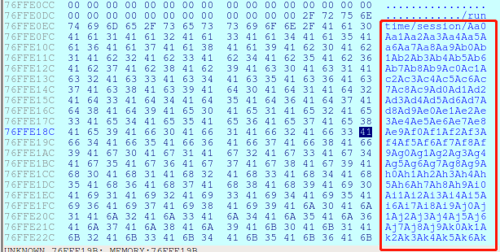
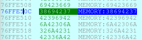
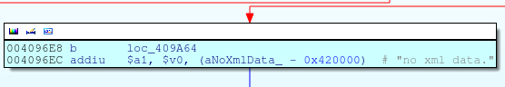
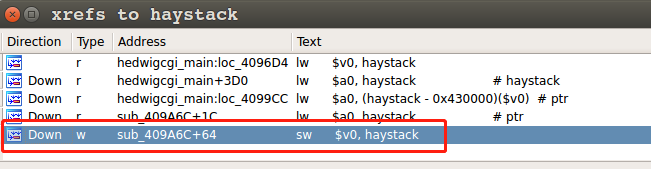
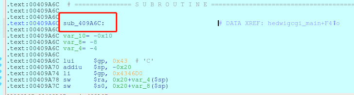
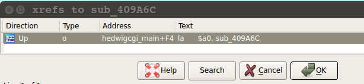

# D-LInk DIR-815路由器多次溢出漏洞分析

## 漏洞简介

从exploit-db所公布的POC和漏洞公告中，可以知道漏洞存在于名为"hedwig.cgi"的CGI脚本那种，未认证攻击者通过调用这个CGI脚本传递一个超长的Cookie，使得程序堆栈溢出，从而获得路由器远程控制权限；

可能影响的路由器有：D-Link DIR-815、DIR-300、DIR-600、DIR-645；

## 分析

固件下载：

### 固件提取

```
binwalk -e --preserve-symlinks DIR-815A1_FW101SSB03.bin
```

这里之所以与书上不同(--preserve-symlinks)，是因为没有这个选项的话，解压出的固件文件夹里的文件会处于安全考虑链接到/dev/null，置空，会严重影响后面的调试，如图。



可以找到处于`_DIR-815A1_FW101SSB03.bin.extracted/squashfs-root/htdocs/web/`文件夹中的`hedwig.cgi`，其指向了`_DIR-815A1_FW101SSB03.bin.extracted/squashfs-root/htdocs/`中的`cgibin`；

### 配置文件

将`qemu-mipsel-static`移动到当前文件夹(_DIR-815A1_FW101SSB03.bin.extracted/squashfs-root)；

```
cp $(which qemu-mipsel-static) .
```

如果不是qemu-mipsel-static还需要用ldd查看相关依赖，然后把依赖复制到各自指定的位置；

配置调试脚本；

```bash
#!/bin/bash
# tool.sh
TEST=$(python -c "print 'uid=' + open('content','r').read(2000)")
# TEST=$(python -c "print 'uid=' + 'A' * ? + 'B' * 4")
# TEST=$(python -c "print 'uid=' + open('exploit','r').read()")
LEN=$(echo -n "$TEST" | wc -c)
PORT="6666"
sudo chroot . ./qemu-mipsel-static -E CONTENT_LENGTH=$LEN -E CONTENT_TYPE="appliaction/x-www-form-urlencoded" -E REQUEST_METHOD="POST" -E HTTP_COOKIE=$TEST -E REQUEST_URI="/hedwig.cgi" -E REMOTE_ADDR="127.0.0.1" -g $PORT /htdocs/web/hedwig.cgi 
echo "[+] END"
```

通过exploit-db获知，漏洞产生的原因是由于Cookie的值超出了长度，通过`char *getenv("HTTP_COOKIE")`在CGI脚本中获取用户输入的Cookie值，因此需要搜索该字符串，并且定位出现问题的代码地址；



通过搜索后可以看到，`sess_get_uid`函数引用了该字符串，找到了函数被调用的地址，下面还有`sprintf`危险函数的存在；

在`0x00409680`的`jalr $t9`处下断点，此时还未进入sprintf函数；

### 调试

使用脚本patternLocOffset.py生成数据文件content；

```python
# coding:utf-8
'''
生成定位字符串：轮子直接使用
'''
 
import argparse
import struct
import binascii
import string
import sys
import re
import time
a ="ABCDEFGHIJKLMNOPQRSTUVWXYZ"
b ="abcdefghijklmnopqrstuvwxyz"
c = "0123456789"
def generate(count,output):
    # pattern create
    codeStr =''
    print '[*] Create pattern string contains %d characters'%count
    timeStart = time.time()
    for i in range(0,count):
        codeStr += a[i/(26*10)] + b[(i%(26*10))/10] + c[i%(26*10)%10]
    print 'ok!'
    if output:
        print '[+] output to %s'%output
        fw = open(output,'w')
        fw.write(codeStr)
        fw.close()
        print 'ok!'
    else:
        return codeStr
    print "[+] take time: %.4f s"%(time.time()-timeStart)
 
def patternMatch(searchCode, length=1024):
 
   # pattern search
   offset = 0
   pattern = None
 
   timeStart = time.time()
   is0xHex = re.match('^0x[0-9a-fA-F]{8}',searchCode)
   isHex = re.match('^[0-9a-fA-F]{8}',searchCode)
 
   if is0xHex:
       #0x41613141
       pattern = binascii.a2b_hex(searchCode[2:])
   elif isHex:
       pattern = binascii.a2b_hex(searchCode)
   else:
       print  '[-] seach Pattern eg:0x41613141'
       sys.exit(1)
 
   source = generate(length,None)
   offset = source.find(pattern)
 
   if offset != -1: # MBS
       print "[*] Exact match at offset %d" % offset
   else:
       print
       "[*] No exact matches, looking for likely candidates..."
       reverse = list(pattern)
       reverse.reverse()
       pattern = "".join(reverse)
       offset = source.find(pattern)
 
       if offset != -1:
           print "[+] Possible match at offset %d (adjusted another-endian)" % offset
 
   print "[+] take time: %.4f s" % (time.time() - timeStart)
 
def mian():
   '''
   parse argument
   '''
   parser = argparse.ArgumentParser()
   parser.add_argument('-s', '--search', help='search for pattern')
   parser.add_argument('-c', '--create', help='create a pattern',action='store_true')
   parser.add_argument('-f','--file',help='output file name',default='patternShell.txt')
   parser.add_argument('-l', '--length', help='length of pattern code',type=int, default=1024)
   args = parser.parse_args()
   '''
   save all argument
   '''
   length= args.length
   output = args.file
   createCode = args.create
   searchCode = args.search
 
   if createCode and (0 <args.length <= 26*26*10):
       generate(length,output)
   elif searchCode and (0 <args.length <=26*26*10):
       patternMatch(searchCode,length)
   else:
       print '[-] You shoud chices from [-c -s]'
       print '[-] Pattern length must be less than 6760'
       print 'more help: pattern.py -h'
 
if __name__ == "__main__":
   if __name__ == '__main__':
       mian()
```

生成content文本文件；

```
python patternLocOffset.py -c -l 2000 -f content
```

执行脚本

```
sudo ./root.sh
```

然后在ida中attach process；



运行程序到达断点处，步进观察栈上输入进去的数据，并找到存储$RA寄存器的指令；




可以看到栈上输入的数据，以及存储$RA的地址；

```
.text:00409A28 lw      $ra, 0x4E8+var_4($sp)
```

根据调试信息，可以知道对应的地址是0x76FFE50C，在运行程序后，被溢出的数据修改为：0x38694237



使用脚本patternLocOffset.py来匹配对应的字符串；

```
python patternLocOffset.py -s 0x38694237 -l 2000
```

得到结果为：

```
[*] Create pattern string contains 2000 characters
ok!

[+] Possible match at offset 1043 (adjusted another-endian)
[+] take time: 0.0015 s
```

但是还不能这么快下判断，因为当满足条件（文件/var/tmp/temp/xml存在时），在程序运行中还有一处sprintf的调用；

```nasm
.text:004096A0 lw      $gp, 0x4E8+var_4D8($sp)
.text:004096A4 lui     $a0, 0x42  # 'B'
.text:004096A8 la      $t9, loc_76764CA0
.text:004096AC lui     $a1, 0x42  # 'B'
.text:004096B0 la      $a0, aVarTmpTemp_xml             # "/var/tmp/temp.xml"
.text:004096B4 jalr    $t9 ; 

...

.text:00409944 addiu   $s0, $sp, 0x4E8+var_428
.text:00409948 lw      $gp, 0x4E8+var_4D8($sp)
.text:0040994C nop
.text:00409950 la      $t9, sobj_get_string
.text:00409954 nop
.text:00409958 jalr    $t9 ; sobj_get_string
.text:0040995C move    $a0
.text:00409960 lw      $gp, 0x4E8+var_4D8($sp)
.text:00409964 lui     $a1, 0x42  # 'B'
.text:00409968 la      $t9, loc_76765A70
.text:0040996C lui     $a2, 0x42  # 'B'
.text:00409970 la      $a1, aHtdocsWebincFa             # "/htdocs/webinc/fatlady.php\nprefix=%s/%"...
.text:00409974 la      $a2, aRuntimeSession             # "/runtime/session"
.text:00409978 move    $a3, $v0
.text:0040997C jalr    $t9 ; sprintf
```

而由于这个过程中同样调用了`sobj_get_string`获取了用户输入，流程类似，依然会造成缓冲区溢出。

由此需要先弄清楚在真实的路由环境中是否存在/var/tmp目录，否则与模拟环境会有偏差，导致定位失败。

这里可以自己做一个/var/tmp/temp.xml文件来模拟打开成功的情况；

- 第一种情况是模拟不存在temp.xml的实验结果，返回如下：

  ```
  HTTP/1.1 200 OK
  Content-Type: text/xml
  
  <hedwig><result>FAILED</result><message>
  ```

- 第二种情况折腾了好久，也9没有如书上所说的不打印信息，或许我所用的固件版本并不一致？

  调试跟踪了程序执行流，发现程序的确可以打开var/tmp/temp.xml，但是问题在于无论里面是否有数据都会跳转到"no xml data"的box，如图：

  

  

  <div align="center">no xml data</div>

  最后检查`$v0`是否不为0，不为0则跳转到`0x004096F0`，但是这里的`$v0`为haystack的值`0`。

  

  <div align="center">lw $v0, haystack</div>

  转而追踪如何对haystack写数据：

  

  该条指令属于函数`sub_409A6C`：

  

  查看其引用时发现，在hedwigcgi_main中有引用，但并没有调用。

  

  奇怪。。

根据书上的内容，构造一个数据包进行测试，结果出现了远程路由器程序崩溃，返回内部服务器信息。因此真正导致漏洞产生的是打开/var/tmp/temp.xml文件之后的sprintf函数；

整个漏洞产生的过程是：在攻击者伪造了超过长度限制的Cookie值后，`hedwig_main`函数调用`sess_get_uid`函数，从HTTP头部中获取了Cookie的值。使用`sobj_get_string`获取Cookie值，没有验证Cookie长度，直接将其作为sprintf的参数格式化到堆栈中，导致了缓冲区溢出；

## 漏洞利用

- 劫持PC，确定缓冲区大小，定位并确定控制偏移；
- 编写代码通过QEMU验证调试；
- 确定攻击路径，构造ROP；
- 构建攻击数据；
