# 路由器漏洞分析技能

## D-Link/DIR-605L

### 修复路由器程序环境

- 运行程序，定位异常函数
- 分析函数，编写相同功能函数，伪造流程和数据，封装到新动态库
- 使用LD_PRELOAD环境变量加载新的动态库来劫持程序中的异常函数，使目标程序执行动态库中的函数

#### 固件分析与调试

- 固件下载

  D-Link官网下载固件，我用IDM下载`ftp://ftp2.dlink.com/PRODUCTS/DIR-605L/REVA/DIR-605L_FIRMWARE_1.13.ZIP`，解压后可以得到：

  ```
  ~/iot_pwn/D-link/DIR-605L_FIRMWARE_1.13$ ls
  DIR-605L_FIRMWARE_1.13.zip  dir605L_FW_113.bin  DIR-605L_RELEASENOTES_1.13B06_EN_US.PDF
  ```

- 文件系统提取

  使用binwalk提取文件系统`_dir605L_FW_113.bin.extracted`；

  ```
  binwalk -e dir605L_FW_113.bin
  ...
  
  ~/iot_pwn/D-link/DIR-605L_FIRMWARE_1.13$ ls | grep extracted
  _dir605L_FW_113.bin.extracted
  ```

- 找到目标Web服务器程序`boa`

  其位于`_dir605L_FW_113.bin.extracted/squashfs-root-0/bin/boa`

  ```
  ~/iot_pwn/D-link/DIR-605L_FIRMWARE_1.13/_dir605L_FW_113.bin.extracted$ find ./ -name boa
  ./squashfs-root-0/bin/boa
  ./squashfs-root-0/etc/boa
  ```

- 编写劫持函数动态库

  - 首先拷贝qemu-mips到文件系统根目录

    ```
    cp $(qemu-mips) ./
    ```

  - 切换根目录并执行

    ```
    sudo chroot ./qemu-mips ./bin/boa
    ```

    > 结果报错了...😅
    >
    > chroot: cannot change root directory to './qemu-mips': Not a directory

    考虑使用

    ```
    sudo chroot . ./qemu-mips ./bin/boa
    ```

    > 又报错了...😅
    >
    > chroot: failed to run command ‘./qemu-mips’: No such file or directory

    这次使用`qemu-mips-static`来执行

    ```
    # 安装依赖
    sudo apt-get install qemu binfmt-support qemu-user-static
    
    # 拷贝qemu-mips-static到当前目录
    cp $(which qemu-mips-static) ./
    
    # 执行
    sudo chroot . ./qemu-mips-static ./bin/boa
    ```

    这次成功了，结果如下：

    > Initialize AP MIB failed!
    > Segmentation fault (core dumped)

  - 接着，使用`ida`对`/bin/boa`进行调试分析；

    - 搜索字符串`Initialize AP MIB failed!`所在位置，简单说就是`ALT+t`，输入需要搜索到字符串，选择`Find all occurences`即可；

      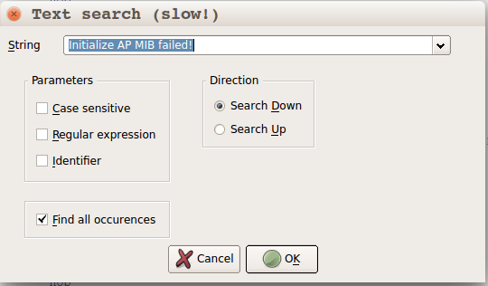

    - 接着找到处在`websAspInit`函数中的对应字符串位置；

      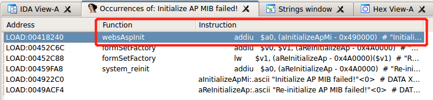

    - 双击即可；

      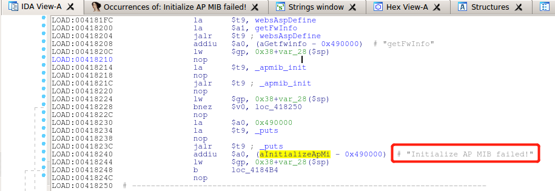

    - 在terminal中执行

      ```
      sudo chroot . ./qemu-mips-static -g 6666 ./bin/boa
      ```

    - 接下来进行断点调试，在该字符串puts的地方下断点，即`0x0041823C`；

    - 选择`Debugger`->`Select debuuger...`->`Remote GDB debugger`，并在`Debugger`->`Process options...`中设置对应的`hostname`和`port`；

      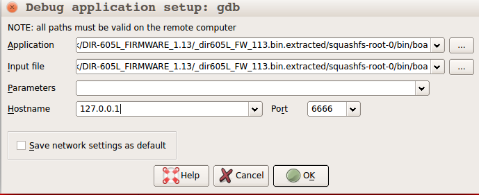

    - 选择`Debugger`->`Attach to process...`，并选择`OK`，即可进入到调试界面；

      

    - 选择继续执行，程序执行到断点处时停止，观察执行流的过程

      ```
      LOAD:0041821C jalr    $t9 ; _apmib_init
      LOAD:00418220 nop
      LOAD:00418224 lw      $gp, 0x38+var_28($sp)
      LOAD:00418228 bnez    $v0, loc_418250					# 跳转指令
      LOAD:0041822C nop
      
      LOAD:00418230 la      $a0, 0x490000
      LOAD:00418234 la      $t9, _puts
      LOAD:00418238 nop
      LOAD:0041823C jalr    $t9 ; _puts
      LOAD:00418240 addiu   $a0, (aInitializeApMi - 0x490000)  # "Initialize AP MIB failed!"
      ```

      可以看到这里进行了一次判断跳转，观察到`apmib_init`函数的返回值（保存在`$v0`寄存器中）为0，跳转后执行`puts`函数，程序崩溃退出；

    - 查找关于`ampib_init`函数的库文件

      ```
      $ sudo grep -rn apmib_init
      Binary file bin/setfirewall matches
      Binary file bin/flash matches
      Binary file bin/boa.id0 matches
      Binary file bin/boa matches
      Binary file etc/boa/core matches
      Binary file lib/apmib.so matches
      ```

      这里看到匹配到了`lib/apmib.so`文件，将之用ida打开分析，找到对应的`ampib_init`函数；

      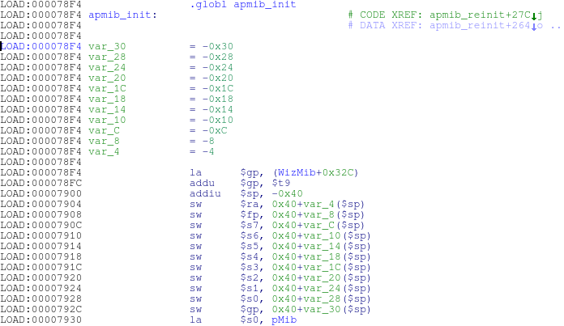

      这里仅仅是一小部分的汇编代码，事实上，`amplib_init`有着比较复杂的函数功能，但是其内部处理流程对模糊测试并没有影响，因此可以尝试伪造`amplib_init`的值返回为`1`，使程序执行流能够走向另一个分支，即跳转到`0x00418250`的地址；

      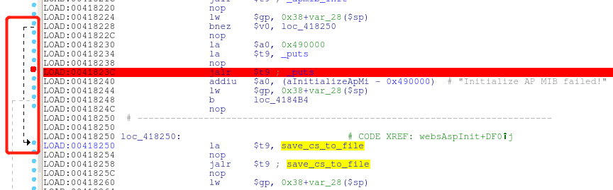

    - 如何进行劫持程序流呢？这里需要伪造一个新的`amplib_init`，以供程序执行；

      ```c
      // fake_apmib_init.c
      #include <stdio.h>
      #include <stdlib.h>
      int apmib_init(void){
          return 1;
      }
      ```

      使用下列命令编译生成动态库，将生成的`apmib-ld.so`文件放入`lib`文件夹中；

      ```
      mips-linux-gcc -Wall -fPIC -shared fake_apmib_init.c -o apmib-ld.so
      ```

      当然这里需要注意mips-linux-gcc的全局环境问题；

    - 使用`LD_PRELOAD`环境变量加载`apmib-ld.so`，劫持`apmib.so`中的`apmib_init()`函数，命令如下：

      ```
      sudo chroot . ./qemu-mips-static -E LD_PRELOAD="/apmib-ld.so" ./bin/boa
      ```

      得到的是另外一个错误提示。

      > Create chklist file error!
      > Create chklist file error!
      > Segmentation fault (core dumped)

    - 虽然原先的程序执行流程被修改了，但是新的`segmentation fault`出现了，于是在此基础上继续进行断点调试；

      显然还得先运行qemu来等待远程gdb的接入：

      ```
      sudo chroot . ./qemu-mips-static -E LD_PRELOAD="/apmib-ld.so" -g 6666 ./bin/boa
      ```

    - 在`_apmib_init`处下断点，`F8`单步执行，可以看到经过劫持动态库到`apmib-ld.so`后，程序执行流跳转到另外的分支，并且最终在`_apmib_get`处产生异常；

      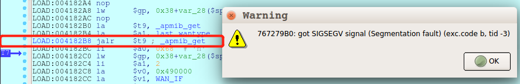

    - 由此还需要劫持`_apmib_get`函数，需要对该函数功能进行分析，同样使用IDA查看`apmib.so`文件，找到`apmib_get`函数的位置，同样进行分析，可以通过程序执行流程图看到函数还是有很复杂的执行逻辑的；

      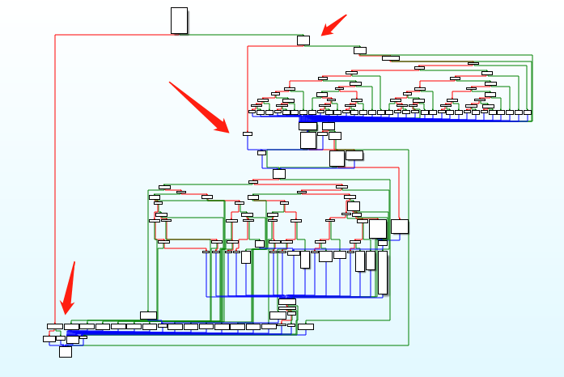

    - 最终的劫持代码为：

      ```c
      // fake_ampib.c
      #include <stdio.h>
      #include <stdlib.h>
      #define MIB_IP_ADDR 170
      #define MIB_HW_VER 0x250
      #define MIB_CAPTCHA 0x2C1
      
      int apmib_init(void){
          return 1;
      }
      
      int fork(void){
          return 0;
      }
      
      void apmib_get(int code, int *value){
          switch(code){
              case MIB_HW_VER:
                  *value = 0xF1;
                  break;
              case MIP_IP_ADDR:
                  *value = 0x7F000001;
                  break;
              case MIB_CAPTCHA:
                  *value = 1;
                  break;
          }
          return ;
      }
      ```
    
      使用下面的编译命令，并将生成的文件`final-apmib-ld.so`放在文件系统根目录下；
    
      ```
      mips-linux-gcc -Wall -fPIC -shared final_fake_apmib.c -o final-apmib-ld.so
      ```
    
    - 接着执行/bin/boa，看`segmentation fault`的问题是否解决；
    
      ```
      sudo chroot . ./qemu-mips-static -E LD_PRELOAD="/final-apmib-ld.so" ./bin/boa
      ```
    
      可以看到，问题已经解决，程序可以正常执行，没有崩溃；
    
      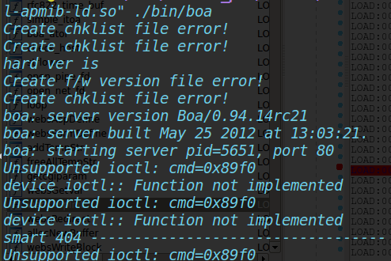
    
    - 使用`netstat`可以看到开启了一个`80`端口的Web服务，这表示Web服务器boa已经成功运行了；
    
      > $ netstat -anto | grep 80
      > tcp        0      0 0.0.0.0:80      0.0.0.0:*     LISTEN      off (0.00/0/0)
    

### IDA反汇编调试

#### 静态反汇编

这个不多阐述...

#### 动态调试

- 运行IDA Pro界面的计算机为调试器客户端；

- 运行Qemu界面的则为调试器服务端；

这里跟着写一个使用Qemu指令执行模拟器测试的脚本`test_busybox.sh`

```shell
# debug

#!/bin/sh
INPUT = $1												# 脚本的第一个参数为BusyBox的输入参数
LEN=$(echo -n "$INPUT" | wc -c)							# 计算输入参数的长度
PORT="6666"												# Qemu调试的端口
if [ "$LEN" == "0" ] || [ "$INPUT" == "-h" ] || [ "$UID" != "0" ]	# 判断参数个数、类型是否正确
then
	echo "\nUsage: sudo $0 \n"
	exit 1
fi
cp $(which qemu-mips-static) ./qemu						# 大端序的qemu-mips指令复制到当前目录，将其更改为qemu
# 使用qemu指令模式模拟执行BusyBox，相当于执行chroot . ./qemu -E CONTENT_LENGTH=$LEN -g 6666 /bin/busybox $INPUT
# -E指定的环境变量在测试CGI脚本才能发挥实际用处，这里只是举例
echo "$INPUT" | chroot . ./qemu -E CONTENT_LENGTH=$LEN -g $PORT /bin/busybox 2>/dev/null
rm -rf ./qemu								# 执行完删除模拟程序
```

运行后，服务器等待IDA remote gdb debugger的对接；

在IDA中对接的方法不多介绍，主要是对debugger的一些配置；

### IDA脚本基础

基于对扩展性的考虑，IDA支持自定义脚本插件；

- IDC：内建的脚本语言，和C语言类似，仅适用于GUI版本的IDA；
- IDAPython：插件，支持Python集成式脚本；
- 独立脚本插件

#### 脚本执行

- IDC命令行：`File`->`IDC Command`
- 独立脚本文件：`File`->`Script File`
- Python命令行：`File`->`Python Command`

#### IDC

- `F1`->`Index of IDC Functions`可以查看IDC官方文档，支持搜索函数调用等；

- 关于IDC的用法

  - 变量类型：

    没有明确类型，主要有3种：

    - 整型long
    - 字符串型
    - 浮点型

  - 变量环境：

    支持全局和局部变量

    - 全局

      ```c
      // 引入全局变量extern
      extern outval;
      extern outval = "wrong!"		// 不合法声明，全局变量不能声明时赋值
      static main(){
      extern inval;					// 合法
      outval = "Global String";		// 全局变量赋值
      inval = 1;
      }
      ```

    - 局部

      ```c
      // 局部变量的声明
      auto addr, reg, val;
      auto valinit = 0;
      ```

  - 表达式

    IDC的表达式语法与C语言十分相似，但是有几点不同：

    - 复合赋值运算：不支持`op=`，如`+=`，`-=`；
    - 所有整数操作作为有符号数处理，因此进行移位等比特操作时要对移动的符号位进行处理；
    - 字符串操作不需要调用函数拼接，可以直接使用`+`来拼接字符串；

  - 预处理指令

    - `#include <头文件>`
    - `#define <宏>`
    - `#ifdef <名称> ... #else ... #endif`：测试宏存在与否
    - `#undef <名称>` ：删除宏

- 需要自定义函数时，应当使用`File`->`Script File`独立加载，这时候可以创建独立的IDC程序文件来提供支持；

  应当满足：

  - 使用自定义函数；
  - 至少定义一个没有参数的`main`函数；
  - 文件中必须包含`idc.idc`头文件;

  下面是一个sample；

  ```c
  #include <idc.idc>
  #define DEBUG
  static main(){
      #ifdef DEBUG
      Message("DEBUG MODE\n");
      #else
      Message("RELEASE MODE\n");
      #endif
  	Message("this is a IDC Script File Sample!\n");
  }
  ```

- IDC常用函数

  - 数据访问
    - long Byte(long addr)：从虚拟地址addr处读取一个字节的值；
    - long Word(long addr)：从虚拟地址addr处读取两个字节（一个字）的值；
    - long Dword(long addr)：从虚拟地址addr处读取两个字节（双字）的值；
  - 赋值
    - long PatchByte(long addr, long val)：将虚拟地址addr处的一个字节的值赋值为val；
    - long PatchWord(long addr, long val)：将虚拟地址addr处的两个字节（一个字）的值赋值为val；
    - long PatchDword(long addr, long val)：将虚拟地址addr处的两个字节（双字）的值赋值为val；
  - 检测
    - bool isLoaded(long addr)：如果虚拟地址addr包含有效数据，则返回1，否则返回0；
  - 打印
    - void Message(string format,...)
    - void print(...)
    - void Warning(string format,...)
  - 交互
    - string AskStr(string default, string prompt)：要求用户在消息框中输入字符串；
    - string AskFile(long doSave, string mask, string prompt)：要求用户选择文件；
    - string AskYN(long default, string prompt)：获取用户选择的`Yes`或`No`；
    - long ScreenEA()：返回当前光标所在位置的虚拟地址
    - bool Jump(long addr)：跳转到反汇编下的指定addr；
  - 字符串操作
    - long atol(string val)：十进制->整型；
    - long xtol(string val)：十六进制->整型；
    - string ltoa(long val, long radix)：指定radix进制返回val的字符串的值；
    - long ord(string ch)：返回ch的ASCII码值；
    - long strlen(string str)
    - long strstr(string str, string search)：返回字符串str中search的索引，若没有则返回`-1`；
    - string substr(string str, long start, long end)：切片，start->end-1；
  - 函数操作
    - long GetFuntionAttr(long addr, logn attrib)
    - string GetFunctionName(long addr)
    - long NextFunction(long addr)
    - long PrevFunction(long addr)
  - **代码交叉引用
    - long Rfirst(long form)
    - long Rnext(long form, long current)
    - long XrefType()
    - long RfirstB(long to)
    - long RnextB(long to, long current)
  - **数据交叉引用
    - long Dfirst(long form)
    - long Dnext(long form, long current)
    - long XrefType()
    - long DfirstB(long to)
    - long DnextB(long to, long current)
  - 数据库名称
    - string Name(long addr)：返回地址在IDA数据库中的名称，若无则返回空；
    - string NameEx(long form, long addr)：返回与addr相关的名称；
    - bool MakeNameEx(long addr, string name, long flags)：给addr分配名称name，flags指定属性；
    - long LocByName(string name)：返回指定name的addr；
    - long LocByNameEx(long funcaddr, string localname)：在包含funcaddr的函数中指定局部名称localname；
  - 数据库搜索
    - long FindCode(long addr, long flags)
    - long FindBinary(long addr, long flags, string binary)
    - long FindData(long addr, long flags)
    - long FindText(long addr, long flags, long row, long column, string text)
  - 数据库操纵
    - void MakeUnkn(long addr, long flags)
    - long MakeCode(long addr)
    - bool MakeByte(long addr) - MakeWord() - MakeDword()
    - bool MakeFunction(long start, long end)
    - bool MakeStr(long start, long end)
  - 反汇编组件
    - string GetDisasm(long addr)
    - string GetMnem(long addr)：地址的指令的助记符
    - string GetOpnd(long addr, long opnum)：指令的指定操作数文本
    - long GetOpType(long addr, long opnum)：指令的指定操作数类型
    - long GetOperandValue(long addr, long opnum)：指令的指定操作数的值
    - string CommentEx(long addr, long type)：注释


一个小demo，用于搜寻危险函数，保存为`scanvuln.idc`文件；

```c
// scanvuln.idc
#include <idc.idc>
static flagCalls(func_name){			// func_name 为用户指定的危险函数名称
    auto count = 0;
    auto func_addr, xref;
    func_addr = LocByName(func_name);
    if(func_addr != BADADDR){
        for(xref = RfirstB(func_addr);xref!=BADADDR;xref=RnextB(func_addr, xref)){	// 代码交叉引用遍历
            // Message("%x, %x\n", xref, func_addr)
            // 如果当前RfirstB()或者RnextB()函数返回的交叉引用类型是近调用或者远调用，会在调用位置上加上注释，输出该地址
            if(XrefType() == fl_CN || XrefType() == fl_CF){
                MakeComm(xref, "**** AUDIT HERE ****");
                Message("Function%d: 0x%x ==> %s\n", ++count, xref, func_name);
            }
        }
     /*
     	// 数据交叉引用遍历
       	for(xref = DirstB(func_addr); xref!=BADADDR; xref = DnextB(func_addr, xref)){
        	if(XrefType() == dr_0){
        		MakeComm(xref, "**** AUDIT HERE ****");
                Message("Function%d: 0x%x ==> %s\n", ++count, xref, func_name);
        	}
        }
     */
    }
}
static main(){
    Message("--------------------------------\n");
    flagCalls("strcpy");
    flagCalls("sprintf");
    Message("--------------------------------\n");
}
```

一个小的测试程序，其实就是之前的编译生成的`vuln`；

```c
#include <stdio.h>
void vuln(char *src){
	char output[20] = {0};
    strcpy(output, src);		// 缓冲区溢出
    printf("%s\n", output);
}

int main(int argc, char *argv[]){
    if(argc < 2){
        printf("need more input arguments\n");
        return 1;
    }
    vuln(argv[1]);			// 参数作为源字符串输入
    return 0;
}
```

- IDA反编译程序vuln，执行脚本文件的方式加载scanvuln.idc（`alt+F7`），可以看到危险函数`strcpy`的引用地址被打印出来；

  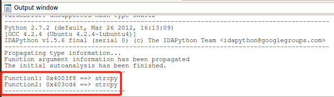

- 双击地址后，会自动调到引用处，可以看到被标记上了注释；

  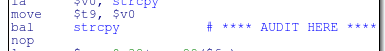

#### IDAPython

IDApython有更强大的功能（感谢Python），但是比较难找到官方使用文档（但是不乏大佬写的文章），IDA目录中Python子目录里有关于IDAPython的3个模块，可供学习；

- idaapi.py：负责访问核心IDA API
- idautils.py：提供大量的使用函数
- idc.py：负责提供IDC中所有函数的功能

另外在[ida自己的文档](https://www.hex-rays.com/products/ida/supportidapython_docs/index.html)中有对这三个文件所有可用函数的介绍；

下面是用IDAPython写的具有查找危险函数功能的脚本`scanvuln.py`；

```python
# coding:utf-8
from idaapi import *
# 根据函数名获取函数地址
def getFuncAddr(func_name):
    return LocByName(func_name)

# 对危险函数所在的位置进行标注
def judgeAduit(func_addr):
    MakeComm(func_addr, "### AUDIT HERE ###")
    SetColor(func_addr, CIC_ITEM, 0x0000ff)
    
# 搜寻函数
def flagCalls(func_name):
    count = 0
    func_addr = getFuncAddr(func_name)
	func = get_func(func_addr)
    if not func is None:
    	name = Name(func.startEA)
    	items = FuncItems(func.startEA)
        for i in items:
            for xref in XrefsTo(i, 0):
                if xref.type == fl_CN or xref.type == fl_CF:
                    count += 1
                    Message("%s[%d] calls 0x%08x from => %08x\n"%(name, count, xref.frm, i))
                    judgeAduit(func_addr)
                else:
                    Warning("No function named '%s' found at location %x" % (func_name, func_addr))
                    
if __name__ == '__main__':
   flagCalls('strcpy') 
```

执行后会出现如下结果：

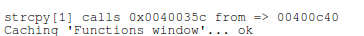

双击地址即可实现跳转,可以看到strcpy的地址被标红了；


