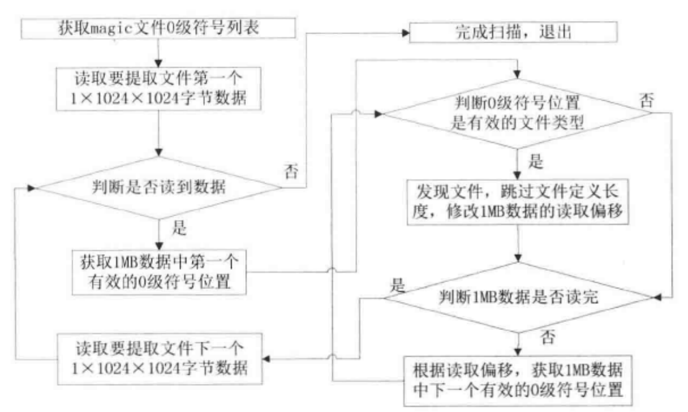
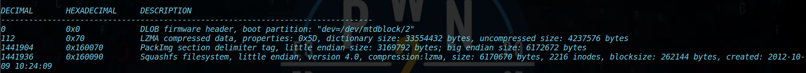
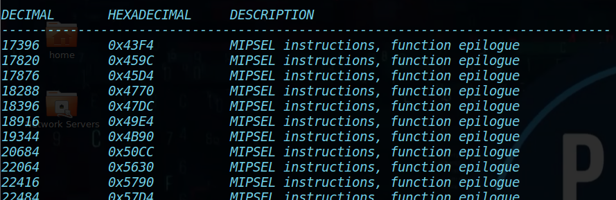
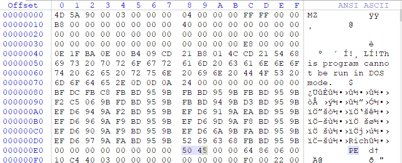
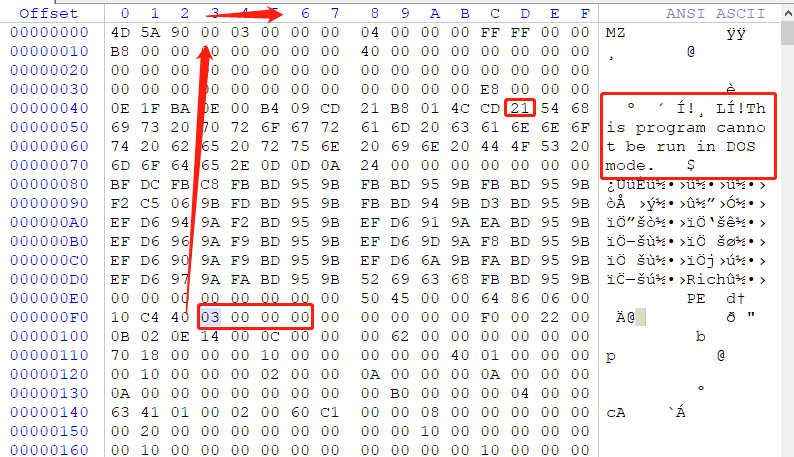

#  路由器文件系统提取

## 路由器文件系统

更新路由器 -> 更新固件（操作系统内核、文件系统）， 固化在只读存储器中。

### 路由器固件

[固件下载地址](ftp://ftp2.dlink.com/PRODUCTS/DIR-645/REVA/DIR-645_FIRMWARE_1.03.ZIP)

1. 检索文件系统的magic标签

   - cramfs文件系统头部特征字符为"0x28cd3d45"
   - squashfs文件系统头部特征较多，有一些是标准的，例如sqsh, hsqs, qshs, shsq等等；

   1. 检查是否为cramfs

      由于不知道大小端序，所以需要判断两次；

      ```
      $ strings dir645_FW_103.bin | grep `python -c 'print "\x28\xcd\x3d\x45"'`
      $ strings dir645_FW_103.bin | grep `python -c 'print "\x45\x3d\c3d\x28"'`
      ```

      没有任何输出，说明不是该类型的文件系统；

   2. 检查是否为squashfs

      ```
      $ strings dir645_FW_103.bin | grep "hsqs"
      hsqs
      ```

      检索到了`hsqs`，也就确定了文件系统为squashfs；

2. 确定文件系统

   1. 确定是否包含squashfs文件系统：

   ```
   $ hexdump -C dir645_FW_103.bin | grep -n "hsqs"
   88345:00160090  68 73 71 73 a8 08 00 00  49 fb 73 50 00 00 04 00  |hsqs....I.sP....|
   
   ```

   2. 复制`0x00160090`后的100字节，squashfs文件系统的头部校验不会超过100字节；

      这里的`1441936`是`0x00160090`的十进制表示，skip=addr，说明从addr开始copy；

      而of为output file；

      

      ```
      $ dd if=dir645_FW_103.bin bs=1 count=100 skip=1441936 of=squash
      100+0 records in
      100+0 records out
      100 bytes copied, 0.000171359 s, 584 kB/s
      ```

   3. 使用file检查copy下来的squash文件；

      可以看到文件系统大小为6170670 bytes;

      ```
      $ file squash
      squash: Squashfs filesystem, little endian, version 4.0, 6170670 bytes, 2216 inodes, blocksize: 262144 bytes, created: Tue Oct  9 10:24:09 2012
      ```

### 手动提取文件系统

利用dd来copy；

```
$ dd if=dir645_FW_103.bin bs=1 count=6170670 skip=1441936 of=kernel.squash
6170670+0 records in
6170670+0 records out
6170670 bytes (6.2 MB, 5.9 MiB) copied, 4.97822 s, 1.2 MB/s
```

接下来还原根文件系统；

安装firmware-mod-kit以及相关依赖；

```
$ git clone https://github.com/mirror/firmware-mod-kit.git
$ sudo apt-get install git build-essential zlib1g-dev liblzma-dev python-magic
$ cd firmware-mod-kit/src
$ ./configure && make
```

使用`unsquashfs_all.sh`解压kernel.squash，生成文件夹根目录squashfs-root；

```
$ ../../firmware-mod-kit/unsquashfs_all.sh kernel.squash
...
Trying ./src/others/squashfs-4.0-lzma/unsquashfs-lzma... Parallel unsquashfs: Using 4 processors
2097 inodes (2115 blocks) to write

[========================================================================/   ] 2049/2115  96%
created 1836 files
created 119 directories
created 195 symlinks
created 0 devices
created 0 fifos
File system sucessfully extracted!
MKFS="./src/others/squashfs-4.0-lzma/mksquashfs-lzma"
```

### 自动提取文件系统

#### Binwalk + libmagic

Binwalk中合租要使用libmagic的4个函数，magic_open, magic_close, magic_buffer, magic_load；

在magic.h中定义如下：

```c
magic_t magic_open(int flags);			// 创建并返回一个magic cookie指针
void magic_close(magic_t cookie);	// 关闭magic签名数据库并释放所有使用过的资源
const char *magic_buffer(magic_t cookie, const void *buffer, size_t len);	// 读取buffer中指定长度的数据，并与magic签名数据库进行对比，返回对比结果
int magic_load(magic_t cookie, const char *filename)	// 从filename指定文件加载magic签名数据库，把多个magic签名文件组合到一个临时文件中用于加载
```

#### Binwalk算法流程



#### 提取与分析

先扫描固件；

```
$ binwalk dir645_FW_103.bin
```

得到结果：



可以看到识别出了目标文件中包含的所有可识别的文件类型。

- 使用`-e`或者`--extract`进行提取

  ```
  $ binwalk -e dir645_FW_103.bin
  ```

  执行结束后生成了一个名为`_dir645_FW_103.bin.extracted`的文件夹，内容如下：

  ```
  $ ls _dir645_FW_103.bin.extracted/
  160090.squashfs  70  70.7z  squashfs-root
  ```

- 使用`-M`或`--matryoshka`来根据magic签名扫描结果进行递归提取，仅对`-e`和`--dd`选项有效

  ```
  $ binwalk -Me dir645_FW_103.bin
  ```

  执行结束后生成了一个名为`_dir645_FW_103.bin-0.extracted`的文件夹，内容如下：

  ```
  $ ls _dir645_FW_103.bin-0.extracted/
  160090.squashfs  70  70.7z  squashfs-root
  ```

- 使用`-d`或`--depth=<int>`来限制递归提取的深度，默认深度是8，仅当`-M`选项存在时有效

  ```
  $ binwalk -Me -d 5 dir645_FW_103.bin
  ```

  执行结束后生成了一个名为`_dir645_FW_103.bin-1.extracted`的文件夹，内容如下：

  ```
  $ ls _dir645_FW_103.bin-1.extracted/
  160090.squashfs  70  70.7z  squashfs-root
  ```

- 使用`-I`或`--invalid`显示完整扫描结果

  ```
  $ binwalk -I dir645_FW_103.bin
  ```

- 使用`-A`或`--opcodes`扫描指定文件中通用CPU架构的可执行代码

  ```
  $ cd _dir645_FW_103.bin.extracted/ && binwalk -A 70 | more
  ```

  得到如下结果，存在许多小端序的MIPS指令：

  

#### 无法识别固件

使用binwalk的最新版本一般都能对常见的固件种类进行识别和提取，如果遇到无法直接提取的，可以添加新的提取规则和方法，从而实现对新的文件系统进行扫描和提取。

##### 基于maigc签名文件自动提取

file命令通过magic签名文件中的规则，识别文件的类型。Binwalk也累死，但是binwalk可以扫描处目标文件包含的多个文件的类型。

- magic签名文件规则

  magic签名文件的每一行都指定了一条测试项，每条测试项从一个特定的偏移开始比较，如果比较通过，则会输出信息。

  每一个测试项包含四个域：

  - offset：被测试文件中的指定偏移位置，表示测试项从这里开始测试，类型为数字型或表达式
  - type：被测试位置的数据类型，有byte, short, long, quad, string, leshort, lelong, lequad, beshort, belong, bequad
  - test：测试项本列的值域文件中的值进行比较，如果类型是数值型，那么该值被指定为C语言，如果是字符型，被指定为C格式字符串。
  - message：比较测试通过，则输出message；

- magic签名文件实例

  示例1 exe.f

  ```
  # MS Windows executables are also valid MS-DOS executables
  # exe.f
  # offset	type		test			message
  0			string		MZ			
  >0x18		leshort		<0x40		MZ executable (MS-DOS)
  # skip the whole block below if it is not an extended executable
  >0x18		leshort		>0x3f
  >>(0x3c.l)	string		PE\0\0		PE executable (MS-WINDOWS)
  >>(0x3c.l)	string		LX\0\0		LX executable (OS/2)
  ```

  上面是magic signatures file。

  在offset列中，有的测试项在数值前包含一个或多个">"，这里表示测试的等级（深度），没有">"表示0级。整个测试就像是一个树型层次结构，形成了一种"if/then"的逻辑能力，如果是第n级测试成功，才会测试第n+1级，否则跳过等级为n+1的行直到下一个等级为n或者更低的行继续执行。

  由于上面，如果第0级的测试"0 string MZ"没有通过，会掉过大于0级的行，寻找下一个等级为0的行。在上面的例子中，下面的行都不会执行了。

  - 简介偏移：将从文件中获取的值作为偏移量，格式如下：
  
    ```
    (( x[.[bisBISL]][+-][ y ]))
    ```
  
    其中：
  
    "x"表示使用文件中位于x位置的值作为偏移；
  
    "[bisl]"是小端序的byute/int/short/long这几个数据类型；
  
    "(0x3c.1)"表示从文件0x3c获取lelong类型的值作为此处的偏移量；
  
    "(0x3c.1+0x12)"表示从文件0x3c获取lelong类型的值作为0x12作为此处的偏移；
  
  接下来使用file来验证该文件的效果：
  
  ```
  file -m exe.f calc.exe
  ```
  
  这里的calc.exe来自`C:\Windows\System32`；
  
  在执行后，可以得到：
  
  ```
  calc.exe: PE executable (MS-WINDOWS)
  ```
  
  现在把calc.exe丢到winhex里，看一下文件头部的数据；
  
  
  
  对照magic其阿明文件与calc.exe，分析：
  
  - 根据头部数据，第0级"MZ"成立，继续执行第1级；
  - 根据头部数据，0x18位置的值为`0x00000040`，第2个等级为1的行成立，继续执行第2级；
  - 根据头部数据，0x3c位置的值是`0x000000E8`，将其作为偏移，匹配`0x000000E8`处是否存在字符串"PE\0\0"。如果成立，则输出`PE executable(MS-Windows)`，因此下一个同等级的"LE\0\0"是不成立的，比较就此完成。
  
  示例2 exe.f1
  
  ```
  # exe.f1
  # offset	type		test			message
  0			string		MZ
  >0x18		leshort		>0x3f
  >>(0x3c.l)	string		PE\0\0		PE executable (MS-WINDOWS)
  # immediately following the PE signature is the CPU type
  >>>&0		leshort		0x8664		for x64
  >>>&0		leshort		0x14c		for 80386
  >>>&0		leshort		0x184		for DEC
  >>>&0		leshort		0x200		Intel Itanium
  ```
  
  0x3c处的值为`0x000000E8`匹配"PE\0\0"后偏移量位于`0x000000EC`，想一二等级测试依赖于上一个等级偏移，相对位移为0，因此这里测试的偏移就是`0x000000EC`的值，测试是否为0x8664，如果是的话则为x64架构，以此类推；
  
  执行下面命令获得结果：
  
  ```
  $ file -m exe.f1 calc.exe 
  calc.exe: PE executable (MS-WINDOWS) for x64
  ```
  
  示例3 exe.f2
  
  ```
  # exe.f2
  # offset	type		test			message
  0			string		MZ
  >0x18		leshort		>0x3f
  >>(0x3c.l)	string		PE\0\0		PE executable (MS-WINDOWS)
  >>>(&0x7.l+0x4a)		string		x		\b, string: %s
  ```
  
  这里意思是获取相对于偏移(0x000000EC+0x7)所在的值，即&0x000000F3，值为0x0000003，加上0x4a，即为0x0000004d；
  
  因此最终输出该位置的字符串；
  
  ```
  $ file -m exe.f2 calc.exe
  calc.exe: PE executable (MS-WINDOWS), string: !This program cannot be run in DOS mode.
  ```
  
  

接下来可以用binwalk加载自定义的magic掐你明文件exe.f1来扫描calc.exe；

```
$ binwalk --magic exe.f2 calc.exe

DECIMAL       HEXADECIMAL     DESCRIPTION
--------------------------------------------------------------------------------
0             0x0             PE executable (MS-WINDOWS), string: !This program cannot be run in DOS mode.

```

