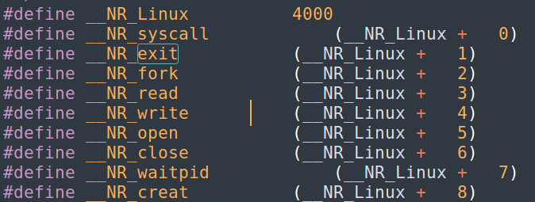

# 基于MIPS的Shellcode开发

## MIPS Linux系统调用

Mips中采用了syscall指令进行系统调用。

### 调用方法

在进行syscall调用前：

1. 需要使用`$v0`来保存需要执行的系统调用号；
2. 按照调用规则构造系统调用参数，伪代码为`syscall($v0, $a0, $a1, $a2)`;

例如，如下代码调用了exit系统调用：

```
li $a0, 0
li $v0, 4001
syscall
```

一般而言，在mips的/include/asm/unistd.h中，可以找到对应的系统调用号，例如如上所示的4001号调用exit，就可以在其中找到。

												

### 例子

#### write


可以看到进行write系统调用需要三个参数，`$a0`指定了文件描述符，`$a1`指定了输出缓冲区的地址，也可以理解为指向要输出的信息的地址指针，`$a2`指定了输出的字符数量；

在C语言中，可以这样调用write进行输出；

```c
int main(){
	char *str = "ABC\n";
	write(1, str, 5);
}
```

生成汇编文件

```
$ /home/klose/mips/cross-compiler-mips/bin/mips-gcc write.c -S -o write.s
```

查看write.s的内容：

```
	.file	1 "write.c"
	.section .mdebug.abi32
	.previous
	.abicalls
	.rdata
	.align	2
$LC0:
	.ascii	"hello, world\012\000"
	.text
	.align	2
	.globl	main
	.ent	main
	.type	main, @function
main:
	.frame	$fp,40,$31		# vars= 8, regs= 2/0, args= 16, gp= 8
	.mask	0xc0000000,-4
	.fmask	0x00000000,0
	.set	noreorder
	.cpload	$25
	.set	nomacro
	
	addiu	$sp,$sp,-40
	sw	$31,36($sp)
	sw	$fp,32($sp)
	move	$fp,$sp
	.cprestore	16
	lw	$2,%got($LC0)($28)
	nop
	addiu	$2,$2,%lo($LC0)
	sw	$2,24($fp)
	li	$4,1			# 0x1
	lw	$5,24($fp)
	li	$6,14			# 0xe
	lw	$25,%call16(write)($28)
	nop
	jalr	$25
	nop

	lw	$28,16($fp)
	move	$2,$0
	move	$sp,$fp
	lw	$31,36($sp)
	lw	$fp,32($sp)
	addiu	$sp,$sp,40
	j	$31
	nop

	.set	macro
	.set	reorder
	.end	main
	.ident	"GCC: (GNU) 4.1.2"
```

生成可执行文件；

```
$ /home/klose/mips/cross-compiler-mips/bin/mips-gcc --static write.c -o write
```

使用readelf查看程序入口地址；

```
readelf -S write
```

得到结果；

```
  [ 2] .init             PROGBITS        004000cc 0000cc 00008c 00  AX  0   0  4
  [ 3] .text             PROGBITS        00400160 000160 001400 00  AX  0   0 16
  [ 4] .fini             PROGBITS        00401560 001560 00005c 00  AX  0   0  4
```

