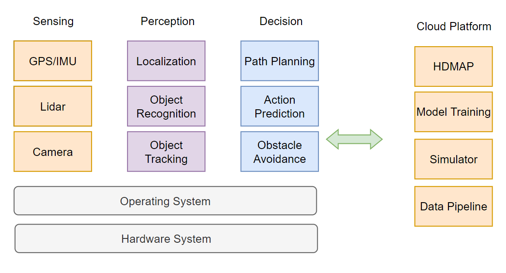
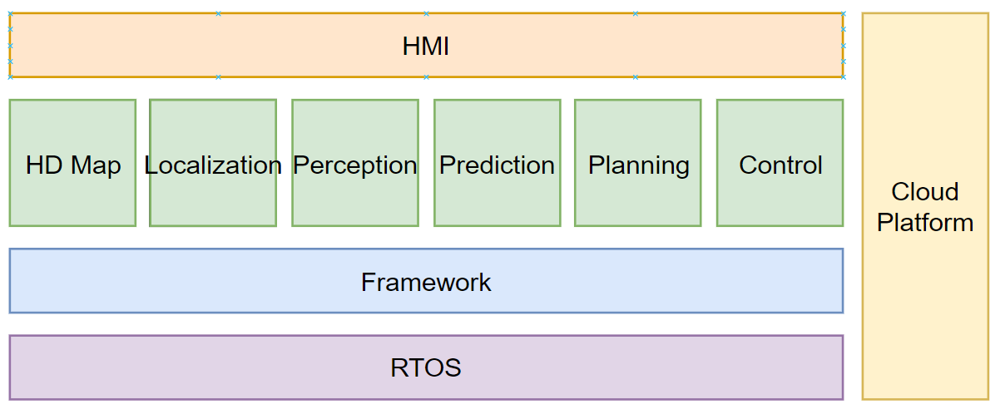

# 概述

> "A self-driving car, also known as a robot car, autonomous car, or driverless car, is a vehicle that is capable of sensing its environment and moving with little or no human input."						-- wikipedia

## 无人驾驶技术路径

- 无人驾驶分级
- L2/L3自动驾驶
- L4自动驾驶

### 无人驾驶分级

美国汽车工程师协会SAE，将自动驾驶分为6个级别L0~L5。

-----

责任主体在于**驾驶员**：

L0：纯人工

L1：巡航定速（Adaptive Cruise Control, ACC），巡航装置可以纵向控制车辆，加速减速。

L2：车道保持辅助（Lane Keeping），系统可以纵向控制，也可以横向控制汽车，但是人仍为主导。（特斯拉）

L2.5：在简单路况下的变道能力。

-----

责任主体在于**汽车**：

L3：在L2基础上提供变道能力。

**L4：相当于全无人驾驶，大部分时间由车主导。**

L5：驾驶能力几乎与人类没有关系，没有方向盘、脚踏板以及其他接管设备。

---

### L2级别无人驾驶

代表：Tesla Model X

- L2高级辅助驾驶
- 驾驶员需要对安全负责
- 启动条件要求不高（速度和车道线）
- 早期采用Mobileye提供感知技术
- 无法解决复杂路口问题
- 主动变道需要人提供变道指示

### L3级别无人驾驶

代表：Audi A8

- L3自动驾驶
- 自动驾驶期间，车辆负全责
- 进入自动驾驶的条件苛刻（多车道路，60km/h以下速度，天气良好）
- 量产车里智能性最好的
- 暂时没有主动变道能力
- 遇到紧急情况或者不符合条件的情况需要通知驾驶员接管，10s时间。

### L4级别无人驾驶

代表：Waymo

- L4全自动驾驶
- 曾有一段时间取消了安全员
- 商业运营阶段
- 世界最领先的自动驾驶能力
- 成本昂贵

代表：Nuro

- 特殊场景下的Level 4能力
- 物流配送车
- 成本要求不能太高
- 可以不用考虑乘坐体感
- 相关物流公司都有布局，比如：京东、美团、菜鸟等等

实现思路：

- V2X：Vehicle to Everything（车路协同）
  - V2V：Vehicle to Vehicle
  - V2I：Vehicle to Installtion
  - V2P：Vehicle to people
- 边缘计算：RSU（路侧单元）、OBU（车载单元）
- 5G通信能力：LTE-V协议，专门针对车间通讯的协议，可兼容4G和5G
- 主车智能：深度学习
- 感知能力：高度复杂冗余的传感器
- 决策能力：大数据下的智能决策
- 高精地图：丰富的地图信息数据
- 定位：精确的位置获取能力
- 权责问题处理：RSS模型（Responsibility-Sensitive Safely）责任敏感安全模型：利用可衡量的具体数据来区分事故的责任

## 无人驾驶技术概述

- L4自动驾驶系统架构
- 自动驾驶硬件
- 自动驾驶软件

### L4自动驾驶系统架构

### 自动驾驶硬件

- 128L LiDAR + 若干 16L LiDAR 辅助盲区，激光雷达平行偏下的感知范围
- Front Cameras + Side Cameras
- Radar 毫米波雷达，弥补光线不足时的感知能力
- Industrial PC 工控机
- IMU + GPS Antenna + GPS Receiver 定位

#### 感知传感器

- 摄像头：物体识别、追踪
- 激光雷达：障碍物位置识别、绘制地图、辅助定位。精准度很高，作为主传感器
- 毫米波雷达：坏天气下辅助感知物体的位置和速度，观测距离远，但容易误检
- 超声波：近距离高敏，作为安全冗余设备检测车辆的碰撞安全问题

#### 定位系统传感器

- IMU：实时监测自身的姿态，200Hz或更高。包括了三个单轴的加速度计和三个单轴的陀螺仪。
- GNSS：GPS，无人车一般使用RTK（载波相位差分）来实现定位，10Hz

#### 计算单元

车载计算单元IPC：

- 高效连接计算单元内部各计算设备，连接外部传感器的信息输入和存储
- 冗余设计，防止单点故障
- 考虑车规、电磁干扰和震动方面的设计以及ISO-26262标准的要求（ASIL D级别，故障率是10FIT，10亿各小时里面出一次故障）

#### 车辆线控系统

- 线控系统：控制是由简单命令完成的，不是由物理操作。
- 将传统车辆的液压系统和真空助力泵 设计为 电控化的零部件。

### 自动驾驶软件

- RTOS 实时操作系统
- Framework 框架
- 各类模块
- HMI 可视化
- Cloud Platform 云平台

感知系统（Computer Vision + Sensor Fusion）处理后，传递信息给定位系统（Localization），按照信息进行路径规划，最后控制系统执行行驶指令。

#### RTOS

- 实时操作系统
  - QNX，类Unix系统，具有强实时性，符合车规级的实时操作系统
  - RT Linux，Linux内核补丁，通过软实时进行监控
- Framework：
  - ROS，机器人操作系统：B->M
  - YARP、Microsoft Robotics、MOOS、Cybertron

#### HD Map

High Dimensional Map 作为其他模块的支撑

- 不同于导航地图，最大的特点就是高纬度和高精度
- 道路网的精确三维表征，例如交叉路口布局和路标位置
- 地图语义信息，例如道路速度限制，左转车道开始的位置
- 导航地图只能达到米级精度，高精地图能达到厘米级
- 高精地图坐标系：WGS84、墨卡托坐标系
- 提供许多准确的静态物体信息
- 定位可以用于计算相对位置
- 帮助传感器缩小检测范围，缩小感兴趣区域ROI
- 计算道路导航信息
- 帮助车辆识别车道的确切中心线

#### Localization

- 无人车最重要的基础就是位置

  - INS：Inertial Navigation System 惯性导航系统，较高更新频率
    - IMU获取自身状态后通过状态矩阵递推下一时刻的位置
    - 如果没有矫正的话，状态递推会随着时间不断产生误差，导致最终位置发散
  - RTK，载波相位差分系统，较低更新频率
    - 多加了一个静止基站，基站位置不变，有固定坐标 $(X_{基站固定},Y_{基站固定})$ ，而基站从卫星获取到自身位置坐标为 $(X_{基站卫星},Y_{基站卫星})$ ，这二者的误差为 $Error=(X_{基站固定}-X_{基站卫星},Y_{基站固定}-Y_{基站卫星})$ ，该误差可以衡量车辆是否偏航，即汽车坐标应当在 $(X_{汽车卫星},Y_{汽车卫星}) \space ± \space Error $ 之间。  

  - 通过 Kalman Filter 卡尔曼滤波整合两类数据各取优势，得出高准确性的实时信息。

- 几何定位：

  - 激光雷达：点云
  - 摄像头：图像
  - 高精地图

  迭代最近点 ICP：每个时刻进行多次点云与高精地图位置的比对，选择最近点作为位置校正。

  直方图滤波 Histogram Filter

#### Preception

- 任务：

  - 检测：得到物体在环境中的位置

  - 分类：明确物体是什么

  - 跟踪：随时间的持续观察移动物体并保持物体一致性

  - 分割：图像中每个像素与语义类别进行匹配，合理语义分割

- 方法：

  - 深度学习：监督学习、半监督学习、强化学习
  - R-CNN系列、YOLO、SSD

- 计算融合：

  - 前融合：将数据基础信息进行融合，得到Raw Data
  - 后融合：将不同传感器分别执行操作后，将数据融合

#### Prediction

- 任务

  - 实时性
  - 准确性

- 方法：

  - 基于状态进行检测
    - Kalman Filter
    - Particle Filter

  - 基于车道序列进行预测通过
    - 机器学习模型化简为分类问题
  - 行人预测：行人预测很难

#### Planning

- 任务
  - 导航线路规划
  - 精细轨迹表述
- 方法
  - 数学问题转换：将物理世界的地图转化为数学上的图表达
  - 最优路径搜索：通过数学上的最优路径求解出确定解
  - 考虑车辆的体感和安全性

#### Control

- 任务
  - 输入信息：目标轨迹、车辆状态，输出：方向盘、油门
  - 时效性、准确性、稳定性要求都非常高
- 方法：
  - 传统控制算法PID可以满足车辆控制要求，控制算法优化上由LQR、MPC

## 问题总结

- 我在哪？
- 我周围有什么？
- 他们要到哪里去？
- 我该怎么走？

