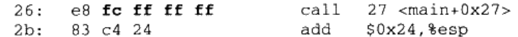

# 静态链接

## 空间地址分配

按序叠加

相似合并

1. 空间地址分配：扫描、收集（符号定义和引用到全局符号表）、合并、建立映射
2. 符号解析与重定位：读取段信息、重定位信息，进行符号解析和重定位

```c
// a.c
extern int shared;
int main(){
    int a = 100;
    swap(&a, &shared);
}

// b.c
int shared = 1;
void swap(int *a, int *b){
    *a ^= *b ^= *a ^= *b;
}
```

生成目标文件；

```
gcc -c a.c b.c
```

进行链接；

```
ld a.o b.o -e main -o ab
```

链接后各个段的虚拟地址就确定了；

接着开始计算各个符号的虚拟地址；

例如main函数，原本在`a.o`中与`.text`的偏移`offset`为`x`，链接后，`.text`的虚拟地址假设为`0x08048094`，则`main`的地址为`0x08048094 + x`；

## 符号解析与重定位

### 符号解析

`a.c`中引用了`shared`变量，并且调用了`swap`外部函数；

在`a.c`编译成`a.o`时，编译器并不知道`shared`和`swap`的地址，因此`shared`用地址`0x0`暂时代替，而函数`swap`则用`main+offset`来表示（下一条指令的地址，与本行指令机器码指定的`offset`相加，决定调用的地址）；

链接器通过重定位表`Relocation Table`获取哪些部分需要重定位；

例如当`.text`中有部分需要重定位，将会有一个`.rel.text`段保存代码段的重定位信息，`.data`段类似；

查看重定位信息，所有引用外部符号的地址；

```
objdump -r a.o
```

每个要重定位的地方有一个重定位入口`Relocation Entry`，在`a.o`中就有两个：`shared`和`swap`；

重定位入口的偏移`offset`代表其在段中的偏移；

接着，查全局符号表，没查到就是`undefined`状态，查到就修正地址；

### 重定位修正


假设链接完成后，最终可执行文件中，`main`的虚拟地址为`0x1000`，`swap`的虚拟地址为`0x2000`，`shared`的虚拟地址为`0x3000`；

#### 绝对寻址修正

对于`shared`变量，重定位前，`a.o`中使用了`movl $0x0, 0x4(%esp)`来暂时代表`shared`的地址，即`0x0`；

这里的重定位使用了`R_386_32`的绝对寻址修正，则`S = 0x3000`，而`A = 0x0`；

那么最终重定位入口地址修正为`S + A = 0x3000`，修正后的指令为`movl $0x3000, 0x4(%esp)`；

#### 绝对寻址修正

对于`swap`函数，重定位前，`a.o`中使用了



这里的重定位使用了`R_386_PC32`的相对寻址修正，则`S=0x2000`，`A = 0xfffffffc = -4`，`A`即为机器码`0xfffffffc`，而`P = 0x1000 + 0x27`，是被修正的虚拟地址；

最后重定位入口地址修正为`S + P - A = 0x2000 + (-4) - 0x1027 = 0xfd5`，即最后`call 0xfd5`；

下一条指令的地址加上当前call的地址，正好就是`swap`函数的地址，即：`102b + fd5 = 0x2000`


## 静态库链接

交互使用操作系统提供的API；

开发环境中的语言库`Language Library`就是对操作系统API的封装；

查看一个文件包含的目标文件

```
ar -t libc.a
```

将这些目标文件都提取出来

```
ar -x libc.a
```

查看某个函数在那个目标文件中

```
objdump -t libc.a | grep func
```

打印链接的过程

```
gcc -static --verbose -fno-builtin hello.c
```

1. cc1编译成.s文件
2. as汇编成.o文件
3. collect2链接
