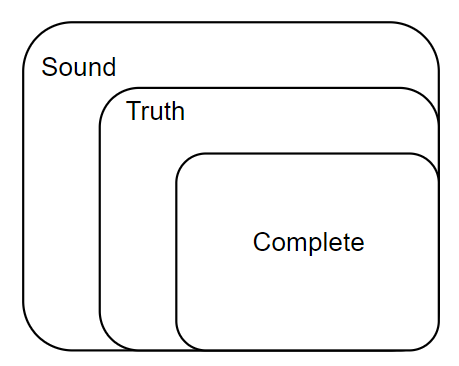
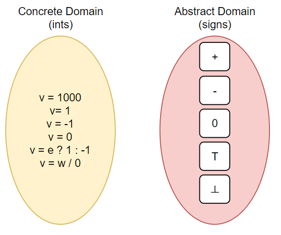

# Introduction

## Links

[official link](https://pascal-group.bitbucket.io/teaching.html)


## PL & Static Analysis

### What is Program Languages

- Theory - 理论
  - Language Design - 语言设计
  - Type System - 类型系统
  - Semantics and Logics - 语义和逻辑
  - ...
- Environment - 环境
  - Compilers - 编译器
  - Runtime System - 运行时系统
  - ...
- Application - 应用
  - Program Analysis - **程序分析**
  - Program Verification - 程序验证
  - Program synthesis - 程序合成
  - ...

### Background

过去几十年，语言的核心没有变化，但是语言应用的环境，即语言写的程序和环境变得越来越复杂。

### Challenge

如何保证复杂程序的可靠性、安全性和其他性能？

## Why we learn static analysis?

### Application

#### Program Reliability

- Null pointer derefernce
- memory leak
- ...

#### Program Security

- Private information leak
- Injection attack
- ...

#### Compiler Optimization

- Dead code elimination - 死代码移除
- Code motion - 代码移动
- ...

#### Program Understanding

- IDE call hierarchy - 调用层次
- type indication
- Debug
- ...

### Market of Static Analysis

任何与编程相关的方向都会涉及静态分析，尤其在大厂：

- Programming Languages
- Software Engineering
- Systems
- Security
- ...

### Understanding

- 理解编程语言
- 写出更好的程序

## What is Static Analysis?

### Static Analysis

Static analysis analyzes a prgram P to resaon about its behaviors and determines whether it satisfies some properties before running P.

在运行程序P前需要分析程序的行为特征以及确定它是否满足一些属性。

- Does P contain any private information leaks?
- Does P derefernce any null pointers?
- Are all the cast operations in P safe?
- Can v1 and v2 in P point to the same memory location?
- Will certain assert statements in P fail?
- Is this piece of code in P dead(so that it could be eliminated)?
- ...

### Rice theority

但是莱斯定理表示，不存在方法能够准确地判断出以上的所有答案。

> "Any non-trivial property of the behavior of programs in a recursively enumerable language is undecidable."
>
> 
>
> r.e. => recursively enumerable 递归可枚举 => recognizable by a Turing-machine

> "A property is trival if either it is not satisfied by any r.e languagem, or if it is satisfied by all r.e. languages; otherwise it is non-trivial."
>
> 
>
> non-trivial property ~= interesting property 
>
> ​					 ~= the properties related with run-time behaviors of programs
>
> 如果这个性质与运行行为相关，都是interesting properties，反之则为non-trivial properties.

不存在Perfect static analysis[^1]，例如对于程序中有无存在空指针，没有静态分析能够给出确切答案。

### Sound & Complete

一个Perfect Static Analysis满足Sound和Complete。




<div align="center">
    <p>
        Sound & Complete
    </p>
    <p>
        例如空指针引用，当程序动态运行时，存在十个空指针引用异常。
    </p>
    <p>
        Truth：Perfect Static Analysis要做到十个空指针引用异常全部都能判断出来。
    </p>
    <p>
        Sound：包含Truth，即十个空指针都能判断出来，也可能判断出不存在的异常。
    </p>
    <p>
    	Complete：被Truth包含，判断出的异常一定是十个空指针引用异常中的几个。
    </p>
</div>

既然不存在既满足Sound又满足Complete，即能完完全全表示Truth的Perfect Static Analysis存在，就需要进行一定程度的妥协，转化为Useful Static Analysis。

- Compromise Soundness - 妥协Soundness，产生漏报，false negatives
- Compromise Completeness - 妥协Completeness，产生误报，false positives <- 绝大部分静态分析都会采取这个方案，Sound but not fully-precise。

### Necessity of Soundness

- Soundness is critical to a collection of important(static-analysis) applications such as compiler optimization and program verification.

Soundness，所有Input覆盖到的所有路径分支都能被包含。

以下用一个例子来表述，存在下列代码：

```java
// 存在两个处理分支
// 1
B b = new B();
a.fld = b;

// 2
C c = new C();
a.fld = c;

// 当存在一条语句，进行强制类型转换cast
B tempb = (B) a.fld;
```

当执行处理分支1后，执行`B tempb = (B) a.fld;`，程序是可以正常执行的。

当执行处理分支2后，执行`B tempb = (B) a.fld;`，程序会抛出强制类型转换错误的异常。

如果没有覆盖到分支2的执行路径，会得出`Safe Cast`的结论，则这个静态分析是Unsound Static Analysis；

反之如果全部路径全部覆盖到了，检测出了强制类型转换的错误，会得出`Unsafe Cast`的结论， 则这个静态分析是相对Sound的；

- Soundness is also preferable to other(static-analysis) applications for which soundness is not demanded, e.g., bug detection, as better soundness implies more bugs could be found.

因此应该尽量保证Sound，可以牺牲一些精度。

### Example?

```c
if(input)
	x = 1;
else
	x = 0;

// x = ?

/*
1. 结论一：while input is true, x = 1; while input is false, x = 0;
2. 结论二：x = 0 or x = 1;
3. 结论三：x = 0 or x = 1 or x = 2 or x = 3;
4. 结论四：x = -1 or x = 0;
*/
```

上述结论中，结论一、二和三都是正确的，其中结论三是soundness的，虽然其包含了误报，但是也包含了truth，而结论四没有包含truth，因此不是soundness，是错误的。

结论一、二的区别在于，结论一还需要维护一些条件值，耗费更多，而结论二仅仅给出结果即可，耗费更少；

因此这也需要静态分析能够达到：

ensure (or get close to) soundness, while making godd trade-offs between analysis precision and analysis speed.

在分析精度和速度之间有一个好的权衡。


## How to conclude Static Analysis

### Two aspect

- Abstraction - 具体事物的抽象化
- Over-approximation - 近似
  - Transfer functions
  - Control flows

### Example?

Determine the sign(+, -, 0) of all the variables of a given program.



在判断value符号的例子中，value本身的数值并不关键。

#### Abstraction

对于这些value，可以用抽象的方法，将concrete的数值转变成对应的abstrat符号，例如`v=1000`可以抽象到`'+'`，以此类推。

可以注意到其中的两个表达式：

- `v = e ? 1:-1`
- `v = w / 0`

这两个表达式的结果并不能直接用`'+'`、`'-'`、`'0'`来表示，所以构造了两个类型的符号：

- 'T' -> Top：在此处代表unknown
- '⊥' -> Bottom：在此处代表undefined

#### Over-approximation

##### Transfer Functions

- In static analysis, transfer functions define how to evaluate different program statements on abstract values.
- Transfer funcitons are defined according to "analysis problem" and the "semantics" of different program statements.

转化函数根据不同程序语句的“分析问题”和“语义”，定义了如何处理计算这些抽象值的规则。

例如，对于如上的符号规则，可以有如下的transfer functions：

```
[+] + [+] = [+]
[-] + [-] = [-]
[0] + [0] = [0]
[+] + [-] = [T]

[+] / [+] = [+]
[-] / [-] = [+]
[T] / [0] = [⊥]
[+] / [-] = [-]

...
```

根据这套规则，现在有一个程序，其中有如下的值：

```
x = 10;
y = -1;
z = 0;
a = x+y;
b = z/y;
c = a/b;
p = arr[y];
q = arr[a];
```

经过抽象后，有：

```
x = [+]
y = [-]
z = [0]
a = [T]
b = [0]
c = [⊥] -> 除0错误
p = [⊥] -> 数组索引为负
q = [⊥] -> 过度近似产生误报
```

第6、7行的静态分析是有效的，可以查出确切的错误。

第8行在a为正数的时候是正确的，a为负数的时候是错误的，所以可能会产生误报。

##### Control Flows

程序执行控制流。

```
x = 1;
if(input)
	y = 10;
else
	y = -1;
z = x + y;
```

对于这个程序逻辑，当input=true时，会存在`x = 1, y = 10`，在input=false时，会存在`x = 1, y = -1`；

所有程序执行流汇聚的点，必须抽象；

## Teaching Plan

1. Introduciton
2. Intermediate Representation
3. Data Flow Analysis - Applications
4. Data Flow Analysis - Foundations(I)
5. Data Flow Analysis - Foundations(II)
6. Inter-procedural Analysis
7. CFL-Reachability and IFDS
8. Soundness and Soundiness
9. Pointer Analysis - Foundations(I)
10. Pointer Analysis - Foundations(II)
11. Pointer Analysis - Context Sensitivity
12. Modern Pointer Analysis
13. Static Analysis for Security
14. Datalog-Based Analysis
15. Abstract Interpretation
16. Course Summary


## Coding Assignment

- Assignment 1:Constant Propagation
  - Statically compute and propagate constant values in program
  - Intra-procedural analysis
- Assignment 2:Dead Code Elimination
  - Based on constant propagation, eliminate dead code in program
  - `b = true; if (b) {...} else{/*dead code*/}`
- Assignment 3:Class Hierarchy Analysis
  - Build a call graph via class hierarchy analysis
  - Enable inter-procedural constant propagation
- Assignment 4:Pointer Analysis
  - Build a call graph via pointer analysis
  - Enable more precise inter-procedural constant propagation
- Assignment 5:Context-Sensitive Pointer Analysis
  - Build a call graph via C.S. pointer analysis
  - Enable more precise inter-procedural constant propagation


## Important Point

- What are the differences between static analysis and (dynamic) testing?
- Understand soundess, completeness, false negatives and false positives.
- Why soundness is usually required by static analysis?
- How to understand abstraction and over-approximation?


## Footer

[^1]:Can determine whether P satisfies such non-trivial properties, i.e.,giving exact answer:Yes or No.
