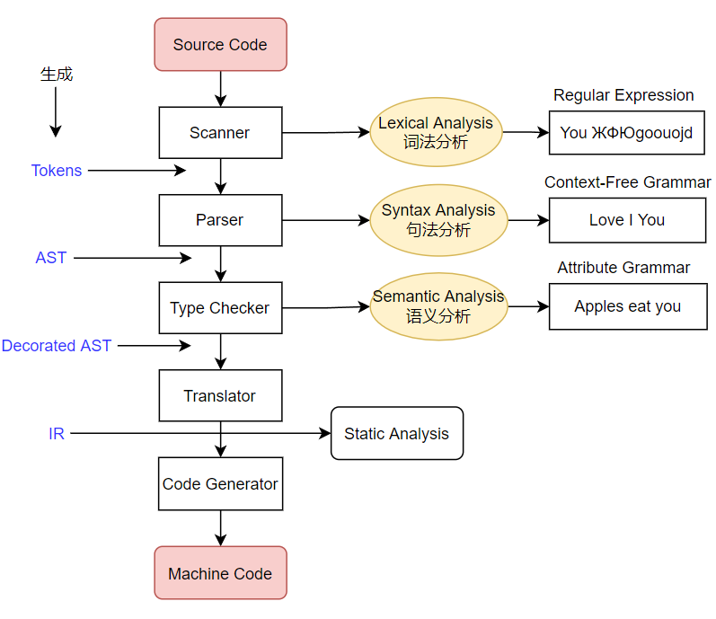
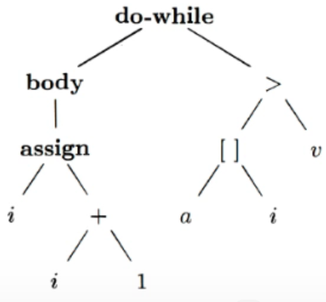
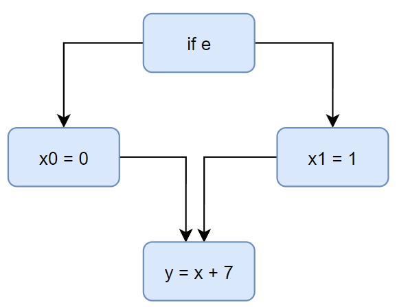
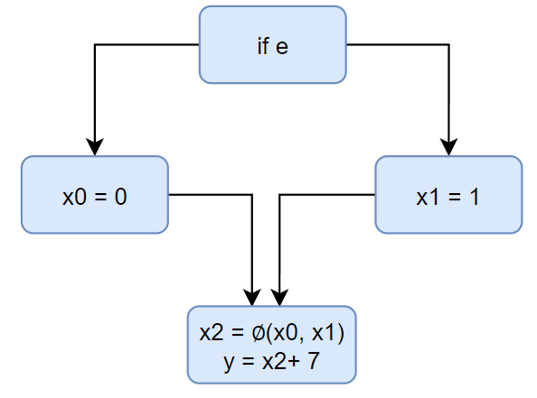
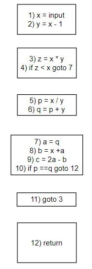
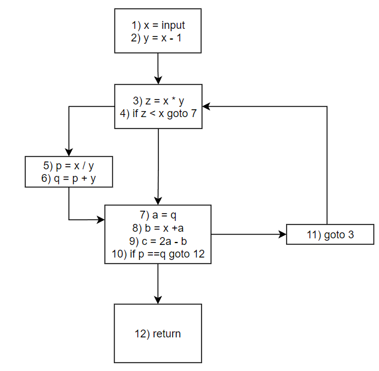

# Intermediate Representation

## Compilers & Static Analyzers

静态分析和编译器的关系？



如上图；

1. Source Code通过Scanner生成了Tokens，Scanner完成了词法分析，根据正则表达式（Regular Expression）对不合法的词语进行处理，最后将每个合法的词生成一个tokens；
2. Paser进行语法分析，也可以称句法分析，根据上下文无关文法（Context-Free Grammar）将无法识别的词句进行处理，生成了AST（抽象语法树）；这里不用上下文敏感文法而言，因为是上下文无关文法用来表述程序语法已经足够，否则将会导致分析编程语言时效率十分低下；
3. Type Checker进行语义分析，例如上图中的`Apples eat you`，编译器进行简单的语义分析，例如类型检查的错误，根据Attribute Grammar的规则来进行处理，最后生成装饰后的抽象语法树（Decorated AST），其中包含检查过的类型信息等；
4. 前面步骤都通过后，如果编译器需要对程序进行后期优化，还需要使用转换器（Translator）进行转换，转换为中间表现形式IR，通常指的是三地址码。
5. 之后要使机器执行还需要代码生成器（Code Generator）来生成相应的机器码。

这里可以简单地称IR生成前为前端，转换器生成IR后为后端。

## AST vs. IR

为什么说通过在三地址码上分析利于静态分析器的分析？为什么不能直接在AST上分析呢？

下面有一个例子。

```c++
do{
	i = i + 1;
}while(a[i]<v);
```

对于上面的代码会有如下的AST；



<div align="center">
    <p>
        根节点标识为`do-while`循环；
    </p>
    <p>
        左孩子为body循环体，其中有assign，左孩子为i,右孩子为+，而进行加法操作的则为i和1，表示为i = i + 1；
    </p>
    <p>
        右孩子为条件表达式，>的左孩子为[]，对应的是数组a的下标为i的元素，而比较的另一方为v；
    </p>
</div>

对应的IR - 三地址码（"3-address" form）为：

```
1: i = i + 1
2: t1 = a [ i ]
3: if t1 < v goto 1
```

其中1、2、3标记了语句在程序中的位置。

生成一个临时变量t1，该变量与v进行比较，如果t1<v，则会goto第一条语句，进入一个循环。

比较起来有如下的差别：

AST

- high-level and closed to grammar structure - 更高层并且贴近语法结构
- usually language dependent - 通常依赖不同语言，因为更贴近语法结构，每个语言会有自己不同的语法结构
- suitable for fast type checking - 遍历AST的时候，更方便取类型进行类型检查
- lack of control flow information - 缺少控制流的表达信息

IR

- low-level and closed to machine code - 更底层并且贴近汇编机器码
- usually language independent - 通常不太依赖高级语言的语法结构，因为更贴近机器码，而很多高级语言都能转化为汇编语言
- compact and uniform - 更加压缩化统一化
- contains control flow information - 能够包含体现控制流的信息
- usually considered as the basis for static analysis - 通常被认为是静态分析的基础


## IR:Three-Address Code(3AC)

There is at most one operator on the right side of an instruction.

如果要求只能有两个操作数和一个操作符，例如下面的

```
t1 = a + b +3
```

需要被转化成：

```
t2 = a + b
t1 = t2 + 3
```

为什么被称作三地址码呢？

这里的地址并非真实的地址，而是概念上的地址，每个三地址码最多包含三种地址（元素）。

对于上面的表达式，有：

- Name: a,b
- Constant: 3
- Compiler-generated temporary: t1, t2

每种指令都有自己对应的三地址码，对于下列的三地址码表达式：

```
x = y bop z
x = uop y
x = y
goto L
if x goto L
if x rop y goto L
```

有如下解释：

```
x, y, z: addresses - 上面表达式中的x,y,z可以是name, constant 或者是compiler-generated temporary。
bop: binary arithmetic or logical operation - 二元操作符，即加减运算或者逻辑操作与或非
uop: unary operation(minus, negation, casting) - 一元操作符，即类型转换、取反等等
L: a label to represent a program location - 程序指令的地址标签
rop: relational operator(>, <, ==, >=, <=, etc.) - 比较类型的操作符
goto L: unconditional jump - 无条件跳转
if ... goto L: conditional jump - 满足条件的跳转
```

这是形式上的三地址码，而真实的三地址码会复杂很多，例如Soot。

## Soot: 3AC in Real Static Analyzer

Soot是最有名的JAVA静态分析框架；

Soot's IR is Jimple - Soot的中间表示层为Jimple，是一种 typed 3-address code；

### For Loop

对于下列的JAVA代码：

```java
package nju.sa.examples;
public class ForLoop3AC{
    public static void main(String[] args){
		int x = 0;
        for(int i = 0; i < 10; i++)
            x = x + 1;
    }
}
```

下面是这个`For Loop`类型的三地址码。

```
public static void main(java.lang.String[]){
	java.lang.String r0;
	int i1;
	
	r0 := @parameter0: java.lang.String[];  
	i1 = 0;
	
label1:
	if i1 >= 10 goto label2;
	i1 = i1 + 1;
	goto label1;

label2:
	return;
}
```

1. 对于

```
	java.lang.String r0;
	int i1;
```

这里对r0和i1变量进行了声明，`java.lang.String`和`int`作为数据类型；

2. 对于

```
	r0 := @parameter0: java.lang.String[];  
	i1 = 0;
```

这里是对已经声明的变量进行赋值操作，但是这里并不是真正赋值，要知道三地址码只是对程序代码进行标记，以利于静态分析器进行分析。

可以看到的是，对于r0变量的赋值操作，将传入的数组java.lang.String[]中的参数赋值给r0，而对于i1，则是for循环里定义的变量i。

3. 对于

```
label1:
	if i1 >= 10 goto label2;
	i1 = i1 + 1;
	goto label1;
```

在标签label1中，存在三条语句。

`if i1 >= 10 goto label2`，表示变量i1大于等于10时，跳转到label2标签。

程序流继续向下，i1=i1+1，进行一次增操作。

最后跳转回label1，继续for循环。

可以看到，这里的形式非常像汇编代码。

4. 对于

```
label2:
	return;
```

则是跳出for循环后，程序运行结束。

### Do-While Loop

对于do-while类型的Java代码，三地址码是什么样子的呢？

```java
package nju.sa.examples;
public class DoWhileLoop3AC{
    public static void main(String[] args){
        int[] arr = new int[10];
		int i = 0;
        do{
            i = i + 1;
        } while (arr[i] < 10);
    }
}
```

对应的三地址码为：

```
public static void main(java.lang.String[]){
	java.lang.String[] r0;
	int[] r1;
	int $i0, i1;
	
	r0 := @parameter0: java.lang.String[]; 
    r1 = newarray (int)[10];
    i1 = 0;

label1:
	i1 = i1 + 1;
	$i0 = r1[i1];
	if $i0 < 10 goto label1;
	return;
}
```

分析可以人为分成两部分考虑：

1. 变量的声明与初始化；

2. 程序流；

首先按照惯例，会先对变量进行声明，有`r0`:传入的数组元素，`r1`定义的一个int型数组，`$i0`是一个，`i1`是一个int型的变量。接着就是对这些变量的赋值。其中可以看到在对数组进行初始化的时候，`r1 = newarray (int)[10]`，其实看起来就很像C++里的`new int[10]`的方式。

在label1标签中，i1累加1，变量$i0被赋值为r1数组中的元素，然后拿该元素与10进行比较，如果小于10就进入循环，否则return。

### Method Call

函数调用的三地址码如何呢？

对于下列示例

```java
package nju.sa.examples;

// 字符串拼接
public calss MethodCall3AC{
	String foo(String para1, String par2){
		return para1 + " " + para2;
	}
	
	public static void main(String[] args){
		MethodCall3AC mc = new MethodCall3AC();
		String result = mc.foo("hello", "world");
	}
}
```

foo有如下的三地址码

```
java.lang.String foo(java.lang.String, java.lang.String){
	nju.sa.examples.MethodCall3AC r0;
	java.lang.String r1, r2, $r7;
	java.lang.StringBuilder $r3, $r4, $r5, $r6;
	
	r0 := @this: nju.sa.examples.MethodCall3AC;
	r1 := @parameter0: java.lang.String;
	r2 := @parameter1: java.lang.String;
	$r3 = new java.lang.StringBuilder;
	
	specialinvoke $r3.<java.lang.StringBuilder: void <init>()>();
	$r4 = virtualinvoke $r3.<java.lang.StringBuilder: java.lang.StringBuilder append(java.lang.String)>(r1);
	$r5 = virtualinvoke $r4.<java.lang.StringBuilder: java.lang.StringBuilder append(java.lang.String)>(" ");
	$r6 = virtualinvoke $r5.<java.lang.StringBuilder: java.lang.StringBuilder append(java.lang.String)>(r1);
	$r7 = virtualinvoke $r6.<java.lang.StringBuilder: java.lang.String toString()>();
	
	return $r7;
}
```

还是一样，分为两部分考虑，变量声明和初始化。

`r0 := @this: nju.sa.examples.MethodCall3AC`，r0指向了当前类。

`r1, r2`为String类型。

`$r3`实际上是调用了StringBuilder类，这是Java用来进行字符串操作的类。

用`specialinvoke`来调用`$r3`的构造函数（上面`$r3`是StringBuilder类的一个实例）。`<java.lang.StringBuilder: void <init>()>`是一个`Method Signature`，`Method Signature`一般格式为`class name: return type, method name(parameter1 type, parameter2 type ...)`；例如这个例子中，`java.lang.StringBuilder`为class name，void为返回类型，这里面并没有参数。

同理的，下面的操作是不断进行字符串拼接，`virtualinvoke`用来调用method，这里的method显然是`append()`。

再来看看main的三地址码；

```
public static void main(java.lang.String[]){
	java.lang.String[] r0;
	nju.sa.examples.MethodCall3AC $r3;
	
	r0 := @parameter0: java.lang.String[];
	$r3 = new nju.sa.examples.MethodCall3AC;
	
	specialinvoke $r3.<nju.sa.examples.MethodCall3AC: void <init>()>();
	virtualinvoke $r3.<nju.sa.examples.MethodCall3AC: java.lang.String foo(java.lang.String, java.lang.String)>("hello","world");
	return;
}
```

同样的，new一个类的实例`$r3`，`specialinvoke`调用该类的构造函数，`virtualinvoke`调用该类的函数`foo()`，对应的参数是两个字符串类型的parameter：`"hello"`，`"world"`；

### Class

对于下面的代码

```java
package nju.sa.examples;
public class Class3AC{
	public static final double pi = 3.14;
	public static void main(String[] args){
	
	}
}
```

有如下的三地址码；

```
public class nju.sa.exampels.Class3AC extends java.lang.Object{
	public static final double pi;
	
	public void <init>(){
		nju.sa.exampels.Class3AC r0;
		r0 := @this: nju.sa.examples.Class3AC;
		specialinvoke r0.<java.lang.Objet: void <init>()>();
		return;
	}
	
	public static void main(java.lang.String[]){
		java.lang.String[] r0;
		r0 := @parameter0: java.lang.String[];
		return;
	}
	
	public static void <clinit>(){
		<nju.sa.examples.Class3AC: double pi> = 3.14;
		return;
	}
}
```

首先是对pi的一个声明；

然后是默认生成的`<init>`构造函数；

其中有一个`clinit`,它是一个类的静态初始化函数，在引用一个变量时，会将这个变量加载，可以看到，在类`Class3AC`中，定义了static类型的一个变量pi，所以pi这个变量会通过`clinit`加载进来。

## Static Single Assignment(SSA)

** Optional material

### What is SSA

另一种AR的格式，SSA-Static Single Assignment；

All assignments in SSA are to varuiables with distinct names

- Give each definition a fresh name - 每个定义都有独自的名字
- Propagate fresh name to subsequent uses
- Every varible has exactly one definitoin - 每个变量都有确切的一个定义

例如：
在3AC中，有：

```
p = a + b
q = p - c
p = q * d
p = e - p
q = p + q
```

而在SSA中，则有：

```
p1 = a + b
q1 = p1 - c
p2 = q1 * d
p3 = e - p2
q2 = p3 + q1
```

What if a varibale use is at control flow merges?

对于控制流的汇合处，如何判断引用的是x0还是x1呢？



SSA引入了∅的概念：

- A sepcial merge operator, ∅ (called phi-funciton), is introduced to select the values at merge nodes.
- ∅(x0, x1) has the value x0 if the control flow passes through the true part of the conditional and the value x1 otherwise.



新建了一个变量x2，如果走了x0的分支，则x2的值为x0，反之则反。

### Why SSA

- Flow infortmation is indirectly incorporated into the unique variable names - 程序流间接包含了独特的变量名
  - May help deliver some simpler analyses, e.g., flow-insensitive analysis gains paartial precision of flow-sensitive analysis via SSA
- Define-and-Use pairs are explicit - 变量很明确
  - Enable more effective data facts storage and propagation in some on-demand tasks
  - Some optimization tasks perform better on SSA(e.g., conditional constant propagation, global value numbering)

### Why not SSA

- SSA may introduce too many variables and phi-functions - 引入了太多的变量和∅
- May introduce inefficiency problem when translating to machine code(due to copy operations) - 转换为机器码太冗杂

## Control Flow Analysis

- Usually refer to building Control Flow Graph 
- Control Flow Graph node -> Basic Blocks

Input: 3AC of Program P -> 

Intermediation: Basic Blocks -> 

Output: CFG of Program P)

通常在控制流程图上进行静态分析，而每一个流程图的结点是Basic Block；

### Basic Blocks(BB)

- Basic Blocks are maximal sequences of consecutive three-address instructions with the properties that
  - It can be entered only at the beginning, i.e., the fisrt instruction in the block
  - It can be exited only at the end, i.e., the last instruction in the block

Basic Blocks出入口分别对应basic block中的第一条指令和最后一条指令。

对于下面的3AC，如何建立basic block呢？

```
x = input
y = x - 1
z = x * y
if z < x goto 7
p = x / y
q = p + y
a = q
b = x + a
c = 2a - b
if p == q goto 12
goto 3
return
```

那么根据bb的性质，Basic Blocks出入口分别对应basic block中的第一条指令和最后一条指令，并且bb应当是maximal的，所以按照goto来区分会比较容易。

举例说，1、2可以组成一个bb，但是3不能添加到这个bb中，因为在第11行的指令为`goto 3`，这样bb的一个入口就为bb中的第3行了，这和bb的性质相违背。

因此最后的bb集为：



总结的规则为：

1. Determine the leaders in P (1)
   1. Any target instruction of a conditional or unconditional jump is a leader (3, 5, 7)
   2. Any instruction that immediately follows a conditional or unconditional jump is a leader (5, 11, 12)
2. Build BBs for P
   1. A BB consists of a leader and all its subsequent instructions until the next leader

### Control Flow Graphs(CFG)

BBs + edge = Graphs

两个规则：

1. 顺序
2. 有条件goto，无条件goto且goto的目标与当前指令不相邻
3. Entry + End



## Important Point

- The relation between compilers and static analyzers
- Understand 3AC and its common forms (in IR jimple)
- How to build basic blocks on top of IR?
- How to construct control flow graphs on top of BBs?
