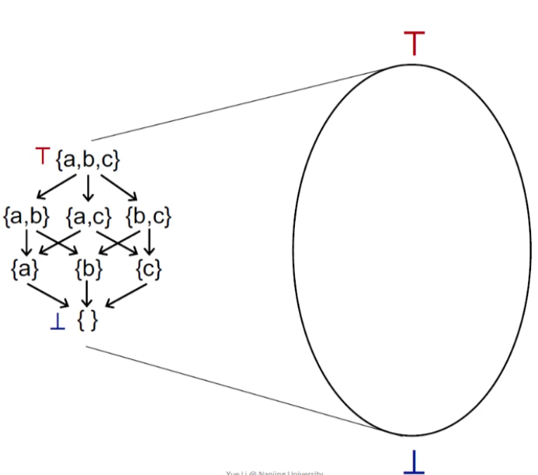
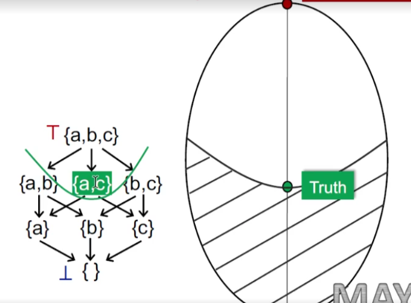

# Data Flow Analysis -- Foundations

## Contents

- Iterative Algorithm, another view
- Partial Order
- Upper and Lower Bounds
- Lattice, Semilattice, Complete and Product Lattice
- Data Flow Analysis Framework via Lattice
- Monotonicity and Fixed Point Theorem

- Relate Iterative Algorithm to Fixed Point Theorem
- May/Must Analysis, A Lattice View
- Distributivity and MOP
- Constant Propagation
- Worklist Algorithm

涉及到：数学理论和证明，内容概念抽象而繁杂。

## Iterative algorithm

> This general iterative algorithm produces a soluiton to data flow analysis.

### For May&Forward  Analysis

- OUT[entry] = ∅
- OUT[B]=∅
- $OUT[B] = IN[B]=∪_{P \space a \space predecessor \space of \space B}OUT[P], \space gen_B \space ∪ \space (IN[B] - kill_B) $

这是上一节课所总结的内容，现在从另一个角度来分析；

#### View Iterative Algorithm in Another Way

- Given a CFG(program) with k nodes, the iterative alogrithm updates OUT[n] for every node n in each iteration

- Assume the domain of the values in data flow analysis is V, then we can define a k-tuple.
  $$
  (OUT[n_1], OUT[n_2], ... ,OUT[n_k])
  $$
  as an element of set ($V_1 × V_2 × ...×V_k$) denoted as $V^k$, to hold the values of the analysis after each iteration.

- Each iteration can be considered as taking an action to map an elemtn of $V^k$ to a new element of $V^k$, through applying the transfer functions and control-flow handing, abstracted as a function $F:V^k$->$V^k$

- Then the algorithm outputs a series of k-tuples is the same as the last one in two consecutive iterations.

#### Sample

可以看到：

- 红色部分的代码可以视为初始化的过程；

  `init` => (⊥, ⊥, ..., ⊥) = $X_0$

  (⊥, ⊥, ..., ⊥)是一个k-tuple，用bottom表示其元素；

- 黄色部分的代码作为迭代的条件

  when

  ​	`iter i` => (${v_1}^i,{v_2}^i,...,{v_k}^i$) = $F(X_{i-1})$

  exists

  ​	`iter i+1` => (${v_1}^{i},{v_2}^{i},...,{v_k}^{i}$) = $F(X_i)$

  即：

  ​	$X_i = X_{i+1}$ => $X_i=X_{i+1}=F(X_i)$

  则达到不动点，退出循环；

- 绿色部分的代码迭代的操作

  `iter 1` => (${v_1}^1,{v_2}^1,...,{v_k}^1$) = $X_1$ = $F(X_0)$

  `iter 2` => (${v_1}^2,{v_2}^2,...,{v_k}^2$) = $X_2$ = $F(X_1)$

  ...

  `iter i` => (${v_1}^i,{v_2}^i,...,{v_k}^i$) = $X_i$ = $F(X_{i-1})$

由此得到的结论是：

$X$ is a fixed point of function $F$ if $X=F(X)$ => The iterative algorithm reaches a fixed point.

partial means for a pair of set elements in P, they could be incomparable; in other words, not necessary that every pair of set elements must statisfy the ordering $\sqsubseteq$. 不一定所有元素都需要满足.

## Some Question

The iterative alogrithm (or the IN/OUT equation system) produces a solution to a data flow analysis

- Is the algorithm guaranteed to terminate orreach the fixed point, or does it always have a soluiton?

  所有的data flow的分析都可以使用吗，一定都能达到不动点吗？

- If so, is there only one solution or only one fixed point? If more than one, is our solution the best one(most precise)?

  如果不动点成立，它只有一个吗，是最精确的吗？

- When will the algorithm reach the fixed point, or when can we get the solution?

  什么时候能到不动点？

### Partial Order

> 偏序集poset(PartiallyOrdered set), We define poset as a pair(P, $\sqsubseteq$) where $\sqsubseteq$ is a binary relation that defines a partial ordering over P, and $\sqsubseteq$ has the following properties:
>
> ​	(1) *Reflexivity自反性*: $\forall x \in P, x \sqsubseteq x$
>
> ​	(2) *Antisymmetry反对称性*$\forall x,y \in P,x \sqsubseteq y \land y \sqsubseteq x $ => $x=y$
>
> ​	(3) *Transitivity传递性*$\forall x,y,z \in P, x \sqsubseteq y \land y \sqsubseteq z$ => $x \sqsubseteq z$
>
> 满足这三个性质的set为poset

#### Sample 1

Is ($S, \sqsubseteq$) a poset where S is a set of integers and $\sqsubseteq$ representes $\leq$ (less than or equal to)?

当S是整数集合时，S是poset吗？

(1) *Reflexivity*: 1 <= 1, 2 <= 2

(2) *Antisymmetry*: 1 <= 1 $\land$ 1 <= 1 then 1 = 1

(3) *Transitivity*: 1 <= 2 $\land$ 2 <= 3 then 1 <= 3

因此$S$为opset；

#### Sample 2

Is ($S, \sqsubseteq$) a poset where S is a set of integers and $\sqsubseteq$ representes $<$ (less than)?

当S是整数集合时，S是poset吗？

(1) *Reflexivity*: 1 < 1, 2 < 2	----不满足

#### Sample 3

Is ($S, \sqsubseteq$) a poset where S is a set of `English words` and $\sqsubseteq$ representes the `substring` relation, i.e., $s1\sqsubseteq s2$ means s1 `is a substring` of s2?

当S是满足上述条件的英文单词集合，S是opset吗？

S such as :

(1) *Reflexivity*: 每个string是否为自己的substring？符合

(2) *Antisymmetry*: string是自己的substring，反过来还是。符合

(3) *Transitivity*: in $\in$ sing, sing $\in$ singing => in $\in$ singing 符合

### Upper & Lower Bounds

> Given a poset(P,$\sqsubseteq$) and its subset S that S $\subseteq$ P, we say that u $\in$ P is an upper bound of S, if $\forall x \in S, x \sqsubseteq u$.Similarly, we say that l $\in$ P is an lower bound of S, if $\forall x \in S, l \sqsubseteq x$.

#### Sample 1

对于S：

upper bound => {a, b, c}

lower bound => {}

> We define the `least upper bound 最小上界`(lub or join) of S, written $\sqcup$S, if for every upper bound of S, say u,  $\sqcup$S $\sqsubseteq$ u. Similarly, We define the `greatest lower bound 最大下界`(glb or meet) of S, written $\sqcap$S, if for every upper bound of S, say l, l $\sqsubseteq$ $\sqcap$S.

#### Sample 2

对于S：

upper bound => {a, b, c}, {a, b}

least upper bound (join or lub,) => {a, b}

lower bound => {}

greast lower bound (meet or glb, ) => {}

#### Properties

- Not every poset has `lub` or `glb`

- But if a poset has lub or glb, it will be unique

  > *Proof.*
  >
  > ​	assume $g_1$ and $g_2$ are both glbs of poset P according to the definition of glb
  > $$
  > g_1 \sqsubseteq (g_2 = \sqcap P) ,\space  g_2 \sqsubseteq(g_1 = \sqcap P)
  > $$
  > ​	by the *`antisymetry`* of partiallyordered set => $\sqsubseteq g_1=g_2$

### Lattice

> Given a poset(P, $\sqsubseteq$), $\forall a, b \in P, if \space a \sqcup b$ and $a \sqcap b$ exists, then (P, $\sqsubseteq$) is called a lattice.
>
> A poset is a lattice if every pair of its elements has a least upper bound and ag reatest lower bound.

#### Sample 1

Is(S, $\sqsubseteq$) a lattice where S is a set of integers and $\sqsubseteq$ represents <= (less than or equal to)?

The $\sqcap$ operator means "min", The $\sqcup$ operator means "max". so yes.

#### Sample 2

Is ($S, \sqsubseteq$) a lattice where S is a set of `English words` and $\sqsubseteq$ representes the `substring` relation, i.e., $s1\sqsubseteq s2$ means s1 `is a substring` of s2?

必须要满足任意元素的最小上界和最大下界都存在，但是pin和sin显然没有共同的最小上界。 so no.

#### Sample 3

The $\sqcap$ operator means $\cap$, The $\sqcup$ operator means $\cup$. so yes.

### Semilattice

> Given a poset(P, $\sqsubseteq$), $\forall a, b \in P$,
>
> if only $a \sqcup b$ exists, then (P, $\sqsubseteq$) is called a join semilattice.
>
> if only $a \sqcap b$ exists, then (P, $\sqsubseteq$) is called a meet semilattice.

### Complete Lattice

> Given a lattice(P, $\sqsubseteq$), for arbitrary subset S of P, if $\sqcup S$ and $\sqcap S$ exist, then (P, $\sqsubseteq$) is call a complete lattice.
>
> All subsets of a lattice have a least upper bound and a greatest lower bound.

#### Sample 1

Is(S, $\sqsubseteq$) a `complete lattice` where S is a set of integers and $\sqsubseteq$ represents <= (less than or equal to)?

For a subset $S^+$ including all positive integers, it has no $\sqcup S^+$($+\infty$)

整数集本身是无穷的，无边界的。

#### Sample 2

Yes. The definition of bounds implies that the bounds are not necessarily in the subsets(but they must be in the lattice)

#### Top & Bottom

> Every complete lattice (P, $\sqsubseteq$) has 
>
> - a greatest element T = $\sqcup P$ called top 
>
> - a least elemtent ⊥ = $\sqcap P$ called bottom
>
> Every finite lattice (P is finite) is a complete lattice. 有穷格是完全格，但是完全格不一定是有穷格（0,1之间的实数集）。

### Product Lattice

> Given lattices $L_1=(P_1, \sqsubseteq_1),L_2=(P_2,\sqsubseteq_2),...,L_n=(P_n,\sqsubseteq_n)$, if for all i, $(P_i, \sqsubseteq_i)$has $\sqcup_i$(least upper bound) and $\sqcap_i$(greatest lower bound), then we can have a `product lattice` $L^n = (P, \sqsubseteq)$ that is defined by:
>
> - 值域：$ P = P_1 × P_2 × \space ... \space × P_n$
> - two element to opset：$(x_1, \space ... \space x_n ) \sqsubseteq (y_1, \space ... \space y_n)$ <=> $(x_1 \sqsubseteq y_1) \and ... \and (x_n \sqsubseteq y_n)$
> - 下界关系：$(x_1, \space ... \space x_n ) \sqcup (y_1, \space ... \space y_n)$ = $(x_1 \sqcup_1 y_1, ... , (x_n \sqcup_n y_n)$
> - 上界关系：$(x_1, \space ... \space x_n ) \sqcap (y_1, \space ... \space y_n)$ = $(x_1 \sqcap_1 y1 , ... , (x_n \sqcap_n y_n)$
>
> A product lattice is a lattice
>
> If a product lattice L is a product of complete lattices, then L is also complete

### Data Flow Analysis Framework via Lattice

> A data flow analysis framework (D, L, F) consists of:
>
> - *D*：a `direction` of data flow: forwards or backwards
> - *L*：a `lattice` including domain of the values V and a meet $\sqcap$ or join $\sqcup$ operator
> - *F*：a family of `transfer funcitons` from V to V

#### Sample

对于如上的例子，先看左边，

- 假设已知：

  - Direction: Forward

  - Merge: Union

  - OUT[s1]={a}， OUT[s3]={b}

  可以得到：

  - IN[s2]={a,b}；

那么以上操作对应右侧，有：

- May Analysis从bottom开始：
  - 初始化空{}，对应a,b,c的subset为{0,0,0}；
  - OUT[s1],OUT[s3]得到的IN[S2]={a,b}，是一个向上汇聚的过程

而由IN到OUT需要做一个`F: tansfer function`操作；

> Data flow analysis can be seen as iteratively applying transfer functions and meet/join operations on the values of a lattice

## Review the questions

- Is the algorithm guaranteed to terminate orreach the fixed point, or does it always have a soluiton?

  所有的data flow的分析都可以使用吗，一定都能达到不动点吗？

  - Recall "OUT never shrinks" It is about monotonicity. Lattice上的单调性问题。
  - 关联问题？Now what we have just seen is the property(fixed point theorem) for the function on a lattice. We cannot say our iterative algorithm also has that property unless we can relate the algorithm to the fixed point theorem, if possible.

- If so, is there only one solution or only one fixed point? If more than one, is our solution the best one(most precise)?

  如果不动点成立，它只有一个吗，是最精确的吗？

  - 对于$X=F(X)$的函数不动点，一个函数可以有多个不动点。还有一个问题待解决。Iterative algorithm 从初始化开始递归，需要走到哪一个不动点？哪一个精确呢？

- When will the algorithm reach the fixed point, or when can we get the solution?

  什么时候能到不动点？

### Monotonicity

> A function f: L -> L (L is a lattice) is monotonic if $\forall x, y \in L, x \sqsubseteq y$ => $f(x) \sqsubseteq f(y)$

### Fixed-Point Theorem

> Given a complete lattice(L, $\sqsubseteq$), if:
>
> ​	f: L -> L is monotonic & L is finite, 
>
> 前提是：全格 + 单调 + 有限
>
> then, 
>
> the least fixed point of f can be found by iterating
>
> - $f(⊥), f(f(⊥)), ... ,f^k(⊥)$ until a fixed point is reached
>
> 单调 + 由⊥迭代 => 最小不动点
>
> the greastest fixed point of f can be found by iterating
>
> - $f($T$)$, $f(f($T$))$, ... ,$f^k($T$)$ until a fixed point is reached
>
> 单调 + 由T迭代 => 最大不动点

若要证明最小不动点成立，需要证明：

- 不动点存在
- 不动点最小

若要证明最大不动点成立，需要证明：

- 不动点存在
- 不动点最大

#### Existence of Fixed Point

如何证明不动点的存在？

> *Proofs.*
>
> Bt the definition of ⊥ and f: L -> L, we have
> $$
> ⊥ \sqsubseteq f(⊥),\space f(⊥) \in L
> $$
> As f is monotonic, we have
> $$
> f(⊥) \sqsubseteq f(f(⊥)) = f^2(⊥),\space f(⊥) \sqsubseteq f^2(⊥)
> $$
>
> $$
>  f(⊥) \in L, \space f^2(⊥) \in L
> $$
>
> 
>
> Similarly (by repeatedly applying f), we have
> $$
> ⊥ \sqsubseteq f(⊥) \sqsubseteq f^2(⊥) \sqsubseteq ... \sqsubseteq f^i(⊥)
> $$
> As L is finite, for some k, we have
> $$
> f^{Fix} = f^k(⊥) = f^{k+1}(⊥)
> $$
> Thus, the fixed point exists.

#### Least Fixed Point

证明最小不动点？

> *Proof.*
>
> Assume we have another fixed point x, i.e., x = f(x)
>
> By the definition of ⊥, we have ⊥ $\sqsubseteq $ x
>
> Induction begins:
>
> As f is monotonic, we have
> $$
> f(⊥) \sqsubseteq f(x)
> $$
> Assume $f^i(⊥) \sqsubseteq f^i(x)$, as f is monotonic, we have
> $$
> f^{i+1}(⊥) \sqsubseteq f^{i+1}(x)
> $$
> Thus by induction, we have
> $$
> f^i(⊥) \sqsubseteq f^i(x)
> $$
> Thus $f^i(⊥) \sqsubseteq f^i(x)=x$, then we have
> $$
> f^{Fix}=f^k(⊥) \sqsubseteq x
> $$
> Thus the fied point is the least.

#### Greatest Fixed Point

参考最小不动点的证明，可以得到：
$$
x \sqsubseteq f^k(⊥)=f^{Fix}
$$

## Relate Iterative Algorithm to Fixed-Point Theorem

如何关联呢？

> If a product lattice $L^k$ is a product of complete (and finite) lattices, i.e., (L, L, ..., L), then $L^k$ is also complete (and finite)
>
> In each iteration, it is equivalent to think that we apply `function F` which consists of 
>
> - transfer function f: L -> L for every node <=> 对于每个node应用transfer function
> - join/meet function $\sqcap$/$\sqcup$: L × L -> L for control-flow confluence <=> merge时进行处理，应用join或meet

已经证明了是有限的，现在需要证明的是function F是否是单调的。

$Gen, Kill$ function is monotonic => transfer function is monotonic

Is join/meet function monotonic?

> To prove join is monotonic =>
>
> *Proof.*
>
> $\forall x, y, z \in L, \space x \sqsubseteq y$, we want to prove $x \sqcup z \sqsubseteq y \sqcup z$ => 意味着 进行join操作后，仍然满足单调关系
>
> by the definition of $\sqcup, \space y \sqsubseteq y \sqcup z$ => join求的是两个元素的最小上界，所以 y join z 会满足$\space y \sqsubseteq y \sqcup z$
>
> by transitivity of $\sqsubseteq, \space x \sqsubseteq y \sqcup z$ => 由于$x \sqsubseteq y$，根据传递性，可以得到$x \sqsubseteq y \sqsubseteq y \sqcup z$
>
> thus $y \sqcup z$ is an upper bound for x, and also for z (by $\sqcup$'s definition) => $y \sqcup z$为x的上界，y和z的最小上界
>
> as $x \sqcup z$ is the least upper bound of x and z => $x \sqcup z$是x,z的最小上界，最小上界小于$y \sqcup z$(上界)
>
> thus $x \sqcup z \sqsubseteq y \sqcup z$

同理可证meet；

## When will the algorithm reach the fixed point? 

> The height of a lattice $h$ is the length of the longest path from Top to Bottom in the lattice. 

对于上图的例子而言，其高度$h=3$；

现在需要求得到不动点需要的迭代次数$i$；

在每次迭代中，假设往一个方向上的每一次迭代只有一个结点的变化，例如0->1。

假设lattice高度为h，而结点个数为k，最坏情况下，相当于每一个结点从空到"满"，从bottom->top，每一个结点需要处理h次，则需要的迭代次数为h*k；

## May&Must Analysis from a lattice view

通过lattice的角度，用图例说明上述结论。

假设lattice是一个product lattice。

### May Analysis

目的是：unsafe result -> safe result

例如，Reaching Definition中：

程序开始时即为bottom，处于unsafe result（No definitions can reach所有变量都初始化了，因为作为一个查询错误的程序，所以如果一开始就表述结果为没有错误，就是一个unsafe的结果）。

当处于safe result（All definitions may reach），即查错程序认为程序的变量都有出现了reach的问题，但这是Safe but useless  result。因为作为查错程序，需要找出Truth。

查错程序停留在Truth时，即为所需要求得的result。

假设一个lattice为上图左边部分所示，{a,c}为Truth，那么Truth上即为safe，而Truth下为unsafe。那么如何知道有没有进入到Safe域。

在求解步骤中存在很多不动点，但是may analysis所求的是最小不动点。

处于精确度的考虑，最小不动点与Truth最相近，因此Least Fixed Point在Fixed Points中最为准确。

### Must Analysis

目的是：unsafe result -> safe result

以expressions available的优化程序为例，Top的初始为unsafe(All expressions must be available)，这就相当于程序还没有开始分析优化，就断定所有expression都available，都可以使用，所以是unsafe。

当运行到bottom时，是safe的，相当于所有expression都是不可用，这是一种safe的情况，但是没有相当于不需要再做优化，因此相当于一个safe but useless result。

因为Must Analysis允许漏报，但是不允许误报。如果处于unsafe域，在expressions availble检查中，如果误报，则程序分析会导致错误。

针对与该分析，must Analysis时，到达最大不动点时，进入safe域，最接近truth，因此最为精确。

## How Precise is our solution?

- Meet-Over-All-Paths Solution (MOP)

  > A path P from Entry to S：
  >
  > ​	P = Entry -> S1 -> S2 -> ... -> Si ；
  >
  > $F_P$作为transfer function，对每一个Statement，得出一个OUT，作为下一个statement的IN；

  MOP理解起来就是，把多条所有Path的结果join/meet => $MOP[S_i]= \sqcup /\sqcap $

  $F_P(OUT[Entry])$

  有一些路径不会执行，有一些程序会有循环没有边界，有一些程序路径数量很多，无穷枚举，这些结果不应该被join/meet；

  举一个例子：OUR Iterative Alogrithm vs. MOP

  

  上图是Iterative Alogrithm的做法，merge时join后在使用transfer function处理；

  而对于MOP，可以得到

  $MOP[S_4]=f_{S_3}(f_{S_1}(OUT[Entry])) \sqcup f_{S_3}(f_{S_2}(OUT[Entry]))$

  相当于merge时，先transfer function处理各个分支，再join；

  即表示为：
  $$
  Ours=F(x \sqcup y)
  $$

  $$
  MOP=F(x)\sqcup F(y)
  $$

  他们之间的关系是什么？

  

  得到$MOP \sqsubseteq Ours$；

  当F is distributive，F具有分配性，$F(x \sqcup y)=F(x) \sqcup F(y)$，则有$MOP=Ours$

  对于bit-vector or Gen/kill problems，Ours 几乎和MOP一样准；

  一个例子：

  [Constant Propagation]

  Given a variable x at program point p, determine whether x is *guaranteed* to hold a constant value at p.	-- must analysis

  - The OUT of each node in CFG, includes a set of pairs (x,v) where x is a variable and v is the value held by x after that node.

    > A data flow analysis framework(D, L, F)consits of:
    >
    > - D: a direction of data flow => [fowards]
    > - L: a lattice including domain of the values V and a meet or join operator
    > - F: a family of transfer functions from V to V

    - Lattice

      - Domain of the values V

        

        UNDEF: undefined

        NAC: not a constant

      - Meet Operator

        NAC $\sqcap$ v = NAC

        UNDEF $\sqcap$ v = v

        c $\sqcap$ v = ?

        - c $\sqcap$ c = c
        - c1 $\sqcap$ c2 = NAC

    - transfer function

      

  - Nondistributivity

    一个例子：

    

## Worklist Alogrithm, an optimization of Iterative Algorithm

Iterative Algorithm在OUT没有变化时才会停止迭代，而worklist algorithm则相反，只处理那些OUT变化的node;

对于Forward Analysis而言，将所有的bb放到worklist中，只要worklist不是空的，则选择一个worklist中的bb来进行transfer操作，如果操作后OUT变化了，则说明后面的bb的IN可能变化了，则将其所有后继加入到worklist中。

## Summary

- Iterative Algorithm, another view
- partial order
- upper and lower bounds
- lattice, semilattice, complete and product lattice
- data flow analysis framework via lattice
- monotonicity and fixed point theorem
- relate iterative algorithm to fixed point theorem
- may/must analysis, a lattice view
- MOP and distributivity
- constant propagation
- worklist algorithm

## Key Point

- Understand the functional view of iterative algorithm
- The definitions of lattice and complete lattice
- understand the fixed-point therorem
- how to summarize may and must analysis in lattices
- The relation between MOP and the solution produced by the iterative algorithm
- Constant propagation algorithm
- Worklist algorithm
