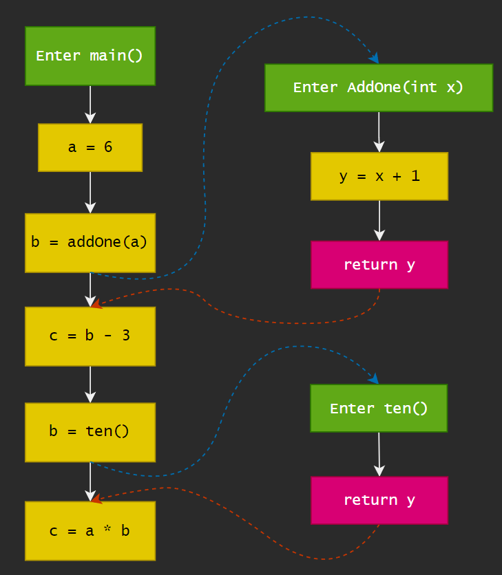

# Interprocedural Analysis

## Contents

- Motivation
- Call Graph Construction (CHA)
- Interprocedural Control-Flow Graph
- Interprocedural Data-Flow Analysis

## Motivation

### Problem of Intraprocedural Analysis

过程内分析，要如何分析函数调用？

- 最保守的假设：在常量传播检测(constant propagation)中，需要假设未知的变量不是常量，因此丢失了精度。

  ```
  void foo(){
  	int n = ten();
  	addOne(42);
  }
  
  int ten(){
  	return 10;
  }
  
  int addOne(int x){
  	int y = x + 1;
  	return y;
  }
  
  int main(){
  	foo()
  }
  ```

  对于foo()函数而言，结果应该是n=10，由于函数内的分析无法判断ten()返回的值是什么，一次你只能保守假设ten()返回了非常量的值。

因此需要过程间分析(interprocedural Analysis)，通过Graph中的边传递data flow，因此避免了过度假设导致的精度丢失。而call graph包含了点和有向边。

## Call Graph

> A representation of calling relationships in the program. Essentially, a call graph is a set of call edges from call-sites to their target methods.(callees)

以上面的函数调用为例子，有如下调用图：


调用图call graph在很多分析中都有所应用。

### Call Graph Construction for OOPLs

focus on JAVA

构造调用图的方法有：

- Class hierarchy analysis (CHA)
- Rapid type analysis (RTA)
- Variable type analysis (VTA)

- Pointer analysis (k-CFA)

以上的方法中，从上到下所得到的精度越高，但是效率有所降低。

在Java中有如下三种方法调用：

|                          |  Statck call   |                         Special call                         |               Virtual call               |
| :----------------------: | :------------: | :----------------------------------------------------------: | :--------------------------------------: |
|       Instruction        |  invokestatic  |                        invokespecial                         | 1) invokeinterface<br />2) invokevirtual |
|     Receiver objects     |       ×        |                              √                               |                    √                     |
|      Target methods      | Static methods | 1) Constructors<br />2) Private instance methods<br />3) Superclass instance methods |          Other instance methods          |
| Number of Target methods |       1        |                              1                               |            >=1(polymorphism)             |
|       Determinacy        |  Compile-time  |                         Compile-time                         |                 Run-time                 |

构造调用图的关键在于处理Virtual call；

#### Method Dispatch of Virutal call

During run-time, a virtual call is resolved based on:
$$
o^1.foo(...)^2;
$$

1. type of the receiver object(pointed by o)

2. method signature at the call site

如上，在程序运行时，virtual call需要对调用的实例方法进行resolve，这个过程设计到以上两个要素：

1. o指向的具体类型 c；
2. 调用时的方法签名 m；

对于签名signature：

- Signature = class type + method name + descriptor
  - Descriptor = return type + paramter types

即，对于下面的方法foo()而言：

```java
class C{
	T foo(P p, Q q, R r){
		...
	}
}
```

有如下的签名：`<C: T foo(P,Q,R)>`，定义缩写为：C.foo(P,Q,R)

由此可以定义一个函数`Dispatch(c, m)`，模拟动态时dispatch method的过程；


当c所包含的非抽象方法m'和m有相同的名字和描述时，即返回对应的m'，相当于知道了对应的method。否则，递归其父类，寻找符合条件的m'。

##### Sample

有以下例子：

```java
class A {
	void foo(){
		...
	}
}

class B extends A {
	
}

class C extends B {
    // overide
	void foo(){
		...
	}
}

void dispatch(){
	A x = new B();
	x.foo();
	
	A y = new C();
	y.foo();
}
```

那么对于`A x = new B(); x.foo();`，`Dispatch(B, A.foo())`对应哪一个方法呢？

1. 首先Dispatch会先查找B类中的foo()方法，但是B类中并没有声明任何方法；
2. 因此会到A类中寻找foo()方法，得到`Dispatch(B, A.foo())=A.foo()`；

那么对于`A y = new C(); y.foo();`，`Dispatch(C, A.foo())`对应哪一个方法呢？

1. 首先Dispatch会先查找C中的foo()方法，因为C中存在了foo()的声明，并且signature一致，因此对应的方法是`C.foo()`；

### 1-Class Hierarchy Analysis *(CHA)

- Require the class hierarchy information(inheritance structure) of the whole program - 需要程序中类的继承关系

- Resolve a virtual call based on the declared type of receiver variable of the call site - 需要根据声明类型resolve virtual call

  ```java
  A a = ...
  a.foo()
  ```

- Assume the receiver variable a may point to objects of class A or all subclasses of A - 查询A类的继承结构来找目标方法

  - Resolve target methods by looking up the class hierarchy of class A

#### call resolution of CHA

We define function Resolve(cs) to resolve possible target methods of a call site cs by CHA - 定义一种Resolve(cs)方法，来resolve可能被调用的目标函数。


- 首先初始化变量T；

- 用变量m存放call site对应方法的签名

- 对三种调用情况进行分别处理：

  - 对于static call，将签名直接存放到T中；

    对于：

    ```java
    class C{
    	static T foo(P p, Q q){
    		...
    	}
    }
    
    C.foo(x, y);
    ```

    可以得到：

    ```
    cs:	C.foo(x, y)
    m:	<C: T foo(P,Q)>
    ```

  - 对于special call

    - 对于处理Superclass instance method，有以下例子：

      ```java
      class C extends B {
      	static T foo(P p, Q q){
      		...
      		super.foo(p, q);
      	}
      }
      ```

      可以得到：

      ```
      cs:		super.foo(p, q);
      m:		<B: T foo(P,Q)>
      c^m:	B
      T = {Dispatch(c^m, m)} = {Dispatch(B, m)}
      ```
    
      这里还要做Dispatch是因为不知道B中是否含有对应的方法，也许B也是集成自另一个类的对应方法foo()；
    
    - 对于处理Private instance method或是Constructor，有以下例子：
    
      ```java
      class C extends B {
      	T foo(P p, Q q){
      		...
      		this.bar();
      	}
      	private T bar();
      }
      C c = new C();
      ```
    
  - 对于virtual call
  
    - 对于以下例子：
  
      ```java
      class C {
      	T foo(P p, Q q){
      		...
      	}
      }
      C c = ...
      c.foo(x, y)
      ```
  
      可以得到：
  
      ```
      cs:		c.foo(x, y)
      m:		<C: T foo(P, Q)>
      c:		C
      ```
  
      对应算法的处理，对当前类c以及每一个c的子类c'进行dispatch，保存结果到T；
  

#### Sample

存在以下程序：

```java
class A {
	void foo() {...}
}

class B extends A {}

class C extends B {
	void foo() {...}
}

class D extends B {
	void foo() {...}
}

void resolve(){
	C c = ...;
	c.foo();
	
	A a = ...;
	a.foo();
	
	B b = ...;
	b.foo();
}
```

其继承关系如图：


有：

1. Resolve(c.foo()) = {C.foo()} => 对当前类及其子类进行Dispatch => 没有子类，当前类包含target method => C.foo()
2. Resolve(a.foo()) = {A.foo(), C.foo(), D.foo()} => 对当前类及其子类进行Dispatch => 当前类包含foo() => 子类C、D包含foo()
3. Resolve(b.foo()) = {A.foo(), C.foo(), D.foo()} => 对当前类及其子类进行Dispatch => 当前类未包含，Dispatch到A => A包含foo() => 子类C、D包含foo()

若最后对b的声明中，`B b = new B(); b.foo();`。那么有：

Resolve(b.foo()) = {A.foo(), C.foo(), D.foo()}

根据算法，CHA中对于virtual call的处理，c只受声明类型的影响，这里虽然`new B()`，但本质类型还是`B`；

#### Features of CHA

- Fast
  - 只考虑声明类型以及继承关系
  - 忽略数据流、控制流信息
- imprecise
  - 简单的函数关系处理

CHA在IDE中有所应用；

#### Call Graph Construction

via CHA

- start from graph for whole program via CHA
- For each reachable method m, resolve target methods for each call site cs in m via CHA
- Repeat until no new method is discovered

##### Algorithm


构建调用图的过程如上；

- 首先进行初始化，三个数据结构：

  `WL`即为worklist，其中存储了需要进行处理的方法。初始化为入口方法$m^entry$；

  `CG`为调用边的集合；

  `RM`为reachable method，表示算法目前分析到的方法；

- 随机是一个while循环，不断从worklist中取出方法并处理，过程中也许会加入新的方法；在循环内部，从worklist中取出一个方法，判断是否分析到，如果分析过了，这次循环就跳过，如果没有分析过，则为新的方法，需要进行处理；

- 对新方法的处理，先加入到`RM`中，将该方法中所有的call site，对每一个call site进行resolve，得到的目标方法结果放在T中；

- 对T中的每一个目标方法，将call site到目标方法的边加入到CG中，再将发现的目标方法加入到worklist中，其中有可能存在未分析过的方法；

- 只要worklist非空，循环会一直进行；

- 当worklist为空，则返回了调用边的集合；

##### Sample

存在以下例子；

```java
class A{
    
    /* ----------
    	A.main()	-- Method
    	A.foo()		-- Call site
   	------------- */
	static void main(){
		A.foo();
	}
    
	/* ----------
    	A.foo()		-- Method
    	a.bar()		-- Call site
   	------------- */
	static void foo(){
		A a = new A();
		a.bar();
	}
    
	/* ----------
    	A.bar()		-- Method
    	c.foo()		-- Call site
   	------------- */
	void bar(){
		C c = new C();
		c.bar();
	}
}

class B extends A {
    // B.bar()		-- Method
	void bar() {}
}

class C extends A {
    /* ----------
    	C.bar()		-- Method
    	A.foo()		-- Call site
   	------------- */
	void bar(){
		if (...)
			A.foo();
	}
    
    // C.m()		-- Method
	void m() {}
}
```

对于上述代码，进行CHA算法，则有：

- 初始化，将入口方法`A.main()`存放到worklist中

  |  Worklist  | Call Graph | Reachable Method |
  | :--------: | :--------: | :--------------: |
  | [A.main()] |     {}     |        {}        |

- 判断该方法`A.main()`是否在`Reachable Method`中，如果不存在，则将方法`A.main()`从Worklist中取出，并将该方法放入`Reachable Method`中；

  | Worklist | Call Graph | Reachable Method |
  | :------: | :--------: | :--------------: |
  |    []    |     {}     |    {A.main()}    |

- 解出该方法中的每一个cs，当前cs只有一个，为`Resolve(A.foo())`，因为A.foo()为静态方法`static void foo()`，因此得到target method；

  ```
  Resolve(A.foo())={A.foo()}
  T = {A.foo()}
  ```

- 对于T中的每一个`target method`，添加`cs`到`target method`的边到`Call Graph`中，并将`target method`，即A.foo()添加到`Worklist`中；

  | Worklist  |                          Call Graph                          | Reachable Method |
  | :-------: | :----------------------------------------------------------: | :--------------: |
  | [A.foo()] |  |    {A.main()}    |

- 此时判断Worklist是否为空，不为空则继续resolve；

  | Worklist  |                          Call Graph                          | Reachable Method |
  | :-------: | :----------------------------------------------------------: | :--------------: |
  | [A.foo()] |  |    {A.main()}    |

- 判断该方法`A.foo()`是否在`Reachable Method`中，如果不存在，则将方法`A.foo()`从Worklist中取出，并将该方法放入`Reachable Method`中；

  | Worklist |                          Call Graph                          |  Reachable Method   |
  | :------: | :----------------------------------------------------------: | :-----------------: |
  |    []    |  | {A.main(), A.foo()} |

- 解出该方法中的每一个cs，当前cs只有一个，为`Resolve(a.bar())`。因为`A a = new A()`，相当于调用了类A的构造函数，resolve后根据dispatch的规则，将得到其子类的同签名target method，得到的target method放到T中；

  ```
  Resolve(a.bar())={A.bar(), B.bar(), C.bar()}
  T = {A.bar(), B.bar(), C.bar()}
  ```

- 对于T中的每一个`target method`，添加`cs`到`target method`的边到`Call Graph`中，并将`target method`添加到`Worklist`中；

  |          Worklist           |                          Call Graph                          |  Reachable Method   |
  | :-------------------------: | :----------------------------------------------------------: | :-----------------: |
  | [A.bar(), B.bar(), C.bar()] |  | {A.main(), A.foo()} |

- 此时判断Worklist是否为空，不为空则继续resolve；

- 取出`A.bar()`，判断`RM`中是否存在，不存在则枚举其所有的cs，得到`c.bar()`，对其进行Resolve(c.bar())，得到`C.bar()`；

  ```
  Resolve(c.bar())={C.bar()}
  T = {C.bar()}
  ```

- 对于T中的每一个`target method`，添加`cs`到`target method`的边到`Call Graph`中，并将`target method`添加到`Worklist`中；

  |      Worklist      |                          Call Graph                          |       Reachable Method       |
  | :----------------: | :----------------------------------------------------------: | :--------------------------: |
  | [B.bar(), C.bar()] |  | {A.main(), A.foo(), A.bar()} |

- 同理，对`B.bar()`中的cs进行resolve，由于`B.bar()`为空函数，则得到的`target Method`也为空，因此没有指向新的Method；

  | Worklist  |                          Call Graph                          |           Reachable Method            |
  | :-------: | :----------------------------------------------------------: | :-----------------------------------: |
  | [C.bar()] |  | {A.main(), A.foo(), A.bar(), B.bar()} |

- 同理，对`C.bar()`中的cs进行resolve，`resolve(A.foo())={A.foo()}`，得到：

  | Worklist |                          Call Graph                          |                Reachable Method                |
  | :------: | :----------------------------------------------------------: | :--------------------------------------------: |
  |    []    |  | {A.main(), A.foo(), A.bar(), B.bar(), C.bar()} |

- 最后worklist已经为空，算法结束；

### Interprocedural Control-Flow Graph

过程间控制流图

- CFG represents structure of an individual method - CFG表示单个方法的结构

- ICFG represents structure of the whole program - ICFG表示整个程序的结构

  - with ICFG, we can perform interprocedural analysis - 因此可以做过程间分析

- An ICFG of a program consists of CFGs of the methods in the program, plus two kinds of additional edges:

  - Call edges: from call sites to the entry nodes of their callees - 调用点到目标方法的

  - Return edges: from return statements of the callees to the statements following their call sites(i.e., return sites) - 目标方法的return语句到调用方法cs

    
  
  例如：
  
  ```java
  // call site 的 return statement 会指向 return site
  void foo(){
  	bar(...);		// call site
  	int n = 3;		// return site
  }
  ```

#### Sample

```java
static void main(){
	int a, b, c;
	a = 6;
	b = addOne(a);
	c = b - 3;
	b = ten();
	c = a * b;
}

int addOne(int x){
	int y = x + 1;
	return y;
}

int ten(){
	return 10;
}
```

```
ICFG = CFGs + call & return edges
```


上图中，蓝色箭头为`Call edges`，红色为`return edges`，黑色为`CFG edges`；

### Interprocedural Data-Flow Analysis

利用上面的ICFG即可进行过程间数据流分析；

Analyzing the whole program with method calls based on interprocedural control-flow graph (ICFG)

|                        |       Intraprocedural        |                 Interprocedural                  |
| :--------------------: | :--------------------------: | :----------------------------------------------: |
| Program representation |             CFG              |      ICFG = CFG + Call edges + Return Edges      |
|   Transfer functions   | Node transfer - 通过结点转换 | Node transfer + edge transfer - 通过结点和边转换 |

关于 Edge transfer

- Call edge transfer: transfer data flow from call node to the entry node of callee(along call edges)
- Return edge transfer: transfer data flow from return node of the callee to the return site(along return edges)

#### Sample-Interprocedural Constant Propagation

以过程间常量传播为例子；

- Call edge transfer: pass argument values - 传参
- Return edge transfer: pass return values - 传返回值
- Node transfer: same as intra-procedural constant propagation, plus that - 与过程内分析时一致，但多了处理方法调用
  - For each call node, kill data-flow value for the LHS variable. Its value will flow to return site along the return edges.

依旧使用上面的程序作为例子；

```java
static void main(){
	int a, b, c;
	a = 6;
	b = addOne(a);
	c = b - 3;
	b = ten();
	c = a * b;
}

int addOne(int x){
	int y = x + 1;
	return y;
}

int ten(){
	return 10;
}
```

可以得到如下流程图：



在过程间分析后，得到的结果为：


最后得到的结果是：a = 6, b = 10, c = 60

而如果是过程内分析，由于缺少 `call edges` 和 `return edges` ，只能够保守假设，得到的结果是：a = 6, b = NAC, c = NAC

可见，在使用过程间分析后，在Constant Propagation中能够得到更好的精度；

## Key point

- How to build call graph via CHA
- Concept of interprocedural control-flow graph
- Concept of interprocedural data-flow analysis
- Interprocedural constant propagation
