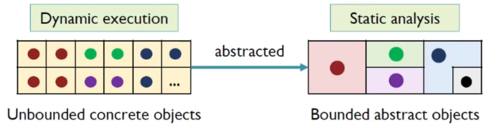
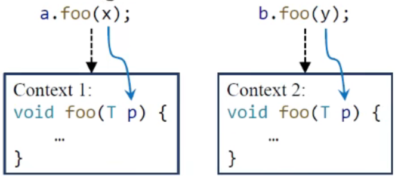

# Pointer Analysis

## Contents

- Motivation
- Introduction to Pointer Analysis
- Key Factors of Pointer Analysis
- Concerned Statements

## Motivation

### via CHA

```java
void foo(){
	Number n = new One()
	int x = n.get();
}

interface Number{
	int get();
}

class Zero implements Number{
	public int get(){
		return 0;
	}
}

class One implements Number{
	public int get(){
		return 1;
	}
}

class Two implements Numebr {
	public int get(){
		return 2;
	}
}
```

存在如上的示例代码，如果用CHA，那么`n.get()`根据Number类，会得到的target method是：`{Zero.get(), One.get(), Two.get()}`；

根据常量传播的分析，x=NAC，因为0,1,2三个值都返回，merge时则为NAC；

因此在这种情况中，使用CHA的常量传播算法就丢失了精度；

如果用指针分析来分析程序呢？

### via Pointer Analysis

```java
void foo(){
	Number n = new One()
	int x = n.get();
}
```

简单来说，由于`n.get()`的调用，根据指向的对象One，因此可以精确地得到`target method：{One.get()}`；

因此可以准确地到返回值`1`；

## Introduction to Pointer Analysis

- A fundamental static analysis
  - Computes which memory locations a pointer can point to - 计算指针指向内存的位置
- For object-oriented programs(focus on Java)
  - Computes which objects a pointer(variable or field) can point to - 计算指针指向的对象
- Regarded as a may-analysis
  - Computes an over-approximation of the set of objects that a pointer can point to, i.e., we ask "a pointer may point to which objects?" - 指针指向了哪些对象

### Example

```java
// Sample 2
void foo(){
	A a = new A();
	B x = new B();
	a.setB(x);
	B y = a.getB();
}

class A {
	B b;
	
	void setB(B b){
		this.b = b;
	}

	B getB(){
		return this.b;
	}
}
```

存在以上程序，通过指针分析，输入上面的程序，得到对应的表格：

| Variable | Object |
| -------- | ------ |
| a        | new A  |
| x        | new B  |
| this     | new A  |
| b        | new B  |
| y        | new B  |

| Field   | Object |
| ------- | ------ |
| new A.b | new B  |

那么如何通过程序来得到这样的表格呢？

### Alias Analysis

这里引出了一种分析--Alias analysis

Two closely related but different concepts

- Pointer analysis: which objects a pointer can point to?
- Alias anlaysis: can two pointers point to the same object?

If two pointers, say p and q, refer to the same object, then p and q are aliases

```java
p = new C();
q = p;
x = new X();
y = new Y();
```

上面的例子可以得出，p和q是aliases，而x和y则不是；

### Applications of Pointer Analysis

- Fundamental information
  - Call graph
  - aliases
  - ...
- Compiler optimization
  - Virtual call inlining
  - ...
- Bug detection
  - Null pointer detection
  - ...
- Security anlaysis
  - Information flow analysis
  - ...
- And many more...

## Key Factors of Pointer Analysis

- Pointer analysis is a complex system
- Multiple factors affect the precision and efficiency of the system

| Factor              | Problem                                        | Choice                                         |
| ------------------- | ---------------------------------------------- | ---------------------------------------------- |
| Heap abstarction    | How to model heap memory?                      | - Allocation-site<br />- Storeless             |
| Context sensitivity | How to model calling contexts?                 | - Context-sensitive<br />- Context-insensitive |
| Flow sensitivity    | How to model control flow?                     | - Flow-sensitive<br />- Flow-insensitive       |
| Analysis scope      | Which parts of program should be are analyzed? | - Whole-program<br />Demand-driven             |

### Heap Abstraction

How to model heap memory?  

- In dynamic execution, the number of heap objects can be unbounded due to loops and recursion

  ```java
  for (...){
  	A a = new A();
  }
  ```

- To ensure termination, heap abstraction models dynamically allocated, unbounded concrete objects as finite abstract objects for static analysis

  

  为了确保循环或者其他原因产生无穷尽的内存堆块（这样就不好进行静态分析），使用抽象的方法将具有共性的对象抽象到一起，形成有限的处理单元，保证静态分析能够终止；

对于Heap Abstraction，有两大方向，其中又有很多小的方向：

- Store based model
  - k-limiting
  - *Allocation sites*
  - ...
- Storeless model
  - k-limiting
  - Patterns
  - ...

这里只学习Allocation sites；

#### Allocaiton sites(selected)

> The most commonly-used heap abstraction

- Model concrete objects by their allocaiton sites
- One abstract object per allocation site to present all its allocated concrete objects

有一个例子：

```java
for(i = 0; i < 3; ++i){
	a = new A();
	...
}
```

对于上述代码，for循环执行了三次，创建了三个对象；

这里规定，使用$O_i$代表程序第$i$行的创建点$O$。

根据这个规则能够得到：

$O_2$,iteration i = 0

$O_2$,iteration i = 1

$O_2$,iteration i = 2

如果用allocation-site abstraction的技术进行分析，则只得到一个创建点的抽象$O_2$

The number of allocation sites in a program is bounded, thus the abstract objects must be finite.

### Context Sensitivity

How to model calling contexts? - 指针分析的过程中如何对调用的上下文进行建模？

通常有两种选择，针对：

| context-sensitive                                         | context-insensitive                    |
| --------------------------------------------------------- | -------------------------------------- |
| Distinguish different calling contexts of a method        | Merge all calling contexts of a method |
| Analyze each method multiple times, once for each context | Analyze each method once               |

#### context-sensitive(selected)

- 一个方法可能会被调用很多次，产生不同的上下文，需要进行区别
- 对一个方法分析多次，每一个上下文分析一次



上面的例子说明，当一个方法调用两次时，由于实体对象不同，针对上下文敏感分成了两个context；

#### context-insensitive(selected)

- 对于一个方法，产生的上下文merge到一起（可能丢失精度）


上面的例子说明，当一个方法调用两次时，虽然实体对象不同，但是上下文不敏感，因此都指向了同一个context；

### Flow Sensitivity

How to model control flow?

| Flow-sensitive                                               | Flow-insensitive                                             |
| ------------------------------------------------------------ | ------------------------------------------------------------ |
| Respect the execution order of the statements                | Ignore the control-flow order, treat the program as a set of unordered statements |
| Maintain a map of points-to relations at each program location | Maintain one map of points-to relations for the whole program. |

在指针分析的过程中，如何对程序控制流进行建模；

可以分为对控制流敏感和不敏感的情况进行分析；

```java
1: c = new C();
2: c.f = "x";
3: s = c.f;
4: c.f = "y";
```

#### Flow-sensitive

- 流敏感的分析会尊重程序语句的先后顺序，在程序语句的每一行都会建立一个点，用来做指针映射指向；

对于上面例子，流敏感分析可以得到结果：

1:	c -> {$O_1$}

2:	c -> {$O_1$}, $O_1$.f -> {"x"}

3:	c -> {$O_1$}, $O_1$.f -> {"x"}, s -> {"x"}

4:	c -> {$O_1$}, $O_1$.f -> {"y"}, s -> {"x"}

#### Flow-insensitive(selected)

- 忽视控制流的顺序，当做无序程序语句的集合

c -> {$O_1$}, $O_1$.f -> {"x", "y"}, s -> {"x", "y"}

存在语言间的效率差别，java中使用insensitive进行指针分析并没有相对于sensitive效率差很多；

### Analysis Scope

Which parts of program should be analyzed?

| Whole-program                                                | Demand-driven                                                |
| ------------------------------------------------------------ | ------------------------------------------------------------ |
| Coompute points-to information for all pointers in the program | Only compute points-to information fot the pointers that may affect specific sites of interest(on demand) |
| Provide information for all possible clients                 | Provide information for specific clients                     |

```java
x = new A();
y = x;
y.foo();
z = new T();
z.bar();
```

#### Whole-program(selected)

- 分析整个程序中的指针

以上面的代码为例，将所有的指针进行分析：

x -> {$O_1$}

y -> {$O_1$}

z -> {$O_4$}

#### Demand-driven

- 根据需求驱动，只分析满足特定应用的指针

如果根据需求：

```
Client: call graph construction
Site of interest: line 5
```

我们需要收集的信息是：

```java
z = new T();
z.bar();
```

得到的结果为：z -> {$O_4$}

虽然只需要一些指针信息，但是也需要保证结果是safe的，需要将程序的很大一部分分析完，才能找到依赖的信息，所以效率并不一定比whole-program的方式高。另外client的需求有可能多样化，每次分析可能会有重复；

## Concerned Statement

### What do we analyze?

在进行指针分析时，只关注的是pointer-affecting statements，即影响指针的一些语句；

### Pointers in Java

- Local variable: x
- Static field: C.f
- Instance field: x.f
- Array element: array[i]

