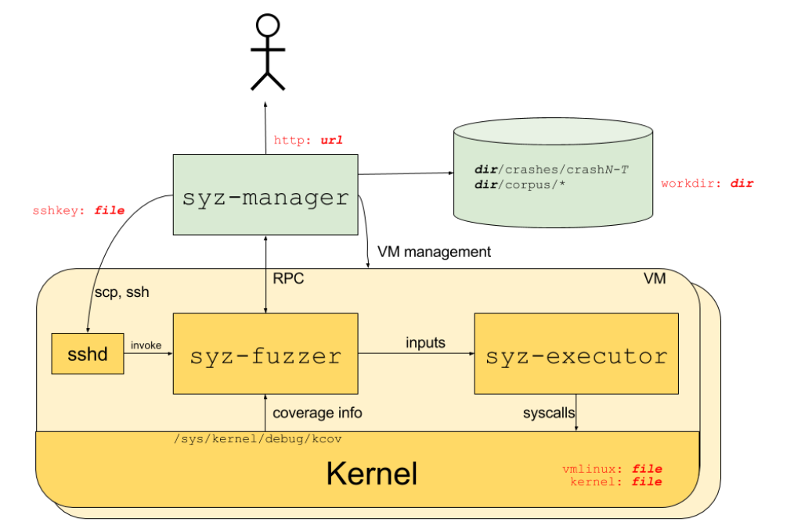

# syzkaller(2):原理与测试

## 流程图



上图为流程图。

`syz-manager`通过`ssh`调用`syz-fuzzer`；

`syz-fuzzer和syz-manager`之间通过`RPC`进行通信；

`syz-fuzzer`将输入传给`syz-executor`，从`kernel`中读取代码覆盖率信息；

`syz-executor`执行`syscall`系统调用。

## 目录结构

| 文件/文件名 |                          说明/用途                           |
| :---------: | :----------------------------------------------------------: |
|   Godeps    |                       golang依赖包管理                       |
|  dashbord   | 与syzbot相关，syzbot会在fuzz后向内核邮件列表报告发现的错误，内容在https://syzkaller.appspot.com上 |
|    docs     |                           相关文档                           |
|  executor   |                       用于执行系统调用                       |
|     pkg     |                         配置文件目录                         |
|    prog     |              目标系统信息以及需要执行的系统调用              |
|     sys     |                         系统调用描述                         |

在`pkg`目录中又有如下的结构：

- ast目录：解析并格式化sys文件。
- bisect目录：通过二分查找，编译代码测试确定引入含有漏洞代码的commit和引入修复的commit。
- build目录：包含用于构建内核的辅助函数。
- compiler目录：从文本描述生成系统调用，类型和资源的sys描述。
- config目录：加载配置文件。
- cover目录：提供处理代码覆盖信息的类型。
- csource目录：根据syzkaller程序生成等价的c程序。
- db目录：存储syz-manager和syz-hub中的语料库。
- email目录：解析处理邮件相关功能。
- gce目录：对Google Compute Engine(GCE) API的包装。
- gcs目录：对Google Compute Storage(GCS) API的包装。
- hash目录：提供一些hash函数。
- host目录：检测host是否支持一些特性和特定的系统调用。
- html目录：提供一些web端显示fuzz结果的html页面用的辅助函数。
- ifuzz目录：生成和变异x86机器码。
- instance目录：提供用于测试补丁，镜像和二分查找的临时实例的辅助函数。
- ipc目录：进程间通信。
- kd目录：windows KD调试相关。
- log目录：日志功能。
- mgrconfig目录：管理解析配置文件。
- osutil目录：os和文件操作工具。
- report目录：处理内核输出和检测/提取crash信息并符号化等。
- repro目录：对crash进行复现并进行相关的处理。
- rpctype目录：包含通过系统各部分之间的net/rpc连接传递的消息类型。
- runtest目录：syzkaller程序端到端测试的驱动程序。
- serializer目录：序列化处理。
- signal目录：提供用于处理反馈信号的类型。
- symbolizer目录：处理符号相关信息。
- vcs目录：处理各种库的辅助函数。

## 概况

### 系统调用模板

#### syzkaller formwork

`syzkaller`使用自己的声明式语言描述系统调用模板，可以在`docs/syscall_descriptions.md`中找到说明；

#### formwork => golang code

这些系统调用模板被翻译成`syzkaller`能够执行的代码需要经过两个步骤：

1. 使用`syz-extract`从`linux`的源码中提取符号常量值，结果存储在`.const`文件中；

   > 如：`/sys/linux/tty.txt`被转换为`sys/linux/tty_amd64.const`；

2. 根据`syscall formwork`和`.const`文件，使用`syz-sysgen`生成`syzkaller`使用的go代码；

   - `assignSyscallNumbers`：分配系统调用号，检测不受支持的系统调用并丢弃；
   - `patchConsts`：将AST中的常量patch成对应的值；
   - `check`：对AST进行语义检查；
   - `genSyscalls`：从AST生成prog对象；

   可以在`/sys/linux/gen/amd64.go`和`/executor/syscalls.h`中看到结果；

#### new syscall test

`/sys/linux/sys.txt`包含的是常规系统调用的描述；

子系统的低筒调用描述放在`sys/linux/`下，即为那些以`.txt`结尾的文件；

> 如：bpf、socket子系统...

如果要对新的系统调用进行测试，需要添加新的系统调用的描述，系统调用和参数都可以自己定义，如：

```c
syscallname "(" [arg ["," arg]*] ")" [type] ["(" attribute* ")"]
arg = argname type
argname = identifier
type = typename [ "[" type-options "]" ]
typename = "const" | "intN" | "intptr" | "flags" | "array" | "ptr" |
       "string" | "strconst" | "filename" | "len" |
       "bytesize" | "bytesizeN" | "bitsize" | "vma" | "proc"
type-options = [type-opt ["," type-opt]]
```

甚至说可以为一个全新的子系统添加系统调用描述，`docs`目录下的`syscall_descriptions_syntax.md`中可以找到语法描述；

#### update syscall formwork

首先拿到内核源码后，先看一下是什么版本的内核；

```
cat Makefile | head
```

由下面的信息可以知道是`5.16`版本的内核；

```
VERSION = 5
PATCHLEVEL = 16
SUBLEVEL = 0
```

先比较新旧版本`uapi/*.h`发生了什么变化；

```
git diff -U0 v5.15 v5.14 include/uapi/*.h | grep "+++"   # 5.16没有在working tree中，先用5.15看看...
```

将得到：

```
+++ b/include/uapi/asm-generic/siginfo.h
+++ b/include/uapi/asm-generic/socket.h
+++ b/include/uapi/asm-generic/unistd.h
...
```

Linus在linux 3.7版本中接受了David Howell的用来解决递归引用的补丁。递归引用这个问题通常发生在`inline`函数中：比如头文件A中的`inline`函数需要头文件中B的`struct`，但是同时B中也有一个`inline`函数需要A中的一个`struct`。所以David Howell把`include`和`arch/xxxxxx/include`目录中的内核头文件中有关用户空间API的内容分割出来，放到新的uapi/子目录中相应的地方。

除了解决递归引用的问题之外，这样做简化了仅供内核使用的头文件的大小，并且使得跟踪内核向用户空间呈现的API的更改变得更容易。对C库维护者、测试项目(如LTP)、文档项目(如man-pages)还有我们利用`syzkaller`做内核fuzz的人来说有很大的帮助；

## 测试

### 编译syz-extract&syzsysgen

```
 make bin/syz-extract
 make bin/syz-sysgen
```

### 自定义规则

在`syzkaller/sys/linux`下，新建`proc_operation.txt`文件，并加入：

```
include <linux/fs.h>
 
open$proc(file ptr[in, string["/proc/test"]], flags flags[proc_open_flags], mode flags[proc_open_mode]) fd
read$proc(fd fd, buf buffer[out], count len[buf])
write$proc(fd fd, buf buffer[in], count len[buf])
close$proc(fd fd)
 
proc_open_flags = O_RDONLY, O_WRONLY, O_RDWR, O_APPEND, FASYNC, O_CLOEXEC, O_CREAT, O_DIRECT, O_DIRECTORY, O_EXCL, O_LARGEFILE, O_NOATIME, O_NOCTTY, O_NOFOLLOW, O_NONBLOCK, O_PATH, O_SYNC, O_TRUNC, __O_TMPFILE
proc_open_mode = S_IRUSR, S_IWUSR, S_IXUSR, S_IRGRP, S_IWGRP, S_IXGRP, S_IROTH, S_IWOTH, S_IXOTH
```

参考大师傅们的介绍：`$`号前的`syscallname`是系统调用名，`$`号后的t`ype`是指特定类型的系统调用。如上文的` open$proc` 指的就是`open`这个类调用中`proc`这个具体的调用，这个名字是由规则编写者确定的，具体行为靠的是后面的参数去确定。 参数的格式如下： `ArgumentName ArgumentType[Limit] ArgumentName`是指参数名，`ArgumentType`指的是参数类型，例如上述例子有string、flags等类型。[ ]号中的内容就是具体的类型的值，不指定的时候由`syzkaller`自动生成，若要指定须在后文指定，以上文为例：

```
mode flags[proc_open_mode]
proc_open_mode = ...
```

 因为我们给的例子是通过`/proc/test`这个内核接口的写操作来触发堆溢出，因此我们需要控制的参数是`open`函数中的file参数为“/proc/test”即可，其他操作参考sys.txt即可；

### 生成.const文件

调用`syz-extract`生成`.consts`文件；

```
bin/syz-extract -os linux -sourcedir "/root/source/linux" -arch amd64 proc_operation.txt
```

文件内容如下：

```
# Code generated by syz-sysgen. DO NOT EDIT.
arches = amd64
FASYNC = amd64:8192
O_APPEND = amd64:1024
O_CLOEXEC = amd64:524288
O_CREAT = amd64:64
O_DIRECT = amd64:16384
O_DIRECTORY = amd64:65536
O_EXCL = amd64:128
O_LARGEFILE = amd64:32768
O_NOATIME = amd64:262144
O_NOCTTY = amd64:256
O_NOFOLLOW = amd64:131072
O_NONBLOCK = amd64:2048
O_PATH = amd64:2097152
O_RDONLY = amd64:0
O_RDWR = amd64:2
O_SYNC = amd64:1052672
O_TRUNC = amd64:512
O_WRONLY = amd64:1
S_IRGRP = amd64:32
S_IROTH = amd64:4
S_IRUSR = amd64:256
S_IWGRP = amd64:16
S_IWOTH = amd64:2
S_IWUSR = amd64:128
S_IXGRP = amd64:8
S_IXOTH = amd64:1
S_IXUSR = amd64:64
__NR_close = amd64:3
__NR_open = amd64:2
__NR_read = amd64:0
__NR_write = amd64:1
__O_TMPFILE = amd64:4194304

```

### 生成go代码

运行`syz-sysgen`，生成`syzkaller`可以执行的go代码；

```
./bin/syz-sysgen
```

### 编译syzkaller

```
make clean
make all
```

### 修改my.cfg

添加上允许的自定义系统调用；

```
"enable_syscalls": [
                "open$proc",
                "read$proc",
                "write$proc",
                "close$proc"
],
```


### 参考


