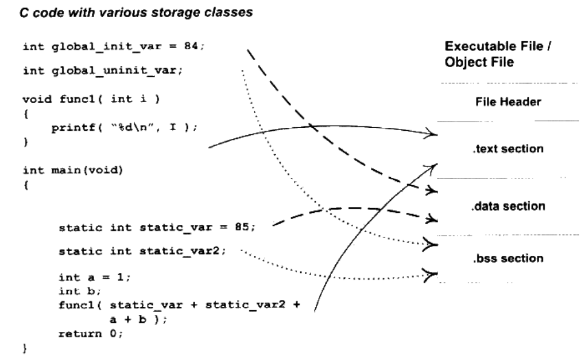
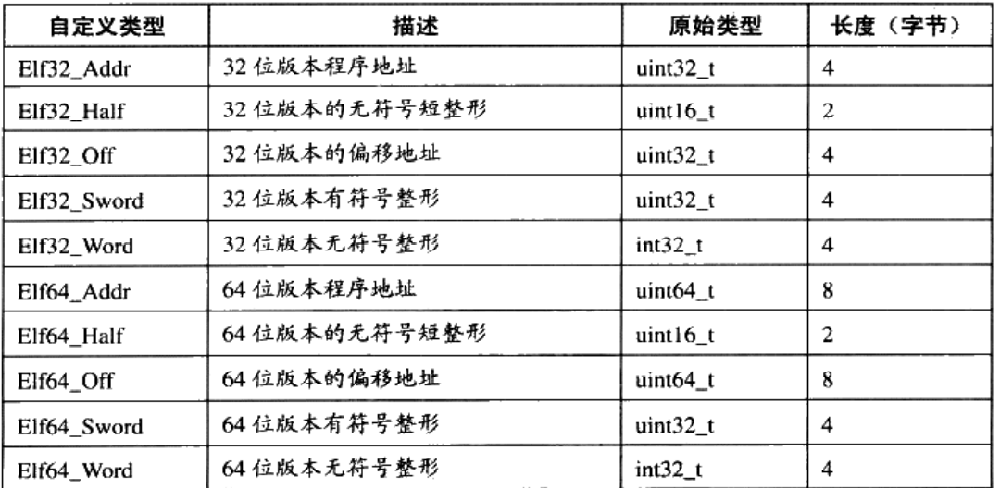
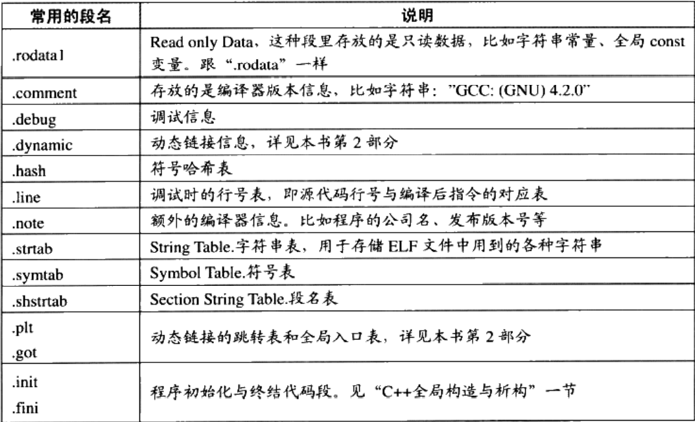
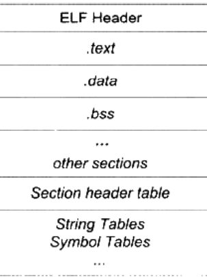
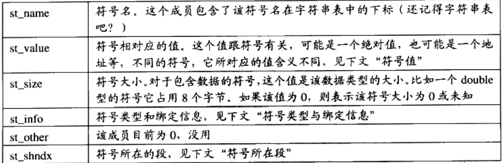
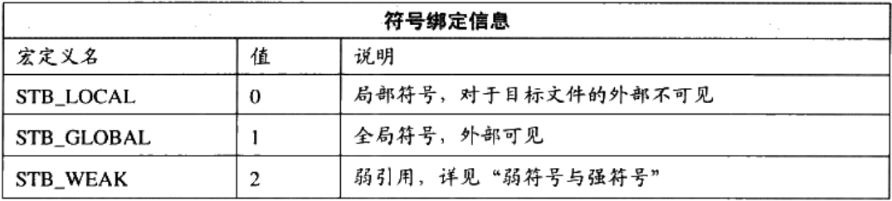
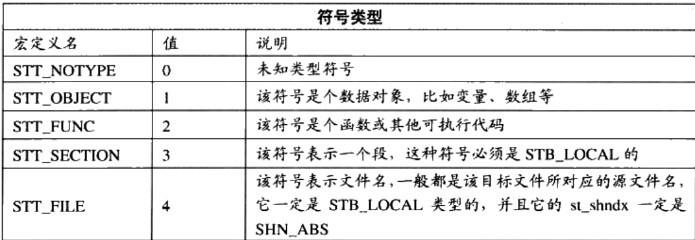

# 目标文件的秘密

编译器编译源代码后生成的文件叫做目标文件，那么目标文件里面存放着什么呢？

从结构上说，是可执行文件的格式，还未经过链接；

## 目标文件格式

可执行文件、动态链接库和静态链接库都是按照可执行文件格式存储；

## 目标文件内容

机器指令代码、数据、符号表、调试信息等；

按属性不同以Section的形式存储，基本上不加以区别，除非是在链接和装载的时候；

以下列代码为例：

```c
/*************************************************************************
    > File Name: hello.c
    > Author: K1ose
    > Mail: klose@jk404.cn
    > Created Time: Tue 16 Nov 2021 09:01:52 AM CST
 ************************************************************************/

#include<stdio.h>
int global_init_var = 84;
int global_uninit_var;

void func1(int i){
	printf("%d\n", i);
}

int main(void){
	static int static_var = 85;
	static int static_var2;

	int a = 1;
	int b;
	func1(static_var + static_var2 + a + b);
	return 0;
}

```



编译生成目标文件；

```
$ gcc -c -fno-asynchronous-unwind-tables hello.c -o hello.o 
```

`-fno-asynchronous-unwind-tables`用于去掉一些附加的调试信息段；

### File Header

```
$ readelf -h hello.o 
ELF Header:
  Magic:   7f 45 4c 46 02 01 01 00 00 00 00 00 00 00 00 00 
  Class:                             ELF64
  Data:                              2's complement, little endian
  Version:                           1 (current)
  OS/ABI:                            UNIX - System V
  ABI Version:                       0
  Type:                              REL (Relocatable file)
  Machine:                           Advanced Micro Devices X86-64
  Version:                           0x1
  Entry point address:               0x0
  Start of program headers:          0 (bytes into file)
  Start of section headers:          888 (bytes into file)
  Flags:                             0x0
  Size of this header:               64 (bytes)
  Size of program headers:           0 (bytes)
  Number of program headers:         0
  Size of section headers:           64 (bytes)
  Number of section headers:         11
  Section header string table index: 8
```

有两个版本的结构：`ELF32_Ehdr`和`ELF64_Ehdr`；




### section info

```
$ objdump -h hello.o | bat
───────┬──────────────────────────────────────────────────────────────────────────────────────
       │ STDIN
───────┼──────────────────────────────────────────────────────────────────────────────────────
   1   │ 
   2   │ hello.o:     file format elf64-x86-64
   3   │ 
   4   │ Sections:
   5   │ Idx Name          Size      VMA               LMA               File off  Algn
   6   │   0 .text         00000057  0000000000000000  0000000000000000  00000040  2**0
   7   │                   CONTENTS, ALLOC, LOAD, RELOC, READONLY, CODE
   8   │   1 .data         00000008  0000000000000000  0000000000000000  00000098  2**2
   9   │                   CONTENTS, ALLOC, LOAD, DATA
  10   │   2 .bss          00000004  0000000000000000  0000000000000000  000000a0  2**2
  11   │                   ALLOC
  12   │   3 .rodata       00000004  0000000000000000  0000000000000000  000000a0  2**0
  13   │                   CONTENTS, ALLOC, LOAD, READONLY, DATA
  14   │   4 .comment      00000036  0000000000000000  0000000000000000  000000a4  2**0
  15   │                   CONTENTS, READONLY
  16   │   5 .note.GNU-stack 00000000  0000000000000000  0000000000000000  000000da  2**0
  17   │                   CONTENTS, READONLY
───────┴──────────────────────────────────────────────────────────────────────────────────────
```

可以看到`.bss`段没有`CONTENTS`属性，说明其实际在ELF中不存在内容；

根据这些信息得到的结构是：

```
+---------+
|  other  |
+---------+
| .coment |		36 bytes
+---------+
| .rodata |		4 bytes
+---------+
|  .data  |		8 bytes
+---------+
|  .text  |		57 bytes   
+---------+
|ELFheader|		64 bytes
+---------+

```

`-s`打印所有section的十六进制输出；

```
$ objdump -s hello.o | bat
───────┬──────────────────────────────────────────────────────────────────────────────────────
       │ STDIN
───────┼──────────────────────────────────────────────────────────────────────────────────────
   1   │ 
   2   │ hello.o:     file format elf64-x86-64
   3   │ 
   4   │ Contents of section .text:
   5   │  0000 554889e5 4883ec10 897dfc8b 45fc89c6  UH..H....}..E...
   6   │  0010 bf000000 00b80000 0000e800 00000090  ................
   7   │  0020 c9c35548 89e54883 ec10c745 f8010000  ..UH..H....E....
   8   │  0030 008b1500 0000008b 05000000 0001c28b  ................
   9   │  0040 45f801c2 8b45fc01 d089c7e8 00000000  E....E..........
  10   │  0050 b8000000 00c9c3                      .......         
  11   │ Contents of section .data:
  12   │  0000 54000000 55000000                    T...U...        
  13   │ Contents of section .rodata:
  14   │  0000 25640a00                             %d..            
  15   │ Contents of section .comment:
  16   │  0000 00474343 3a202855 62756e74 7520352e  .GCC: (Ubuntu 5.
  17   │  0010 342e302d 36756275 6e747531 7e31362e  4.0-6ubuntu1~16.
  18   │  0020 30342e31 32292035 2e342e30 20323031  04.12) 5.4.0 201
  19   │  0030 36303630 3900                        60609.          
───────┴──────────────────────────────────────────────────────────────────────────────────────
```

可以看到`.text`占用的57bytes，并且`.data`中存放了`84`和`85`两个已初始化的静态变量，而`.rodata`中存放了只读数据`"%d"`；

#### .text

`-d`反汇编所有包含指令的section；

```
$ objdump -d hello.o | bat
───────┬──────────────────────────────────────────────────────────────────────────────────────
       │ STDIN
───────┼──────────────────────────────────────────────────────────────────────────────────────
   1   │ 
   2   │ hello.o:     file format elf64-x86-64
   3   │ 
   4   │ 
   5   │ Disassembly of section .text:
   6   │ 
   7   │ 0000000000000000 <func1>:
   8   │    0:   55                      push   %rbp
   9   │    1:   48 89 e5                mov    %rsp,%rbp
  10   │    4:   48 83 ec 10             sub    $0x10,%rsp
  11   │    8:   89 7d fc                mov    %edi,-0x4(%rbp)
  12   │    b:   8b 45 fc                mov    -0x4(%rbp),%eax
  13   │    e:   89 c6                   mov    %eax,%esi
  14   │   10:   bf 00 00 00 00          mov    $0x0,%edi
  15   │   15:   b8 00 00 00 00          mov    $0x0,%eax
  16   │   1a:   e8 00 00 00 00          callq  1f <func1+0x1f>
  17   │   1f:   90                      nop
  18   │   20:   c9                      leaveq 
  19   │   21:   c3                      retq   
  20   │ 
  21   │ 0000000000000022 <main>:
  22   │   22:   55                      push   %rbp
  23   │   23:   48 89 e5                mov    %rsp,%rbp
  24   │   26:   48 83 ec 10             sub    $0x10,%rsp
  25   │   2a:   c7 45 f8 01 00 00 00    movl   $0x1,-0x8(%rbp)
  26   │   31:   8b 15 00 00 00 00       mov    0x0(%rip),%edx        # 37 <main+0x15>
  27   │   37:   8b 05 00 00 00 00       mov    0x0(%rip),%eax        # 3d <main+0x1b>
  28   │   3d:   01 c2                   add    %eax,%edx
  29   │   3f:   8b 45 f8                mov    -0x8(%rbp),%eax
  30   │   42:   01 c2                   add    %eax,%edx
  31   │   44:   8b 45 fc                mov    -0x4(%rbp),%eax
  32   │   47:   01 d0                   add    %edx,%eax
  33   │   49:   89 c7                   mov    %eax,%edi
  34   │   4b:   e8 00 00 00 00          callq  50 <main+0x2e>
  35   │   50:   b8 00 00 00 00          mov    $0x0,%eax
  36   │   55:   c9                      leaveq 
  37   │   56:   c3                      retq   
───────┴──────────────────────────────────────────────────────────────────────────────────────
```

#### .data & .rodata

```
  11   │ Contents of section .data:
  12   │  0000 54000000 55000000                    T...U...        
  13   │ Contents of section .rodata:
  14   │  0000 25640a00                             %d..      
```

`.data`中存放了`84`和`85`两个已初始化的静态变量，而`.rodata`中存放了只读数据；

#### .bss

未初始化的数据将会放在bss段上；

由于编译器优化的结果，`static int x = 0;`中变量x将被放在`.bss`段上，编译器认为值为`0`可认为其是未初始化的；

#### others



## ELF文件结构

基础结构：



### 文件头

ELF文件版本、目标机器型号、程序入口地址等；

### 各个段

### 段表

名字、长度、文件中的偏移、读写权限和其他属性；编译器、链接器和装载器依照段表来定位和访问各个段的属性，其中header的成员`e_shoff`决定了段表在elf文件中的偏移；

```
readelf -S elf_file
```

`sh_type`段类型和`sh_flags`段标志位决定段属性；

`sh_link`和`sh_info`是段的链接信息；

### 重定位表

类型为`SHT_REL`；

链接器处理目标文件时，对目标文件中**需要对绝对地址进行引用的部分**进行重定位；

### 字符串表

字符串

### 符号表

链接的接口，记录了文件引用的符号及其符号值（他们的地址）；

这些函数和变量就是符号；

#### 结构







