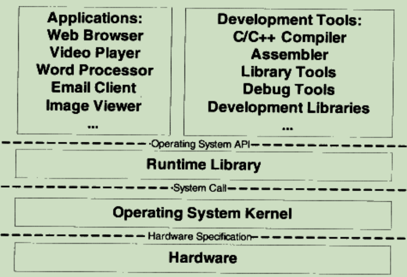
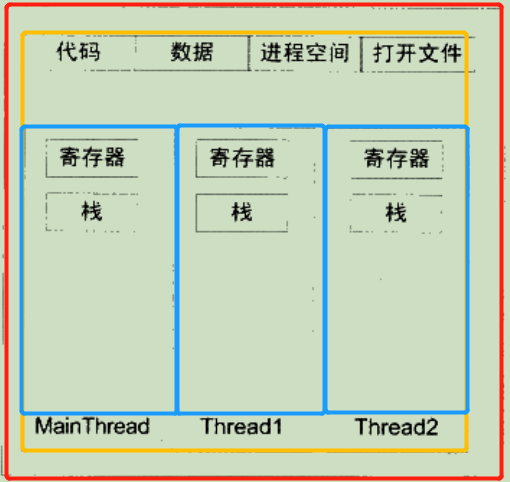
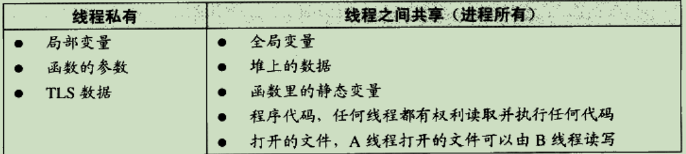
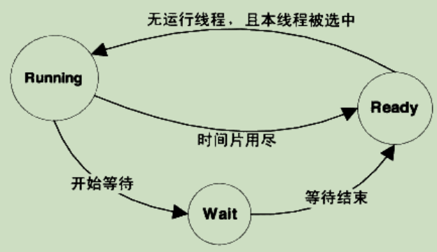
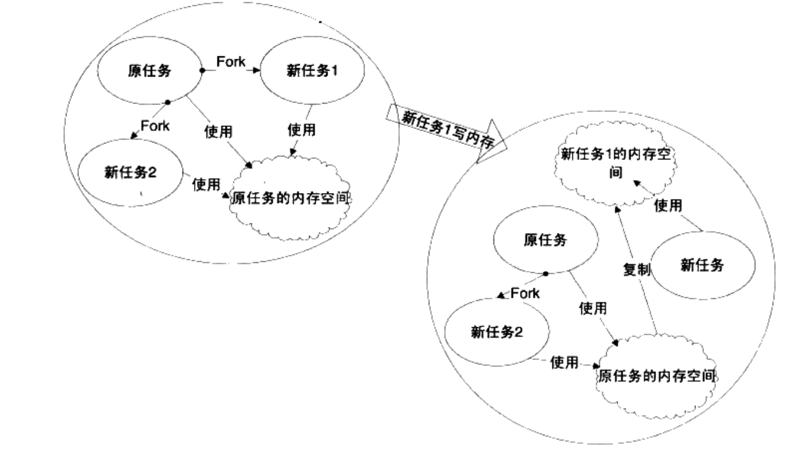
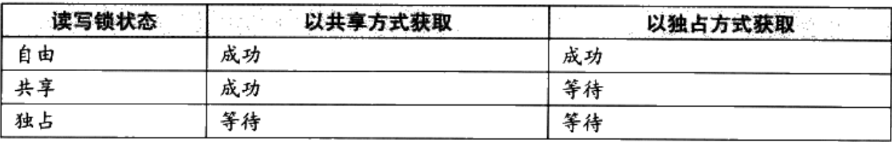

# 知识储备

> *我就简单写写。			—— K1ose*

序言强调了基础的重要性，对**数据结构和算法、操作系统、计算机组成原理**等大学基础课程要有足够的掌握；

## 将学到什么

对学习内容有一个初步的认识，清楚了解到能够学习到什么：

1. Windows和Linux下的**可执行文件**、**目标文件格式**（PE、ELF）；
2. 普通C/C++代码**编译生成目标文件的过程**、**程序在目标文件中的存储**；
3. **目标文件的链接**（静态链接、动态链接的详细解读）与**可执行文件的生成**；
4. **可执行文件的装载与执行**；
5. 可执行文件在**虚拟空间中的映射**；
6. **堆栈**与**函数调用**；
7. 运行**库**、**Glibc和MSVC CRT的分析实现**；
8. **系统调用**与**API**；

## 认识的开始

> *ANY problem in computer science can be solved by another layer of indirection.*

### 从三个关键硬件部件出发

1. CPU；
2. 内存；
3. I/O控制芯片；

I/O：慢吞吞的I/O总线 => PCI/ISA南北桥构架 => AGP、PCI Express等
CPU：频率上的追求（集成密度） => CPU数量（SMP，symmetrical multi-processing对称多处理器） => 打包核心（multi-core Processer多核处理器）
内存：物理内存 => 虚拟内存与映射

### 各层次关系——高楼大厦



接口：

Interface 由下层定义，上层使用；

中间层对下层进行包装和扩展；

Operating System API：操作系统**应用程序编程接口**（Application Programming Interface），由运行库提供，开发工具与应用程序都是用这个接口；

System Call Interface：系统调用接口以**软件中断**的方式提供；

Hardware Specification：操作系统是**硬件规格**（产商提供）的使用者，开发者通过**硬件规格文档**编写操作系统和驱动程序；

### 操作系统——管理员和小帮手

操作系统功能：

1. 提供抽象接口（向上向下）；
2. 管理硬件资源（努力榨干硬件资源）；

#### 烦人却必须用到的I/O设备

操作系统是**硬件层的上层**，**对硬件**进行**管理和抽象**；

对于操作系统上层建筑而言，他们更希望这些硬件拥有统一的访问模式（不然应用程序开发人员还要和硬件打交道——读写硬件端口、处理终端等，这也太痛苦了）；Thanks to the OS，**操作系统**的**驱动程序**将**硬件设备的访问方式**抽象成**对象或系统**，实现的方式是**为硬件产商提供了接口和框架**；

例如：UNIX中，设备访问形式和访问普通文件一样；磁盘被抽象成普通文件系统等等；

如果是直接地对硬件进行交互，例如对磁盘进行读取，需要对对应的功能端口进行out value，来调用读取功能，同时还需要关注磁盘的磁片、磁道和扇区的分布，这是非常复杂的，而驱动程序提供了很好的框架去协调解决这个问题。这大大解放了应用程序开发人员的劳动力。

#### 榨干CPU

--低效率：如果CPU只能运行一个程序，那么读磁盘的时候，CPU怠工等待；

--多道程序：添加队列。
打比方：一家银行只有一个窗口，但是有多个客户排队队伍，当其中一个队伍排头的客户在办理手续时，需要对自己手头上的资料进行整理（反正需要停一停窗口办理的流程，工作人员不处理他的事务），这是工作人员会去处理其他队列的事务。但是这样就会出现一个问题，如果有很重要的客户需要办理紧急业务，这样的工作机制就会导致致命后果（打开一个文件夹，十分钟后PC机才有反应）；

--分时系统：协作模式
继续打个比方：经由多道程序带来的惨痛经历，大家意识到协作的重要性。这次银行来办理业务的客户素质都很高（或者是银行工作人员熟悉一些业务需要客户自己停下做准备时），工作人员处理业务时会主动停下，让其他人也能办理一下业务，这样其他客户也能办到一定程度的业务。但是不乏一些霸占窗口不放的客户，这样整个办理流程都停止了；

--多任务系统：管理员模式
操作系统管辖所有硬件资源，运行在受硬件保护的级别；
应用程序以进程方式运行在较低级别，这些进程空间相互隔离，拥有自己独立的地址空间。通过优先级高低来分配CPU资源，而且给这些进程一定的时间片段来占用CPU，超出了就暂停并将资源分配给其他的进程（抢占式分配）；
最后打个比方：通过银行经理的管辖，队伍之间建立了挡板，客户进门时拿取一个优先级牌子，工作人员根据优先级牌子来处理客户的业务，如果规定时间内，客户的问题没有被完全解决，工作人员会转移工作目标；

#### 榨干内存

##### 物理地址的痛

前面说到，CPU允许多进程同时进行（多任务系统），那么在内存分配的早期，以访问物理内存的方式分配给这些进程，将会出现以下问题：

1. **地址空间不隔离**

   物理地址被直接访问，大家都在一个域上，这会产生很大的安全隐患，各个进程之间可能会存在相互干扰；

2. **内存使用效率低**

   设想一下，在物理内存即将用尽时，如果这时需要紧急运行一个程序，那么需要将其他进程数据写到磁盘中，需要时再读取回来。如果只是释放一个进程的空间可能还不够，因为物理地址是连续的，因此还需要再释放相邻的进程，这会导致大量数据交互，影响效率；

   | 内存                      | 突然运行的程序            |
   | ------------------------- | ------------------------- |
   | 进程A：data_size = 0x500  | 程序C：data_size = 0x1000 |
   | 进程B：data_size = 0x1500 |                           |

   这时需要释放A、B进程的数据，暂存到磁盘中，以装载程序C的数据；

3. **程序运行地址不确定**

   程序每次需要装载入内存，由于空间连续，进程又多，因此每次分配到的物理地址不一致，这大大加重了数据重定位的工作（获得数据地址才可以访问或跳转）；

因此引进了中间层——**虚拟地址(Virtual Address, VA)**，通过**映射**的方法，将进程虚拟地址转换为实际的物理地址，只要搞清楚这个映射关系，就可以很好地管理内存空间；

##### 虚拟地址真香

###### 虚拟地址带来什么

1. 地址隔离（Address Isolation）

   既然进程们（客户）都这么娇贵，就给他们营造一个环境——**独立的虚拟地址空间（Virtual Address Space）**。独立又虚拟，显然是为了应付和敷衍。在内存空间没那么多的情况，提供虚拟的、独立的大内存空间给进程，在映射后，进程们通过映射关系只能访问自己的地址空间，营造了良好的隔离环境。

2. **分段（Segmentation）**

   分段是一种映射的方法，将程序所需的内存空间大小的虚拟空间映射到某个地址空间。因此我们可以说：

   1. 分段做到了**地址隔离**；
   2. 对程序来说，虚拟地址空间才是它直接交互的，而**物理地址空间对它而言是透明的**，不必关心被分配到物理地址的哪个位置，因为通过映射，虚拟地址会对应地指向真实存在的物理地址，而这段**物理地址是确定的**。

   但是这种办法依然**没有解决效率的问题**；

   这时候就需要**原子化操作**，**更小粒度地进行内存分割和映射**，于是有了Paging；

3. **分页（Paging）**

   1. 高效

      **分页将地址空间人为分成固定大小的页，每一页的大小由硬件决定**（绝大部分是**4KB**/page）；

      `磁盘页：磁盘中的分页；`

      `虚拟页：虚拟地址空间的分页；`

      `物理页：物理地址空间的分页；`

      通过映射，虚拟地址空间的一些分页可能会被分配到同一个物理页中，这就实现了**内存共享**；

      当进程访问不存在的地址（页），就会出现**页错误**（Segment Fault）；

      如果需要访问，则操作系统接管进程，将对应**磁盘页装载入虚拟页**中，并**关联**这两个页（利用这种原子化操作，则可以进行高效存取）；

   2. 安全

      对每个分页可以设置相应权限，而只有操作系统可以修改这些属性，这也使得操作系统能够保护自己和进程；

###### 虚拟地址如何实现

虚拟存储需要硬件支持，不同CPU不一样，但是几乎都采取了MUU（Memory Management Unit）部件进行映射；

在页映射模式下，CPU发出的是VA，程序可以识别，经过MUU转换后成为PA；

### 线程：当业务窗口越来越多...

当CPU频率增长停滞后（工作人员个人业务处理能力无法再飞速提高），CPU向多核发展（业务窗口增加）；

设想一下，当客户的业务可以**同时被多个窗口的工作人员处理**，那么处理的速度也将大大提升；

#### hello, thread

线程（Thread, or Lightweight Process, LWP），是**程序执行流的最小单元**；

标准的线程由**线程ID**、**当前指令指针（PC）**、**寄存器集合**和**堆栈**组成；

一个进程可以有一个或多个线程；

线程之间的关系如图下所示：



可以看到他们共享了全局变量和堆的数据；

##### 线程的访问权限

线程有自己的独立空间，就像窗口工作人员处理各自负责的任务，但是他们也可以使用共享的客户资料；

1. 栈
2. 线程局部存储（Thread Local Storage, TLS）
3. 寄存器；



#####  线程调度

**无论是多处理器的计算机还是单处理器计算机，线程总是“并发”执行的；**

怎么理解这句话呢？按照先前的理解，当存在多个业务窗口以及小于等于窗口数量的队伍的时候，线程并发是可行的。不同的线程运行在不同的处理器上，彼此之间互不干扰。但是当只有一个窗口的时候，或者当队伍数量大于窗口数量的时候，要怎么使得一个窗口处理多个队伍呢？

**在单处理器应对多线程的情况下，并发是一种模拟态；**

实际上，操作系统会让多线程程序轮流执行，并且每个线程会有设定优先级，这些线程每次被执行一小段时间，这样看起来就是在同时执行。这种不断在处理器上有选择地切换不同线程的行为称为**线程调度（Thread Schedule）**（**优先级调度 + 轮转法**）；
这样机制下的线程会存在至少三种状态：

1. Running： 线程正在被执行，拥有一段允许执行时间限制，称为**时间片（Time Slice）**，如果时间片用尽，则线程进入Ready态，调度系统将选择其他的Ready态线程继续执行，这个过程叫做**抢占（Preemption）**；
2. Ready： 可启动，但CPU被占用；
3. Waiting： 线程在等待某一事件（通常是I/O信号或同步），无法执行，Waiting态结束了就会进入Ready态；



###### 线程优先级（Thread Priority）

具有高优先级的线程会更早执行，而低优先级的线程常常要等待到系统中已经没有高优先级的可执行线程存在时才能够执行；
在Windows中，通过使用下面函数来设置线程优先级；

```c
BOOL WINAPI SetThreadPriority(HANDLE hThread, int nPriority);
```

而在Linux中通过pthread库实现；

频繁等待的线程——IO密集型线程（IO Bound Thread），容易获得高优先级；

很少等待的线程——CPU密集型线程（CPU Bound Thread），容易被分配低优先级；

再这样的机制下，有些线程会出现Starvation的情况，即**线程饿死**的情况，优先级较低的线程总不被执行（特别是CPU密集型的线程得到高优先级后），因此为了避免这种情况发生，频繁等待的线程会逐渐获得更高的优先级；

总结如下：


###### 不可抢占线程——特权人士

先前讨论到抢占问题，还有一些线程是不可抢占的，必须等线程自主发出放弃执行的指令，其他线程才能得到执行；
放弃执行的指令依据：

1. 当线程试图等待某事件时（I/O等）；
2. 线程主动放弃时间片；

#### Linux的多线程

Windows对进程和线程的实现非常标准；

1. Windows内核有明确的的线程和进程的概念；
2. Windows API中，可以使用明确的API：`CreateProcess`和`CreateThread`来创建进程和线程；

Linux并非如此；
Linux内核不存在真正意义上的线程概念；
在Linux上，**所有执行实体都称为任务（Task）**，每个任务概念上都类似于一个单线程的进程，具有内存空间、执行实体、文件资源等。但是**不同任务之间可以选择共享内存空间**，在广义上，**同一个内存空间的多个任务构成了一个进程**，而**这些Task就是这个进程里的线程**。

##### 创建新任务

1. fork - 复制当前进程
2. exec - 使用新的可执行映像覆盖当前可执行映像
3. clone - 创建子进程并从指定位置开始执行

###### fork

fork()函数可以产生一个和当前进程完全一样的新进程，并和当前进程一样从fork函数里返回；

```c
pid_t pid;
if (pid == fork())
{
	...
}
```

父进程（原本任务）的fork将返回子进程（新任务）的pid，而子进程（新任务）的fork将返回0；

fork并不复制父进程的内存空间，而是与子进程共享一个写时复制（Copy on Write, COW）的内存空间；写时复制是指，两个进程（任务）可以同时自由读取内存空间，但是在修改内存空间时，复制一份内存空间以供修改，避免影响到其他任务的使用；（如下图）



fork只产生原本任务的镜像，配合exec的使用才可以生成新任务；

###### exec

进程使用exec来执行新的可执行文件；

###### clone

clone可以产生新线程，在指定位置开始执行，并且可以选择地共享当前进程的内存空间和文件等；

```c
int clone(int (*fn)(void*), void* child_stack, int flags, void* arg);
```

#### 线程安全

多线程程序在并发时数据一致性很重要，试想线程A要保存的数据被线程B修改，导致结果偏差；

##### 竞争与原子操作

举个例子，一下的代码在执行时是否有可能会被调度系统中断；

```c
i++;
```

答案是肯定的，因为这个指令在汇编层面并非一行代码，将这种指令的操作称为非原子的，反之单指令单操作则为原子的（Atomic）；

这样看来，单指令操作在执行过程中不容易出错，但是原子操作只能对简单的数据结构进行更改，当有复杂的数据结构需要修改，就会十分麻烦；因此，出现了上锁的概念；

##### 同步与锁

保证同步，即各个线程对同一数据的访问**同步（Synchronization）**；

锁Lock是一种非强制的机制，每一个线程在访问数据或资源前首先试图获取（Acquire）锁，访问结束即释放（Release）锁；锁被占用时，若要试图获取，线程会进行等待；

###### 几种锁

二元信号量（Binary Semaphore）：0和1表示占用与非占用；

多元信号量（信号量，Semaphore）：初值为N的信号量允许N个线程并发访问，每有一个线程占用，则减1，反之加1；

互斥量（Mutex）：信号量可以由非获取锁的进程修改释放，而互斥量则是谁占用谁释放；

临界区（Critical Section）：信号量与互斥量在系统的任何进程中都是可见的，而临界区作用范围仅限于本进程，其他进程无法获取；

读写锁：针对读取频繁，偶有写入的情况，读写锁提供两种获取方式：

1. 共享的（Shared）
2. 独占的（Exclusive）



条件变量（Condition Variable），作用类似于一个栅栏，可以让一群牛等着进来（许多线程一起等待某个事件发生），当栅栏打开（某个事件发生），所有线程可以一起恢复执行；

##### 可重入函数

没有被执行完成的函数想要再次执行，其触发情况有：

1. 多个线程同时执行这个函数；
2. 函数自身调用自身；

这个函数需要满足：

1. 不使用任何（局部）静态或全局的非const变量；
2. 不返回任何（局部）静态或全局的非const变量的指针；
3. 仅依赖于调用方提供的参数；
4. 不依赖任何单个资源的锁；
5. 不调用任何不可重入的函数；

这样的函数是并发安全的；（？）

##### 过度优化问题

编译器“过度”优化：变量缓存到寄存器内而不写回、调整操作指令顺序；（使用volatile变量解决）

```
x = y = 0;

Thead1
x = 1;
r1 = y;

Thead2
y = 1;
r2 = x;
```

当Thread1和Thread2并发执行时，r1和r2至少一个为1，逻辑上不可能同时为0；

经过编译器无相关指令调整后，可能变为：

```
x = y = 0;

Thead1
r1 = y;
x = 1;

Thead2
y = 1;
r2 = x;
```

甚至可能出现r1和r2同时为0的情况；

CPU“过度”优化的问题：

```c
volatile T* pInst = 0;

T* GetInstance()
{
	if (pInst == NULL)
	{
		lock();
		if(pInst == NULL)
			pInst = new T;
		unlock();
	}
	return pInst;
}
```

new包含了两个步骤：

1. 分配内存；
2. 调用构造函数；

所以pInst = new T 包含了三个步骤：

1. 分配内存；
2. 在内存位置上调用构造函数；
3. 将该位置赋值给pInst；

当CPU调度优化导致步骤2、3颠倒时，该位置在未调用构造函数前将地址返回给pInst，那么如果出现另一个GetInstance的并发调用，此时第一个if内的表达式pInst == NULL将范围false，这个调用会直接返回尚未构造完全的对象地址供用户使用；

现在并不存在可移植的阻止换序的方法（？），通常是调用CPU提供的barrier指令，这个指令阻止其前面的指令被放到其后面；

```c
// 在POWERPC中提供了"lwsync"指令

#define barrier() __asm__ volatile ("lwsync")
volatile T* pInst = 0;

T* GetInstance()
{
	if (pInst == NULL)
	{
		lock();
		if(pInst == NULL)
		{
			T* temp = new T;
			barrier();
			pInst = temp;
		}
		unlock();
	}
	return pInst;
}
```

#### 多线程内部——用户与内核

大多数操作系统由内核提供线程支持（内核线程和Linux内核终端kernel_thread不是一回事），有多处理器或调度实现并发；

用户使用的是用户态的用户线程，而非内核线程；

内核线程和用户线程使用的数量并非一致；

##### 三种线程模型

###### 一对一

简单说就是**一个用户使用的线程唯一对应一个内核使用的线程**，反过来不一定，一个内核里的线程在用户态**不一定**有对应的线程存在；

由于和内核线程具有一致的有点，线程之间的并发是真正的并发；

一般使用**API或系统调用创建的线程为一对一的线程**，例如Linux中的clone，Windows中的API CreateThread；

缺点：

1. 操作系统**限制了内核线程数量**，导致一对一线程会让**用户线程数量同样受到影响**；

2. 许多操作系统**内核线程调度时，上下文切换开销较大**，导致用户线程执行**效率低下**；

###### 多对一

**多个用户线程映射到一个内核线程上**，线程之间的切换由用户态的代码来进行，拥有高效的上下文切换和几乎无限制的线程数量；

缺点：

1. 一个用户线程阻塞会导致所有线程无法执行，内核线程也随之阻塞；

###### 多对多

将**多个用户线程映射到少数但不止一个内核线程**上；

