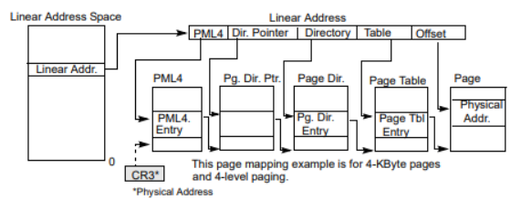
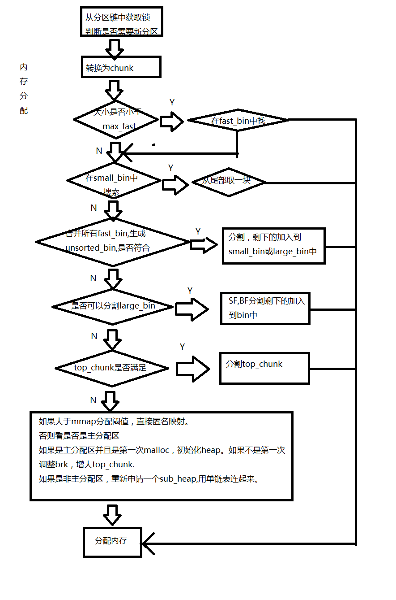

# 零散的知识点

一些零散的知识点，用于简单快速回顾；

## 函数调用约定

cdecl（C declaration），C语言的调用约定；

在x86上有：

1. 函数实参在线程栈上按照从右至左的顺序依次压栈。
2. 函数结果保存在寄存器EAX/AX/AL中
3. 浮点型结果存放在寄存器ST0中
4. 编译后的函数名前缀以一个[下划线字符](https://zh.wikipedia.org/wiki/下划线)
5. 调用者负责从线程栈中弹出实参（即清栈）
6. 8比特或者16比特长的整形实参提升为32比特长。
7. 受到函数调用影响的寄存器（volatile registers）：EAX, ECX, EDX, ST0 - ST7, ES, GS
8. 不受函数调用影响的寄存器： EBX, EBP, ESP, EDI, ESI, CS, DS
9. RET指令从函数被调用者返回到调用者（实质上是读取寄存器EBP所指的线程栈之处保存的函数返回地址并加载到IP寄存器）

x86-64上用寄存器传参：

rdi rsi rdx rcx r8 r9

而且栈顶之外还有128bytes的红区可以使用，如果够用则不必用rsp开新空间；

## 寻址方式

在x86下：

32位基址寄存器是：EAX、EBX、ECX、EDX、ESI、EDI、EBP和ESP；
32位变址寄存器是：EAX、EBX、ECX、EDX、ESI、EDI和EBP(除ESP之外)。

段寄存器的规定：

1. 地址中寄存器的书写顺序决定该寄存器是基址寄存器，还是变址寄存器；
   如：[EBX+EBP]中的EBX是基址寄存器，EBP是变址寄存器，而[EBP+EBX]中的EBP是基址寄存器，EBX是变址寄存器；
2. 默认段寄存器的选用取决于基址寄存器；
3. 基址寄存器是EBP或ESP时，默认的段寄存器是SS，否则，默认的段寄存器是DS；
4. 在指令中，如果使用段前缀的方式，那么，显式段寄存器优先。

## 堆栈及其初始化

### 四种堆栈

1. 系统引导时初始化临时使用的堆栈；
2. 进入保护模式的时候提供给内核程序初始化的堆栈，也是init进程使用的用户态堆栈；
3. 内核态堆栈；
4. 用户态堆栈

### 用于初始化的堆栈

1. 开机时，bootsect设置堆栈；
2. 进入保护模式时，esp指向user_stack的顶端，内核程序自己使用的堆栈；
3. 初始化时，通过fock系统调用，main.c被切换到init进程执行，使用内核程序堆栈；

### task的堆栈

#### 内核态下

系统调用等任务在内核代码中执行期间用到的堆栈，较小。每当任务从用户代码转移进入内核代码中执行时，任务的内核态栈总是空的。任务内核态堆栈被设置在位于其进程描述符的末端，即与任务的进程描述符（task_struct）放在同一页面内。

#### 用户态下

当一个任务（进程）刚被创建时，它的用户态堆栈指针被设置在其地址空间的靠近末端（64MB顶端）部分。实际上末端部分还要包括执行程序的参数和环境变量，然后才是用户堆栈空间。用brk设置program brak，用sbrk来增长堆；

#### 切换问题

如果一个中断产生时任务正在用户代码中执行，那么该中断就会引起CPU特权级从3级到0级的变化，此时CPU就会进行用户态堆栈到内核态堆栈的切换操作。**CPU会从当前任务的任务状态段TSS中取得新堆栈的段选择符和偏移值**。因为中断服务程序在内核中，属于0级特权级代码，所以48位的内核态堆栈指针会从TSS的ss0和esp0字段中获得。在定位了新堆栈（内核态堆栈）之后，CPU就会首先把原用户态堆栈指针ss和esp压入内核态堆栈，随后把标志寄存器eflags的内容和返回位置cs、eip压入内核态堆栈。

内核的系统调用是一个软件中断，因此任务调用系统调用时就会进入内核并执行内核中的中断服务代码。此时内核代码就会使用该任务的内核态堆栈进行操作。同样，当进入内核程序时，由于特权级别发生了改变（从用户态转到内核态），用户态堆栈的堆栈段和堆栈指针以及eflags会被保存在任务的内核态堆栈中。而在执行iret退出内核程序返回到用户程序时，将恢复用户态的堆栈和eflags。

如果一个任务正在内核态中运行，那么若CPU响应中断就不再需要进行堆栈切换操作，因为此时该任务运行的内核代码已经在使用内核态堆栈，并且不涉及优先级别的变化，所以CPU仅把eflags和中断返回指针cs、eip压入当前内核态堆栈，然后执行中断服务过程。

## 程序调试自检

Windows下程序会调用API函数来检查当前进程是否正在被调试；

```c
int debugger_present;
HANDLE process = GetCurrentProcess();
CheckRemoteDebuggerPresent(process, &debugger_present);
```

Linux下的自检方法有：

1. 使用ptrace，来请求trace自己；

   ```c
   int has_debugger(){
       int debugger;
       if (ptrace(PTRACE_TRACEME, 0, NULL, NULL) == 0) { 
           // return 0 means success, so no debugger is attached
           debugger = 0;
       } 
       else
           debugger = 1;
       return debugger;
   }
   ```

   即，如果ptrace()函数设置只能被调用一次，后续的调用会失败，如果返回0，说明没有嗲用过，如果失败，则正处于调式；

2. SIGTRAP处理函数sigtrap_handler

   让程序注册一个SIGTRAP处理函数，显式引发一个SIGTRAP信号，这样如果程序被调试，gdb会拦截SIGTRAP，处理函数则不会执行；

3. ppid

   查看父进程状态，通过搜索进程中中是否含有gdb或者ltrace、strace这些trace工具；

## 虚拟地址->物理地址

48位地址中有：

8 bit 四级页表偏移

8 bit 页目录表指针偏移

8 bit 页目录表偏移

8 bit 页表偏移

12 bit 物理地址偏移

CR0提供了页目录基址物理地址dirbase1；

根据8bit的四级页表入口偏移offset1，找到对应的页入口地址dirbase1+offset1，其对应内容左移12位（低位补3个0）即为页目录指针表基址dirbase2；

根据8bit的页目录表指针偏移offset2，找到对一个的指针地址dirbase2+offset2，其对应内容左移12位，即为页目录表基址dirbase3；

同理，最后可以得到页面物理基地址dirbase5，此时加上12bit的物理地址偏移offset，即可以得到先关的物理地址；



## 查看端口占用情况

```
lsof -i
netstat -tunlp | grep [port number]
```

## elf、load、link

### 数据段

.bss, .data, .rodata，含义；

### 结构

elf header + section + section header table 段表 + 字符串表 + 符号表 + 重定位表，含义？

### section&segment

二者什么关系呢？

section是程序文件中分的段，在装载的时候，为了提高效率，会把相同属性secton合并到一个segment里；

###  静态链接和动态链接

#### 静态链接

优点：

1. 代码装载速度快，执行速度略快；
2. 不需要保证用户计算机上lib版本的问题，避免ddl hell；

缺点：

1. 文件体积大，资源开销大

#### 动态链接

优点：

1. 节省内存，减少页面交换；
2. 更换ddl时，只要输出接口不变，就不会有什么影响；
3. 按照约定就可以调用同一个dll函数；
4. 适用于大规模软件开发；

缺点：

1. dll不存在则会加载失败

### elf中无函数符号，检测syscall的调用


## 在任意进程中修改内存保护属性

windows中用virtualProtect或者virtualProtectEx；

linux中修改的api是mprotect或者pkey_mprotect，他们始终在当前的进程空间上运行，修改寄存器然后系统调用10；如果开了seccomp，就通过内核线程，每次出现current pointer的时候指向目标线程task_strct；所以写一个模块获取目标PID和kallsyms的信息，然后调用mprotect


## malloc的过程



## free的过程


## brk mmap

brk和mmap是系统调用，sbrk只是函数，用来移动堆上界；

mm_struct里有start_code和end_code，是.text的起止地址，start_data和end_data是数据段的起止地址，start_stack是栈的起始地址，start_brk是堆的起始地址，brk是堆终止地址；

brk系统调用改变mm_struct里brk的值；

mmap系统调用新建vm_area_struct，然后把文件结构参数赋值给成员m_file，这样就使得进程读写文件的操作变为读写内存的操作；

calloc初始化，而malloc不进行初始化；

```
<128K brk
>128k mmap
```

## C语言安全缺陷

类型转换

边界检查

等等。。

## 插桩

### 插桩的位置

a. 程序的第一条语句；b. 分支语句的开始；c. 循环语句的开始；d. 下一个入口语句之前的语句；e. 程序的结束语句；f. 分支语句的结束；g. 循环语句的结束

### 插桩的策略

语句覆盖探针（基本块探针）：在基本块的入口和出口处，分别植入相应的探针，以确定程序执行时该基本块是否被覆盖。 　分支覆盖探针：c/c++语言中，分支由分支点确定。对于每个分支，在其开始处植入一个相应的探针，以确定程序执行时该分支是否被覆盖。 　条件覆盖探针：c/c++语言中，if, swich,while, do-while, for 几种语法结构都支持条件判定，在每个条件表达式的布尔表达式处植入探针，进行变量跟踪取值，以确定其被覆盖情况；

后续fuzz的过程中会根据这些桩代码进行路径探索，测试

## 堆喷射

将Shellcode与大量的slide code（滑板指令）相组合，组成一整个 **注入代码段** ，然后向系统申请大量的内存空间，并反复用 **注入代码段** 填充，然后将程序执行流劫持到内核堆上，使得程序慢慢“滑”向SHellcode。

Slide code均不会影响shellcode的执行。：

```
1.NOP指令（\x90）
2.\x0c
3.\x0d
```

SLAB作为用户linux系统内核对于小对象的高速cache。

`cat /proc/slabinfo` 可以查看当前 slab 对象的分配情况。

## gdb

## fuzz

### afl

### syzkaller

## ret2dir

### 原理

利用return-to-direct-mapped memory(ret2dir)攻击技术绕过SMEP,SMAP,PXN,KERNEXEC,UDEREF,KGuard保护。简单来说，通过利用一个核心区域，直接映射系统的一部分或全部物理内存(用户空间内存映射到physmap，内核可直接访问physmap)，允许攻击者在内核地址空间内访问用户数据；

内存分配主要有kmalloc和vmalloc两种方式。

vmalloc 请求 页的倍数大小的内存，要保证虚拟地址连续，物理地址不需要连续

kmalloc 内存在字节级做分配，要保证 虚拟地址和物理地址都是连续的

kmalloc是slub分配器使用的方式，kmalloc可在physmap上做内存分配操作。例如分配0x200，则对应kmalloc-512，该内存在physmap里面。

physmap区域在0xffff888000000000 - 0xffffc87fffffffff这一段，大小为64TB。物理内存直接映射在该虚拟内存空间某地址处，只要知道该基址，做线性加减就完事了，速度和效率都很高

### 方法

从以上可知，1.physmap和RAM是直接的映射关系；2.可通过kmalloc分配的内存地址找到physmap的基址。

SMAP/SMEP主要是使内核不能直接执行用户态的代码。但用户态分配的内存，会停留在RAM中，这块内存在physmap中也能看到。可通过mmap分配大量的内存，这样找到的概率就会比较大。

早期的physmap可执行，只需在用户态写好shellcode，然后劫持内核后跳到physmap对应位置即可，不用管SMAP/SMEP。后期加上保护策略，physmap不可执行(W^X)，但可通过ROP方式进行利用

### 方式

mmap大量内存(喷射rop chain等，这样用户数据会映射到内核physmap)，提高命中概率。

qemu给了128M的内存，mmap出64M的内存，以增大命中率(在用户层喷射数据，这样会映射到内核physmap，这样根据physmap基址搜索的时候才更有可能搜到用户数据)。mmap内存都初始化为字符"K"；

泄露slab地址，根据内核中的slab地址计算physmap基地址，根据physmap基址搜索映射到内核physmap的用户数据，找出slab的地址，然后在上面做爆破，一个页一个页读取，直到找出KKKKKKKKKKKKKKKK这个子串的内存，找到可能的physmap地址后，调用write_any写这个地址，看看用户态对应的内存有没有被改变，如果随之改变，则说明两者已经对应上了；

劫持内核执行流到physmap。

### 修复

排他性页框架所有权机制(exclusive page frame ownership scheme)，能以很低的性能损耗缓解ret2dir攻击。

## ret2user

### 原理

攻击利用了 用户空间的进程不能访问内核空间，但内核空间能访问用户空间 这个特性来定向内核代码或数据流指向用户控件，以 ring 0 特权执行用户空间代码完成提权等操作

### 
